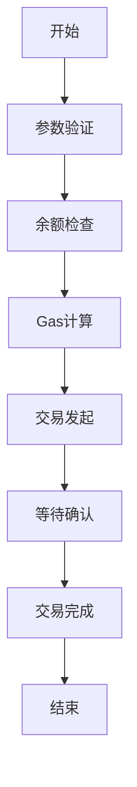
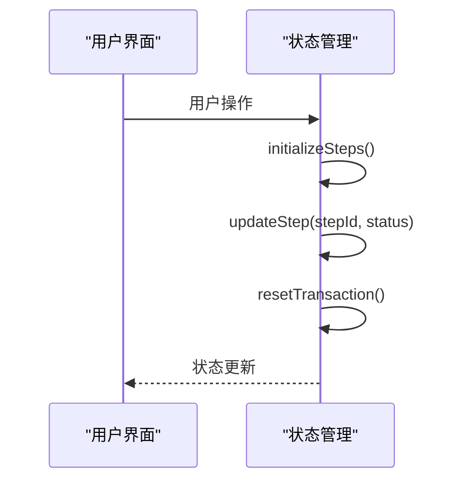
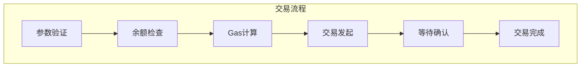
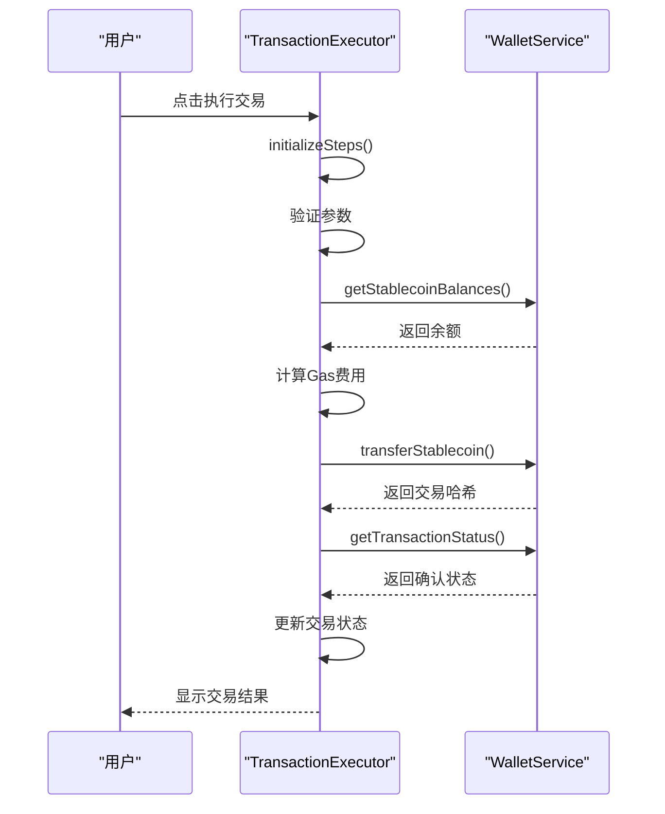
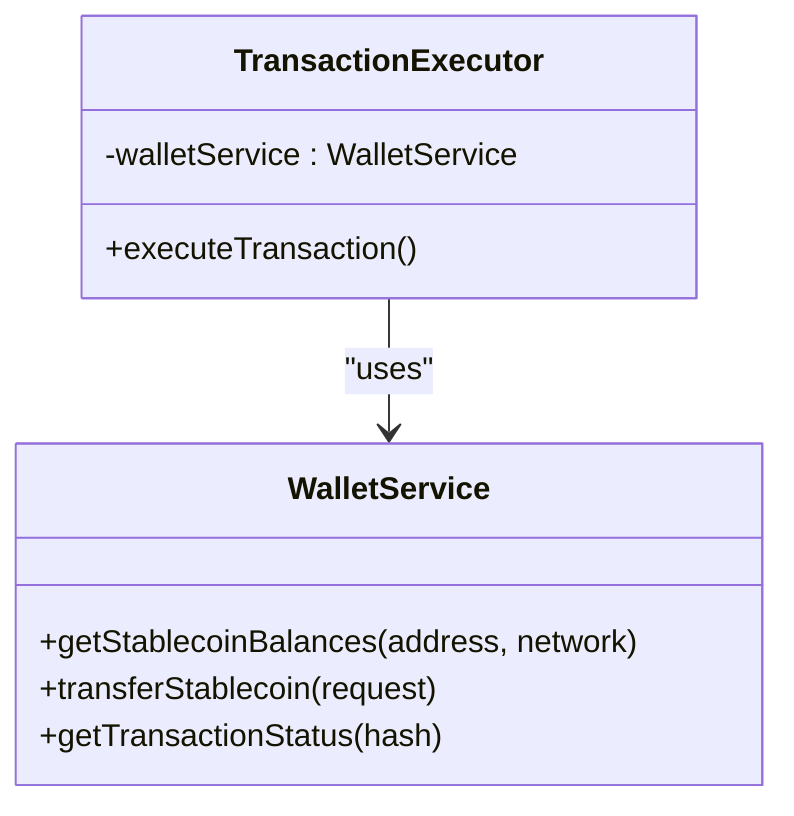
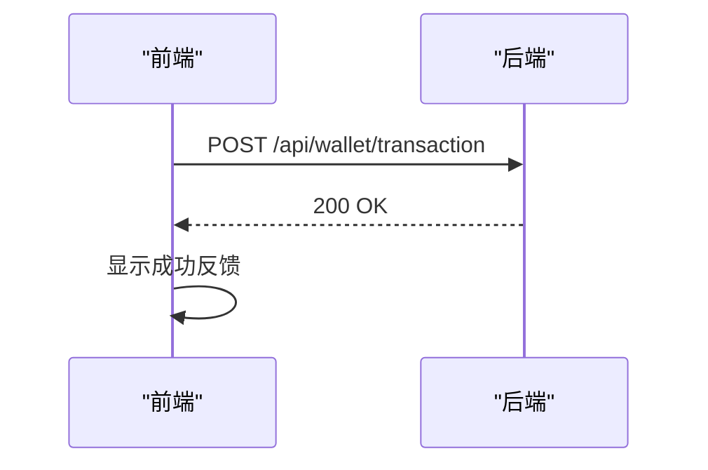
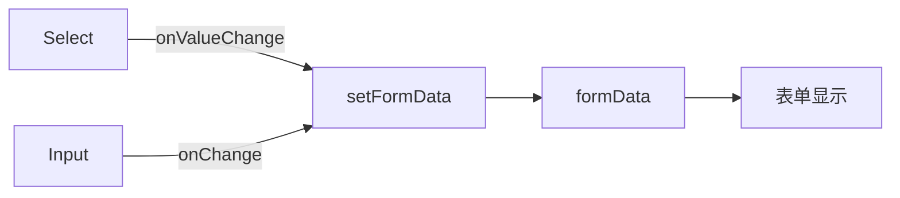
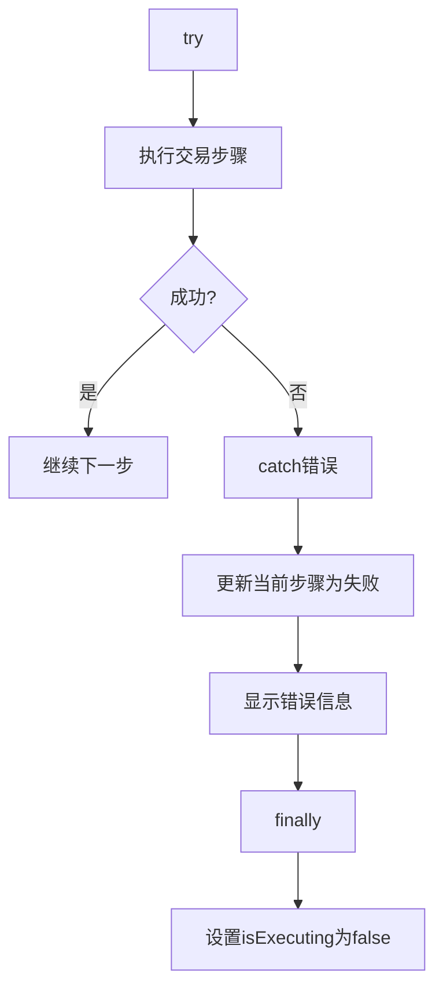
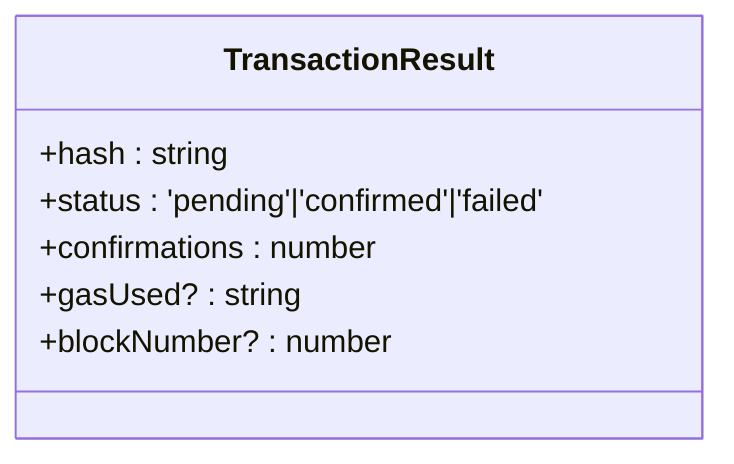

<cite>
**Referenced Files in This Document**   
- [TransactionExecutor.tsx](file://src/components/Blockchain/TransactionExecutor.tsx)
- [walletService.ts](file://src/services/walletService.ts)
- [progress.tsx](file://src/components/ui/progress.tsx)
- [card.tsx](file://src/components/ui/card.tsx)
- [button.tsx](file://src/components/ui/button.tsx)
- [select.tsx](file://src/components/ui/select.tsx)
- [input.tsx](file://src/components/ui/input.tsx)
</cite>

# 前端交易流程

## Table of Contents
1. [核心交易流程概述](#核心交易流程概述)
2. [状态管理机制](#状态管理机制)
3. [六步交易流程实现](#六步交易流程实现)
4. [钱包服务交互](#钱包服务交互)
5. [UI组件与用户体验](#ui组件与用户体验)
6. [错误处理与反馈](#错误处理与反馈)

## 核心交易流程概述

`TransactionExecutor`组件实现了完整的六步交易流程，从参数验证到交易完成的完整生命周期管理。该组件通过结构化的步骤引导用户完成区块链交易，确保每个关键环节都得到妥善处理。



**Diagram sources**
- [TransactionExecutor.tsx](file://src/components/Blockchain/TransactionExecutor.tsx#L22-L388)

**Section sources**
- [TransactionExecutor.tsx](file://src/components/Blockchain/TransactionExecutor.tsx#L22-L388)

## 状态管理机制

### useState状态管理

`TransactionExecutor`组件通过多个`useState`钩子管理不同的状态维度：

- `isExecuting`: 控制交易执行状态，防止重复提交
- `transaction`: 存储交易结果，包括哈希、状态和确认数
- `steps`: 管理六步交易流程的进度和状态
- `currentStep`: 跟踪当前执行的步骤
- `formData`: 管理表单输入数据，包括接收地址、金额和代币选择

```mermaid
classDiagram
class TransactionExecutor {
+isExecuting : boolean
+transaction : TransactionResult | null
+steps : TransactionStep[]
+currentStep : number
+formData : {to : string, amount : string, token : 'DAI'|'USDC'}
}
```

**Diagram sources**
- [TransactionExecutor.tsx](file://src/components/Blockchain/TransactionExecutor.tsx#L22-L388)

**Section sources**
- [TransactionExecutor.tsx](file://src/components/Blockchain/TransactionExecutor.tsx#L22-L388)

### useCallback性能优化

组件使用`useCallback`优化关键函数，避免不必要的重新渲染：

- `initializeSteps`: 初始化六步交易流程的状态
- `updateStep`: 更新特定步骤的状态和交易哈希
- `resetTransaction`: 重置所有交易状态，准备新交易



**Diagram sources**
- [TransactionExecutor.tsx](file://src/components/Blockchain/TransactionExecutor.tsx#L22-L388)

**Section sources**
- [TransactionExecutor.tsx](file://src/components/Blockchain/TransactionExecutor.tsx#L22-L388)

## 六步交易流程实现

### 流程步骤定义

交易流程被明确划分为六个逻辑步骤，每个步骤都有清晰的标题和描述：

1. **参数验证**: 检查接收地址和转账金额的有效性
2. **余额检查**: 验证钱包是否有足够的代币余额
3. **Gas计算**: 估算交易所需的网络费用
4. **交易发起**: 向区块链网络提交交易请求
5. **等待确认**: 监控交易在区块链上的确认状态
6. **交易完成**: 交易成功确认后的最终处理



**Diagram sources**
- [TransactionExecutor.tsx](file://src/components/Blockchain/TransactionExecutor.tsx#L22-L388)

**Section sources**
- [TransactionExecutor.tsx](file://src/components/Blockchain/TransactionExecutor.tsx#L22-L388)

### 执行逻辑分析

`executeTransaction`函数是整个流程的核心，它按顺序执行六个步骤：



**Diagram sources**
- [TransactionExecutor.tsx](file://src/components/Blockchain/TransactionExecutor.tsx#L22-L388)
- [walletService.ts](file://src/services/walletService.ts#L117-L187)

**Section sources**
- [TransactionExecutor.tsx](file://src/components/Blockchain/TransactionExecutor.tsx#L22-L388)

## 钱包服务交互

### WalletService集成

`TransactionExecutor`通过`walletService`实例与MetaMask等钱包进行交互：

- **余额查询**: 调用`getStablecoinBalances`获取DAI和USDC余额
- **交易执行**: 使用`transferStablecoin`发起代币转账
- **状态监控**: 通过`getTransactionStatus`检查交易确认状态



**Diagram sources**
- [TransactionExecutor.tsx](file://src/components/Blockchain/TransactionExecutor.tsx#L22-L388)
- [walletService.ts](file://src/services/walletService.ts#L117-L187)

**Section sources**
- [walletService.ts](file://src/services/walletService.ts#L117-L187)

### 交易结果处理

交易成功后，组件通过`setTransaction`更新交易结果，并调用后端API记录交易：



**Diagram sources**
- [TransactionExecutor.tsx](file://src/components/Blockchain/TransactionExecutor.tsx#L22-L388)

**Section sources**
- [TransactionExecutor.tsx](file://src/components/Blockchain/TransactionExecutor.tsx#L22-L388)

## UI组件与用户体验

### 进度可视化

组件使用`Progress`组件显示整体交易进度，并通过步骤列表展示详细状态：

```mermaid
flowchart TD
A[Progress组件] --> |value| B[(currentStep / steps.length) * 100]
C[步骤列表] --> D[图标状态]
D --> E[待处理: 时钟图标]
D --> F[处理中: 旋转图标]
D --> G[完成: 绿色对勾]
D --> H[失败: 红色警告]
```

**Diagram sources**
- [TransactionExecutor.tsx](file://src/components/Blockchain/TransactionExecutor.tsx#L22-L388)
- [progress.tsx](file://src/components/ui/progress.tsx#L0-L23)

**Section sources**
- [progress.tsx](file://src/components/ui/progress.tsx#L0-L23)

### 表单数据绑定

表单组件通过`useState`实现双向数据绑定：



**Diagram sources**
- [TransactionExecutor.tsx](file://src/components/Blockchain/TransactionExecutor.tsx#L22-L388)
- [select.tsx](file://src/components/ui/select.tsx#L0-L143)
- [input.tsx](file://src/components/ui/input.tsx#L0-L22)

**Section sources**
- [select.tsx](file://src/components/ui/select.tsx#L0-L143)
- [input.tsx](file://src/components/ui/input.tsx#L0-L22)

## 错误处理与反馈

### 异常处理机制

组件实现了全面的错误处理，确保用户能够及时了解交易失败的原因：



**Section sources**
- [TransactionExecutor.tsx](file://src/components/Blockchain/TransactionExecutor.tsx#L22-L388)

### 用户反馈设计

成功交易后，组件显示详细的交易信息，包括：

- 交易哈希（可点击跳转到区块浏览器）
- 确认数量
- Gas使用情况
- 成功状态标识



**Diagram sources**
- [walletService.ts](file://src/services/walletService.ts#L55-L61)

**Section sources**
- [walletService.ts](file://src/services/walletService.ts#L55-L61)