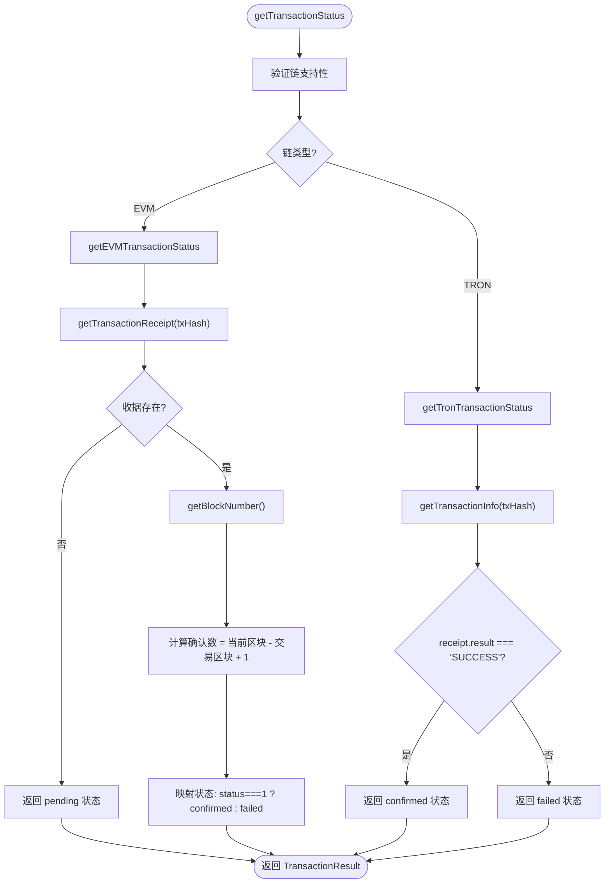
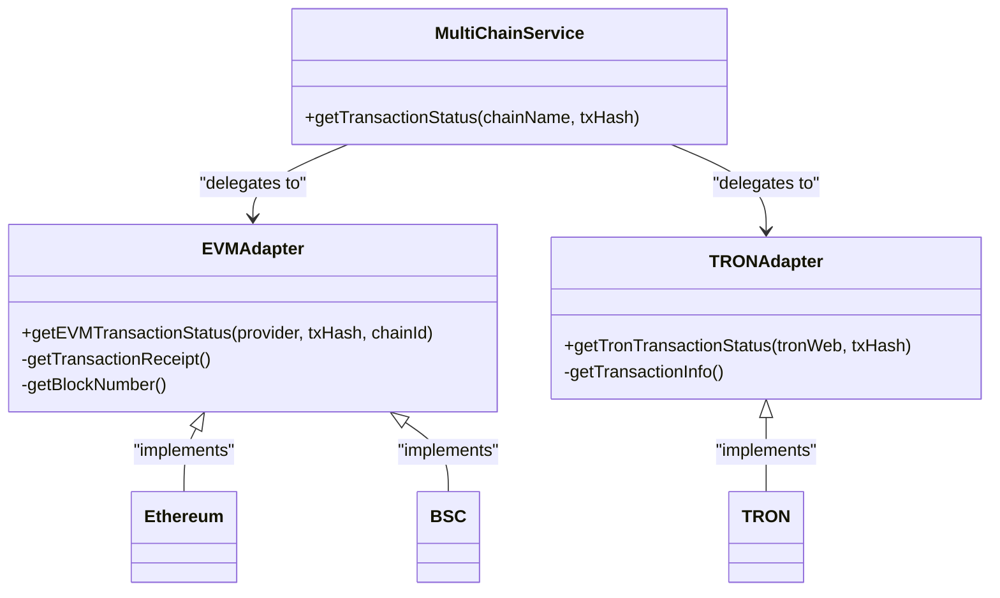
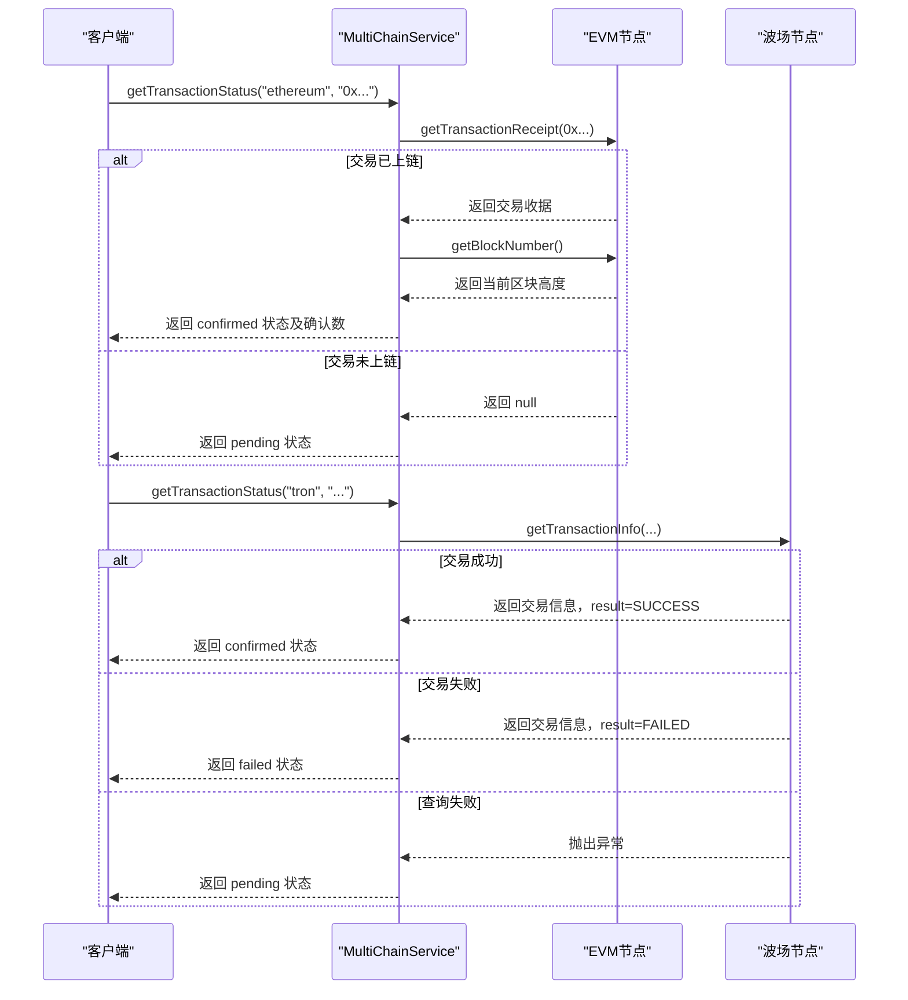

# 后端状态监控

<cite>
**Referenced Files in This Document**   
- [multiChainService.ts](file://backend/src/services/multiChainService.ts)
- [blockchain.ts](file://backend/src/services/blockchain.ts)
- [multiChainService.test.ts](file://backend/src/services/__tests__/multiChainService.test.ts)
- [multiChainService.unit.test.ts](file://backend/src/services/__tests__/multiChainService.unit.test.ts)
</cite>

## 目录
1. [简介](#简介)
2. [核心组件分析](#核心组件分析)
3. [跨链交易状态监控流程](#跨链交易状态监控流程)
4. [区块链API适配逻辑](#区块链api适配逻辑)
5. [轮询策略与错误处理](#轮询策略与错误处理)
6. [统一接口设计](#统一接口设计)
7. [测试验证](#测试验证)
8. [结论](#结论)

## 简介

`multiChainService.getTransactionStatus` 方法是跨链交易系统中的核心监控功能，负责实时追踪和验证在不同区块链网络上执行的交易状态。该服务支持以太坊（Ethereum）、波场（TRON）和币安智能链（BSC）三大主流区块链网络，为稳定币转账提供可靠的状态查询能力。

本文档深入解析该方法的跨链交易监控能力，详细说明服务如何根据链类型选择适当的区块链API进行状态查询，描述交易收据获取、确认数计算和状态映射的完整流程，并解释服务如何处理不同区块链的RPC接口差异。

**Section sources**
- [multiChainService.ts](file://backend/src/services/multiChainService.ts#L363-L440)

## 核心组件分析

`MultiChainService` 类是实现跨链功能的核心服务，通过统一的接口抽象了不同区块链的底层差异。该服务在初始化时配置了三大主流链的RPC端点、区块浏览器URL和稳定币合约地址，为跨链操作提供了基础支持。

服务通过`initializeProviders`方法动态加载并初始化各链的SDK（如ethers.js用于EVM链，tronWeb用于波场链），实现了对不同区块链协议栈的适配。这种设计模式使得系统能够灵活扩展支持新的区块链网络。

```mermaid
classDiagram
class MultiChainService {
+getSupportedChains() ChainConfig[]
+getChainConfig(chainName) ChainConfig | undefined
+getTransactionStatus(chainName, txHash) Promise~TransactionResult~
+getStablecoinBalance(chainName, tokenSymbol, address) Promise~string~
+transferStablecoin(chainName, tokenSymbol, fromAddress, toAddress, amount, privateKey) Promise~TransactionResult~
+getGasPrices(chainName) Promise~{slow, standard, fast}~
+validateAddress(chainName, address) boolean
}
class ChainConfig {
chainId : number
name : string
symbol : string
rpcUrl : string
explorerUrl : string
nativeCurrency : {name, symbol, decimals}
stablecoins : {[symbol] : {address, decimals, symbol, name}}
}
class TransactionResult {
txHash : string
chainId : number
status : 'pending' | 'confirmed' | 'failed'
confirmations : number
gasUsed? : string
blockNumber? : number
timestamp : Date
}
MultiChainService --> ChainConfig : "contains"
MultiChainService --> TransactionResult : "returns"
```

**Diagram sources**
- [multiChainService.ts](file://backend/src/services/multiChainService.ts#L6-L46)
- [multiChainService.ts](file://backend/src/services/multiChainService.ts#L48-L505)

**Section sources**
- [multiChainService.ts](file://backend/src/services/multiChainService.ts#L6-L505)

## 跨链交易状态监控流程

`getTransactionStatus`方法实现了跨链交易状态监控的核心逻辑，其工作流程如下：

1. **链类型识别**：根据传入的`chainName`参数识别目标区块链类型（EVM或TRON）
2. **状态查询分发**：调用相应链类型的专用状态查询方法
3. **状态映射**：将底层区块链返回的状态信息映射为统一的`pending/confirmed/failed`状态
4. **确认数计算**：计算交易的确认数量
5. **结果返回**：返回标准化的交易状态结果



**Diagram sources**
- [multiChainService.ts](file://backend/src/services/multiChainService.ts#L363-L440)

**Section sources**
- [multiChainService.ts](file://backend/src/services/multiChainService.ts#L363-L440)

## 区块链API适配逻辑

服务通过适配器模式处理不同区块链的RPC接口差异，主要体现在以太坊JSON-RPC和波场Web3 API的适配上。

### EVM链适配逻辑

对于以太坊、BSC等EVM兼容链，服务使用ethers.js库进行交互，遵循以太坊JSON-RPC标准：

- **交易收据获取**：调用`provider.getTransactionReceipt(txHash)`方法
- **当前区块获取**：调用`provider.getBlockNumber()`方法
- **状态判断**：检查收据中的`status`字段，`1`表示成功，`0`表示失败
- **确认数计算**：`当前区块高度 - 交易所在区块高度 + 1`

### 波场链适配逻辑

对于波场链，服务使用tronWeb库进行交互，遵循波场特有的API规范：

- **交易信息获取**：调用`tronWeb.trx.getTransactionInfo(txHash)`方法
- **状态判断**：检查返回对象中`receipt.result`字段，`SUCCESS`表示成功
- **确认数处理**：波场API直接返回交易是否在区块中，确认数为`1`或`0`



**Diagram sources**
- [multiChainService.ts](file://backend/src/services/multiChainService.ts#L384-L440)

**Section sources**
- [multiChainService.ts](file://backend/src/services/multiChainService.ts#L384-L440)

## 轮询策略与错误处理

虽然`getTransactionStatus`方法本身不直接实现轮询逻辑，但它为上层服务提供了构建轮询策略的基础。`BlockchainService`类中的`monitorTransaction`方法展示了如何基于此基础功能实现交易监控。

### 轮询最佳实践

1. **重试间隔**：建议初始间隔为3-5秒，根据网络拥堵情况动态调整
2. **超时设置**：设置合理的超时时间（如30分钟），避免无限轮询
3. **指数退避**：在连续查询失败时采用指数退避策略
4. **状态变更检测**：仅在交易状态发生变化时记录日志或通知

### 错误恢复机制

服务实现了完善的错误处理机制：

- **网络异常处理**：当RPC请求失败时，返回`pending`状态，允许客户端重试
- **链不支持处理**：验证链名称的有效性，抛出明确的错误信息
- **交易未找到处理**：对于EVM链，`getTransactionReceipt`返回`null`时表示交易未上链
- **日志记录**：详细记录状态查询过程中的错误信息，便于问题排查



**Diagram sources**
- [multiChainService.ts](file://backend/src/services/multiChainService.ts#L363-L440)
- [blockchain.ts](file://backend/src/services/blockchain.ts#L230-L251)

**Section sources**
- [multiChainService.ts](file://backend/src/services/multiChainService.ts#L363-L440)
- [blockchain.ts](file://backend/src/services/blockchain.ts#L230-L251)

## 统一接口设计

服务通过精心设计的接口实现了跨链操作的统一性，`TransactionResult`接口定义了标准化的交易状态返回格式：

```typescript
export interface TransactionResult {
  txHash: string
  chainId: number
  status: 'pending' | 'confirmed' | 'failed'
  confirmations: number
  gasUsed?: string
  blockNumber?: number
  timestamp: Date
}
```

这种设计模式带来了以下优势：

1. **一致性**：无论底层是EVM还是TRON链，客户端都接收相同结构的响应
2. **可预测性**：状态字段仅包含`pending/confirmed/failed`三种确定状态
3. **扩展性**：接口预留了`gasUsed`和`blockNumber`等字段，便于未来扩展
4. **易用性**：客户端无需了解不同链的技术细节即可处理交易状态

```mermaid
classDiagram
class TransactionRequest {
fromChain : string
toChain : string
fromToken : string
toToken : string
amount : string
fromAddress : string
toAddress : string
slippage? : number
}
class TransactionResult {
txHash : string
chainId : number
status : 'pending' | 'confirmed' | 'failed'
confirmations : number
gasUsed? : string
blockNumber? : number
timestamp : Date
}
class ChainConfig {
chainId : number
name : string
symbol : string
rpcUrl : string
explorerUrl : string
nativeCurrency : {name, symbol, decimals}
stablecoins : {[symbol] : {address, decimals, symbol, name}}
}
MultiChainService --> TransactionRequest : "接收"
MultiChainService --> TransactionResult : "返回"
MultiChainService --> ChainConfig : "配置"
```

**Diagram sources**
- [multiChainService.ts](file://backend/src/services/multiChainService.ts#L27-L46)

**Section sources**
- [multiChainService.ts](file://backend/src/services/multiChainService.ts#L27-L46)

## 测试验证

服务配备了完善的单元测试和集成测试，确保跨链状态查询功能的可靠性。测试用例覆盖了以下场景：

- 支持的区块链列表验证
- 链配置获取功能
- 代币支持情况查询
- 地址格式验证
- 交易状态查询的正确性

测试通过模拟ethers.js库的行为，验证了服务在不同场景下的表现，确保了代码的健壮性和可靠性。

**Section sources**
- [multiChainService.test.ts](file://backend/src/services/__tests__/multiChainService.test.ts)
- [multiChainService.unit.test.ts](file://backend/src/services/__tests__/multiChainService.unit.test.ts)

## 结论

`multiChainService.getTransactionStatus`方法通过精心设计的架构和实现，成功解决了跨链交易状态监控的复杂性问题。服务通过适配器模式优雅地处理了EVM和TRON链的技术差异，提供了统一、可靠的状态查询接口。

该实现展示了优秀的软件工程实践，包括清晰的职责分离、完善的错误处理、标准化的接口设计和全面的测试覆盖。这些特性使得系统不仅能够稳定运行，还具备良好的可维护性和扩展性，为跨链应用的开发提供了坚实的基础。