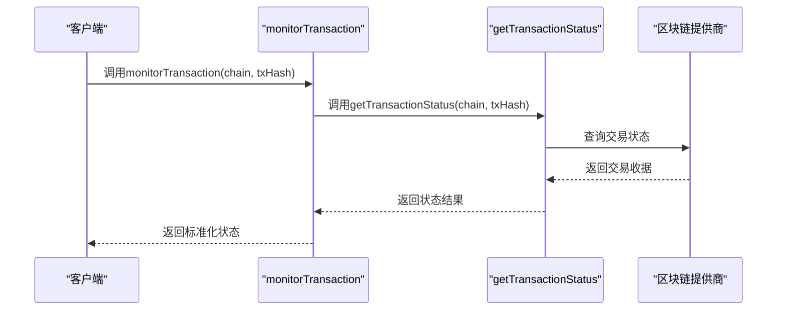
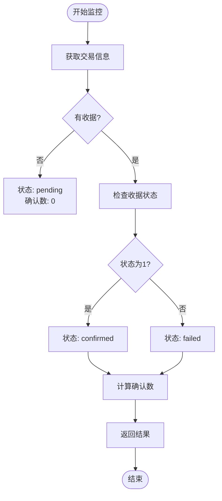
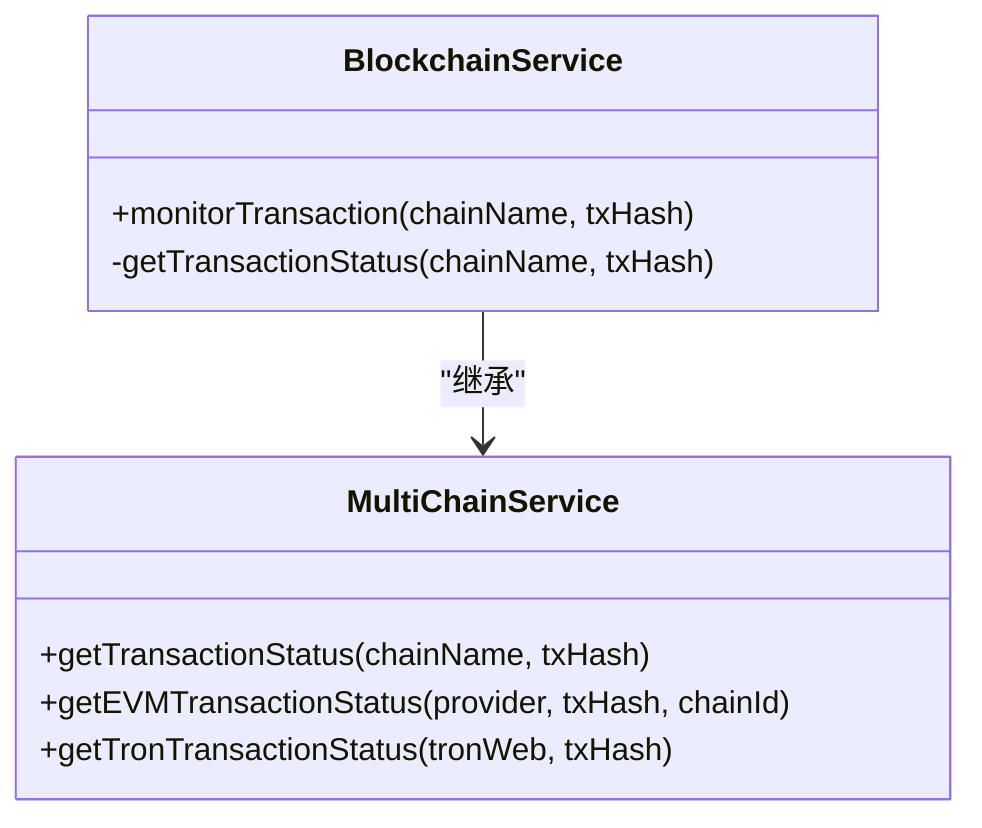
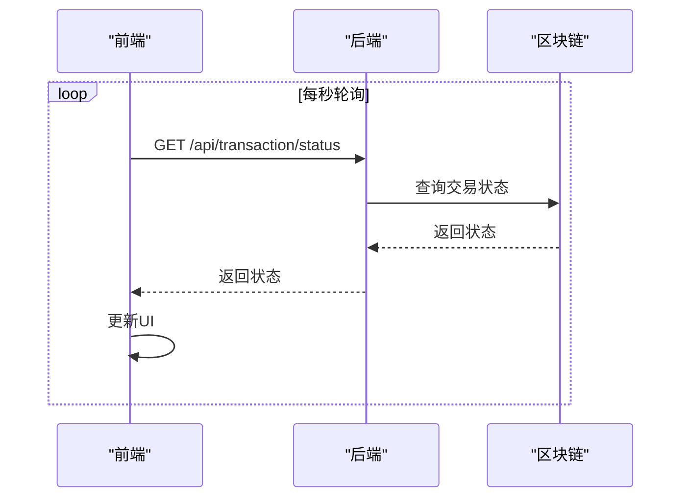

# 交易监控

<cite>
**本文档引用的文件**
- [BlockchainService.ts](file://backend/src/services/BlockchainService.ts)
- [multiChainService.ts](file://backend/src/services/multiChainService.ts)
- [walletService.ts](file://src/services/walletService.ts)
- [CurrencyExchange.tsx](file://src/components/Exchange/CurrencyExchange.tsx)
</cite>

## 目录
1. [简介](#简介)
2. [核心功能分析](#核心功能分析)
3. [交易监控方法详解](#交易监控方法详解)
4. [状态字段说明](#状态字段说明)
5. [底层服务调用关系](#底层服务调用关系)
6. [错误传播策略](#错误传播策略)
7. [使用场景](#使用场景)
8. [异常处理与重试策略](#异常处理与重试策略)
9. [结论](#结论)

## 简介
本文档详细说明了交易监控功能的实现机制，重点分析`monitorTransaction`方法如何跟踪指定区块链上的交易确认状态。文档解释了返回结果中各字段的含义和更新机制，阐述了该方法与底层多链服务的调用关系，以及在交易失败时的错误传播策略。同时提供了交易监控的典型使用场景和最佳实践。

## 核心功能分析

**Section sources**
- [BlockchainService.ts](file://backend/src/services/BlockchainService.ts#L246-L267)
- [multiChainService.ts](file://backend/src/services/multiChainService.ts#L363-L381)
- [walletService.ts](file://src/services/walletService.ts#L151-L186)

## 交易监控方法详解
`monitorTransaction`方法是交易监控功能的核心，负责跟踪指定区块链上的交易确认状态。该方法接收链名称和交易哈希作为参数，返回包含交易状态、确认数等信息的对象。

该方法首先调用底层的`getTransactionStatus`方法获取交易的最新状态，然后将结果转换为标准化的格式返回。在执行过程中，方法会记录详细的日志信息，便于问题排查和系统监控。

**Diagram sources**
- [BlockchainService.ts](file://backend/src/services/BlockchainService.ts#L246-L267)
- [multiChainService.ts](file://backend/src/services/multiChainService.ts#L363-L381)

**Section sources**
- [BlockchainService.ts](file://backend/src/services/BlockchainService.ts#L246-L267)

## 状态字段说明
交易监控返回结果包含多个关键字段，每个字段都有特定的含义和更新机制：

### status 字段
表示交易的当前状态，可能的值包括：
- **pending**：交易已提交但尚未确认
- **confirmed**：交易已确认并成功上链
- **failed**：交易执行失败

### confirmations 字段
表示交易的确认数，计算方式为当前区块高度减去交易所在区块高度再加1。确认数越多，交易的不可逆性越强。

### blockNumber 字段
表示交易被打包的区块高度。对于pending状态的交易，该字段可能不存在。

### gasUsed 字段
表示交易消耗的Gas数量，仅在交易确认后可用。

**Diagram sources**
- [walletService.ts](file://src/services/walletService.ts#L151-L186)
- [multiChainService.ts](file://backend/src/services/multiChainService.ts#L363-L381)

**Section sources**
- [walletService.ts](file://src/services/walletService.ts#L151-L186)

## 底层服务调用关系
`monitorTransaction`方法与底层多链服务存在明确的调用关系。它通过继承`MultiChainService`类，利用其提供的`getTransactionStatus`方法来获取交易状态。

对于不同的区块链网络，系统采用不同的状态查询策略：
- **EVM兼容链**（如以太坊、BSC）：通过`getTransactionReceipt`方法获取交易收据
- **TRON链**：通过`getTransactionInfo`方法获取交易信息

**Diagram sources**
- [BlockchainService.ts](file://backend/src/services/BlockchainService.ts#L20-L306)
- [multiChainService.ts](file://backend/src/services/multiChainService.ts#L48-L505)

**Section sources**
- [multiChainService.ts](file://backend/src/services/multiChainService.ts#L363-L381)

## 错误传播策略
当交易监控过程中发生错误时，系统采用直接传播的策略。这意味着底层服务抛出的异常会直接传递给调用方，而不进行额外的包装或处理。

这种策略的优势在于：
- 保持错误信息的完整性
- 便于调用方根据具体错误类型进行差异化处理
- 简化错误处理逻辑

错误可能发生在多个环节：
1. 链不支持或配置错误
2. 区块链提供商连接失败
3. 交易哈希无效或不存在
4. 网络超时或中断

**Section sources**
- [BlockchainService.ts](file://backend/src/services/BlockchainService.ts#L246-L267)
- [multiChainService.ts](file://backend/src/services/multiChainService.ts#L363-L381)

## 使用场景
交易监控功能在多个业务场景中发挥重要作用。

### 前端轮询实现
前端通过定时轮询的方式监控交易状态，典型的实现模式如下：

**Diagram sources**
- [CurrencyExchange.tsx](file://src/components/Exchange/CurrencyExchange.tsx#L168-L214)

### WebSocket实时通知
对于需要实时更新的场景，可以结合WebSocket实现即时通知：

1. 客户端建立WebSocket连接
2. 服务端监听交易状态变化
3. 状态变化时推送更新到客户端
4. 客户端实时更新界面

**Section sources**
- [CurrencyExchange.tsx](file://src/components/Exchange/CurrencyExchange.tsx#L128-L166)

## 异常处理与重试策略
为了确保交易监控的可靠性，建议采用以下最佳实践：

### 超时设置
为交易监控请求设置合理的超时时间，避免长时间等待。建议的超时范围为10-30秒。

### 重试机制
实现指数退避重试策略：
- 首次重试：1秒后
- 第二次重试：2秒后
- 第三次重试：4秒后
- 最多重试3-5次

### 错误分类处理
根据错误类型采取不同的处理策略：
- 网络错误：重试
- 链不支持：提示用户
- 交易不存在：终止监控
- 系统错误：记录日志并告警

**Section sources**
- [BlockchainService.ts](file://backend/src/services/BlockchainService.ts#L246-L267)
- [walletService.ts](file://src/services/walletService.ts#L151-L186)

## 结论
交易监控功能通过`monitorTransaction`方法实现了对区块链交易状态的全面跟踪。该方法与底层多链服务紧密协作，能够准确反映交易的确认状态。通过合理的错误传播策略和完善的异常处理机制，系统能够稳定可靠地监控交易状态，为前端应用提供准确的数据支持。在实际使用中，建议结合轮询和WebSocket等技术，实现高效、实时的交易状态更新。