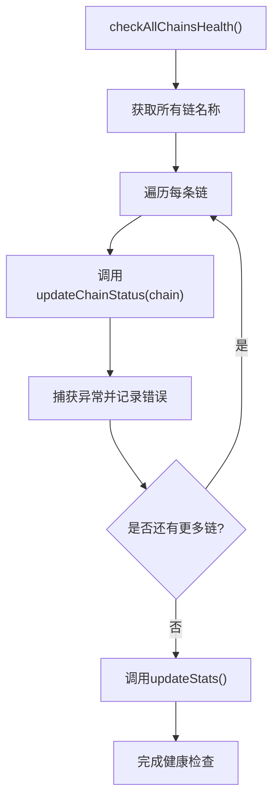
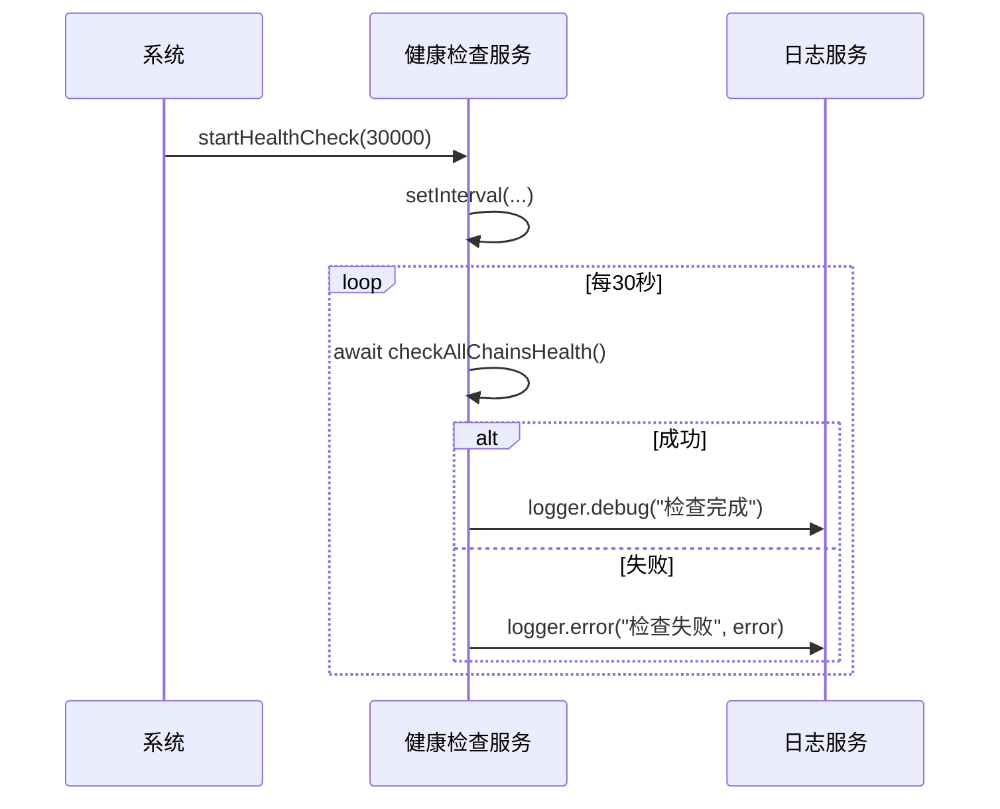
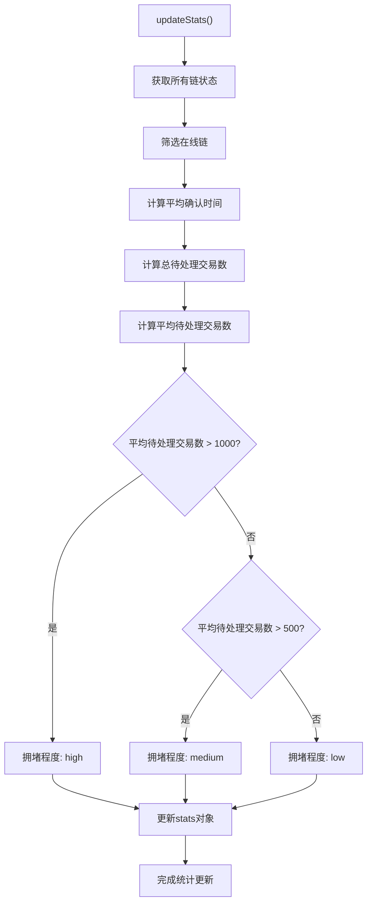

# 健康检查系统

<cite>
**本文档引用的文件**  
- [multiChainService.ts](file://backend/src/services/multiChainService.ts)
- [BlockchainService.ts](file://backend/src/services/BlockchainService.ts)
- [logger.ts](file://backend/src/utils/logger.ts)
</cite>

## 目录
1. [简介](#简介)
2. [核心组件](#核心组件)
3. [健康检查协调机制](#健康检查协调机制)
4. [定时任务机制](#定时任务机制)
5. [全局统计指标计算](#全局统计指标计算)
6. [日志记录与错误处理](#日志记录与错误处理)
7. [性能优化建议](#性能优化建议)
8. [监控告警集成方案](#监控告警集成方案)
9. [结论](#结论)

## 简介
本系统为区块链多链健康检查与状态监控服务，支持以太坊、TRON和BSC网络。系统通过`BlockchainService`类实现对多条区块链的并发健康检查，定期评估各链的在线状态、区块高度、Gas价格、平均出块时间和待处理交易数等关键指标。基于这些数据，系统动态计算全局统计信息，包括在线链数量、平均确认时间和网络拥堵程度，并提供相应的交易建议。该服务在系统启动时自动运行，默认每30秒执行一次全面健康检查。

## 核心组件

`BlockchainService`继承自`MultiChainService`，扩展了区块链状态监控和性能分析功能。其核心组件包括链状态映射表`chainStatus`、统计信息对象`stats`以及一系列健康检查方法。服务初始化时会自动加载支持的区块链配置并建立RPC连接。

**Section sources**
- [BlockchainService.ts](file://backend/src/services/BlockchainService.ts#L1-L50)

## 健康检查协调机制

`checkAllChainsHealth`方法负责协调对所有支持区块链的并发健康检查。该方法首先获取所有已注册链的名称列表，然后逐个调用`updateChainStatus`方法更新每条链的状态。检查过程采用串行执行方式，确保每个链的状态更新操作独立完成，避免并发竞争。在所有链的状态检查完成后，系统自动调用`updateStats`方法刷新全局统计指标。

**Diagram sources**
- [BlockchainService.ts](file://backend/src/services/BlockchainService.ts#L143-L156)

**Section sources**
- [BlockchainService.ts](file://backend/src/services/BlockchainService.ts#L143-L156)

## 定时任务机制

`startHealthCheck`方法启动一个定时任务，以指定的时间间隔（默认30秒）周期性地执行区块链健康检查。该方法使用Node.js的`setInterval`函数创建一个异步定时器，每次触发时都会调用`checkAllChainsHealth`方法。成功执行后记录调试日志，失败时捕获异常并记录错误日志。服务启动时会输出包含实际检查间隔的日志信息，便于运维监控。

**Diagram sources**
- [BlockchainService.ts](file://backend/src/services/BlockchainService.ts#L294-L305)

**Section sources**
- [BlockchainService.ts](file://backend/src/services/BlockchainService.ts#L294-L305)

## 全局统计指标计算

`updateStats`方法基于各链当前状态计算全局统计指标。算法首先筛选出所有在线链，然后计算平均确认时间（即平均出块时间）。网络拥堵程度根据待处理交易的平均数量判定：当平均待处理交易数超过1000时为"high"，超过500时为"medium"，否则为"low"。在线链数量直接由在线链的总数决定。这些指标被整合到`stats`对象中，供外部查询使用。

**Diagram sources**
- [BlockchainService.ts](file://backend/src/services/BlockchainService.ts#L158-L184)

**Section sources**
- [BlockchainService.ts](file://backend/src/services/BlockchainService.ts#L158-L184)

## 日志记录与错误处理

系统采用Winston日志库实现结构化日志记录。健康检查失败时，系统会通过`logger.error`记录详细的错误信息，包括失败的链名称和错误对象。当链状态更新失败时，对应链的状态会被标记为离线（`isOnline = false`）。开发环境日志包含颜色编码和时间戳，生产环境则输出结构化JSON格式日志到文件。HTTP请求日志中间件还会记录所有请求的详细信息，便于问题排查。

**Section sources**
- [logger.ts](file://backend/src/utils/logger.ts#L1-L100)
- [BlockchainService.ts](file://backend/src/services/BlockchainService.ts#L100-L140)

## 性能优化建议

1. **并发检查优化**：当前`checkAllChainsHealth`采用串行检查，建议改为并发执行（使用`Promise.all`）以减少总检查时间。
2. **缓存机制**：对于频繁查询但变化不快的指标（如Gas价格），可引入Redis缓存，设置合理的TTL。
3. **连接池管理**：优化RPC连接池配置，避免频繁创建和销毁连接。
4. **批量查询**：对于支持批量查询的区块链API，尽量使用批量请求减少网络开销。
5. **资源监控**：添加对内存、CPU使用率的监控，防止长时间运行导致资源泄漏。

## 监控告警集成方案

1. **Prometheus集成**：暴露/metrics端点，将`getPerformanceMetrics`返回的数据转换为Prometheus格式，便于Grafana可视化。
2. **告警规则**：基于`getNetworkCongestionAdvice`结果设置告警阈值，当网络拥堵为"high"时触发告警。
3. **健康检查端点**：提供/health API端点，返回`getBlockchainStats`信息，供Kubernetes等容器编排系统进行存活探针检查。
4. **日志告警**：配置ELK或类似系统，对ERROR级别的日志进行实时监控和告警。
5. **链状态监控**：当某条链连续3次检查失败时，触发严重告警通知运维团队。

## 结论
本健康检查系统实现了对多条区块链的全面监控，通过`checkAllChainsHealth`方法协调各链状态检查，`startHealthCheck`方法维持定期检查机制，并通过`updateStats`方法提供有价值的全局统计指标。系统具备完善的日志记录和错误处理机制，为区块链应用的稳定运行提供了有力保障。建议进一步优化为并发检查模式，并集成专业的监控告警系统以提升运维效率。