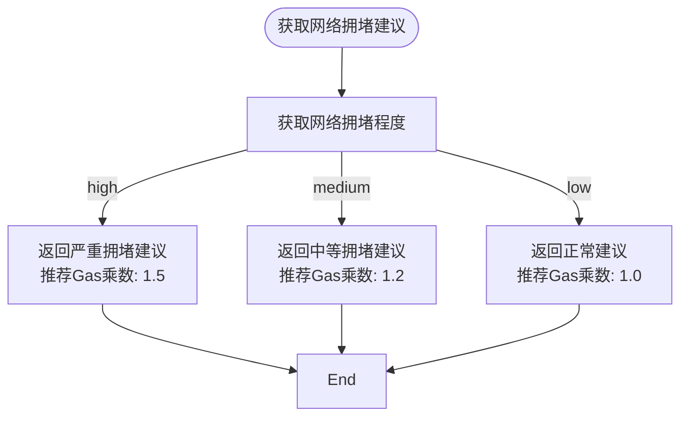

# 区块链服务

<cite>
**本文档引用的文件**   
- [BlockchainService.ts](file://backend/src/services/BlockchainService.ts)
- [multiChainService.ts](file://backend/src/services/multiChainService.ts)
</cite>

## 目录
1. [架构概述](#架构概述)
2. [核心组件分析](#核心组件分析)
3. [链状态管理](#链状态管理)
4. [区块链统计信息](#区块链统计信息)
5. [健康检查机制](#健康检查机制)
6. [性能指标与建议](#性能指标与建议)
7. [交易监控](#交易监控)
8. [后台任务](#后台任务)

## 架构概述

`BlockchainService` 类是多链区块链服务的核心实现，通过继承 `MultiChainService` 基类扩展了区块链监控与统计功能。该服务架构采用分层设计模式，将基础的多链操作功能与高级的监控统计功能分离，实现了职责分离和代码复用。

```mermaid
classDiagram
class MultiChainService {
+getSupportedChains() ChainConfig[]
+getChainConfig(chainName) ChainConfig | undefined
+getStablecoinBalance(chainName, tokenSymbol, address) Promise~string~
+transferStablecoin(chainName, tokenSymbol, fromAddress, toAddress, amount, privateKey) Promise~TransactionResult~
+getTransactionStatus(chainName, txHash) Promise~TransactionResult~
+getGasPrices(chainName) Promise~{slow, standard, fast}~
+validateAddress(chainName, address) boolean
+getSupportedTokens(chainName) string[]
+getTokenInfo(chainName, tokenSymbol) any
}
class BlockchainService {
+getBlockchainStats() BlockchainStats
+getChainStatus(chainName?) ChainStatus | ChainStatus[] | undefined
+updateChainStatus(chainName) Promise~void~
+checkAllChainsHealth() Promise~void~
+getNetworkCongestionAdvice() {level, message, recommendedGasMultiplier}
+estimateOptimalGasPrice(chainName) Promise~{slow, standard, fast, instant}~
+monitorTransaction(chainName, txHash) Promise~{status, confirmations, blockNumber, gasUsed}~
+getPerformanceMetrics() {throughput, latency, successRate}
+startHealthCheck(intervalMs) void
}
BlockchainService --|> MultiChainService : 继承
```

**Diagram sources**
- [BlockchainService.ts](file://backend/src/services/BlockchainService.ts#L20-L306)
- [multiChainService.ts](file://backend/src/services/multiChainService.ts#L48-L505)

**Section sources**
- [BlockchainService.ts](file://backend/src/services/BlockchainService.ts#L20-L306)
- [multiChainService.ts](file://backend/src/services/multiChainService.ts#L48-L505)

## 核心组件分析

`BlockchainService` 类作为 `MultiChainService` 的子类，继承了多链操作的基础功能，并在此基础上扩展了区块链监控和统计能力。这种继承关系使得 `BlockchainService` 能够直接使用父类中定义的区块链连接、交易处理和状态查询功能，同时专注于实现高级监控特性。

```mermaid
classDiagram
class BlockchainService {
-stats : BlockchainStats
-chainStatus : Map~string, ChainStatus~
+constructor()
+getBlockchainStats() BlockchainStats
+getChainStatus(chainName?) ChainStatus | ChainStatus[] | undefined
+updateChainStatus(chainName) Promise~void~
+checkAllChainsHealth() Promise~void~
+getNetworkCongestionAdvice() {level, message, recommendedGasMultiplier}
+estimateOptimalGasPrice(chainName) Promise~{slow, standard, fast, instant}~
+monitorTransaction(chainName, txHash) Promise~{status, confirmations, blockNumber, gasUsed}~
+getPerformanceMetrics() {throughput, latency, successRate}
+startHealthCheck(intervalMs) void
}
class BlockchainStats {
+totalTransactions : number
+totalVolume : string
+activeChains : number
+avgConfirmationTime : number
+networkCongestion : 'low' | 'medium' | 'high'
}
class ChainStatus {
+name : string
+isOnline : boolean
+blockHeight : number
+gasPrice : string
+avgBlockTime : number
+pendingTransactions : number
}
BlockchainService "1" *-- "1" BlockchainStats : 包含
BlockchainService "1" *-- "n" ChainStatus : 管理
```

**Diagram sources**
- [BlockchainService.ts](file://backend/src/services/BlockchainService.ts#L20-L306)
- [BlockchainService.ts](file://backend/src/services/BlockchainService.ts#L3-L9)
- [BlockchainService.ts](file://backend/src/services/BlockchainService.ts#L11-L18)

**Section sources**
- [BlockchainService.ts](file://backend/src/services/BlockchainService.ts#L20-L306)

## 链状态管理

`BlockchainService` 通过 `chainStatus` 属性维护一个 `Map<string, ChainStatus>` 结构，用于存储和管理各区块链的实时状态信息。每个链的状态包含名称、在线状态、区块高度、Gas价格、平均出块时间和待处理交易数等关键指标。


**Diagram sources**
- [BlockchainService.ts](file://backend/src/services/BlockchainService.ts#L11-L18)
- [BlockchainService.ts](file://backend/src/services/BlockchainService.ts#L20-L306)

**Section sources**
- [BlockchainService.ts](file://backend/src/services/BlockchainService.ts#L11-L18)
- [BlockchainService.ts](file://backend/src/services/BlockchainService.ts#L20-L306)

### 初始化与获取

在构造函数中，`BlockchainService` 会调用 `initializeChainStatus()` 方法初始化支持的区块链状态。该方法为以太坊、TRON和BSC三条链创建初始状态对象，并设置默认的平均出块时间。


**Diagram sources**
- [BlockchainService.ts](file://backend/src/services/BlockchainService.ts#L36-L50)

**Section sources**
- [BlockchainService.ts](file://backend/src/services/BlockchainService.ts#L36-L50)

### 状态更新机制

`updateChainStatus` 方法负责实时获取指定链的健康指标。该方法首先验证链配置，然后根据链类型（TRON或EVM兼容链）使用不同的API获取最新状态，包括区块高度和Gas价格等信息。


**Diagram sources**
- [BlockchainService.ts](file://backend/src/services/BlockchainService.ts#L79-L140)

**Section sources**
- [BlockchainService.ts](file://backend/src/services/BlockchainService.ts#L79-L140)

## 区块链统计信息

`BlockchainService` 通过 `stats` 属性维护一个 `BlockchainStats` 对象，用于存储全局的区块链统计信息。这些统计信息不仅反映当前状态，还用于生成网络拥堵建议和性能指标。


**Diagram sources**
- [BlockchainService.ts](file://backend/src/services/BlockchainService.ts#L3-L9)
- [BlockchainService.ts](file://backend/src/services/BlockchainService.ts#L20-L306)

**Section sources**
- [BlockchainService.ts](file://backend/src/services/BlockchainService.ts#L3-L9)
- [BlockchainService.ts](file://backend/src/services/BlockchainService.ts#L20-L306)

### 统计信息更新

`updateStats` 方法在每次健康检查后被调用，用于计算和更新全局统计信息。该方法基于当前各链的状态计算活跃链数量、平均确认时间和网络拥堵程度。


**Diagram sources**
- [BlockchainService.ts](file://backend/src/services/BlockchainService.ts#L158-L184)

**Section sources**
- [BlockchainService.ts](file://backend/src/services/BlockchainService.ts#L158-L184)

## 健康检查机制

`BlockchainService` 提供了全面的健康检查机制，包括单链状态检查和全链批量检查。这些机制确保系统能够实时监控各区块链的运行状况，并及时发现和处理问题。


**Diagram sources**
- [BlockchainService.ts](file://backend/src/services/BlockchainService.ts#L143-L156)

**Section sources**
- [BlockchainService.ts](file://backend/src/services/BlockchainService.ts#L143-L156)

### 全链健康检查流程

`checkAllChainsHealth` 方法实现了对所有已知链的批量健康检查。该方法遍历 `chainStatus` 映射中的所有链名，依次调用 `updateChainStatus` 方法更新每条链的状态，最后调用 `updateStats` 更新全局统计信息。


**Diagram sources**
- [BlockchainService.ts](file://backend/src/services/BlockchainService.ts#L143-L156)

**Section sources**
- [BlockchainService.ts](file://backend/src/services/BlockchainService.ts#L143-L156)

## 性能指标与建议

`BlockchainService` 提供了多种性能相关的功能，包括网络拥堵建议、最优Gas价格估算和性能指标收集，帮助用户优化交易体验。

### 网络拥堵建议

`getNetworkCongestionAdvice` 方法根据当前统计信息中的网络拥堵程度，提供相应的交易建议和Gas价格乘数。



**Diagram sources**
- [BlockchainService.ts](file://backend/src/services/BlockchainService.ts#L187-L214)

**Section sources**
- [BlockchainService.ts](file://backend/src/services/BlockchainService.ts#L187-L214)

### Gas价格优化策略

`estimateOptimalGasPrice` 方法基于当前链的Gas价格，计算并返回不同优先级的Gas价格建议，帮助用户在交易速度和成本之间做出权衡。


**Diagram sources**
- [BlockchainService.ts](file://backend/src/services/BlockchainService.ts#L217-L243)

**Section sources**
- [BlockchainService.ts](file://backend/src/services/BlockchainService.ts#L217-L243)

## 交易监控

`monitorTransaction` 方法提供了交易状态监控功能，通过调用父类 `MultiChainService` 的 `getTransactionStatus` 方法获取交易的最新状态。


**Diagram sources**
- [BlockchainService.ts](file://backend/src/services/BlockchainService.ts#L246-L267)
- [multiChainService.ts](file://backend/src/services/multiChainService.ts#L363-L381)

**Section sources**
- [BlockchainService.ts](file://backend/src/services/BlockchainService.ts#L246-L267)

## 后台任务

`startHealthCheck` 方法启动一个后台定时任务，定期执行全链健康检查，确保系统能够持续监控区块链的运行状况。


**Diagram sources**
- [BlockchainService.ts](file://backend/src/services/BlockchainService.ts#L294-L305)

**Section sources**
- [BlockchainService.ts](file://backend/src/services/BlockchainService.ts#L294-L305)