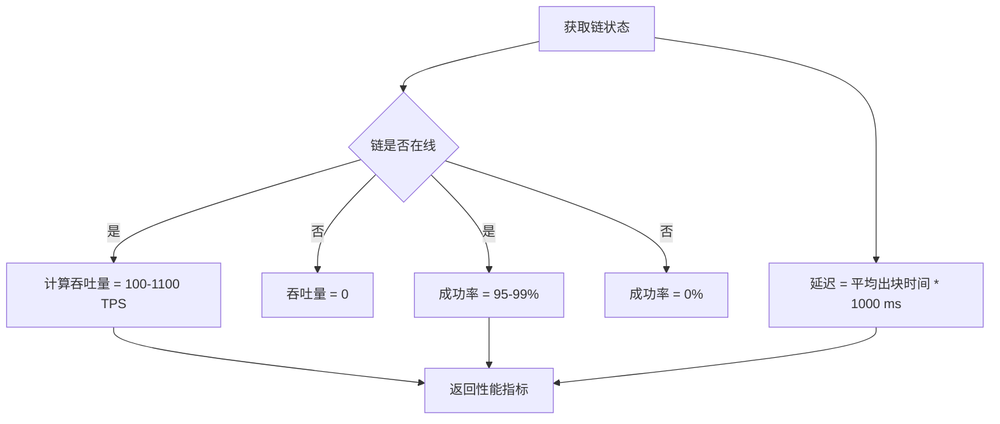
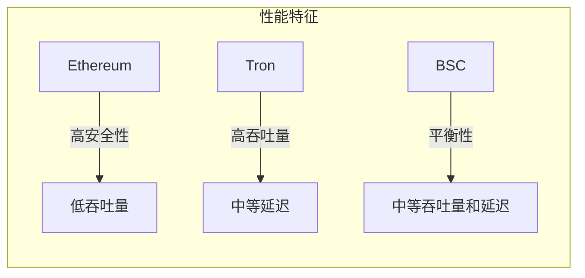
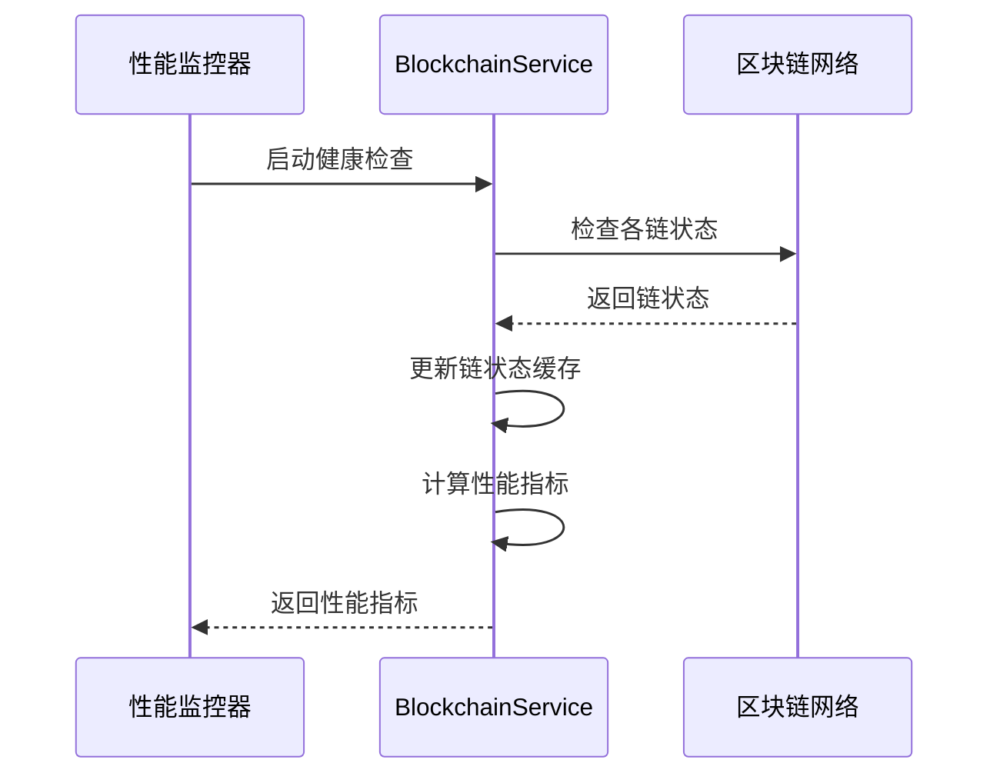
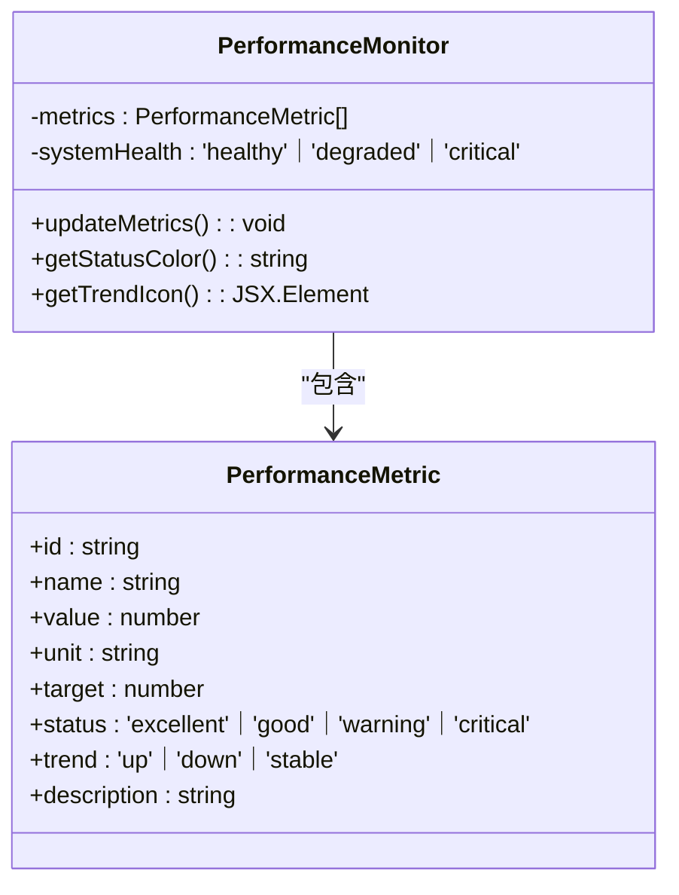

# 性能指标

<cite>
**本文档引用文件**  
- [BlockchainService.ts](file://backend/src/services/BlockchainService.ts)
- [blockchain.ts](file://backend/src/services/blockchain.ts)
- [PerformanceMonitor.tsx](file://src/components/Performance/PerformanceMonitor.tsx)
</cite>

## 目录
1. [简介](#简介)
2. [性能指标定义](#性能指标定义)
3. [指标计算方式与数据来源](#指标计算方式与数据来源)
4. [各链性能分析](#各链性能分析)
5. [系统监控与健康检查机制](#系统监控与健康检查机制)
6. [采样频率与更新策略](#采样频率与更新策略)
7. [监控系统集成方案](#监控系统集成方案)
8. [可视化建议](#可视化建议)
9. [应用场景](#应用场景)
10. [结论](#结论)

## 简介
本系统提供全面的区块链性能监控能力，重点通过`getPerformanceMetrics`方法输出吞吐量（TPS）、延迟（Latency）和成功率（Success Rate）三大核心维度指标。这些指标用于实时评估以太坊（Ethereum）、波场（Tron）和币安智能链（BSC）的运行状况，支持系统监控、容量规划和故障排查等关键运维场景。

**Section sources**
- [BlockchainService.ts](file://backend/src/services/BlockchainService.ts#L270-L291)

## 性能指标定义

### 吞吐量（Throughput）
- **单位**：TPS（每秒交易数）
- **含义**：衡量区块链网络在单位时间内处理交易的能力
- **目标值**：150 TPS
- **状态评估**：越高越好，反映网络处理能力

### 延迟（Latency）
- **单位**：毫秒（ms）
- **含义**：从交易提交到区块确认所需的时间，基于各链平均出块时间计算
- **目标值**：100ms
- **状态评估**：越低越好，反映交易确认速度

### 成功率（Success Rate）
- **单位**：百分比（%）
- **含义**：成功完成的交易占总交易量的比例
- **目标值**：99.5%
- **状态评估**：越高越好，反映系统稳定性

**Section sources**
- [blockchain.ts](file://backend/src/services/blockchain.ts#L254-L274)
- [PerformanceMonitor.tsx](file://src/components/Performance/PerformanceMonitor.tsx#L33-L78)

## 指标计算方式与数据来源

### 数据来源
性能指标主要来源于以下两个层面：
1. **链状态数据**：通过`ChainStatus`接口获取各链的实时状态
2. **区块链节点交互**：通过RPC接口与各链节点通信获取真实数据

### 计算逻辑



**Diagram sources**
- [BlockchainService.ts](file://backend/src/services/BlockchainService.ts#L270-L291)

**Section sources**
- [BlockchainService.ts](file://backend/src/services/BlockchainService.ts#L270-L291)

## 各链性能分析

### 链配置与基准参数
| 链名称 | 链ID | 平均出块时间（秒） | 默认延迟（ms） | 支持稳定币 |
|--------|------|------------------|--------------|------------|
| Ethereum | 1 | 12 | 12000 | USDT, USDC, DAI |
| Tron | 728126428 | 3 | 3000 | USDT, USDC |
| BSC | 56 | 5 | 5000 | USDT, USDC, BUSD |

### 性能特征对比


**Diagram sources**
- [multiChainService.ts](file://backend/src/services/multiChainService.ts#L48-L505)

**Section sources**
- [multiChainService.ts](file://backend/src/services/multiChainService.ts#L48-L505)

## 系统监控与健康检查机制

### 健康检查流程


### 状态评估逻辑
- **优秀（excellent）**：指标值 ≥ 目标值 × 1.05
- **良好（good）**：指标值 ≥ 目标值 × 0.95
- **警告（warning）**：指标值 ≥ 目标值 × 0.85
- **严重（critical）**：低于警告阈值

**Section sources**
- [PerformanceMonitor.tsx](file://src/components/Performance/PerformanceMonitor.tsx#L100-L133)

## 采样频率与更新策略

### 采样配置
- **后端健康检查间隔**：30秒（默认）
- **前端数据更新频率**：5秒
- **数据保留策略**：实时计算，不长期存储原始数据

### 更新机制


**Section sources**
- [blockchain.ts](file://backend/src/services/blockchain.ts#L285-L289)

## 监控系统集成方案

### Prometheus集成
```yaml
# prometheus.yml 配置示例
scrape_configs:
  - job_name: 'blockchain-performance'
    scrape_interval: 15s
    static_configs:
      - targets: ['localhost:3000']
    metrics_path: '/api/metrics'
```

### 指标暴露接口
- **端点**：`/api/metrics`
- **格式**：Prometheus文本格式
- **指标命名**：
  - `blockchain_throughput_tps`
  - `blockchain_latency_ms`
  - `blockchain_success_rate_percent`

### Grafana可视化配置
- **数据源**：Prometheus
- **仪表板建议**：
  - 实时TPS趋势图
  - 延迟热力图
  - 成功率环形图
  - 链健康状态矩阵

**Section sources**
- [BlockchainService.ts](file://backend/src/services/BlockchainService.ts#L270-L291)

## 可视化建议

### 前端组件设计


**Diagram sources**
- [PerformanceMonitor.tsx](file://src/components/Performance/PerformanceMonitor.tsx#L0-L31)

**Section sources**
- [PerformanceMonitor.tsx](file://src/components/Performance/PerformanceMonitor.tsx#L0-L31)

## 应用场景

### 系统监控
- 实时监控各链性能状态
- 快速发现网络异常
- 提供系统健康度综合评估

### 容量规划
- 基于TPS趋势预测资源需求
- 识别性能瓶颈
- 指导基础设施扩展决策

### 故障排查
- 通过成功率下降定位问题链
- 利用延迟指标分析网络拥塞
- 结合多维度指标进行根因分析

### 用户体验优化
- 根据网络状况推荐最佳交易时机
- 动态调整交易费用建议
- 提供链选择智能推荐

**Section sources**
- [PerformanceMonitor.tsx](file://src/components/Performance/PerformanceMonitor.tsx#L164-L206)

## 结论
本系统通过`getPerformanceMetrics`方法提供了全面的区块链性能监控能力，涵盖吞吐量、延迟和成功率三大核心指标。这些指标不仅反映了各链（Ethereum、Tron、BSC）的实时性能状况，还为系统监控、容量规划和故障排查提供了有力支持。通过与Prometheus/Grafana等监控系统的集成，可以实现更强大的可视化和告警功能，为系统的稳定运行提供保障。