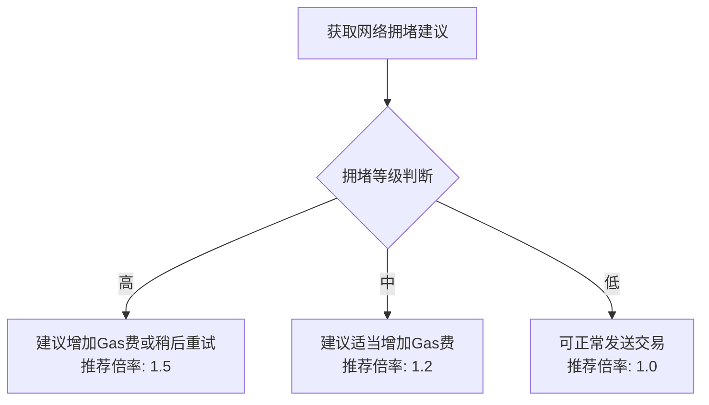
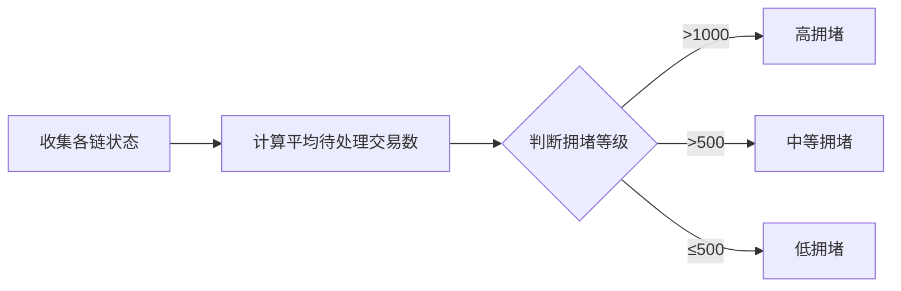
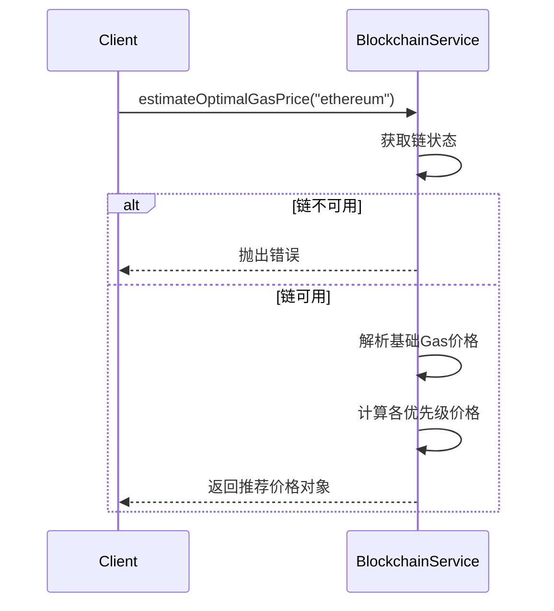
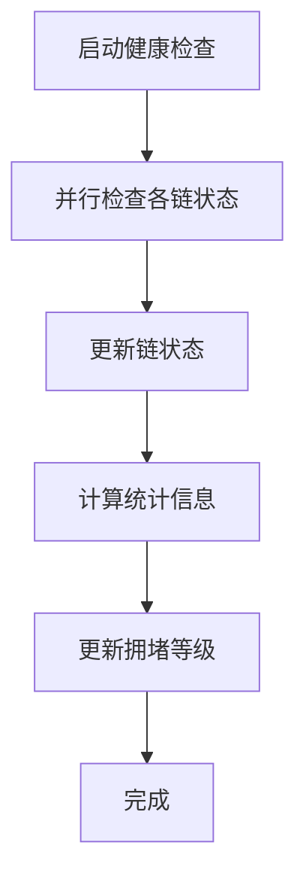

# 网络拥堵管理

<cite>
**本文档中引用的文件**  
- [blockchain.ts](file://backend/src/services/blockchain.ts)
- [BlockchainService.ts](file://backend/src/services/BlockchainService.ts)
- [blockchain.ts](file://backend/src/routes/blockchain.ts)
</cite>

## 目录
1. [简介](#简介)
2. [网络拥堵建议机制](#网络拥堵建议机制)
3. [拥堵等级判定逻辑](#拥堵等级判定逻辑)
4. [Gas价格估算方法](#gas价格估算方法)
5. [推荐Gas倍率的作用](#推荐gas倍率的作用)
6. [实际使用示例](#实际使用示例)
7. [性能考量](#性能考量)

## 简介
本系统通过监控区块链网络的实时状态，提供智能的网络拥堵建议和Gas价格优化策略。核心功能包括根据待处理交易数量评估网络拥堵程度，并据此生成用户友好的建议；同时基于当前Gas价格计算不同优先级的推荐值，帮助用户在交易成本与确认速度之间取得平衡。

**Section sources**
- [blockchain.ts](file://backend/src/services/blockchain.ts#L20-L289)
- [BlockchainService.ts](file://backend/src/services/BlockchainService.ts#L20-L306)

## 网络拥堵建议机制
`getNetworkCongestionAdvice` 方法用于生成针对当前网络状况的建议。该方法从系统统计信息中获取 `networkCongestion` 状态，并根据不同的拥堵级别返回相应的建议信息、推荐操作及Gas费用调整倍率。



**Diagram sources**
- [blockchain.ts](file://backend/src/services/blockchain.ts#L171-L198)
- [BlockchainService.ts](file://backend/src/services/BlockchainService.ts#L187-L214)

**Section sources**
- [blockchain.ts](file://backend/src/services/blockchain.ts#L171-L198)
- [BlockchainService.ts](file://backend/src/services/BlockchainService.ts#L187-L214)

## 拥堵等级判定逻辑
网络拥堵等级由 `updateStats` 方法计算得出，其依据是所有在线链的平均待处理交易数（`avgPendingTx`）。具体阈值如下：

- **低拥堵（low）**: 平均待处理交易数 ≤ 500
- **中等拥堵（medium）**: 500 < 平均待处理交易数 ≤ 1000
- **高拥堵（high）**: 平均待处理交易数 > 1000

此逻辑在每次健康检查后自动更新，确保建议的实时性和准确性。



**Diagram sources**
- [blockchain.ts](file://backend/src/services/blockchain.ts#L142-L168)
- [BlockchainService.ts](file://backend/src/services/BlockchainService.ts#L158-L184)

**Section sources**
- [blockchain.ts](file://backend/src/services/blockchain.ts#L142-L168)
- [BlockchainService.ts](file://backend/src/services/BlockchainService.ts#L158-L184)

## Gas价格估算方法
`estimateOptimalGasPrice` 方法基于指定链的当前Gas价格，计算出四种不同优先级的推荐Gas价格：

- **slow（慢速）**: 基础价格的 80%
- **standard（标准）**: 基础价格的 100%
- **fast（快速）**: 基础价格的 120%
- **instant（即时）**: 基础价格的 150%

该方法首先验证链是否在线，然后解析当前Gas价格并进行乘法运算，最终返回各优先级的整数形式Gas价格。



**Diagram sources**
- [blockchain.ts](file://backend/src/services/blockchain.ts#L201-L227)
- [BlockchainService.ts](file://backend/src/services/BlockchainService.ts#L217-L243)

**Section sources**
- [blockchain.ts](file://backend/src/services/blockchain.ts#L201-L227)
- [BlockchainService.ts](file://backend/src/services/BlockchainService.ts#L217-L243)

## 推荐Gas倍率的作用
`recommendedGasMultiplier` 是网络拥堵建议的一部分，用于指导用户在创建交易时如何调整Gas费用以优化确认速度。其业务价值体现在：

- **成本与效率平衡**：在高拥堵时建议提高1.5倍Gas费以确保快速确认，避免交易长时间挂起。
- **用户体验优化**：提供明确的操作指引，减少用户因不了解网络状况而导致的交易失败或延迟。
- **动态适应性**：倍率随网络状况动态变化，无需手动配置，实现智能化推荐。

该值可直接应用于交易构建逻辑中，作为Gas Price的乘数因子。

## 实际使用示例
以下是一个在交易前调用这些方法进行智能Gas定价的完整代码片段示例：

```typescript
// 获取网络拥堵建议
const congestionAdvice = blockchainService.getNetworkCongestionAdvice();

// 根据建议决定是否继续交易
if (congestionAdvice.level === 'high') {
  console.log(congestionAdvice.message); // 提示用户网络拥堵严重
  const userConfirmed = await promptUser('是否愿意支付更高Gas费？');
  if (!userConfirmed) return;
}

// 估算最优Gas价格（例如以太坊链）
const gasPrices = await blockchainService.estimateOptimalGasPrice('ethereum');

// 使用推荐倍率调整最终Gas价格
const finalGasPrice = Math.round(
  parseInt(gasPrices.standard) * congestionAdvice.recommendedGasMultiplier
);

// 构建交易
const transaction = {
  to: recipientAddress,
  value: amount,
  gasLimit: 21000,
  gasPrice: finalGasPrice,
};
```

**Section sources**
- [blockchain.ts](file://backend/src/services/blockchain.ts#L171-L227)
- [BlockchainService.ts](file://backend/src/services/BlockchainService.ts#L187-L243)

## 性能考量
系统通过定期健康检查机制（默认每30秒）自动更新链状态和统计信息，确保建议的时效性。关键性能设计包括：

- **异步更新**：`checkAllChainsHealth` 方法异步执行所有链的状态检查，避免阻塞主线程。
- **缓存机制**：统计信息和链状态在内存中缓存，减少重复计算和网络请求。
- **错误隔离**：单个链的检查失败不会影响其他链的更新流程，保证系统整体稳定性。



**Diagram sources**
- [blockchain.ts](file://backend/src/services/blockchain.ts#L127-L140)
- [BlockchainService.ts](file://backend/src/services/BlockchainService.ts#L143-L156)

**Section sources**
- [blockchain.ts](file://backend/src/services/blockchain.ts#L127-L140)
- [BlockchainService.ts](file://backend/src/services/BlockchainService.ts#L143-L156)