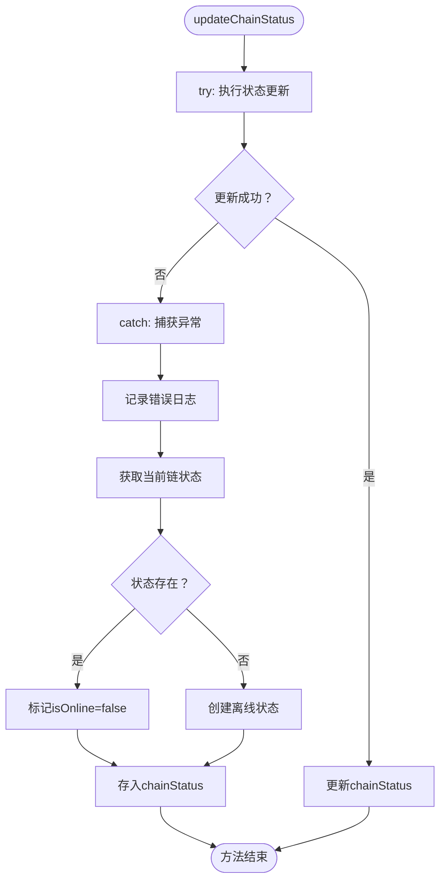

# 链状态监控

<cite>
**Referenced Files in This Document**   
- [BlockchainService.ts](file://backend/src/services/BlockchainService.ts)
- [multiChainService.ts](file://backend/src/services/multiChainService.ts)
- [index.ts](file://backend/src/index.ts)
</cite>

## 目录
1. [链状态监控机制概述](#链状态监控机制概述)
2. [ChainStatus接口字段详解](#chainstatus接口字段详解)
3. [chainStatus Map数据结构设计与初始化](#chainstatus-map数据结构设计与初始化)
4. [多链状态更新实现](#多链状态更新实现)
5. [错误处理与离线标记策略](#错误处理与离线标记策略)
6. [实际使用示例](#实际使用示例)
7. [常见问题排查指南](#常见问题排查指南)

## 链状态监控机制概述

`BlockchainService`类实现了对多条区块链的实时状态监控功能，通过定期检查Ethereum、TRON和BSC三条链的区块高度、Gas价格等关键指标，为跨链支付平台提供网络健康状况评估。该服务在系统启动时自动初始化，并通过定时任务持续更新链状态，确保交易执行时能够获取最新的网络信息。

```mermaid
classDiagram
class BlockchainService {
-stats : BlockchainStats
-chainStatus : Map<string, ChainStatus>
+getBlockchainStats() : BlockchainStats
+getChainStatus(chainName?) : ChainStatus | ChainStatus[]
+updateChainStatus(chainName) : Promise<void>
+checkAllChainsHealth() : Promise<void>
+getNetworkCongestionAdvice() : {level, message, recommendedGasMultiplier}
+estimateOptimalGasPrice(chainName) : Promise<{slow, standard, fast, instant}>
+monitorTransaction(chainName, txHash) : Promise<{status, confirmations, blockNumber, gasUsed}>
+getPerformanceMetrics() : {throughput, latency, successRate}
+startHealthCheck(intervalMs) : void
}
class ChainStatus {
+name : string
+isOnline : boolean
+blockHeight : number
+gasPrice : string
+avgBlockTime : number
+pendingTransactions : number
}
class MultiChainService {
-chains : Map<string, ChainConfig>
-providers : Map<string, any>
+getChainConfig(chainName) : ChainConfig | undefined
+getTransactionStatus(chainName, txHash) : Promise<TransactionResult>
}
BlockchainService --> MultiChainService : "extends"
BlockchainService --> ChainStatus : "manages"
BlockchainService --> "Map" : "chainStatus"
```

**Diagram sources**
- [BlockchainService.ts](file://backend/src/services/BlockchainService.ts#L20-L306)
- [multiChainService.ts](file://backend/src/services/multiChainService.ts#L48-L505)

**Section sources**
- [BlockchainService.ts](file://backend/src/services/BlockchainService.ts#L20-L306)

## ChainStatus接口字段详解

`ChainStatus`接口定义了每条区块链的核心状态指标，这些字段为系统决策提供了关键数据支持。

### 字段业务含义

| 字段名称 | 类型 | 业务含义 |
|---------|------|---------|
| name | string | 链的标识名称（ethereum、tron、bsc），用于区分不同区块链网络 |
| isOnline | boolean | 链的在线状态，true表示链服务正常，false表示链已离线或不可达 |
| blockHeight | number | 当前区块高度，反映区块链的最新进度，用于计算交易确认数 |
| gasPrice | string | 当前Gas价格（单位：Gwei），决定交易手续费成本，影响交易打包速度 |
| avgBlockTime | number | 平均出块时间（秒），Ethereum为12秒，TRON为3秒，BSC为5秒 |
| pendingTransactions | number | 待处理交易数量，反映网络拥堵程度，数值越大表示网络越拥挤 |

**Section sources**
- [BlockchainService.ts](file://backend/src/services/BlockchainService.ts#L11-L18)

## chainStatus Map数据结构设计与初始化

`chainStatus`采用Map数据结构存储各链状态，以链名称为键，`ChainStatus`对象为值，提供高效的增删改查操作。

### 数据结构设计优势

- **高效查找**：基于哈希表实现，查找时间复杂度为O(1)
- **动态扩展**：可轻松添加新链支持，无需修改现有代码结构
- **类型安全**：结合TypeScript泛型，确保键值类型一致性
- **内存优化**：避免对象属性遍历开销，适合频繁状态更新场景

### 初始化过程

`initializeChainStatus`方法在`BlockchainService`构造函数中被调用，为三条支持的链设置初始状态：


**Diagram sources**
- [BlockchainService.ts](file://backend/src/services/BlockchainService.ts#L36-L50)

**Section sources**
- [BlockchainService.ts](file://backend/src/services/BlockchainService.ts#L36-L50)

## 多链状态更新实现

`updateChainStatus`方法通过多链服务提供者获取实时链状态，针对EVM链和TRON链采用不同的实现方式。

### EVM链与TRON链实现差异


**Diagram sources**
- [BlockchainService.ts](file://backend/src/services/BlockchainService.ts#L79-L140)
- [multiChainService.ts](file://backend/src/services/multiChainService.ts#L155-L187)

#### EVM链实现（Ethereum/BSC）

1. 通过`providers.get(chain)`获取Ethers.js提供者实例
2. 调用`provider.getBlockNumber()`获取最新区块高度
3. 调用`provider.getFeeData()`获取Gas价格数据
4. 使用`ethers.formatUnits()`将Wei转换为Gwei单位
5. 构建`ChainStatus`对象并更新到`chainStatus` Map中

#### TRON链实现

1. 通过`providers.get('tron')`获取TronWeb实例
2. 调用`provider.trx.getCurrentBlock()`获取当前区块
3. 从`block_header.raw_data.number`提取区块高度
4. TRON网络使用固定Gas价格'420'（能量费用）
5. 构建`ChainStatus`对象并更新状态

**Section sources**
- [BlockchainService.ts](file://backend/src/services/BlockchainService.ts#L79-L140)

## 错误处理与离线标记策略

当链状态更新失败时，系统采用稳健的错误处理机制确保服务可用性。

### 错误处理流程



### 离线标记策略

1. **异常捕获**：使用try-catch包裹状态更新逻辑，防止单链故障影响整体服务
2. **日志记录**：通过`logger.error()`记录详细的错误信息，便于问题追踪
3. **状态降级**：将对应链的`isOnline`字段设置为false，标记为离线状态
4. **服务降级**：后续交易请求将拒绝使用离线链，避免交易失败
5. **自动恢复**：定期健康检查会尝试重新连接，成功后自动恢复在线状态

**Section sources**
- [BlockchainService.ts](file://backend/src/services/BlockchainService.ts#L79-L140)

## 实际使用示例

### 服务启动时自动初始化


**Diagram sources**
- [index.ts](file://backend/src/index.ts#L236)
- [BlockchainService.ts](file://backend/src/services/BlockchainService.ts#L294-L306)

在`backend/src/index.ts`中，系统启动时会创建`BlockchainService`实例并启动健康检查：

```typescript
const blockchainService = new BlockchainService()
blockchainService.startHealthCheck()
```

这将启动一个每30秒执行一次的定时任务，自动检查所有链的健康状态。

**Section sources**
- [index.ts](file://backend/src/index.ts#L236)

## 常见问题排查指南

### 问题1：链状态未更新

**可能原因**：
- RPC节点不可达或API密钥无效
- 网络连接问题
- 链配置错误

**排查步骤**：
1. 检查环境变量中的RPC URL配置
2. 验证API密钥是否正确设置
3. 查看服务日志中的错误信息
4. 测试RPC端点连通性

### 问题2：Gas价格显示异常

**可能原因**：
- 单位转换错误
- 数据格式不一致
- 缓存未更新

**解决方案**：
- 确认使用`ethers.formatUnits()`正确转换单位
- 检查`gasPrice`字段是否为字符串类型
- 触发手动状态更新测试

### 问题3：链被错误标记为离线

**排查方法**：
1. 检查`chainStatus` Map中对应链的`isOnline`值
2. 查看最近的错误日志，定位失败原因
3. 验证对应链的提供者是否正常初始化
4. 确认RPC服务是否正常响应

**Section sources**
- [BlockchainService.ts](file://backend/src/services/BlockchainService.ts#L79-L140)