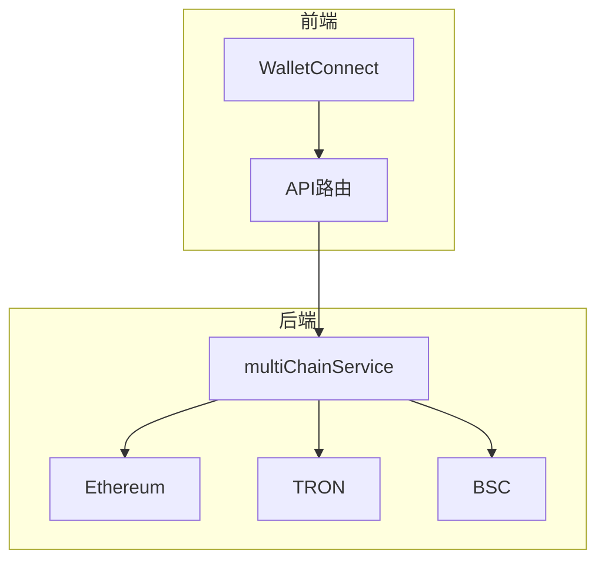
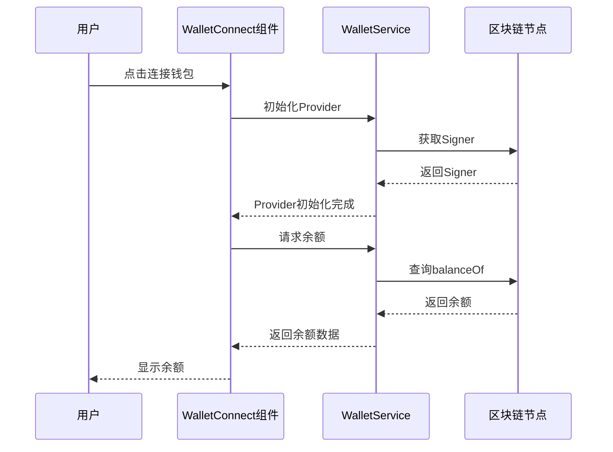
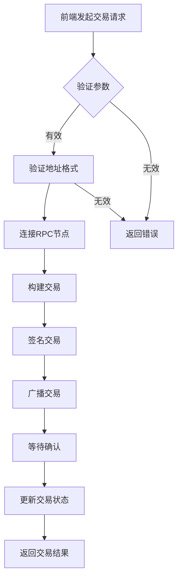
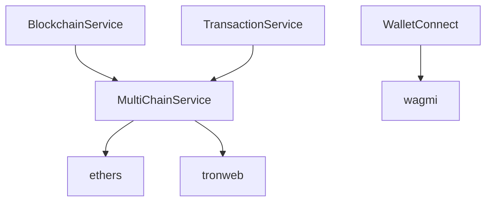

# 区块链集成

<cite>
**本文档引用文件**  
- [multiChainService.ts](file://backend/src/services/multiChainService.ts)
- [WalletConnect.tsx](file://src/components/Wallet/WalletConnect.tsx)
- [route.ts](file://src/app/api/wallet/balances/route.ts)
- [route.ts](file://src/app/api/wallet/transaction/route.ts)
- [walletService.ts](file://src/services/walletService.ts)
- [blockchain.ts](file://backend/src/services/blockchain.ts)
</cite>

## 目录
1. [简介](#简介)
2. [项目结构](#项目结构)
3. [核心组件](#核心组件)
4. [架构概述](#架构概述)
5. [详细组件分析](#详细组件分析)
6. [依赖分析](#依赖分析)
7. [性能考虑](#性能考虑)
8. [故障排除指南](#故障排除指南)
9. [结论](#结论)

## 简介
本文档详细说明了支持Ethereum、TRON和BSC多链的区块链集成架构。重点介绍multiChainService.ts实现的多链支持模式，包括网络配置管理、交易构建、签名和广播机制。文档解释了区块链服务层如何抽象不同链的差异，提供统一的API接口，并涵盖钱包连接流程、余额查询、交易执行等核心功能的技术实现。

## 项目结构
项目采用分层架构，前端位于`src`目录，后端位于`backend/src`目录。前端使用Next.js框架，包含API路由、组件和页面。后端使用Node.js，包含中间件、路由和核心服务。多链服务位于`backend/src/services/multiChainService.ts`，钱包连接组件位于`src/components/Wallet/WalletConnect.tsx`。

## 核心组件
核心组件包括multiChainService.ts实现的多链服务，支持Ethereum、TRON和BSC网络。该服务通过适配器模式抽象不同区块链的差异，提供统一的API接口。钱包连接组件WalletConnect.tsx负责钱包连接和余额查询，交易路由处理交易执行和状态查询。

**核心组件来源**
- [multiChainService.ts](file://backend/src/services/multiChainService.ts#L48-L505)
- [WalletConnect.tsx](file://src/components/Wallet/WalletConnect.tsx#L16-L241)

## 架构概述
系统采用分层架构，前端通过API路由与后端服务通信。后端服务层包含multiChainService，负责与不同区块链网络交互。该服务初始化各链的配置和提供者，支持稳定币转账、余额查询、交易状态获取等功能。



**图表来源**
- [multiChainService.ts](file://backend/src/services/multiChainService.ts#L48-L505)

## 详细组件分析

### MultiChainService分析
`MultiChainService`是多链操作的核心，通过`initializeChains`方法配置Ethereum、TRON和BSC的链参数，包括RPC URL、区块浏览器和稳定币合约地址。`initializeProviders`方法动态加载`ethers`和`tronweb`库，为各链创建RPC提供者。该服务通过`getStablecoinBalance`和`transferStablecoin`等方法提供统一的接口，内部根据链类型（EVM或TRON）调用不同的实现。

```mermaid
classDiagram
class MultiChainService {
+getSupportedChains() ChainConfig[]
+getStablecoinBalance(chainName, tokenSymbol, address) Promise~string~
+transferStablecoin(chainName, tokenSymbol, fromAddress, toAddress, amount, privateKey) Promise~TransactionResult~
+getTransactionStatus(chainName, txHash) Promise~TransactionResult~
+getGasPrices(chainName) Promise~{slow, standard, fast}~
+validateAddress(chainName, address) boolean
}
class ChainConfig {
+chainId : number
+name : string
+symbol : string
+rpcUrl : string
+explorerUrl : string
+nativeCurrency : {name, symbol, decimals}
+stablecoins : {tokenSymbol : {address, decimals, symbol, name}}
}
class TransactionResult {
+txHash : string
+chainId : number
+status : 'pending' | 'confirmed' | 'failed'
+confirmations : number
+gasUsed? : string
+blockNumber? : number
+timestamp : Date
}
MultiChainService --> ChainConfig : "包含"
MultiChainService --> TransactionResult : "返回"
```

**图表来源**
- [multiChainService.ts](file://backend/src/services/multiChainService.ts#L48-L505)

**本节来源**
- [multiChainService.ts](file://backend/src/services/multiChainService.ts#L48-L505)

### 钱包连接流程
`WalletConnect`组件使用wagmi库管理钱包连接状态。当用户连接钱包后，组件会自动加载指定网络上的稳定币余额。余额查询通过`walletService.getStablecoinBalances`方法实现，该方法根据网络ID选择相应的合约地址并查询余额。



**图表来源**
- [WalletConnect.tsx](file://src/components/Wallet/WalletConnect.tsx#L16-L241)
- [walletService.ts](file://src/services/walletService.ts#L63-L265)

**本节来源**
- [WalletConnect.tsx](file://src/components/Wallet/WalletConnect.tsx#L16-L241)

### 交易执行流程
交易执行通过`transaction/route.ts`处理。POST请求接收交易参数，验证地址格式，然后模拟交易处理过程。GET请求支持通过交易哈希或地址查询交易状态和历史记录。实际实现中，这些操作会与区块链节点交互并存储交易详情。



**图表来源**
- [route.ts](file://src/app/api/wallet/transaction/route.ts#L0-L143)

**本节来源**
- [route.ts](file://src/app/api/wallet/transaction/route.ts#L0-L143)

## 依赖分析
系统依赖多个关键库：`ethers`用于EVM链交互，`tronweb`用于TRON链交互，`wagmi`用于前端钱包连接管理。后端服务之间存在依赖关系，`BlockchainService`继承`MultiChainService`以扩展区块链监控功能。



**图表来源**
- [multiChainService.ts](file://backend/src/services/multiChainService.ts#L48-L505)
- [blockchain.ts](file://backend/src/services/blockchain.ts#L0-L289)

**本节来源**
- [multiChainService.ts](file://backend/src/services/multiChainService.ts#L48-L505)
- [blockchain.ts](file://backend/src/services/blockchain.ts#L0-L289)

## 性能考虑
系统通过连接池和缓存优化区块链交互性能。`MultiChainService`在初始化时创建并复用Provider实例，避免重复建立连接。对于频繁查询的余额数据，建议实现缓存机制以减少对区块链节点的请求压力。交易状态查询采用轮询机制，可根据网络状况调整轮询间隔。

## 故障排除指南
常见问题包括网络连接失败、交易签名错误和余额查询超时。对于网络连接问题，检查RPC URL配置和网络连通性。交易失败时，验证私钥格式和nonce管理。余额查询失败时，确认合约地址和ABI定义正确。建议启用详细的日志记录以帮助诊断问题。

**本节来源**
- [multiChainService.ts](file://backend/src/services/multiChainService.ts#L48-L505)
- [walletService.ts](file://src/services/walletService.ts#L63-L265)

## 结论
本文档详细介绍了多链区块链集成的架构和实现。`MultiChainService`通过适配器模式成功抽象了Ethereum、TRON和BSC之间的差异，提供了统一的API接口。钱包连接和交易执行流程设计合理，支持完整的区块链交互功能。建议进一步完善错误处理机制和性能优化策略，以提升系统的稳定性和用户体验。