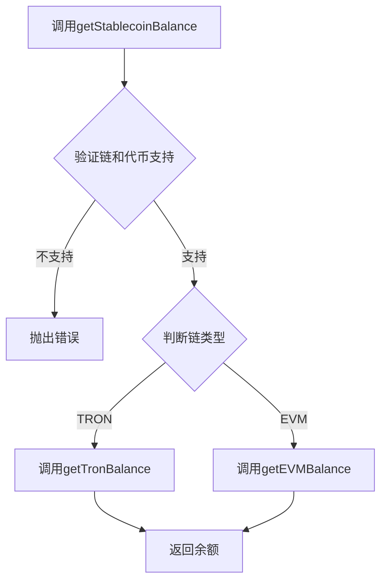
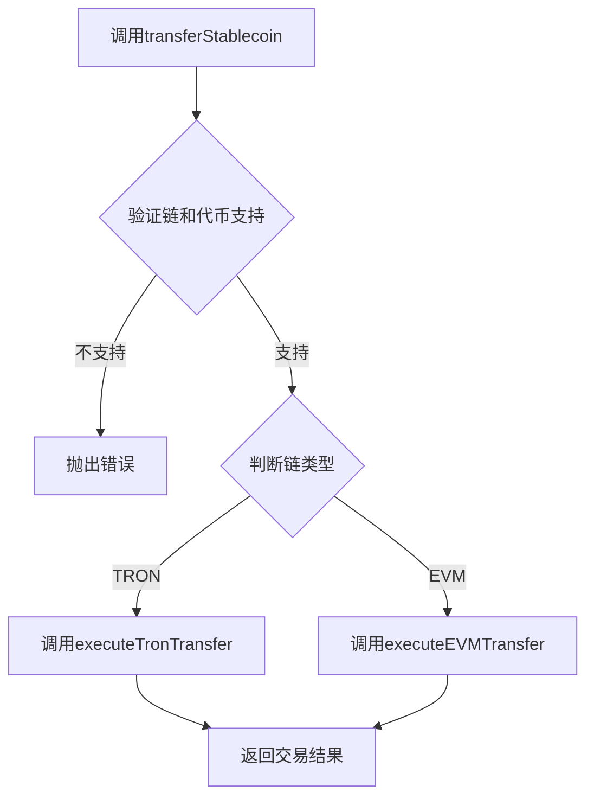

# 多链服务

<cite>
**本文档引用的文件**  
- [multiChainService.ts](file://backend/src/services/multiChainService.ts)
- [multiChainService.test.ts](file://backend/src/services/__tests__/multiChainService.test.ts)
- [multiChainService.unit.test.ts](file://backend/src/services/__tests__/multiChainService.unit.test.ts)
</cite>

## 目录
1. [简介](#简介)
2. [核心架构](#核心架构)
3. [链配置与初始化](#链配置与初始化)
4. [链管理方法](#链管理方法)
5. [核心功能接口](#核心功能接口)
6. [EVM与TRON差异处理](#evm与tron差异处理)
7. [使用示例](#使用示例)
8. [辅助功能实现](#辅助功能实现)
9. [结论](#结论)

## 简介

`MultiChainService` 类是本项目的核心服务组件，旨在为以太坊（Ethereum）、TRON和币安智能链（BSC）等不同区块链网络提供统一的稳定币操作接口。该服务通过抽象化底层区块链的差异，实现了跨链操作的标准化，使开发者能够以一致的方式查询余额、执行转账等操作，而无需关心各链的技术细节。

该服务主要通过两个核心映射结构来实现多链支持：
- **链配置映射** (`chains`)：存储各区块链的配置信息，包括链ID、RPC URL、稳定币合约地址等
- **提供商映射** (`providers`)：管理各链的网络连接实例，用于与区块链节点通信

这种设计模式不仅提高了代码的可维护性，还为未来扩展支持更多区块链提供了便利。

**Section sources**
- [multiChainService.ts](file://backend/src/services/multiChainService.ts#L48-L505)

## 核心架构

`MultiChainService` 采用面向对象的设计模式，通过类的封装实现了多链操作的统一接口。其核心架构由以下几个关键部分组成：

```mermaid
classDiagram
class MultiChainService {
-chains : Map<string, ChainConfig>
-providers : Map<string, any>
+constructor()
+getSupportedChains() : ChainConfig[]
+getChainConfig(chainName : string) : ChainConfig | undefined
+getStablecoinBalance(chainName : string, tokenSymbol : string, address : string) : Promise<string>
+transferStablecoin(chainName : string, tokenSymbol : string, fromAddress : string, toAddress : string, amount : string, privateKey : string) : Promise<TransactionResult>
+getTransactionStatus(chainName : string, txHash : string) : Promise<TransactionResult>
+getGasPrices(chainName : string) : Promise<{slow : string, standard : string, fast : string}>
+validateAddress(chainName : string, address : string) : boolean
}
class ChainConfig {
+chainId : number
+name : string
+symbol : string
+rpcUrl : string
+explorerUrl : string
+nativeCurrency : {name : string, symbol : string, decimals : number}
+stablecoins : {[symbol : string] : {address : string, decimals : number, symbol : string, name : string}}
}
class TransactionResult {
+txHash : string
+chainId : number
+status : 'pending' | 'confirmed' | 'failed'
+confirmations : number
+gasUsed? : string
+blockNumber? : number
+timestamp : Date
}
MultiChainService --> ChainConfig : "使用"
MultiChainService --> TransactionResult : "返回"
```

**Diagram sources**
- [multiChainService.ts](file://backend/src/services/multiChainService.ts#L6-L46)
- [multiChainService.ts](file://backend/src/services/multiChainService.ts#L48-L505)

**Section sources**
- [multiChainService.ts](file://backend/src/services/multiChainService.ts#L6-L505)

## 链配置与初始化

`MultiChainService` 在构造函数中通过调用 `initializeChains()` 和 `initializeProviders()` 方法完成初始化。这种设计将配置与连接分离，提高了代码的可测试性和可维护性。

### 链配置初始化

`initializeChains()` 方法为支持的每条区块链创建并存储配置对象。目前支持的链包括：

- **以太坊主网**：链ID为1，配置了USDT、USDC和DAI等稳定币的合约地址
- **TRON主网**：链ID为728126428，配置了USDT和USDC的合约地址
- **BSC主网**：链ID为56，配置了USDT、USDC和BUSD的合约地址

每条链的配置都包含完整的元数据，如链ID、名称、符号、RPC URL、区块浏览器URL以及原生货币和稳定币的信息。

### 服务商初始化

`initializeProviders()` 方法负责创建与各区块链网络通信的客户端实例：
- 对于EVM兼容链（以太坊和BSC），使用 `ethers.JsonRpcProvider` 创建提供者
- 对于TRON链，使用 `tronweb` 库创建提供者，并设置必要的API密钥头

这种异步初始化方式确保了服务在完全准备好之前不会接受请求，提高了系统的稳定性。

**Section sources**
- [multiChainService.ts](file://backend/src/services/multiChainService.ts#L70-L187)

## 链管理方法

`MultiChainService` 提供了两个核心的链管理方法，用于查询和获取链的配置信息。

### getSupportedChains 方法

该方法返回当前服务支持的所有区块链配置数组。通过 `Array.from(this.chains.values())` 将内部的Map结构转换为数组，便于外部调用者遍历和使用。

```typescript
public getSupportedChains(): ChainConfig[] {
  return Array.from(this.chains.values())
}
```

此方法常用于前端界面显示支持的区块链列表，或在API响应中提供可用链的信息。

### getChainConfig 方法

该方法根据链名称（不区分大小写）返回特定链的配置对象。它使用 `toLowerCase()` 方法确保名称匹配的灵活性。

```typescript
public getChainConfig(chainName: string): ChainConfig | undefined {
  return this.chains.get(chainName.toLowerCase())
}
```

当请求的链不存在时，方法返回 `undefined`，调用者需要处理这种边界情况。该方法是其他功能方法获取链配置的基础。

**Section sources**
- [multiChainService.ts](file://backend/src/services/multiChainService.ts#L190-L197)
- [multiChainService.test.ts](file://backend/src/services/__tests__/multiChainService.test.ts#L22-L30)
- [multiChainService.unit.test.ts](file://backend/src/services/__tests__/multiChainService.unit.test.ts#L50-L58)

## 核心功能接口

`MultiChainService` 提供了统一的跨链操作接口，其中最核心的是余额查询和转账功能。

### getStablecoinBalance 方法

该方法实现了跨链稳定币余额查询的统一接口。其工作流程如下：



该方法首先验证请求的链和代币是否被支持，然后根据链类型分发到相应的实现方法。这种设计模式实现了"一次编写，到处运行"的跨链操作理念。

### transferStablecoin 方法

该方法提供了统一的稳定币转账接口。与余额查询类似，它也根据链类型分发到不同的实现：



该方法要求提供私钥进行签名，确保了交易的安全性。返回的 `TransactionResult` 对象包含了交易哈希、状态等关键信息，便于后续跟踪。

**Section sources**
- [multiChainService.ts](file://backend/src/services/multiChainService.ts#L200-L297)
- [multiChainService.ts](file://backend/src/services/multiChainService.ts#L300-L360)

## EVM与TRON差异处理

尽管 `MultiChainService` 提供了统一的接口，但在底层实现中必须处理EVM链（以太坊、BSC）与TRON链的技术差异。

### 余额查询差异

EVM链和TRON链在余额查询上的主要差异体现在：

| 特性 | EVM链 | TRON链 |
|------|-------|--------|
| 库依赖 | ethers.js | tronweb |
| ABI定义 | 需要手动定义balanceOf函数 | 通过contract().at()自动获取 |
| 数值处理 | 使用ethers.formatUnits格式化 | 手动除以10^6进行格式化 |

```typescript
// EVM余额查询
private async getEVMBalance(provider: any, tokenAddress: string, userAddress: string, decimals: number): Promise<string> {
  const { ethers } = await import('ethers')
  const abi = ['function balanceOf(address owner) view returns (uint256)']
  const contract = new ethers.Contract(tokenAddress, abi, provider)
  const balance = await contract.balanceOf(userAddress)
  return ethers.formatUnits(balance, decimals)
}

// TRON余额查询
private async getTronBalance(tronWeb: any, tokenAddress: string, userAddress: string): Promise<string> {
  const contract = await tronWeb.contract().at(tokenAddress)
  const balance = await contract.balanceOf(userAddress).call()
  return (balance.toNumber() / Math.pow(10, 6)).toString()
}
```

### 转账实现差异

转账操作的差异更为显著：

- **EVM链**：使用钱包实例（Wallet）进行签名，通过 `parseUnits` 处理金额精度
- **TRON链**：需要设置私钥到tronweb实例，手动计算基于10的幂的转账金额

这些差异被完全封装在私有方法中，对外部调用者透明。

**Section sources**
- [multiChainService.ts](file://backend/src/services/multiChainService.ts#L230-L264)
- [multiChainService.ts](file://backend/src/services/multiChainService.ts#L332-L360)

## 使用示例

以下代码示例展示了如何初始化 `MultiChainService` 并获取以太坊主网上的USDT余额：

```typescript
import { MultiChainService } from './multiChainService';

// 初始化多链服务
const multiChainService = new MultiChainService();

// 获取以太坊主网USDT余额
async function getEthUsdtBalance(address: string): Promise<string> {
  try {
    const balance = await multiChainService.getStablecoinBalance(
      'ethereum',  // 链名称
      'USDT',      // 代币符号
      address      // 用户地址
    );
    console.log(`ETH主网USDT余额: ${balance}`);
    return balance;
  } catch (error) {
    console.error('获取余额失败:', error);
    throw error;
  }
}

// 使用示例
const userAddress = '0x742d35Cc6648C8532C2B41F398999930894B6Af8';
getEthUsdtBalance(userAddress);
```

此示例展示了 `MultiChainService` 的易用性——只需调用统一的 `getStablecoinBalance` 方法，服务会自动处理底层的区块链差异。

**Section sources**
- [multiChainService.ts](file://backend/src/services/multiChainService.ts#L200-L227)

## 辅助功能实现

除了核心的余额和转账功能，`MultiChainService` 还提供了一系列辅助功能，增强了服务的完整性和可用性。

### 地址验证

`validateAddress` 方法实现了跨链地址格式验证：

```typescript
public validateAddress(chainName: string, address: string): boolean {
  try {
    if (chainName.toLowerCase() === 'tron') {
      return address.startsWith('T') && address.length === 34;
    } else {
      const { ethers } = require('ethers');
      return ethers.isAddress(address);
    }
  } catch (error) {
    return false;
  }
}
```

该方法根据链类型应用不同的验证规则，防止无效地址导致的交易失败。

### Gas价格估算

`getGasPrices` 方法为EVM链提供Gas价格估算，而为TRON链返回基于带宽的估算成本：

```typescript
public async getGasPrices(chainName: string): Promise<{slow: string, standard: string, fast: string}> {
  if (chainName.toLowerCase() === 'tron') {
    return { slow: '10', standard: '15', fast: '20' };
  } else {
    const gasPrice = await provider.getFeeData();
    return {
      slow: ethers.formatUnits(gasPrice.gasPrice || 0, 'gwei'),
      standard: ethers.formatUnits((gasPrice.gasPrice || BigInt(0)) * BigInt(110) / BigInt(100), 'gwei'),
      fast: ethers.formatUnits((gasPrice.gasPrice || BigInt(0)) * BigInt(120) / BigInt(100), 'gwei')
    };
  }
}
```

### 错误处理

服务在关键操作中都实现了完善的错误处理机制：
- 使用try-catch捕获异步操作异常
- 记录详细的错误日志
- 向上抛出语义化的错误信息
- 在验证方法中优雅地处理异常，返回布尔值而非抛出错误

这些机制确保了服务的健壮性和可维护性。

**Section sources**
- [multiChainService.ts](file://backend/src/services/multiChainService.ts#L405-L465)

## 结论

`MultiChainService` 类通过精心设计的抽象层，成功实现了对以太坊、TRON和BSC等多条区块链的统一操作接口。其核心价值体现在：

1. **抽象化差异**：将EVM链与TRON链的技术差异完全封装，提供一致的API
2. **易于扩展**：通过配置映射的方式，可以轻松添加对新链的支持
3. **高可靠性**：完善的错误处理和验证机制确保了服务的稳定性
4. **开发者友好**：简洁的接口设计降低了跨链开发的复杂度

该服务的设计模式为多链应用开发提供了优秀的参考范例，其模块化和分层的设计思想值得在类似项目中借鉴。未来可以考虑增加对更多区块链的支持，以及提供更丰富的跨链交易功能。