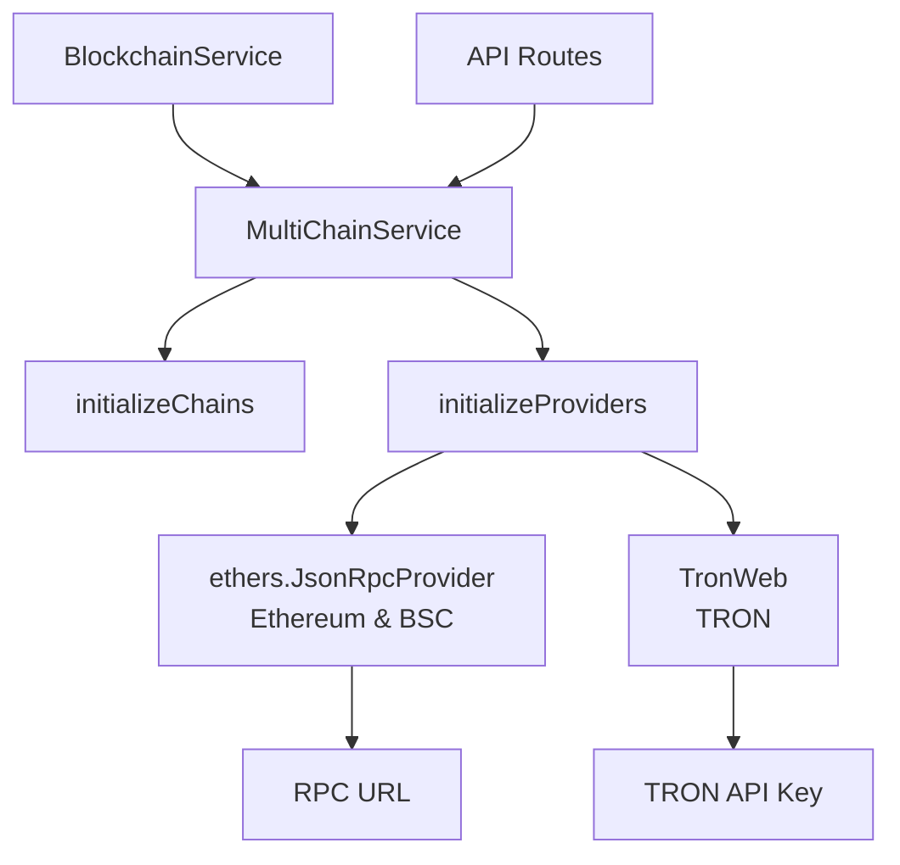
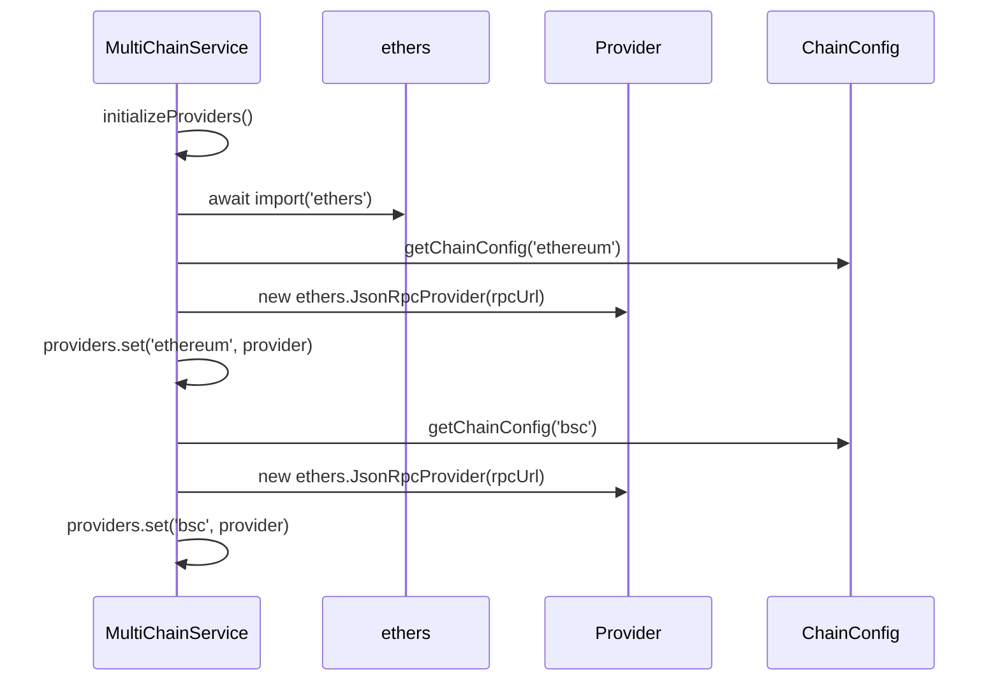
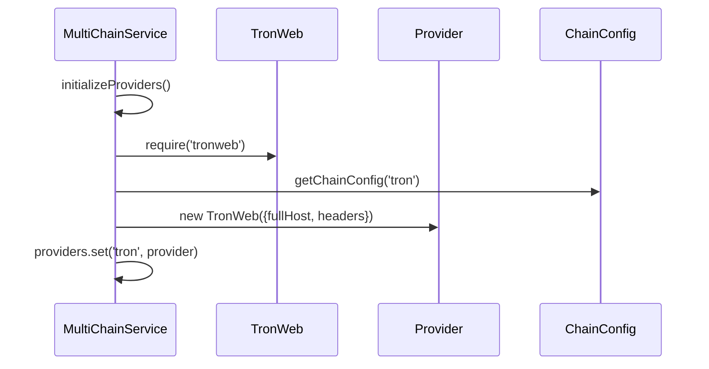
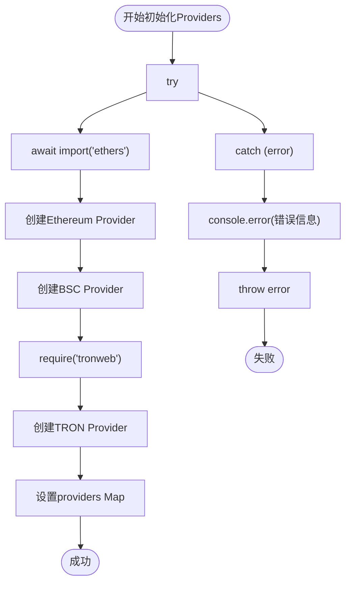
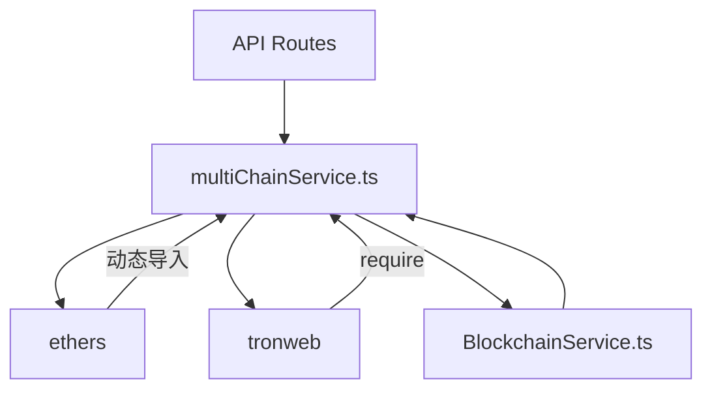

<cite>
**Referenced Files in This Document**   
- [multiChainService.ts](file://backend/src/services/multiChainService.ts)
- [tronweb.d.ts](file://backend/src/types/tronweb.d.ts)
- [blockchain.ts](file://backend/src/services/blockchain.ts)
</cite>

## 目录
1. [Provider初始化](#provider初始化)
2. [核心组件](#核心组件)
3. [架构概述](#架构概述)
4. [详细组件分析](#详细组件分析)
5. [依赖分析](#依赖分析)
6. [性能考虑](#性能考虑)
7. [故障排除指南](#故障排除指南)

## Provider初始化

本文档详细阐述了`multiChainService`中`initializeProviders`方法的实现机制，重点说明如何为EVM兼容链（Ethereum、BSC）使用ethers.js的`JsonRpcProvider`，以及为TRON链使用`tronweb`库进行Provider实例化。

**Section sources**
- [multiChainService.ts](file://backend/src/services/multiChainService.ts#L148-L196)

## 核心组件

`MultiChainService`类是跨链操作的核心，负责管理多个区块链网络的连接和交互。其核心组件包括`chains`和`providers`两个`Map`结构，分别用于存储链配置和Provider实例。`initializeProviders`方法在构造函数中被调用，负责异步加载依赖并初始化各链的Provider。

**Section sources**
- [multiChainService.ts](file://backend/src/services/multiChainService.ts#L14-L22)
- [multiChainService.ts](file://backend/src/services/multiChainService.ts#L148-L196)

## 架构概述

**Diagram sources**
- [multiChainService.ts](file://backend/src/services/multiChainService.ts#L148-L196)
- [blockchain.ts](file://backend/src/services/blockchain.ts#L0-L50)

## 详细组件分析

### initializeProviders方法分析

`initializeProviders`方法是Provider初始化的核心，它通过动态导入（`import`）和`require`来异步加载外部依赖，确保了应用启动时不会因网络请求而阻塞。

#### EVM链Provider初始化
对于Ethereum和BSC等EVM兼容链，该方法使用`ethers.js`库的`JsonRpcProvider`进行初始化。通过`await import('ethers')`动态导入库，然后使用链配置中的`rpcUrl`创建Provider实例。

**Diagram sources**
- [multiChainService.ts](file://backend/src/services/multiChainService.ts#L153-L163)

#### TRON链Provider初始化
对于TRON链，该方法使用`tronweb`库进行初始化。通过`require('tronweb')`同步加载库，然后使用`fullHost`和包含`TRON-PRO-API-KEY`的`headers`选项创建`TronWeb`实例。

**Diagram sources**
- [multiChainService.ts](file://backend/src/services/multiChainService.ts#L165-L174)
- [tronweb.d.ts](file://backend/src/types/tronweb.d.ts#L10-L29)

### 错误处理机制

该方法包含全面的错误处理机制，使用`try-catch`块捕获初始化过程中的任何异常。如果初始化失败，会记录错误日志并重新抛出异常，确保调用者能够感知到Provider初始化的失败。

**Diagram sources**
- [multiChainService.ts](file://backend/src/services/multiChainService.ts#L148-L196)

**Section sources**
- [multiChainService.ts](file://backend/src/services/multiChainService.ts#L148-L196)

## 依赖分析

**Diagram sources**
- [multiChainService.ts](file://backend/src/services/multiChainService.ts#L153)
- [multiChainService.ts](file://backend/src/services/multiChainService.ts#L165)
- [blockchain.ts](file://backend/src/services/blockchain.ts#L0-L50)

## 性能考虑

虽然`initializeProviders`方法本身没有直接的性能优化配置，但其设计考虑了异步加载和错误处理，避免了阻塞主线程。建议在生产环境中实现连接池管理和自定义超时配置，以进一步提升性能和稳定性。

**Section sources**
- [multiChainService.ts](file://backend/src/services/multiChainService.ts#L148-L196)

## 故障排除指南

### 常见问题及解决方案

1.  **RPC连接失败**: 确保环境变量`ETHEREUM_RPC_URL`、`TRON_RPC_URL`和`BSC_RPC_URL`已正确设置，并且网络可达。
2.  **API密钥缺失**: 确保环境变量`TRON_API_KEY`已正确设置，因为TRON Provider需要此密钥进行身份验证。
3.  **依赖加载失败**: 检查`node_modules`目录中是否已正确安装`ethers`和`tronweb`库。

**Section sources**
- [multiChainService.ts](file://backend/src/services/multiChainService.ts#L148-L196)
- [tronweb.d.ts](file://backend/src/types/tronweb.d.ts#L6-L7)