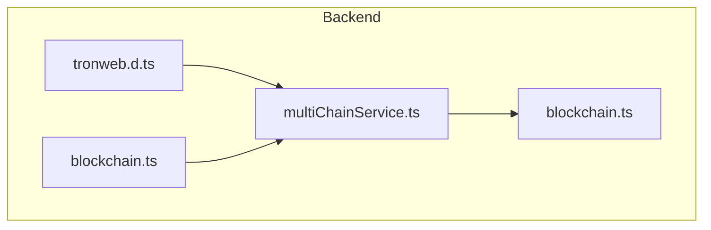
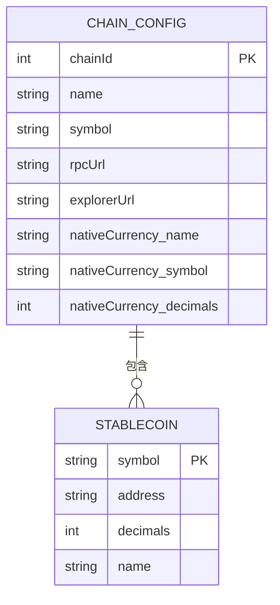
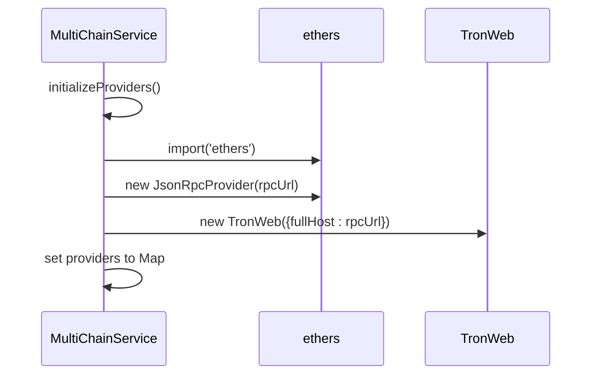
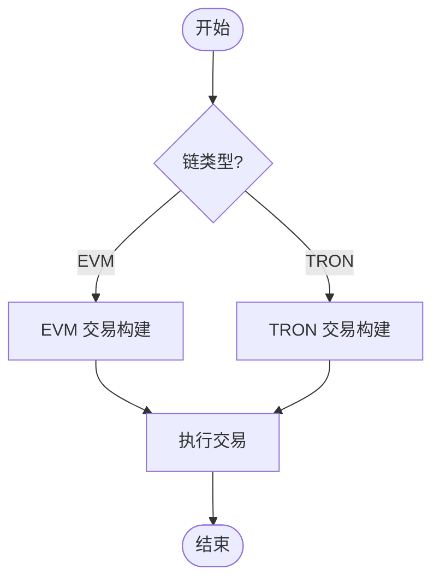
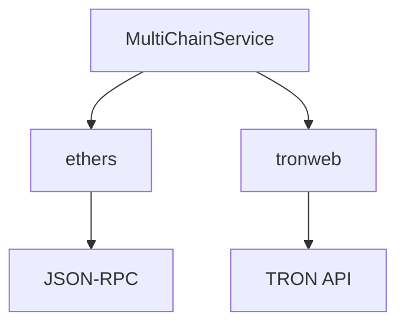

# 多链架构

<cite>
**本文档引用的文件**  
- [multiChainService.ts](file://backend/src/services/multiChainService.ts)
- [blockchain.ts](file://backend/src/services/blockchain.ts)
- [tronweb.d.ts](file://backend/src/types/tronweb.d.ts)
- [blockchain.ts](file://backend/src/routes/blockchain.ts)
</cite>

## 目录
1. [简介](#简介)
2. [项目结构](#项目结构)
3. [核心组件](#核心组件)
4. [架构概述](#架构概述)
5. [详细组件分析](#详细组件分析)
6. [依赖分析](#依赖分析)
7. [性能考虑](#性能考虑)
8. [故障排除指南](#故障排除指南)
9. [结论](#结论)

## 简介
本文档详细说明了 `multiChainService.ts` 实现的多链支持架构，重点涵盖 Ethereum、TRON 和 BSC 区块链的适配器模式设计。文档深入解析了网络配置管理、Provider 实例化、链间差异抽象、链配置扩展指南及错误处理策略。

## 项目结构
本项目采用分层架构，后端服务位于 `backend/src` 目录下，核心多链逻辑由 `multiChainService.ts` 实现，`blockchain.ts` 提供链状态监控与统计功能。类型定义文件 `tronweb.d.ts` 为 TRON 网络交互提供类型支持。



**图源**
- [multiChainService.ts](file://backend/src/services/multiChainService.ts)
- [blockchain.ts](file://backend/src/services/blockchain.ts)
- [tronweb.d.ts](file://backend/src/types/tronweb.d.ts)
- [blockchain.ts](file://backend/src/routes/blockchain.ts)

## 核心组件
`MultiChainService` 类是多链架构的核心，通过 `Map` 结构高效管理多链状态，实现对 Ethereum、TRON 和 BSC 的统一接口支持。

**节源**
- [multiChainService.ts](file://backend/src/services/multiChainService.ts#L48-L505)

## 架构概述
系统采用适配器模式，为不同区块链提供统一的 API 接口。`ChainConfig` 接口定义各链元数据，`MultiChainService` 通过条件分支处理 EVM 与 TRON 链的差异。

```mermaid
classDiagram
class MultiChainService {
-chains : Map<string, ChainConfig>
-providers : Map<string, any>
+getSupportedChains() : ChainConfig[]
+getChainConfig(chainName : string) : ChainConfig | undefined
+getStablecoinBalance(chainName : string, tokenSymbol : string, address : string) : Promise<string>
+transferStablecoin(chainName : string, tokenSymbol : string, fromAddress : string, toAddress : string, amount : string, privateKey : string) : Promise<TransactionResult>
+getTransactionStatus(chainName : string, txHash : string) : Promise<TransactionResult>
+getGasPrices(chainName : string) : Promise<{slow : string, standard : string, fast : string}>
+validateAddress(chainName : string, address : string) : boolean
}
class ChainConfig {
chainId : number
name : string
symbol : string
rpcUrl : string
explorerUrl : string
nativeCurrency : {name : string, symbol : string, decimals : number}
stablecoins : {[symbol : string] : {address : string, decimals : number, symbol : string, name : string}}
}
MultiChainService --> ChainConfig : "使用"
```

**图源**
- [multiChainService.ts](file://backend/src/services/multiChainService.ts#L6-L25)
- [multiChainService.ts](file://backend/src/services/multiChainService.ts#L48-L505)

## 详细组件分析

### 多链服务分析
`MultiChainService` 通过 `initializeChains()` 方法初始化各链配置，包括链 ID、RPC URL、合约地址等元数据，并通过 `initializeProviders()` 实例化相应的 Provider。

#### 链配置接口
`ChainConfig` 接口定义了各链的元数据，包括：
- `chainId`: 链标识符
- `name`: 链名称
- `symbol`: 链符号
- `rpcUrl`: RPC 节点地址
- `explorerUrl`: 区块浏览器地址
- `nativeCurrency`: 原生货币信息
- `stablecoins`: 支持的稳定币合约信息



**图源**
- [multiChainService.ts](file://backend/src/services/multiChainService.ts#L6-L25)

#### Provider 实例化
`initializeProviders()` 方法根据链类型实例化不同的 Provider：
- Ethereum 和 BSC 使用 `ethers.JsonRpcProvider`
- TRON 使用 `TronWeb` 实例



**图源**
- [multiChainService.ts](file://backend/src/services/multiChainService.ts#L155-L165)

#### 链间差异抽象
系统通过条件分支处理 EVM 与 TRON 链的差异：
- **交易构建**: EVM 链使用 `ethers.Wallet`，TRON 链使用 `tronWeb.setPrivateKey`
- **状态查询**: EVM 链使用 `getTransactionReceipt`，TRON 链使用 `getTransactionInfo`



**图源**
- [multiChainService.ts](file://backend/src/services/multiChainService.ts#L287-L329)
- [multiChainService.ts](file://backend/src/services/multiChainService.ts#L331-L369)

**节源**
- [multiChainService.ts](file://backend/src/services/multiChainService.ts#L48-L505)

### 区块链服务分析
`BlockchainService` 继承自 `MultiChainService`，提供链状态监控、性能指标统计等高级功能。

```mermaid
classDiagram
class BlockchainService {
-stats : BlockchainStats
-chainStatus : Map<string, ChainStatus>
+getBlockchainStats() : BlockchainStats
+getChainStatus(chainName? : string) : ChainStatus | ChainStatus[] | undefined
+updateChainStatus(chainName : string) : Promise<void>
+checkAllChainsHealth() : Promise<void>
+getNetworkCongestionAdvice() : {level : string, message : string, recommendedGasMultiplier : number}
+estimateOptimalGasPrice(chainName : string) : Promise<{slow : string, standard : string, fast : string, instant : string}>
+monitorTransaction(chainName : string, txHash : string) : Promise<{status : 'pending' | 'confirmed' | 'failed', confirmations : number, blockNumber? : number, gasUsed? : string}>
+getPerformanceMetrics() : {throughput : { [chain : string] : number }, latency : { [chain : string] : number }, successRate : { [chain : string] : number }}
+startHealthCheck(intervalMs : number = 30000) : void
}
BlockchainService --|> MultiChainService : "继承"
```

**图源**
- [blockchain.ts](file://backend/src/services/blockchain.ts#L20-L289)

**节源**
- [blockchain.ts](file://backend/src/services/blockchain.ts#L20-L289)

## 依赖分析
系统依赖 `ethers` 库处理 EVM 链交互，`tronweb` 库处理 TRON 链交互，通过动态导入避免启动时加载所有依赖。



**图源**
- [package-lock.json](file://backend/package-lock.json#L9640-L9675)

**节源**
- [multiChainService.ts](file://backend/src/services/multiChainService.ts#L155-L165)

## 性能考虑
- 使用 `Map` 结构存储链配置和 Provider，实现 O(1) 时间复杂度的查找
- 懒加载 Provider 实例，减少启动时间
- 缓存链配置，避免重复解析

## 故障排除指南
### 常见错误处理
- **链不支持**: 当请求的链不在 `chains` Map 中时，抛出 `Chain ${chainName} not supported` 错误
- **Provider 初始化失败**: 在 `initializeProviders()` 中捕获异常并重新抛出
- **余额查询失败**: 在 `getStablecoinBalance()` 中捕获异常并记录错误日志

**节源**
- [multiChainService.ts](file://backend/src/services/multiChainService.ts#L209)
- [multiChainService.ts](file://backend/src/services/multiChainService.ts#L279)
- [multiChainService.ts](file://backend/src/services/multiChainService.ts#L368)
- [multiChainService.ts](file://backend/src/services/multiChainService.ts#L451)

## 结论
`multiChainService.ts` 实现了一个灵活、可扩展的多链支持架构，通过适配器模式抽象了 Ethereum、TRON 和 BSC 链的差异，提供了统一的稳定币操作接口。系统设计考虑了性能、可维护性和错误处理，为跨链应用提供了坚实的基础。