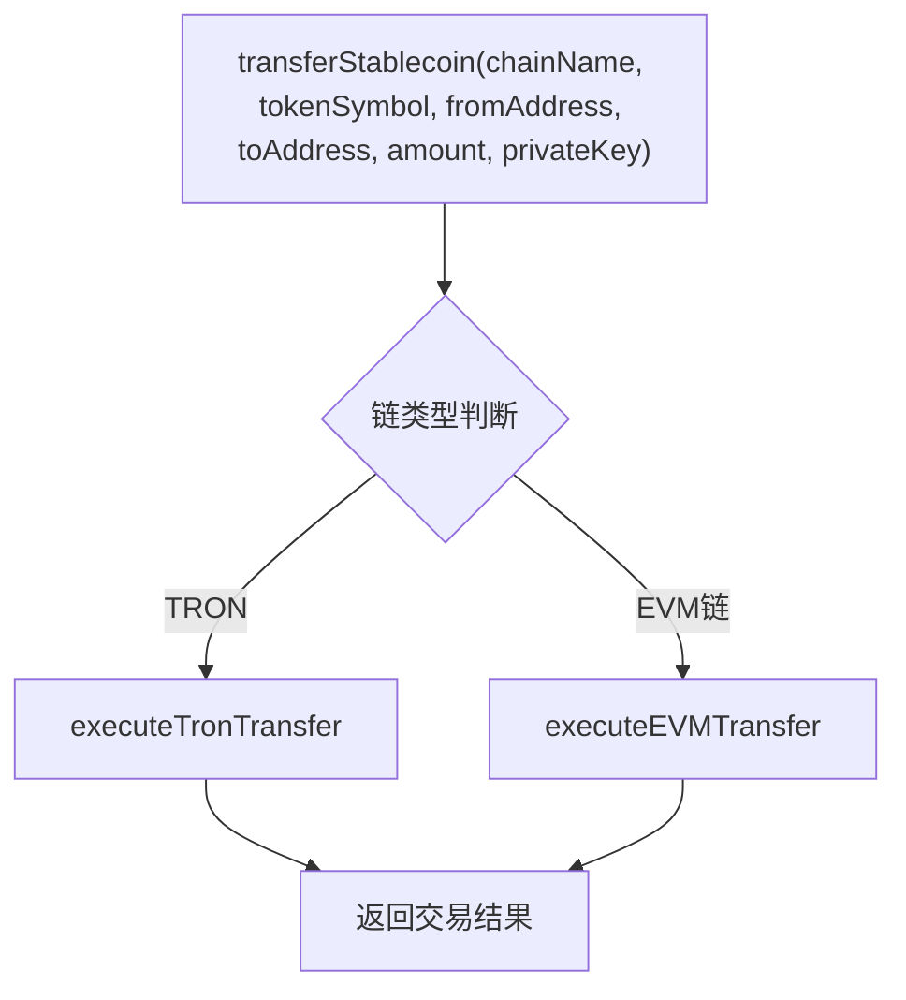
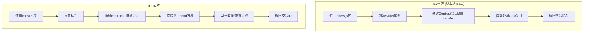
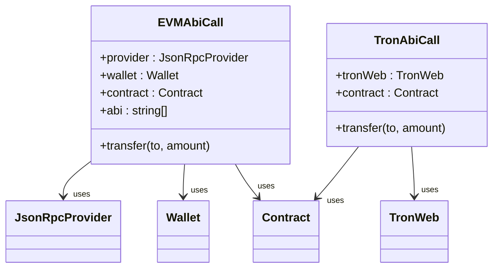
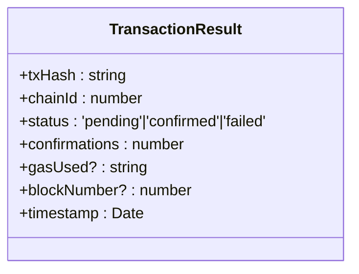
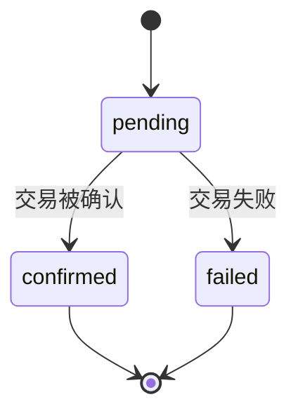
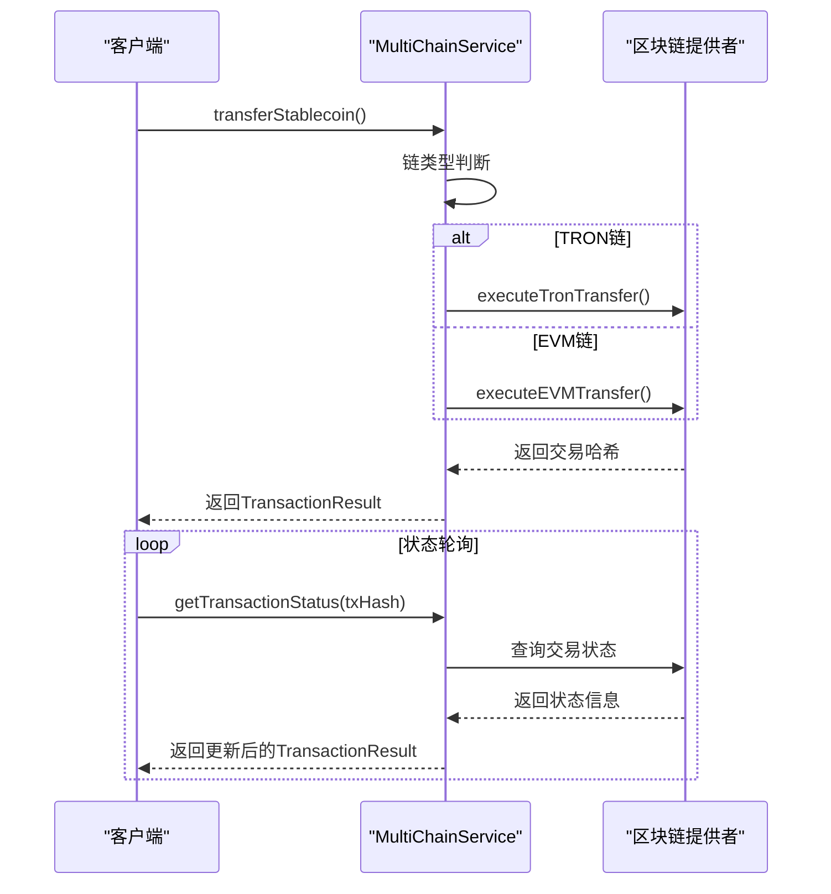
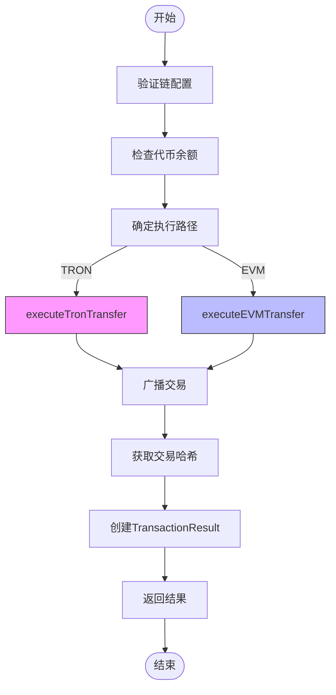

# 跨链交易路由

<cite>
**Referenced Files in This Document**   
- [multiChainService.ts](file://backend/src/services/multiChainService.ts)
- [blockchain.ts](file://backend/src/services/blockchain.ts)
- [transactionService.ts](file://src/services/transactionService.ts)
- [crossBorderPaymentService.ts](file://backend/src/services/crossBorderPaymentService.ts)
</cite>

## 目录
1. [引言](#引言)
2. [核心组件分析](#核心组件分析)
3. [路由逻辑架构](#路由逻辑架构)
4. [EVM与TRON链技术差异](#evm与tron链技术差异)
5. [交易结果对象设计](#交易结果对象设计)
6. [交易状态轮询机制](#交易状态轮询机制)
7. [完整调用流程示例](#完整调用流程示例)
8. [结论](#结论)

## 引言
跨链交易路由系统是连接不同区块链网络的关键基础设施，实现了在异构区块链环境下的资产转移。本技术文档深入分析了`transferStablecoin`方法的路由逻辑，详细阐述了系统如何根据链类型（TRON或EVM）选择不同的执行路径，并对比了EVM链和TRON链在交易构建、签名和广播过程中的技术差异。

## 核心组件分析

`MultiChainService`类是跨链交易的核心实现，负责处理不同区块链间的协议差异和代币标准转换。该服务支持以太坊、TRON和BSC网络，通过统一的接口抽象了底层区块链的复杂性。

**Section sources**
- [multiChainService.ts](file://backend/src/services/multiChainService.ts#L1-L50)

## 路由逻辑架构

`transferStablecoin`方法是跨链交易的核心实现，负责处理不同区块链间的协议差异和代币标准转换。该方法根据目标链的类型选择相应的执行逻辑：

**Diagram sources**
- [multiChainService.ts](file://backend/src/services/multiChainService.ts#L280-L350)

**Section sources**
- [multiChainService.ts](file://backend/src/services/multiChainService.ts#L280-L350)

当调用`transferStablecoin`方法时，系统首先验证链名和代币符号的有效性，然后根据链类型路由到相应的执行方法。对于TRON链，调用`executeTronTransfer`；对于EVM兼容链（如以太坊、BSC），调用`executeEVMTransfer`。

## EVM与TRON链技术差异

### 交易构建与签名

EVM链和TRON链在交易构建和签名机制上存在显著差异：

**Diagram sources**
- [multiChainService.ts](file://backend/src/services/multiChainService.ts#L350-L450)

**Section sources**
- [multiChainService.ts](file://backend/src/services/multiChainService.ts#L350-L450)

在EVM链上，交易通过`ethers.js`库处理，需要创建`Wallet`实例并与`Contract`交互，系统自动处理Gas费用计算和交易签名。而在TRON链上，使用`tronweb`库，通过`setPrivateKey`设置私钥后直接调用合约的`send`方法，费用基于能量和带宽消耗。

### ABI调用差异

EVM链和TRON链在ABI调用方式上也有所不同：

**Diagram sources**
- [multiChainService.ts](file://backend/src/services/multiChainService.ts#L350-L450)

EVM链需要明确指定ABI接口，通过`ethers.Contract`创建合约实例；而TRON链的`tronweb`库提供了更简洁的API，可以直接通过`contract().at()`获取合约并调用方法。

## 交易结果对象设计

交易结果对象`TransactionResult`的设计考虑了不同链的特性，提供了统一的数据结构：

**Diagram sources**
- [multiChainService.ts](file://backend/src/services/multiChainService.ts#L20-L40)

**Section sources**
- [multiChainService.ts](file://backend/src/services/multiChainService.ts#L20-L40)

该对象包含了交易哈希、链ID、状态、确认数等基本信息。对于EVM链，还包括`gasUsed`和`blockNumber`字段；对于TRON链，则通过`confirmations`字段表示确认状态。状态转换机制如下：

**Diagram sources**
- [multiChainService.ts](file://backend/src/services/multiChainService.ts#L371-L413)

## 交易状态轮询机制

系统实现了完善的交易状态轮询机制，确保能够及时获取交易的最新状态：

**Diagram sources**
- [multiChainService.ts](file://backend/src/services/multiChainService.ts#L371-L413)
- [blockchain.ts](file://backend/src/services/blockchain.ts#L230-L251)

**Section sources**
- [multiChainService.ts](file://backend/src/services/multiChainService.ts#L371-L413)
- [blockchain.ts](file://backend/src/services/blockchain.ts#L230-L251)

`BlockchainService`类中的`monitorTransaction`方法实现了交易监控功能，通过定期轮询获取交易的最新状态。同时，`crossBorderPaymentService`中的`startStatusPolling`机制每30秒检查一次支付状态，确保状态的实时性。

## 完整调用流程示例

以下是跨链交易的完整调用流程示例：

**Diagram sources**
- [multiChainService.ts](file://backend/src/services/multiChainService.ts#L280-L350)
- [transactionService.ts](file://src/services/transactionService.ts#L198-L235)

**Section sources**
- [multiChainService.ts](file://backend/src/services/multiChainService.ts#L280-L350)
- [transactionService.ts](file://src/services/transactionService.ts#L198-L235)

## 结论

跨链交易路由系统通过`MultiChainService`实现了对EVM链和TRON链的统一支持。系统根据链类型智能选择执行路径，处理了不同链在交易构建、签名和费用计算方面的差异。交易结果对象的设计提供了统一的状态表示，而状态轮询机制确保了交易状态的实时性。这种架构设计既保持了代码的简洁性，又提供了良好的扩展性，为支持更多区块链网络奠定了基础。