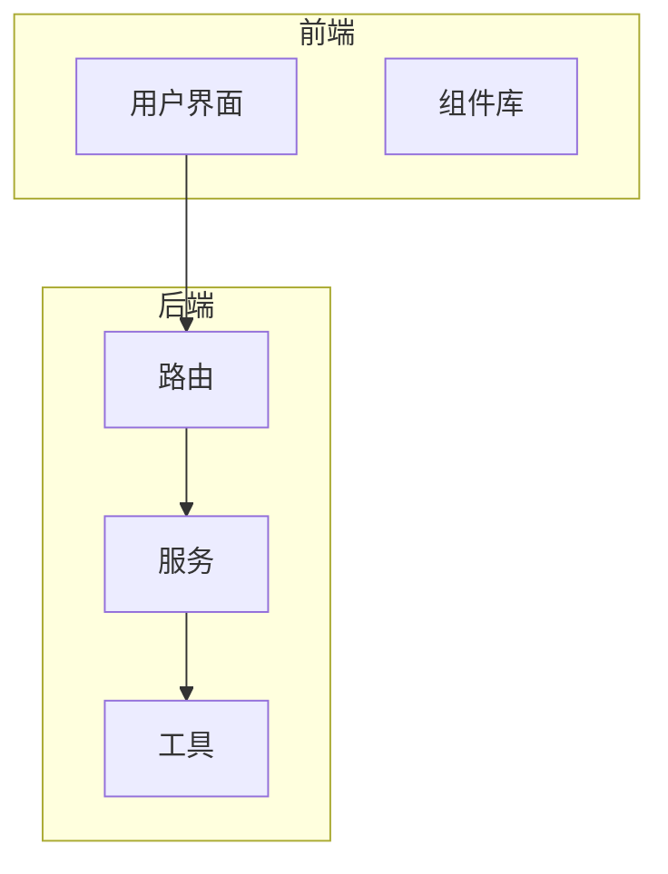
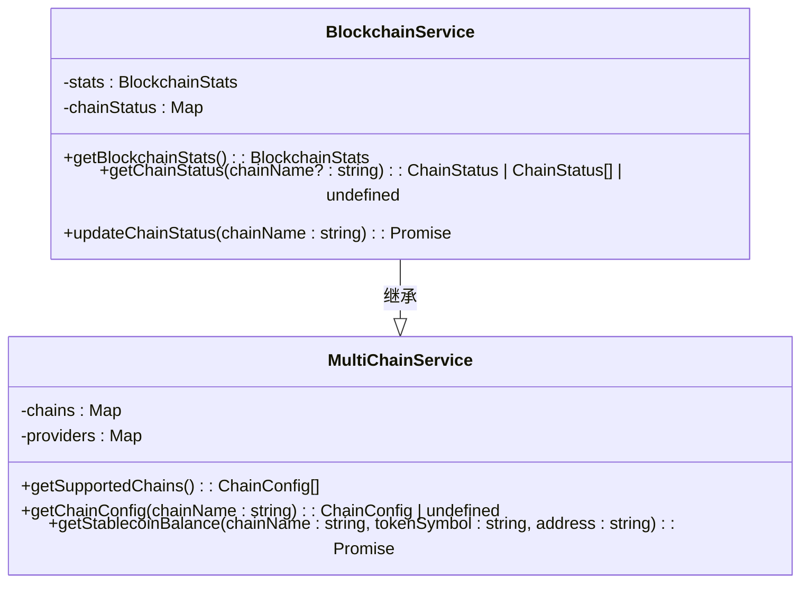
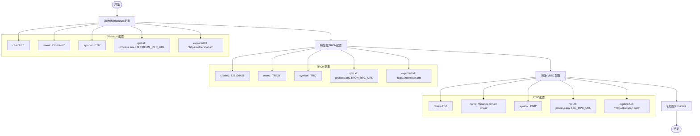
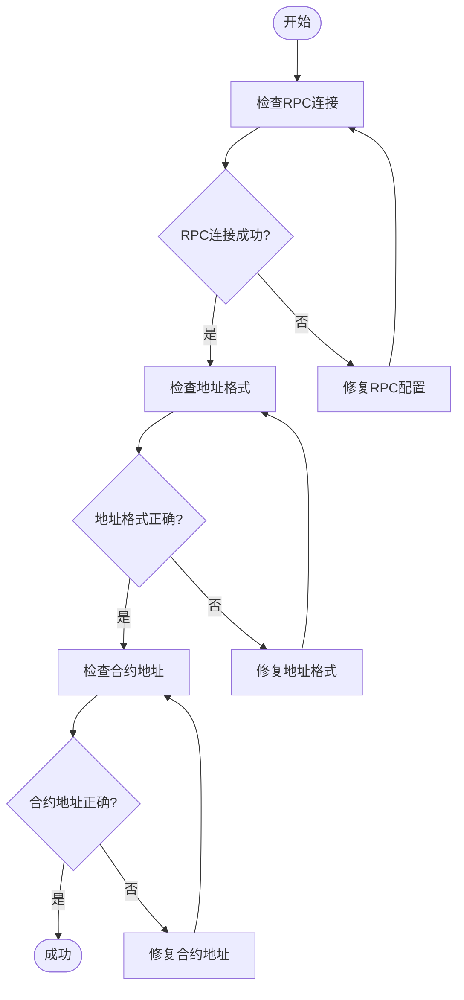
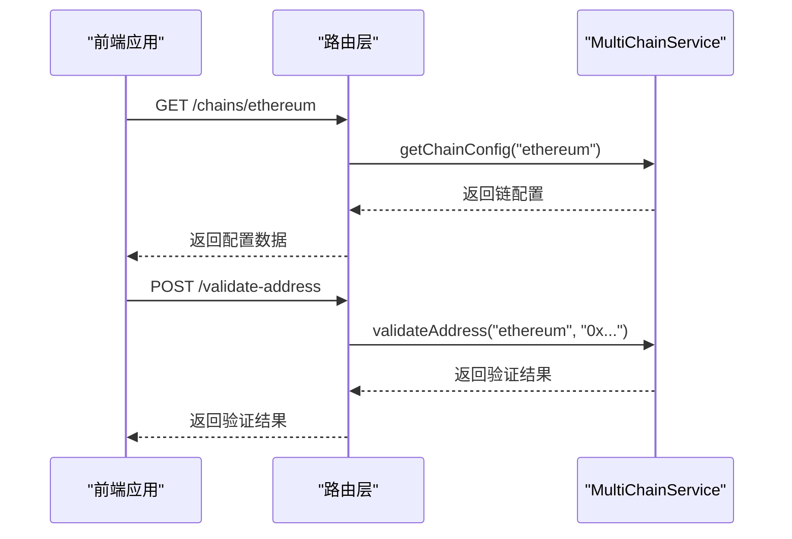
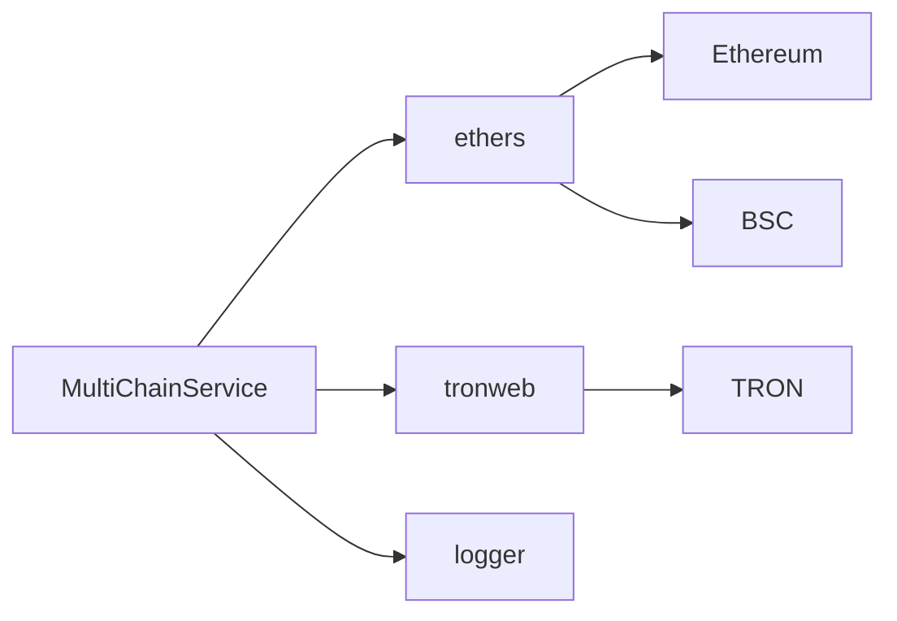

# 链配置管理

<cite>
**本文档引用的文件**  
- [multiChainService.ts](file://backend/src/services/multiChainService.ts)
- [blockchain.ts](file://backend/src/services/blockchain.ts)
- [blockchain.ts](file://backend/src/routes/blockchain.ts)
- [express.d.ts](file://backend/src/types/express.d.ts)
- [tronweb.d.ts](file://backend/src/types/tronweb.d.ts)
</cite>

## 目录
1. [简介](#简介)
2. [项目结构](#项目结构)
3. [核心组件](#核心组件)
4. [架构概述](#架构概述)
5. [详细组件分析](#详细组件分析)
6. [依赖分析](#依赖分析)
7. [性能考虑](#性能考虑)
8. [故障排除指南](#故障排除指南)
9. [结论](#结论)

## 简介
本项目实现了一个多链稳定币支持服务，支持以太坊、TRON和BSC网络。核心功能包括链配置管理、跨链交易、余额查询、地址验证等。系统通过`MultiChainService`类统一管理不同区块链的配置和交互，提供标准化的API接口供上层应用调用。

## 项目结构
项目采用分层架构设计，主要分为后端服务和前端界面两大部分。后端服务位于`backend/src`目录下，包含middleware、routes、services等核心模块；前端界面位于`src`目录下，采用React框架构建用户交互界面。服务层中的`multiChainService.ts`是本系统的核心组件，负责所有区块链相关的配置和操作。



**图示来源**  
- [multiChainService.ts](file://backend/src/services/multiChainService.ts#L6-L25)
- [blockchain.ts](file://backend/src/routes/blockchain.ts#L0-L48)

**本节来源**  
- [multiChainService.ts](file://backend/src/services/multiChainService.ts#L6-L25)
- [blockchain.ts](file://backend/src/routes/blockchain.ts#L0-L48)

## 核心组件
`ChainConfig`接口定义了区块链配置的基本结构，包括链ID、名称、符号、RPC URL、区块浏览器URL、原生货币信息以及稳定币合约地址和精度。`MultiChainService`类通过Map结构高效管理Ethereum、TRON和BSC三条链的配置，并提供统一的API接口进行链配置的获取和验证。

**本节来源**  
- [multiChainService.ts](file://backend/src/services/multiChainService.ts#L6-L25)
- [multiChainService.ts](file://backend/src/services/multiChainService.ts#L52-L118)

## 架构概述
系统采用面向对象的设计模式，`MultiChainService`作为基础服务类，被`BlockchainService`继承扩展。通过`chains`和`providers`两个Map结构分别存储链配置和网络提供者实例，实现了对多链的支持。路由层通过REST API暴露服务功能，控制器层调用服务方法处理业务逻辑。



**图示来源**  
- [multiChainService.ts](file://backend/src/services/multiChainService.ts#L6-L25)
- [blockchain.ts](file://backend/src/services/blockchain.ts#L0-L50)

## 详细组件分析

### ChainConfig接口设计
`ChainConfig`接口定义了区块链配置的元数据结构，包含链ID、名称、符号、RPC URL、区块浏览器URL、原生货币信息以及稳定币合约地址和精度。该接口通过TypeScript的接口特性确保类型安全，支持灵活的稳定币配置。

```mermaid
classDiagram
class ChainConfig {
+chainId : number
+name : string
+symbol : string
+rpcUrl : string
+explorerUrl : string
+nativeCurrency : NativeCurrency
+stablecoins : { [symbol : string] : Stablecoin }
}
class NativeCurrency {
+name : string
+symbol : string
+decimals : number
}
class Stablecoin {
+address : string
+decimals : number
+symbol : string
+name : string
}
ChainConfig --> NativeCurrency : 包含
ChainConfig --> Stablecoin : 包含
```

**图示来源**  
- [multiChainService.ts](file://backend/src/services/multiChainService.ts#L6-L25)

**本节来源**  
- [multiChainService.ts](file://backend/src/services/multiChainService.ts#L6-L25)

### multiChainService初始化流程
`initializeChains`方法通过Map结构初始化Ethereum、TRON和BSC三条链的配置。每条链的配置包含链ID、名称、符号、RPC URL、区块浏览器URL、原生货币信息以及稳定币合约地址和精度。环境变量用于配置RPC URL和API密钥，确保配置的灵活性和安全性。



**图示来源**  
- [multiChainService.ts](file://backend/src/services/multiChainService.ts#L52-L118)
- [multiChainService.ts](file://backend/src/services/multiChainService.ts#L120-L163)

**本节来源**  
- [multiChainService.ts](file://backend/src/services/multiChainService.ts#L52-L163)

### 添加新链的完整步骤
添加新链需要扩展`ChainConfig`类型定义，更新`initializeChains`方法中的配置，并在环境变量中添加相应的RPC URL和API密钥。同时需要实现对应链的Provider初始化逻辑，确保网络连接的正确性。

**本节来源**  
- [multiChainService.ts](file://backend/src/services/multiChainService.ts#L52-L163)
- [multiChainService.ts](file://backend/src/services/multiChainService.ts#L165-L210)

### 配置错误排查方法
常见配置错误包括RPC连接失败、合约地址错误等。系统通过`validateAddress`方法验证地址格式，使用环境变量管理敏感信息，通过日志记录详细的错误信息。对于RPC连接失败，应检查网络连接和API密钥的有效性；对于合约地址错误，应核对地址的正确性和网络匹配性。



**图示来源**  
- [multiChainService.ts](file://backend/src/services/multiChainService.ts#L479-L492)
- [blockchain.ts](file://backend/src/routes/blockchain.ts#L149-L207)

**本节来源**  
- [multiChainService.ts](file://backend/src/services/multiChainService.ts#L479-L492)
- [blockchain.ts](file://backend/src/routes/blockchain.ts#L149-L207)

### 动态获取和验证链配置
系统提供`getChainConfig`和`getSupportedChains`方法动态获取链配置，通过`validateAddress`方法验证地址格式。这些方法被路由层调用，通过REST API暴露给前端应用，实现链配置的动态获取和验证。



**图示来源**  
- [multiChainService.ts](file://backend/src/services/multiChainService.ts#L190-L197)
- [blockchain.ts](file://backend/src/routes/blockchain.ts#L0-L48)

**本节来源**  
- [multiChainService.ts](file://backend/src/services/multiChainService.ts#L190-L197)
- [blockchain.ts](file://backend/src/routes/blockchain.ts#L0-L48)

## 依赖分析
系统依赖`ethers`库处理EVM兼容链的交互，`tronweb`库处理TRON链的交互。通过动态导入方式加载这些库，减少启动时的资源消耗。服务层依赖utils模块中的logger进行日志记录，确保系统的可维护性。



**图示来源**  
- [multiChainService.ts](file://backend/src/services/multiChainService.ts#L165-L210)
- [blockchain.ts](file://backend/src/services/blockchain.ts#L0-L50)

**本节来源**  
- [multiChainService.ts](file://backend/src/services/multiChainService.ts#L165-L210)
- [blockchain.ts](file://backend/src/services/blockchain.ts#L0-L50)

## 性能考虑
系统通过Map结构存储链配置和Provider实例，确保O(1)时间复杂度的查找性能。异步初始化Provider，避免阻塞主线程。使用连接池和缓存机制优化网络请求，提高系统的响应速度和吞吐量。

## 故障排除指南
当遇到RPC连接失败时，应检查环境变量中的RPC URL配置是否正确，网络连接是否正常，API密钥是否有效。对于合约地址错误，应核对地址的正确性和网络匹配性，确保在正确的网络上使用正确的合约地址。日志记录详细的错误信息，帮助快速定位和解决问题。

**本节来源**  
- [multiChainService.ts](file://backend/src/services/multiChainService.ts#L479-L492)
- [blockchain.ts](file://backend/src/routes/blockchain.ts#L149-L207)

## 结论
本系统通过`ChainConfig`接口和`MultiChainService`类实现了对多链配置的统一管理，支持Ethereum、TRON和BSC网络的稳定币操作。系统设计合理，代码结构清晰，具备良好的扩展性和可维护性。通过环境变量管理敏感信息，确保系统的安全性。提供丰富的API接口，方便上层应用集成和使用。