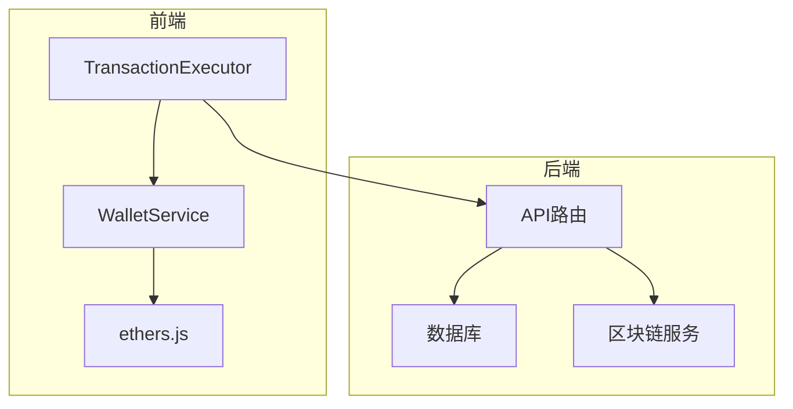
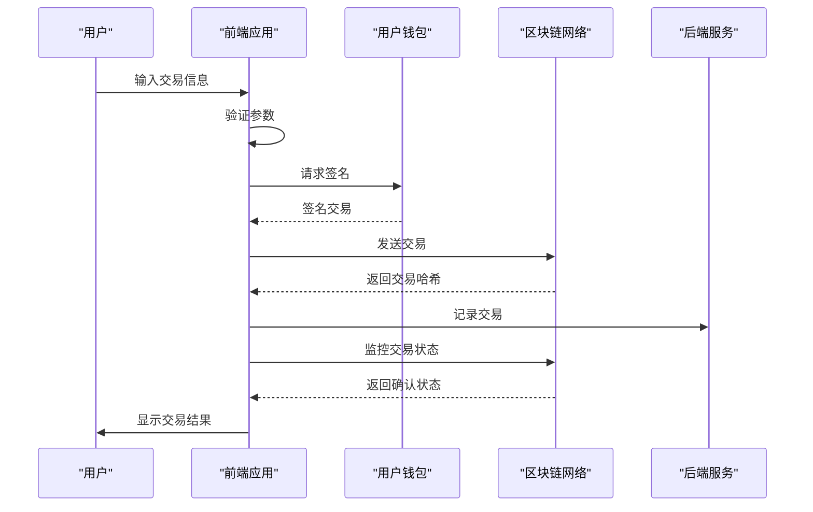
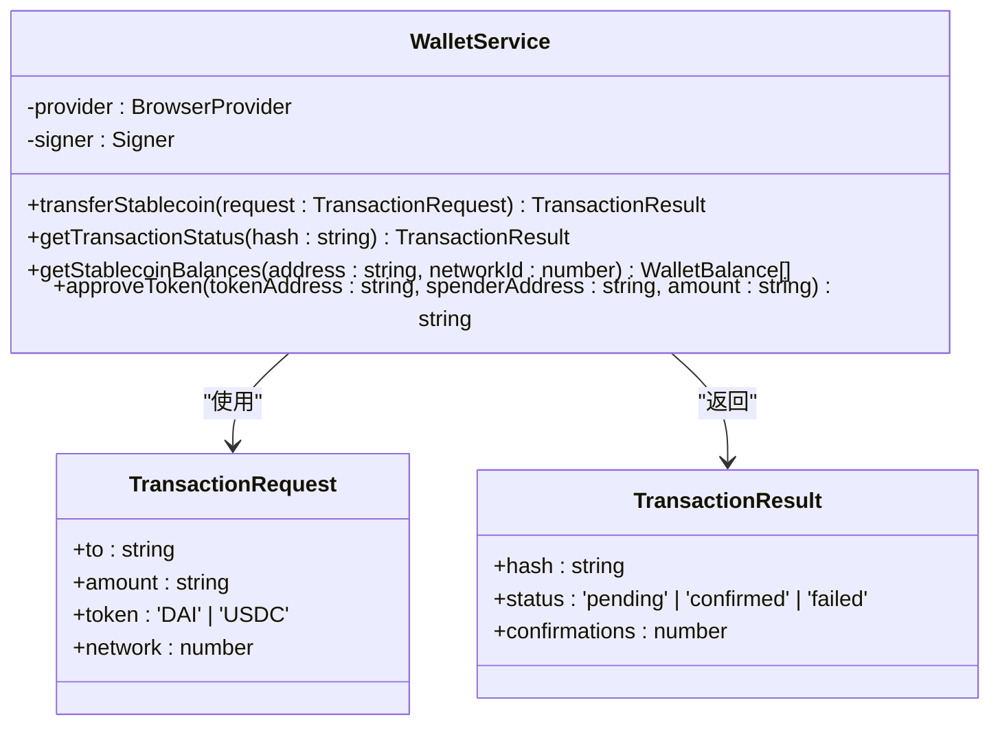
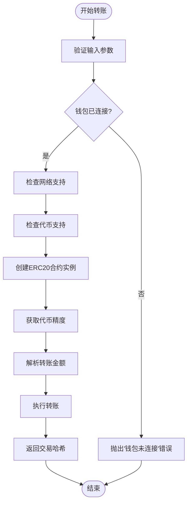
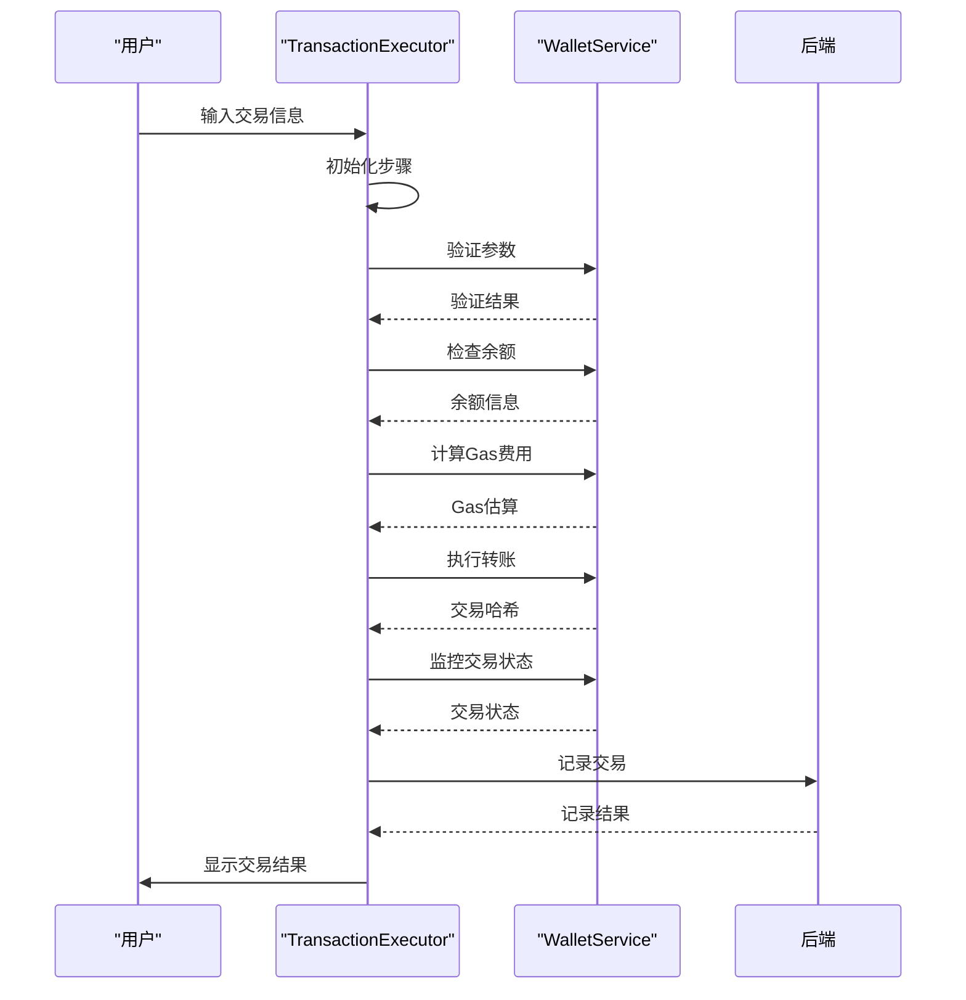
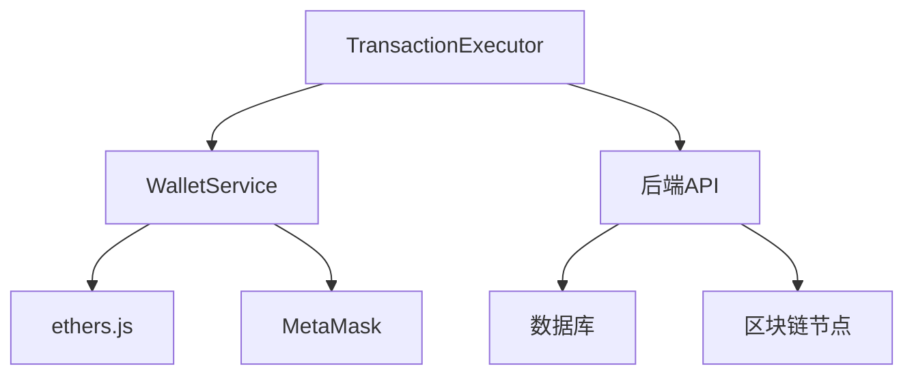

# 交易执行

<cite>
**本文档引用的文件**
- [walletService.ts](file://src/services/walletService.ts)
- [TransactionExecutor.tsx](file://src/components/Blockchain/TransactionExecutor.tsx)
- [route.ts](file://src/app/api/wallet/transaction/route.ts)
</cite>

## 目录
1. [简介](#简介)
2. [项目结构](#项目结构)
3. [核心组件](#核心组件)
4. [架构概述](#架构概述)
5. [详细组件分析](#详细组件分析)
6. [依赖分析](#依赖分析)
7. [性能考虑](#性能考虑)
8. [故障排除指南](#故障排除指南)
9. [结论](#结论)
10. [附录](#附录)（如有必要）

## 简介
本文档深入分析了稳定币转账交易的执行流程，重点研究了`WalletService`类中`transferStablecoin`方法的实现。文档详细说明了交易请求的参数验证、ERC20合约调用、交易构建和签名过程，以及交易哈希返回和状态监控的处理机制。结合前端使用场景，展示了如何通过`WalletService`执行DAI转账操作，包括错误处理、用户提示和交易状态更新。提供了完整的代码示例和安全最佳实践。

## 项目结构
项目采用分层架构，前端和后端分离。前端位于`src`目录，包含组件、服务和API路由。后端位于`backend`目录，提供REST API和区块链服务。钱包服务相关的核心逻辑位于`src/services/walletService.ts`，前端交易执行组件位于`src/components/Blockchain/TransactionExecutor.tsx`。

**图表来源**
- [walletService.ts](file://src/services/walletService.ts#L62-L264)
- [TransactionExecutor.tsx](file://src/components/Blockchain/TransactionExecutor.tsx#L1-L388)

**章节来源**
- [walletService.ts](file://src/services/walletService.ts#L1-L270)
- [project_structure](file://#L1-L200)

## 核心组件
核心组件包括`WalletService`类，负责与区块链交互，执行稳定币转账、查询余额和监控交易状态。`TransactionExecutor`组件提供用户界面，引导用户完成交易流程。后端API处理交易记录和状态查询。

**章节来源**
- [walletService.ts](file://src/services/walletService.ts#L62-L264)
- [TransactionExecutor.tsx](file://src/components/Blockchain/TransactionExecutor.tsx#L1-L388)

## 架构概述
系统采用客户端-服务器架构。前端通过`WalletService`与用户钱包（如MetaMask）交互，执行区块链交易。交易成功后，前端调用后端API记录交易详情。后端提供REST API用于交易状态查询和历史记录获取。

**图表来源**
- [walletService.ts](file://src/services/walletService.ts#L116-L148)
- [TransactionExecutor.tsx](file://src/components/Blockchain/TransactionExecutor.tsx#L138-L138)

## 详细组件分析
### WalletService分析
`WalletService`类是稳定币转账的核心，封装了与区块链交互的所有逻辑。

#### 类图

**图表来源**
- [walletService.ts](file://src/services/walletService.ts#L47-L60)
- [walletService.ts](file://src/services/walletService.ts#L62-L264)

#### 转账流程

**图表来源**
- [walletService.ts](file://src/services/walletService.ts#L116-L148)

**章节来源**
- [walletService.ts](file://src/services/walletService.ts#L116-L148)

### TransactionExecutor分析
`TransactionExecutor`组件提供用户友好的界面，引导用户完成交易。

#### 交易执行流程

**图表来源**
- [TransactionExecutor.tsx](file://src/components/Blockchain/TransactionExecutor.tsx#L138-L138)
- [walletService.ts](file://src/services/walletService.ts#L116-L148)

**章节来源**
- [TransactionExecutor.tsx](file://src/components/Blockchain/TransactionExecutor.tsx#L1-L388)

## 依赖分析
系统依赖于多个外部库和服务。前端依赖`ethers.js`进行区块链交互，`wagmi`用于钱包连接。后端依赖数据库存储交易记录，依赖区块链节点进行数据查询。

**图表来源**
- [package.json](file://package.json#L1-L50)
- [walletService.ts](file://src/services/walletService.ts#L1-L10)

**章节来源**
- [package.json](file://package.json#L1-L100)
- [walletService.ts](file://src/services/walletService.ts#L1-L270)

## 性能考虑
交易执行的性能主要受区块链网络确认时间影响。系统通过异步操作和进度提示优化用户体验。建议在低网络拥堵时段执行交易以获得更快的确认速度。

## 故障排除指南
常见问题包括钱包未连接、余额不足、网络不支持等。系统通过详细的错误消息帮助用户诊断问题。建议检查钱包连接状态、代币余额和网络设置。

**章节来源**
- [walletService.ts](file://src/services/walletService.ts#L116-L148)
- [TransactionExecutor.tsx](file://src/components/Blockchain/TransactionExecutor.tsx#L1-L388)

## 结论
`WalletService`的`transferStablecoin`方法提供了稳定可靠的稳定币转账功能。通过清晰的错误处理和用户反馈机制，确保了良好的用户体验。系统架构合理，前后端职责分明，便于维护和扩展。

## 附录
### 环境变量
- `NEXT_PUBLIC_INFURA_ID`: Infura项目ID
- `DATABASE_URL`: 数据库连接字符串

### 部署指南
参见`DEPLOYMENT_GUIDE.md`文件获取详细部署说明。