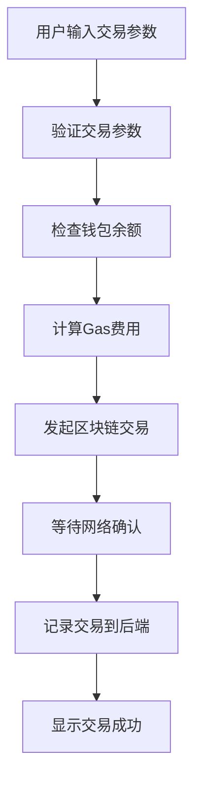
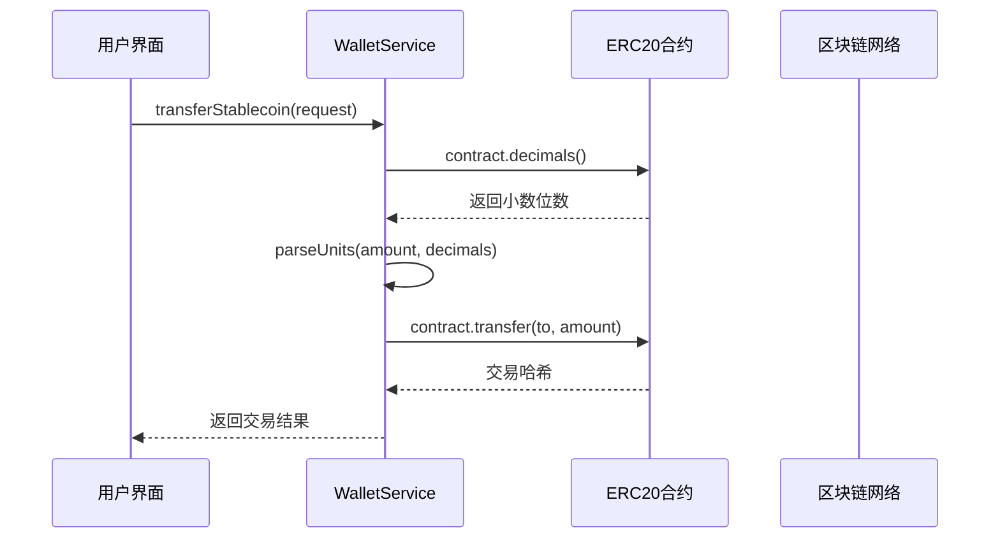
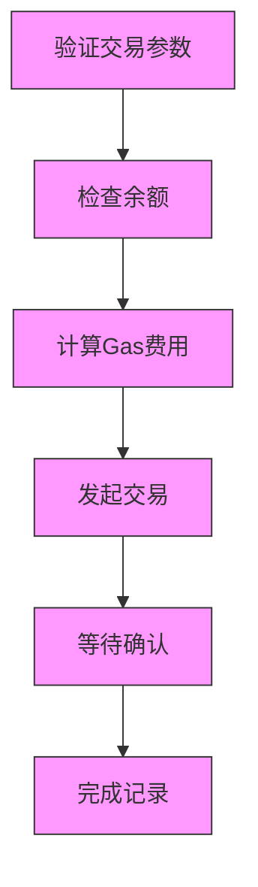
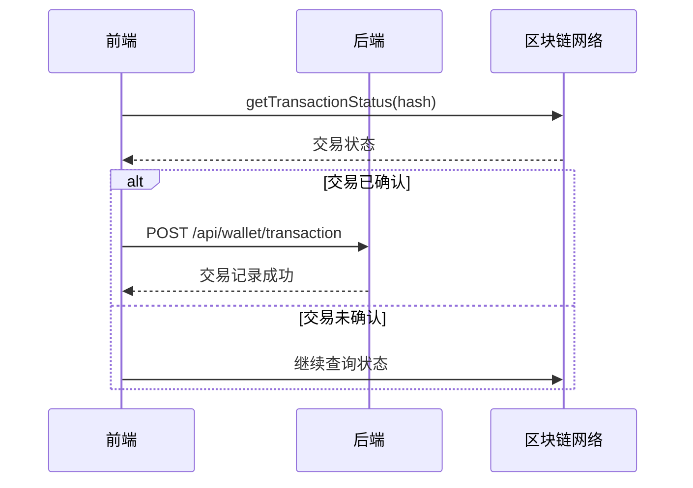

# 交易执行流程

<cite>
**Referenced Files in This Document**   
- [TransactionExecutor.tsx](file://src/components/Blockchain/TransactionExecutor.tsx)
- [walletService.ts](file://src/services/walletService.ts)
- [route.ts](file://src/app/api/wallet/transaction/route.ts)
- [transaction.ts](file://backend/src/routes/transaction.ts)
</cite>

## 目录
1. [简介](#简介)
2. [核心交易流程](#核心交易流程)
3. [transferStablecoin方法详解](#transferstablecoin方法详解)
4. [六步交易流程分析](#六步交易流程分析)
5. [状态管理与用户界面反馈](#状态管理与用户界面反馈)
6. [交易监控与后端集成](#交易监控与后端集成)
7. [结论](#结论)

## 简介

本文档详细阐述了交易执行流程，重点分析了`transferStablecoin`方法如何构建和发送ERC20代币转账交易。文档涵盖了从用户界面交互到后端API调用的完整交易生命周期，包括金额精度转换、交易发起、状态管理和用户反馈等关键环节。通过分析`TransactionExecutor`组件的六步交易流程，展示了从参数验证到交易完成的完整过程，以及如何通过`getTransactionStatus`方法实现交易监控和后端API集成。

**Section sources**
- [TransactionExecutor.tsx](file://src/components/Blockchain/TransactionExecutor.tsx#L1-L388)

## 核心交易流程

交易执行流程始于用户在前端界面输入交易参数，包括接收地址、转账金额和选择代币类型。`TransactionExecutor`组件通过`WalletService`与区块链网络交互，执行完整的交易流程。该流程包括六个关键步骤：参数验证、余额检查、Gas费用计算、交易发起、等待确认和完成记录。每个步骤都有明确的状态管理和用户界面反馈，确保用户能够清晰了解交易进度。



**Diagram sources**
- [TransactionExecutor.tsx](file://src/components/Blockchain/TransactionExecutor.tsx#L22-L388)

**Section sources**
- [TransactionExecutor.tsx](file://src/components/Blockchain/TransactionExecutor.tsx#L22-L388)

## transferStablecoin方法详解

`transferStablecoin`方法是交易执行的核心，负责构建和发送ERC20代币转账交易。该方法首先验证钱包连接状态和网络支持情况，然后获取目标代币的合约地址。关键的`parseUnits`工具用于将用户输入的金额转换为区块链可识别的精度单位，通过查询代币合约的`decimals`方法获取小数位数，确保金额转换的准确性。



**Diagram sources**
- [walletService.ts](file://src/services/walletService.ts#L117-L149)

**Section sources**
- [walletService.ts](file://src/services/walletService.ts#L117-L149)

## 六步交易流程分析

`TransactionExecutor`组件实现了六步交易流程，确保交易的安全性和可靠性。该流程从参数验证开始，逐步进行余额检查、Gas费用计算、交易发起、等待确认，最终完成交易记录。每个步骤都有明确的状态转换和错误处理机制，确保交易过程的透明性和可追溯性。

### 参数验证
交易流程的第一步是验证用户输入的交易参数，包括接收地址和转账金额是否有效。系统检查地址格式和金额是否为正数，确保交易的基本条件满足。

### 余额检查
在参数验证通过后，系统调用`getStablecoinBalances`方法查询用户钱包的代币余额，确保有足够的资金完成交易。该方法通过`ethers.Contract`与代币合约交互，获取精确的余额信息。

### Gas费用计算
虽然当前实现中Gas费用计算为模拟过程，但在实际应用中，这一步会估算交易所需的网络费用。系统会根据网络拥堵情况和交易复杂度计算合理的Gas价格。

### 交易发起
在完成前三步验证后，系统调用`transferStablecoin`方法发起交易。该方法构建交易请求，使用`parseUnits`转换金额精度，并通过`contract.transfer`方法向区块链网络提交交易。

### 等待确认
交易发起后，系统进入等待确认阶段。通过`getTransactionStatus`方法定期查询交易状态，直到交易被区块链网络确认或失败。

### 完成记录
当交易确认成功后，系统调用后端API记录交易详情，包括交易哈希、时间戳和相关元数据，完成整个交易流程。



**Diagram sources**
- [TransactionExecutor.tsx](file://src/components/Blockchain/TransactionExecutor.tsx#L22-L388)

**Section sources**
- [TransactionExecutor.tsx](file://src/components/Blockchain/TransactionExecutor.tsx#L22-L388)

## 状态管理与用户界面反馈

`TransactionExecutor`组件通过React状态管理机制实现交易流程的状态跟踪和用户界面反馈。组件维护`steps`数组来记录每个步骤的状态，包括"pending"（待处理）、"processing"（处理中）、"completed"（已完成）和"failed"（失败）。用户界面根据当前状态显示相应的进度条、图标和消息，提供直观的交易进度可视化。

```mermaid
classDiagram
class TransactionStep {
+id : number
+title : string
+status : 'pending' | 'processing' | 'completed' | 'failed'
+description : string
+txHash? : string
}
class TransactionExecutor {
-isExecuting : boolean
-transaction : TransactionResult | null
-steps : TransactionStep[]
-currentStep : number
-formData : {to : string, amount : string, token : 'DAI' | 'USDC'}
+initializeSteps() : void
+updateStep(stepId : number, status : string, txHash? : string) : void
+executeTransaction() : Promise~void~
+resetTransaction() : void
}
TransactionExecutor --> TransactionStep : "包含"
```

**Diagram sources**
- [TransactionExecutor.tsx](file://src/components/Blockchain/TransactionExecutor.tsx#L22-L388)

**Section sources**
- [TransactionExecutor.tsx](file://src/components/Blockchain/TransactionExecutor.tsx#L22-L388)

## 交易监控与后端集成

交易监控通过`getTransactionStatus`方法实现，该方法定期查询区块链网络获取交易的最新状态。系统通过`provider.getTransaction`和`provider.getTransactionReceipt`方法获取交易详情和收据，计算确认数并更新交易状态。当交易确认成功后，系统通过`fetch`调用后端API `/api/wallet/transaction` 记录交易，实现前端与后端的数据同步。



**Diagram sources**
- [TransactionExecutor.tsx](file://src/components/Blockchain/TransactionExecutor.tsx#L22-L388)
- [route.ts](file://src/app/api/wallet/transaction/route.ts#L1-L143)

**Section sources**
- [TransactionExecutor.tsx](file://src/components/Blockchain/TransactionExecutor.tsx#L22-L388)
- [route.ts](file://src/app/api/wallet/transaction/route.ts#L1-L143)

## 结论

本文档全面分析了交易执行流程，重点阐述了`transferStablecoin`方法如何构建和发送ERC20代币转账交易。通过`parseUnits`工具的应用，确保了金额精度转换的准确性；通过六步交易流程的设计，保证了交易的安全性和可靠性；通过状态管理和用户界面反馈，提供了良好的用户体验；通过交易监控和后端API集成，实现了交易数据的完整记录和追踪。整个流程展示了从用户界面到区块链网络再到后端系统的完整交易生命周期，为类似应用的开发提供了有价值的参考。