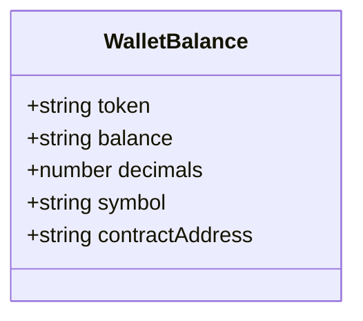
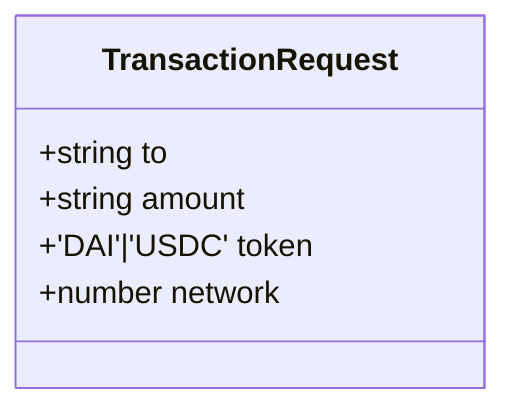
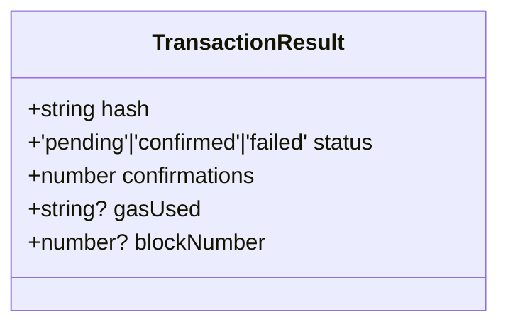
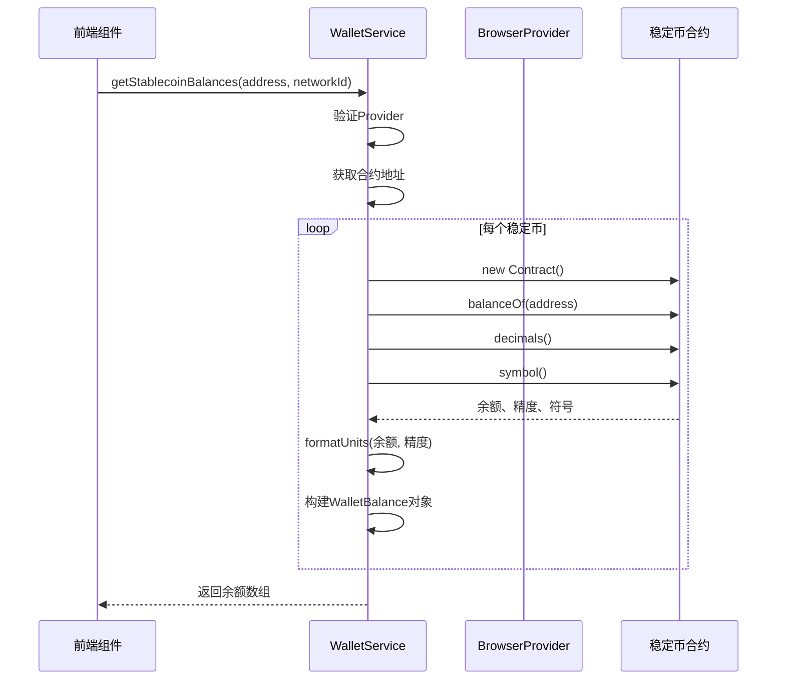
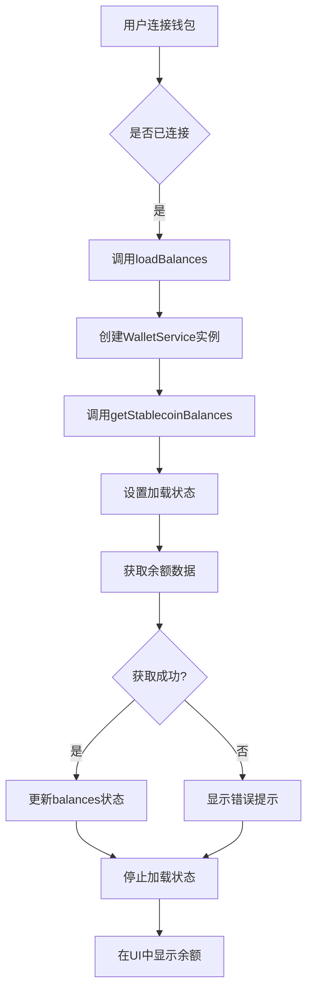
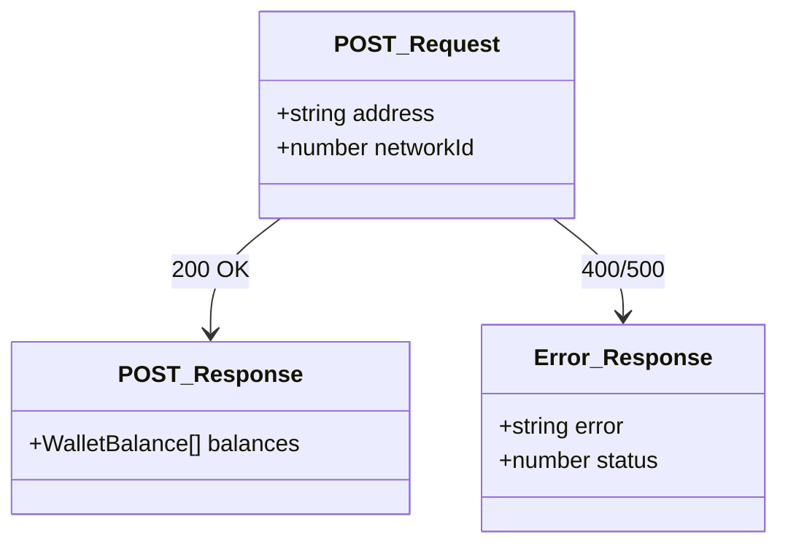
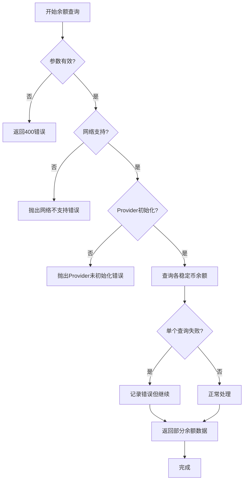

<cite>
**Referenced Files in This Document**   
- [walletService.ts](file://src/services/walletService.ts)
- [WalletConnect.tsx](file://src/components/Wallet/WalletConnect.tsx)
- [route.ts](file://src/app/api/wallet/balances/route.ts)
</cite>

# 余额查询

## Table of Contents
1. [简介](#简介)
2. [核心数据结构](#核心数据结构)
3. [余额查询实现](#余额查询实现)
4. [前端集成](#前端集成)
5. [API接口](#api接口)
6. [错误处理](#错误处理)
7. [使用示例](#使用示例)

## 简介

本文档系统化地文档化了稳定币余额查询功能的实现细节。该功能允许用户查询其钱包地址在不同区块链网络上的DAI和USDC稳定币余额。系统通过`WalletService`类与区块链进行交互，利用`ethers`库执行智能合约调用，并通过`WalletConnect`组件在前端展示余额信息。

整个流程从用户连接钱包开始，前端组件调用服务层方法，服务层通过以太坊提供者（Provider）与指定网络上的稳定币合约进行通信，获取余额数据后返回给前端进行展示。该实现支持多网络（如以太坊主网和Sepolia测试网），并提供了完整的错误处理机制。

**Section sources**
- [walletService.ts](file://src/services/walletService.ts#L1-L50)
- [WalletConnect.tsx](file://src/components/Wallet/WalletConnect.tsx#L1-L50)

## 核心数据结构

### 钱包余额接口
定义了稳定币余额的数据结构，包含代币信息、余额数值和合约地址。



**Diagram sources**
- [walletService.ts](file://src/services/walletService.ts#L39-L45)

### 交易请求接口
定义了执行稳定币转账所需的数据结构。



**Diagram sources**
- [walletService.ts](file://src/services/walletService.ts#L47-L52)

### 交易结果接口
定义了交易状态查询返回的数据结构。



**Diagram sources**
- [walletService.ts](file://src/services/walletService.ts#L54-L60)

## 余额查询实现

`WalletService`类的`getStablecoinBalances`方法是余额查询功能的核心实现。该方法通过以下步骤与区块链交互：

1. 验证提供者（Provider）是否已初始化
2. 根据网络ID获取对应的稳定币合约地址
3. 遍历所有支持的稳定币，创建合约实例
4. 并行调用`balanceOf`、`decimals`和`symbol`方法获取余额信息
5. 使用`formatUnits`将大数格式化为可读的字符串
6. 返回格式化的余额数组



**Diagram sources**
- [walletService.ts](file://src/services/walletService.ts#L78-L113)

**Section sources**
- [walletService.ts](file://src/services/walletService.ts#L62-L264)

## 前端集成

`WalletConnect`组件负责前端的余额查询功能集成。当用户连接钱包后，组件会自动调用`loadBalances`函数获取并显示余额。



**Diagram sources**
- [WalletConnect.tsx](file://src/components/Wallet/WalletConnect.tsx#L38-L38)

**Section sources**
- [WalletConnect.tsx](file://src/components/Wallet/WalletConnect.tsx#L16-L241)

## API接口

系统提供了REST API接口用于余额查询，位于`src/app/api/wallet/balances/route.ts`。该接口接收钱包地址和网络ID作为参数，返回相应的稳定币余额。



**Diagram sources**
- [route.ts](file://src/app/api/wallet/balances/route.ts#L1-L50)

## 错误处理

系统实现了多层次的错误处理机制：

1. **参数验证**：检查地址格式和必要参数
2. **网络支持**：验证网络ID是否被支持
3. **提供者检查**：确保Provider已正确初始化
4. **合约调用**：捕获单个稳定币余额查询的错误，不影响其他代币
5. **前端处理**：捕获异步操作错误并显示用户友好的提示



**Section sources**
- [walletService.ts](file://src/services/walletService.ts#L78-L113)
- [route.ts](file://src/app/api/wallet/balances/route.ts#L1-L50)

## 使用示例

### 基本用法
```typescript
const walletService = new WalletService();
const balances = await walletService.getStablecoinBalances(
  '0x123...abc',
  11155111 // Sepolia测试网
);
```

### 前端集成
```typescript
// 在WalletConnect组件中
useEffect(() => {
  if (isConnected && address && chain) {
    loadBalances();
  }
}, [isConnected, address, chain]);

const loadBalances = async () => {
  if (!address || !chain) return;
  
  setIsLoadingBalances(true);
  try {
    const balances = await walletService.getStablecoinBalances(address, chain.id);
    setBalances(balances);
  } catch (error) {
    console.error('Failed to load balances:', error);
    toast.error('Failed to load wallet balances');
  } finally {
    setIsLoadingBalances(false);
  }
};
```

### API调用
```bash
curl -X POST http://localhost:3000/api/wallet/balances \
  -H "Content-Type: application/json" \
  -d '{
    "address": "0x123...abc",
    "networkId": 11155111
  }'
```

**Section sources**
- [walletService.ts](file://src/services/walletService.ts#L78-L113)
- [WalletConnect.tsx](file://src/components/Wallet/WalletConnect.tsx#L38-L38)
- [route.ts](file://src/app/api/wallet/balances/route.ts#L1-L50)