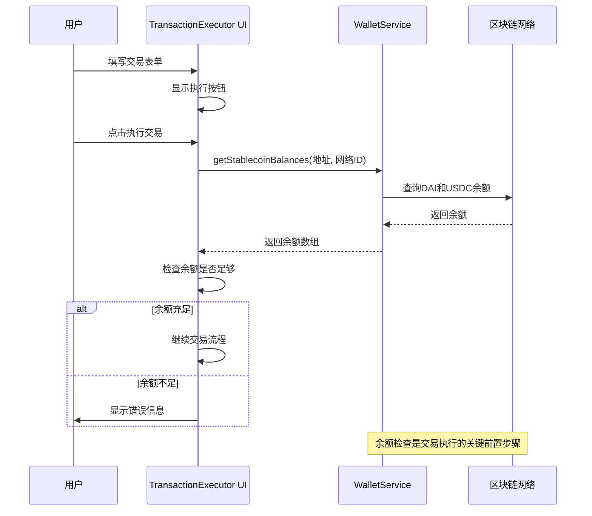

<cite>
**Referenced Files in This Document**   
- [walletService.ts](file://src/services/walletService.ts)
- [TransactionExecutor.tsx](file://src/components/Blockchain/TransactionExecutor.tsx)
- [wagmi.tsx](file://src/config/wagmi.tsx)
</cite>

## 目录
1. [余额查询实现](#余额查询实现)
2. [核心组件分析](#核心组件分析)
3. [余额查询架构](#余额查询架构)
4. [详细组件分析](#详细组件分析)
5. [依赖关系分析](#依赖关系分析)
6. [错误处理机制](#错误处理机制)
7. [前端集成实现](#前端集成实现)

## 余额查询实现

本文档详细分析了TriBridge跨链支付平台中余额查询功能的实现。重点解析了`getStablecoinBalances`方法的技术细节，该方法通过`STABLECOIN_CONTRACTS`配置对象管理不同网络上的稳定币合约地址，并使用ethers.js库批量查询DAI和USDC等ERC20代币的余额。文档还涵盖了错误处理机制以及在前端组件`TransactionExecutor`中的集成实现。

## 核心组件分析

余额查询功能的核心实现位于`WalletService`类中，该类提供了与区块链交互的主要接口。`getStablecoinBalances`方法是余额查询的核心，它接收用户钱包地址和网络ID作为参数，返回指定网络上所有支持的稳定币余额。

**Section sources**
- [walletService.ts](file://src/services/walletService.ts#L79-L114)

## 余额查询架构


**Diagram sources**
- [walletService.ts](file://src/services/walletService.ts#L12-L23)
- [walletService.ts](file://src/services/walletService.ts#L26-L38)

## 详细组件分析

### getStablecoinBalances方法分析

`getStablecoinBalances`方法实现了跨网络稳定币余额查询的核心逻辑。该方法首先验证提供者（provider）是否已初始化，然后根据传入的网络ID从`STABLECOIN_CONTRACTS`配置中获取相应的合约地址集合。


**Diagram sources**
- [walletService.ts](file://src/services/walletService.ts#L79-L114)

### STABLECOIN_CONTRACTS配置对象

`STABLECOIN_CONTRACTS`是一个静态配置对象，用于存储不同网络上DAI和USDC稳定币的合约地址。该配置支持Ethereum Sepolia测试网（网络ID 11155111）和Ethereum主网（网络ID 1）。

```mermaid
erDiagram
STABLECOIN_CONTRACTS {
int networkId PK
string DAI
string USDC
}
STABLECOIN_CONTRACTS ||--o{ Sepolia : "11155111"
STABLECOIN_CONTRACTS ||--o{ EthereumMainnet : "1"
class Sepolia {
DAI: 0x6819...D574
USDC: 0xda9d...f53f
}
class EthereumMainnet {
DAI: 0x6B17...1d0F
USDC: 0xA0b8...5C7D
}
```

**Diagram sources**
- [walletService.ts](file://src/services/walletService.ts#L12-L23)

### ERC20标准方法调用

余额查询功能依赖于ERC20标准的三个核心方法：`balanceOf`、`decimals`和`symbol`。这些方法通过ethers.js库的`Contract`类进行调用，并使用`Promise.all`进行批量执行以提高效率。


**Diagram sources**
- [walletService.ts](file://src/services/walletService.ts#L26-L38)

**Section sources**
- [walletService.ts](file://src/services/walletService.ts#L79-L114)

## 依赖关系分析


**Diagram sources**
- [walletService.ts](file://src/services/walletService.ts)
- [TransactionExecutor.tsx](file://src/components/Blockchain/TransactionExecutor.tsx)
- [wagmi.tsx](file://src/config/wagmi.tsx)

## 错误处理机制

余额查询功能实现了多层次的错误处理机制。在`getStablecoinBalances`方法中，首先检查Provider是否已初始化，然后验证网络是否受支持。在查询每个代币余额时，使用try-catch块捕获可能的异常，并在控制台记录错误信息，但不会中断其他代币的查询。


**Diagram sources**
- [walletService.ts](file://src/services/walletService.ts#L79-L114)

## 前端集成实现

余额查询功能在`TransactionExecutor`前端组件中得到集成应用。该组件在执行交易前调用`getStablecoinBalances`方法检查用户余额，确保有足够的资金完成交易。



**Diagram sources**
- [TransactionExecutor.tsx](file://src/components/Blockchain/TransactionExecutor.tsx#L150-L170)

**Section sources**
- [TransactionExecutor.tsx](file://src/components/Blockchain/TransactionExecutor.tsx)