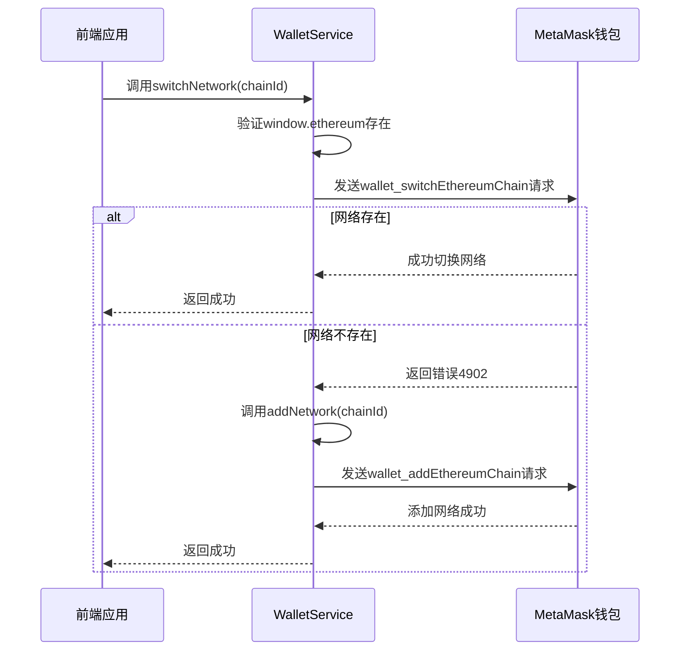
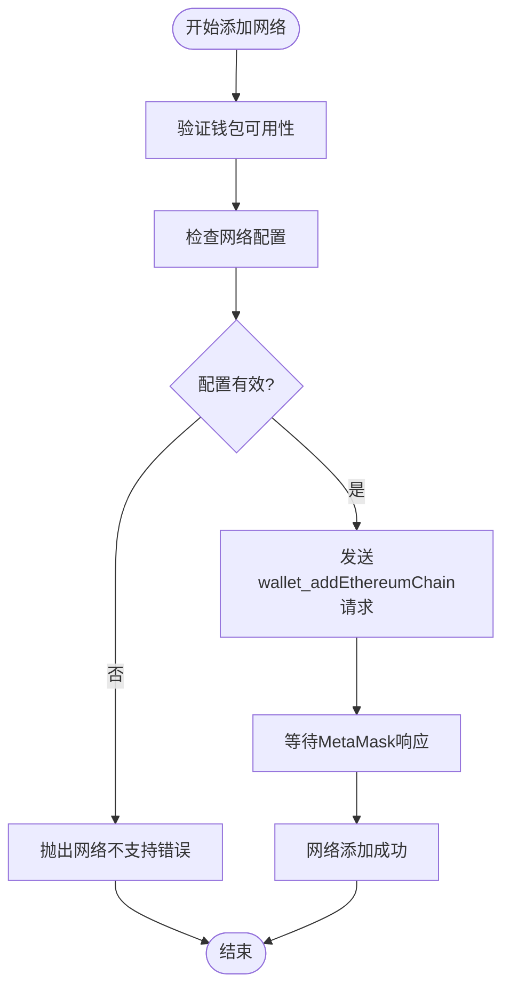
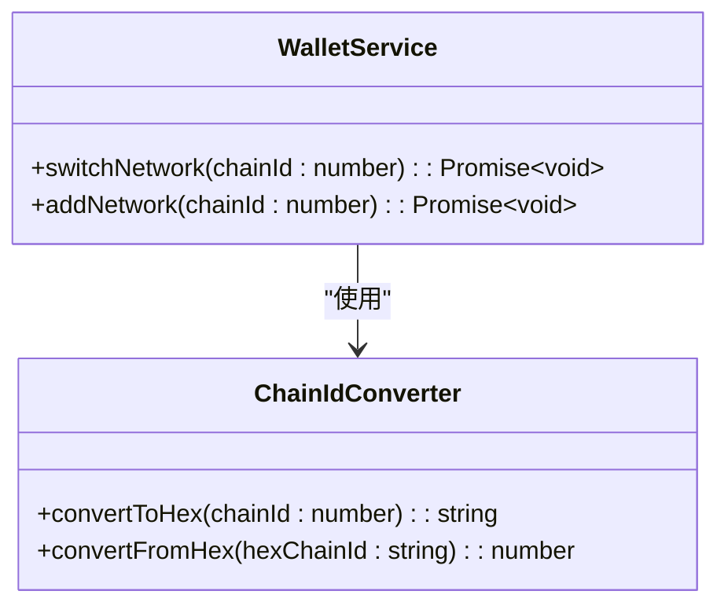
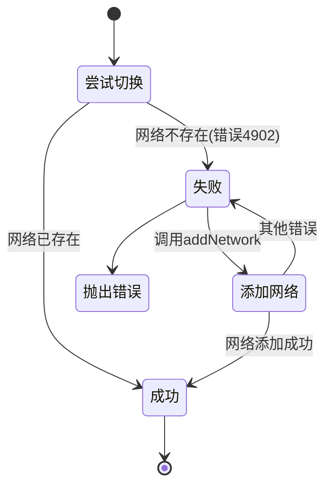
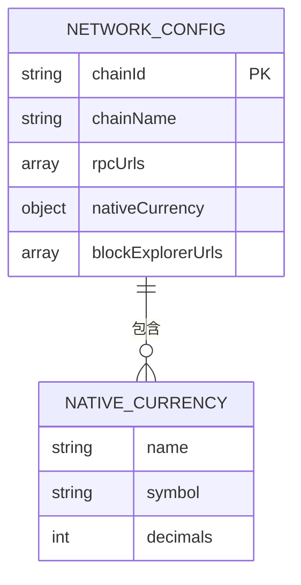

# 网络管理

<cite>
**本文档中引用的文件**   
- [walletService.ts](file://src/services/walletService.ts)
- [wagmi.tsx](file://src/config/wagmi.tsx)
</cite>

## 目录
1. [简介](#简介)
2. [核心组件](#核心组件)
3. [网络切换与添加机制](#网络切换与添加机制)
4. [链ID转换与错误处理](#链id转换与错误处理)
5. [前端实现与兼容性](#前端实现与兼容性)
6. [结论](#结论)

## 简介
本文档全面阐述了钱包网络切换和管理功能的实现原理，重点分析`WalletService`类中`switchNetwork`和`addNetwork`方法的技术细节。详细说明如何通过`wallet_switchEthereumChain` RPC方法切换现有网络，以及如何通过`wallet_addEthereumChain` RPC方法添加新网络。同时解释链ID的十六进制转换、网络配置参数和错误代码4902的处理机制。

## 核心组件

`WalletService`类是实现钱包网络管理功能的核心组件，提供了完整的网络切换、余额查询、交易执行等功能。该服务通过集成Ethers.js库与MetaMask等钱包进行交互，实现了对以太坊网络的全面控制。

**Section sources**
- [walletService.ts](file://src/services/walletService.ts#L62-L264)

## 网络切换与添加机制

### 网络切换流程



**Diagram sources**
- [walletService.ts](file://src/services/walletService.ts#L215-L233)

### 网络添加机制



**Diagram sources**
- [walletService.ts](file://src/services/walletService.ts#L235-L263)

## 链ID转换与错误处理

### 链ID十六进制转换

在以太坊生态系统中，链ID需要以十六进制格式传递。`switchNetwork`方法通过`chainId.toString(16)`将十进制链ID转换为十六进制，并在前面添加"0x"前缀。



**Diagram sources**
- [walletService.ts](file://src/services/walletService.ts#L220-L222)

### 错误代码4902处理机制

当尝试切换到未配置的网络时，MetaMask会返回错误代码4902。`WalletService`实现了自动恢复机制，捕获此错误并调用`addNetwork`方法自动添加网络配置。



**Diagram sources**
- [walletService.ts](file://src/services/walletService.ts#L225-L228)

## 前端实现与兼容性

### 网络配置参数



**Diagram sources**
- [walletService.ts](file://src/services/walletService.ts#L240-L252)

### 实际使用场景

```mermaid
flowchart LR
A[用户界面] --> B{选择网络}
B --> C[Sepolia测试网]
B --> D[其他网络]
C --> E[调用switchNetwork(11155111)]
E --> F{MetaMask响应}
F --> G[成功切换]
F --> H[错误4902]
H --> I[自动添加网络]
I --> J[重新尝试切换]
J --> G
G --> K[更新UI状态]
```

**Diagram sources**
- [walletService.ts](file://src/services/walletService.ts#L215-L263)

## 结论
`WalletService`类通过`switchNetwork`和`addNetwork`方法实现了完整的网络管理功能。该实现遵循以太坊钱包标准，能够安全地处理网络切换和添加操作。通过自动处理错误代码4902，系统能够为用户提供无缝的网络切换体验，无需手动配置网络参数。