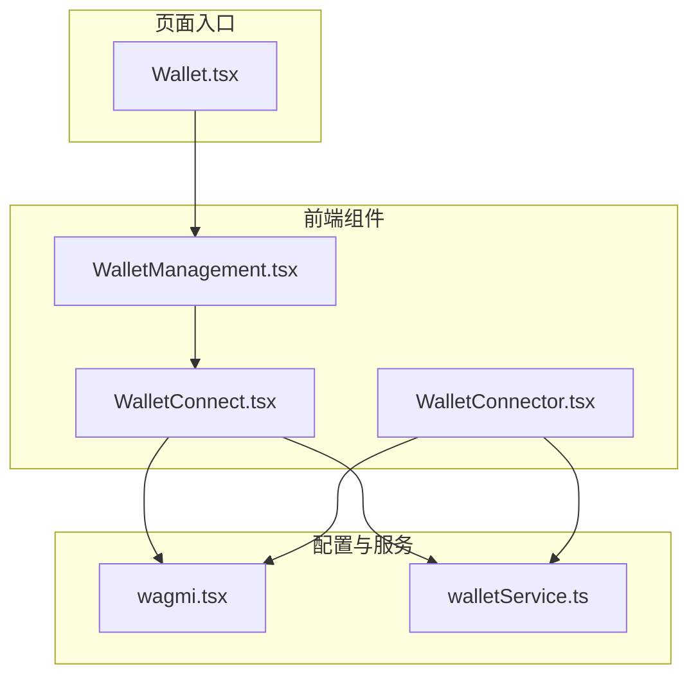
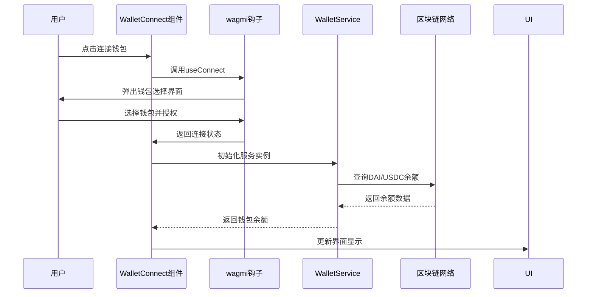
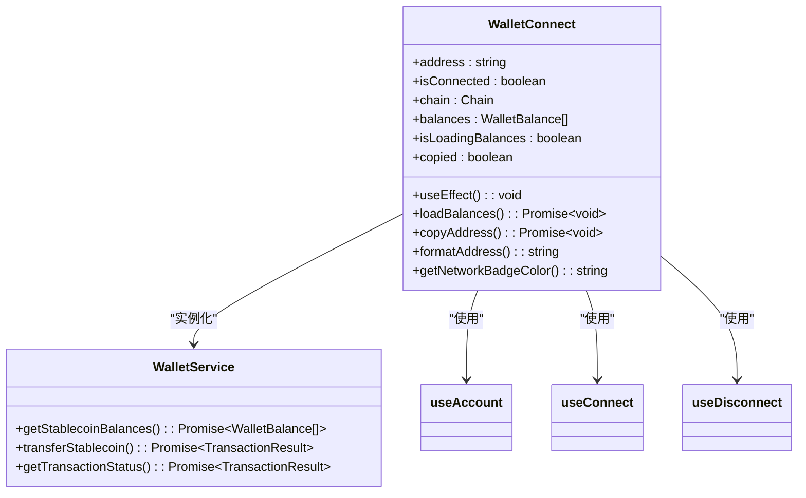
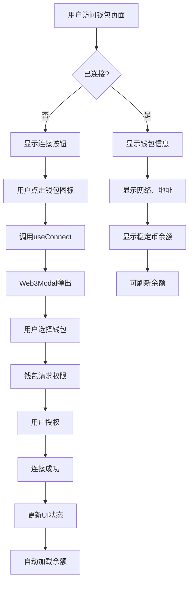
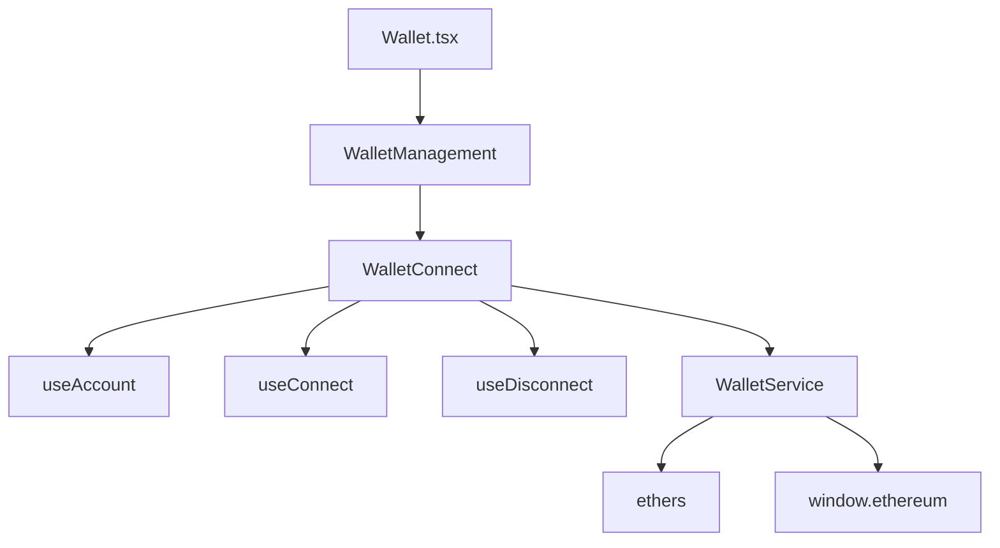

# 钱包连接

<cite>
**本文档中引用的文件**  
- [WalletConnect.tsx](file://src/components/Wallet/WalletConnect.tsx)
- [wagmi.tsx](file://src/config/wagmi.tsx)
- [walletService.ts](file://src/services/walletService.ts)
- [WalletConnector.tsx](file://src/components/Wallet/WalletConnector.tsx)
- [Wallet.tsx](file://src/pages/Wallet.tsx)
</cite>

## 目录
1. [简介](#简介)
2. [项目结构](#项目结构)
3. [核心组件](#核心组件)
4. [架构概述](#架构概述)
5. [详细组件分析](#详细组件分析)
6. [依赖分析](#依赖分析)
7. [性能考虑](#性能考虑)
8. [故障排除指南](#故障排除指南)
9. [结论](#结论)

## 简介
本文档详细说明了前端钱包连接的实现机制，重点描述 `WalletConnect` 组件如何利用 wagmi 库的 `useConnect` 和 `useAccount` 钩子实现与 MetaMask 等 Web3 钱包的连接。文档涵盖用户交互流程、状态管理、错误处理策略以及与后端服务的集成方式，为开发者提供完整的连接流程指导。

## 项目结构
项目采用模块化结构，前端钱包功能主要集中在 `src/components/Wallet` 目录下，通过 wagmi 配置实现 Web3 钱包连接，并与自定义钱包服务进行交互。

**Diagram sources**
- [WalletConnect.tsx](file://src/components/Wallet/WalletConnect.tsx#L1-L241)
- [wagmi.tsx](file://src/config/wagmi.tsx#L1-L79)
- [walletService.ts](file://src/services/walletService.ts#L1-L269)
- [WalletConnector.tsx](file://src/components/Wallet/WalletConnector.tsx#L1-L241)
- [Wallet.tsx](file://src/pages/Wallet.tsx#L1-L15)

**Section sources**
- [WalletConnect.tsx](file://src/components/Wallet/WalletConnect.tsx#L1-L241)
- [wagmi.tsx](file://src/config/wagmi.tsx#L1-L79)

## 核心组件
`WalletConnect` 组件是钱包连接功能的核心，利用 wagmi 钩子管理连接状态，并集成 `WalletService` 获取用户资产信息。

**Section sources**
- [WalletConnect.tsx](file://src/components/Wallet/WalletConnect.tsx#L16-L241)
- [walletService.ts](file://src/services/walletService.ts#L78-L113)

## 架构概述
系统通过 wagmi 配置初始化 Web3Modal，实现与主流钱包的无缝连接。连接成功后，自动加载用户稳定币余额并实时更新 UI。

**Diagram sources**
- [WalletConnect.tsx](file://src/components/Wallet/WalletConnect.tsx#L16-L241)
- [walletService.ts](file://src/services/walletService.ts#L78-L113)

## 详细组件分析

### WalletConnect 组件分析
该组件实现了完整的钱包连接流程，包括连接、断开、地址复制、余额刷新等功能。

#### 组件状态管理

**Diagram sources**
- [WalletConnect.tsx](file://src/components/Wallet/WalletConnect.tsx#L16-L241)
- [walletService.ts](file://src/services/walletService.ts#L1-L269)

#### 连接流程分析

**Diagram sources**
- [WalletConnect.tsx](file://src/components/Wallet/WalletConnect.tsx#L16-L241)

**Section sources**
- [WalletConnect.tsx](file://src/components/Wallet/WalletConnect.tsx#L16-L241)
- [WalletConnector.tsx](file://src/components/Wallet/WalletConnector.tsx#L16-L241)

### wagmi 配置分析
wagmi 配置文件初始化了 Web3Modal，支持多个区块链网络。

#### 网络配置
| 网络 | Chain ID | 名称 | 原生代币 |
|------|---------|------|---------|
| Mainnet | 1 | Ethereum Mainnet | ETH |
| Arbitrum | 42161 | Arbitrum One | ETH |
| Sepolia | 11155111 | Sepolia Testnet | SEP |

**Section sources**
- [wagmi.tsx](file://src/config/wagmi.tsx#L1-L79)

## 依赖分析
组件间依赖关系清晰，遵循单一职责原则。

**Diagram sources**
- [WalletConnect.tsx](file://src/components/Wallet/WalletConnect.tsx#L16-L241)
- [walletService.ts](file://src/services/walletService.ts#L1-L269)
- [wagmi.tsx](file://src/config/wagmi.tsx#L1-L79)

**Section sources**
- [WalletConnect.tsx](file://src/components/Wallet/WalletConnect.tsx#L16-L241)
- [walletService.ts](file://src/services/walletService.ts#L1-L269)
- [wagmi.tsx](file://src/config/wagmi.tsx#L1-L79)

## 性能考虑
- 使用 `useEffect` 监听连接状态变化，避免不必要的重复加载
- 余额加载时显示加载动画，提升用户体验
- 错误处理机制完善，确保异常不会导致界面崩溃
- 地址格式化处理，保护用户隐私

## 故障排除指南
常见问题及解决方案：

| 问题 | 可能原因 | 解决方案 |
|------|---------|---------|
| 无法连接钱包 | 浏览器未安装钱包扩展 | 安装 MetaMask 等钱包 |
| 连接后无响应 | 网络权限未授予 | 检查钱包权限设置 |
| 余额加载失败 | 网络不支持 | 切换到支持的网络（Sepolia/Mainnet） |
| 图标不显示 | SVG 文件缺失 | 检查 public/icons 目录 |

**Section sources**
- [WalletConnect.tsx](file://src/components/Wallet/WalletConnect.tsx#L42)
- [WalletConnect.tsx](file://src/components/Wallet/WalletConnect.tsx#L52)

## 结论
钱包连接功能通过 wagmi 库和自定义服务的结合，实现了稳定、安全的 Web3 钱包集成。组件设计合理，错误处理完善，为用户提供流畅的连接体验。建议在生产环境中添加更多网络支持和更详细的错误提示。