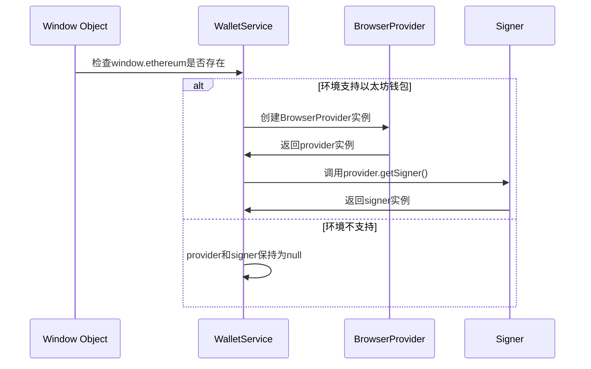
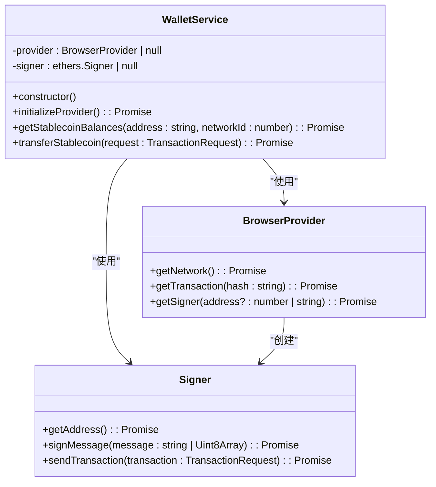
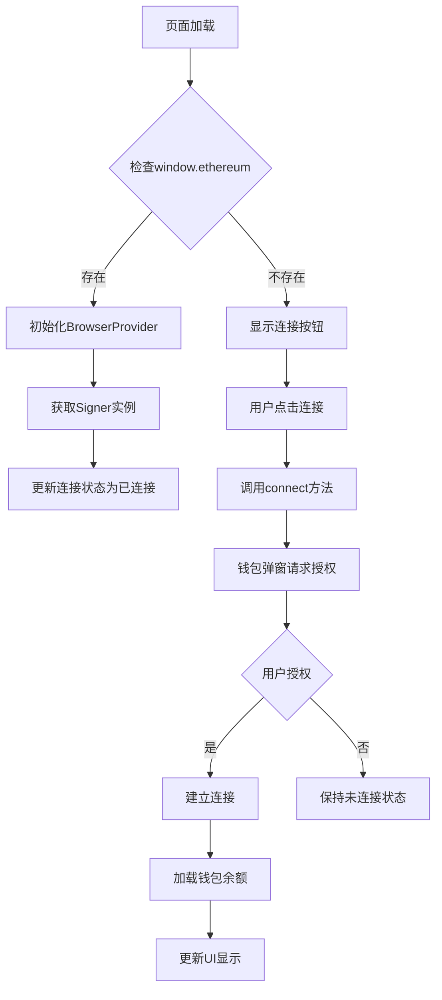
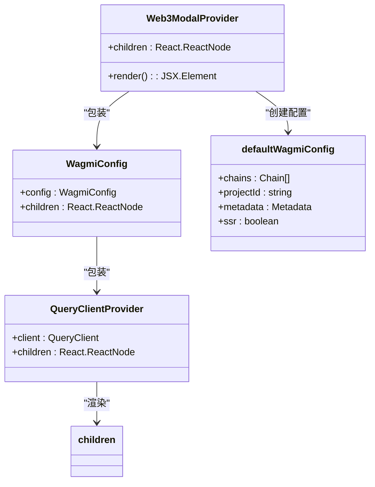
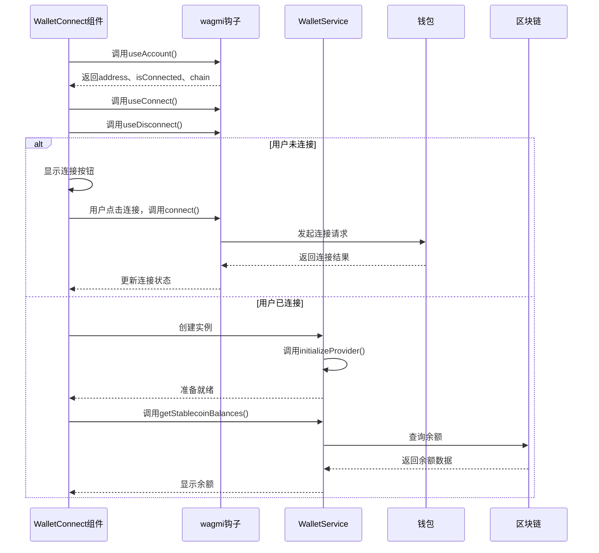
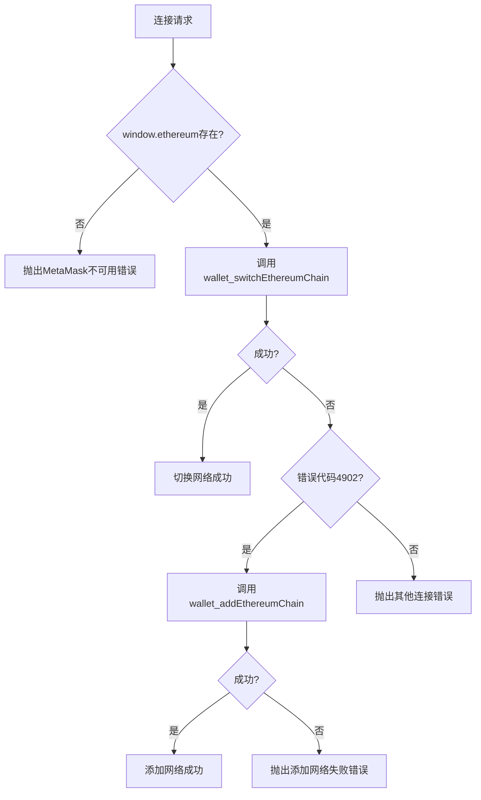
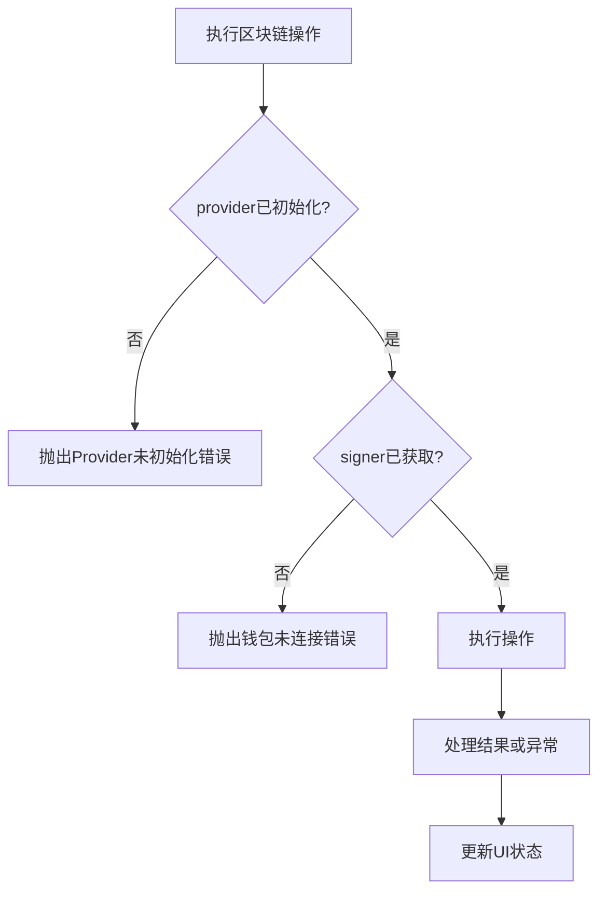

# 钱包连接管理

<cite>
**Referenced Files in This Document**   
- [walletService.ts](file://src/services/walletService.ts)
- [wagmi.tsx](file://src/config/wagmi.tsx)
- [WalletConnect.tsx](file://src/components/Wallet/WalletConnect.tsx)
</cite>

## 目录
1. [简介](#简介)
2. [核心组件](#核心组件)
3. [连接初始化流程](#连接初始化流程)
4. [状态管理与用户反馈](#状态管理与用户反馈)
5. [与wagmi框架集成](#与wagmi框架集成)
6. [错误处理机制](#错误处理机制)
7. [最佳实践](#最佳实践)

## 简介
本文档详细说明了钱包连接管理系统的实现机制，重点介绍`WalletService`类中`initializeProvider`方法的执行逻辑。系统通过检查`window.ethereum`对象来检测浏览器钱包的可用性，并初始化`BrowserProvider`实例以建立与区块链网络的连接。文档还涵盖了`Signer`对象的获取过程、连接状态管理策略以及与wagmi框架的集成方式。

## 核心组件

`WalletService`类是钱包连接管理的核心，负责处理与区块链钱包的交互。该服务通过`BrowserProvider`与`window.ethereum`接口通信，并利用`Signer`对象进行交易签名操作。

**Section sources**
- [walletService.ts](file://src/services/walletService.ts#L63-L265)

## 连接初始化流程

### 初始化提供者

`initializeProvider`方法是钱包连接的第一步，它检查当前环境是否支持以太坊钱包并初始化相应的提供者。

**Diagram sources**
- [walletService.ts](file://src/services/walletService.ts#L71-L76)

**Section sources**
- [walletService.ts](file://src/services/walletService.ts#L71-L76)

### 提供者与签名者关系

`BrowserProvider`和`Signer`在钱包连接中扮演不同的角色，前者用于读取区块链数据，后者用于签署交易。

**Diagram sources**
- [walletService.ts](file://src/services/walletService.ts#L63-L265)
- [node_modules/ethers/src.ts/providers/provider-browser.ts](file://node_modules/ethers/src.ts/providers/provider-browser.ts#L110-L333)

## 状态管理与用户反馈

### 连接状态管理

系统通过`useAccount`钩子监控钱包连接状态，并在UI中实时反映当前连接情况。

**Diagram sources**
- [WalletConnect.tsx](file://src/components/Wallet/WalletConnect.tsx#L14-L24)
- [walletService.ts](file://src/services/walletService.ts#L71-L76)

**Section sources**
- [WalletConnect.tsx](file://src/components/Wallet/WalletConnect.tsx#L14-L24)

## 与wagmi框架集成

### wagmi配置

wagmi框架的配置文件定义了支持的区块链网络和项目元数据，为钱包连接提供基础设置。

**Diagram sources**
- [wagmi.tsx](file://src/config/wagmi.tsx#L1-L80)

**Section sources**
- [wagmi.tsx](file://src/config/wagmi.tsx#L1-L80)

### 钩子集成

`useAccount`、`useConnect`和`useDisconnect`等wagmi钩子与`WalletService`协同工作，实现完整的钱包连接功能。

**Diagram sources**
- [WalletConnect.tsx](file://src/components/Wallet/WalletConnect.tsx#L14-L24)
- [walletService.ts](file://src/services/walletService.ts#L63-L265)

**Section sources**
- [WalletConnect.tsx](file://src/components/Wallet/WalletConnect.tsx#L14-L24)

## 错误处理机制

### 连接错误处理

系统实现了多层次的错误处理机制，确保在各种异常情况下都能提供适当的反馈。

**Diagram sources**
- [walletService.ts](file://src/services/walletService.ts#L211-L270)

**Section sources**
- [walletService.ts](file://src/services/walletService.ts#L211-L270)

## 最佳实践

### 连接状态检查

在执行任何区块链操作前，必须验证提供者和签名者的可用性。

**Diagram sources**
- [walletService.ts](file://src/services/walletService.ts#L85-L88)
- [walletService.ts](file://src/services/walletService.ts#L125-L128)

**Section sources**
- [walletService.ts](file://src/services/walletService.ts#L85-L88)
- [walletService.ts](file://src/services/walletService.ts#L125-L128)