<cite>
**Referenced Files in This Document**  
- [walletService.ts](file://src/services/walletService.ts)
- [TransactionExecutor.tsx](file://src/components/Blockchain/TransactionExecutor.tsx)
- [balances/route.ts](file://src/app/api/wallet/balances/route.ts)
- [transaction/route.ts](file://src/app/api/wallet/transaction/route.ts)
- [wagmi.tsx](file://src/config/wagmi.tsx)
</cite>

## 目录
1. [钱包集成](#钱包集成)
2. [核心组件](#核心组件)
3. [钱包服务实现](#钱包服务实现)
4. [前端组件集成](#前端组件集成)
5. [API接口设计](#api接口设计)
6. [网络切换机制](#网络切换机制)
7. [最佳实践](#最佳实践)

## 钱包集成

本文档详细说明了TriBridge平台的钱包集成方案，重点阐述了`WalletService`类实现的钱包连接与交互功能。文档涵盖了从钱包初始化、余额查询、代币转账到网络切换的完整流程，并提供了前端组件与钱包服务集成的最佳实践。

**Section sources**  
- [walletService.ts](file://src/services/walletService.ts#L63-L265)
- [TransactionExecutor.tsx](file://src/components/Blockchain/TransactionExecutor.tsx#L22-L388)

## 核心组件

钱包集成系统由多个核心组件构成，包括钱包服务、前端执行器、API接口和配置文件。这些组件协同工作，为用户提供安全、可靠的钱包交互体验。

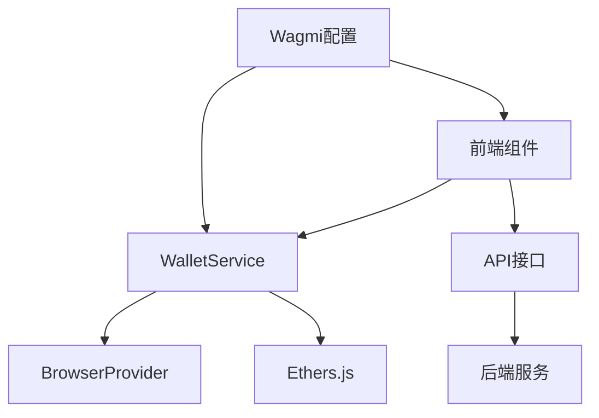

**Diagram sources**  
- [walletService.ts](file://src/services/walletService.ts#L63-L265)
- [TransactionExecutor.tsx](file://src/components/Blockchain/TransactionExecutor.tsx#L22-L388)
- [wagmi.tsx](file://src/config/wagmi.tsx#L1-L80)

**Section sources**  
- [walletService.ts](file://src/services/walletService.ts#L63-L265)
- [TransactionExecutor.tsx](file://src/components/Blockchain/TransactionExecutor.tsx#L22-L388)

## 钱包服务实现

`WalletService`类是钱包集成的核心，负责管理与用户钱包的连接和交互。该服务通过`BrowserProvider`与MetaMask等钱包进行通信，并通过`Signer`对象执行安全的区块链操作。

### 初始化流程

钱包服务的初始化流程在构造函数中自动执行，确保服务实例化后即可使用。

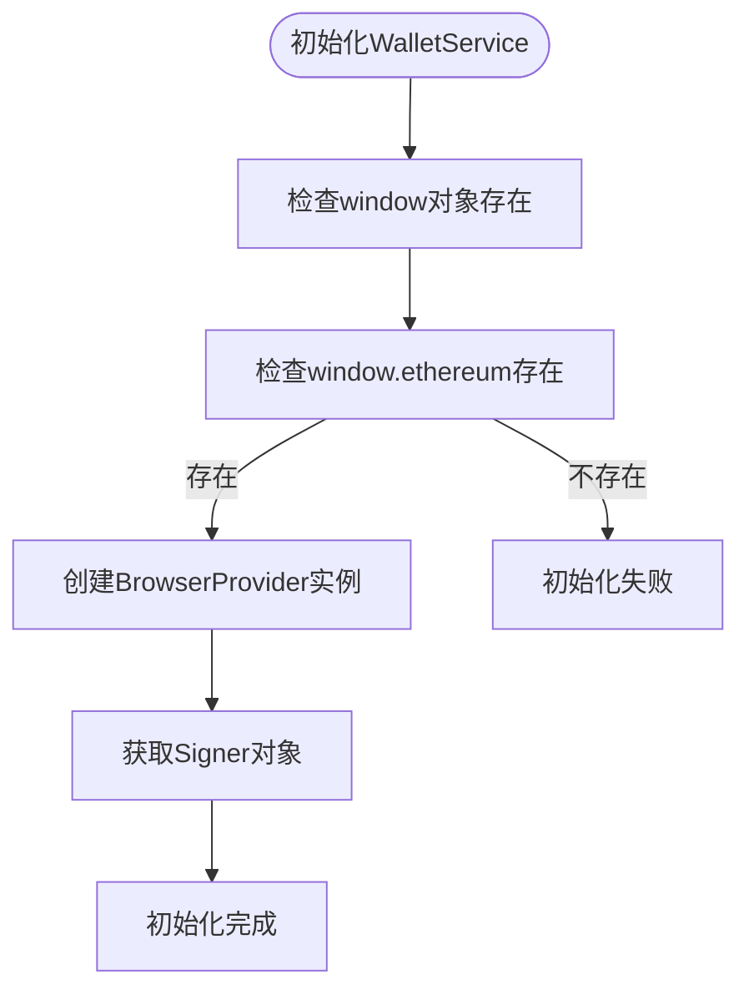

**Diagram sources**  
- [walletService.ts](file://src/services/walletService.ts#L71-L78)

**Section sources**  
- [walletService.ts](file://src/services/walletService.ts#L63-L80)

### 余额查询

`getStablecoinBalances`方法实现了批量查询用户在不同网络上的稳定币余额功能。

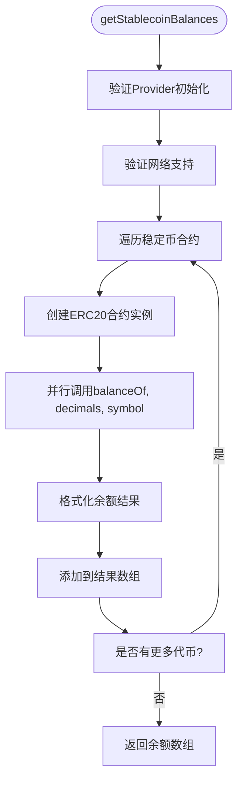

**Diagram sources**  
- [walletService.ts](file://src/services/walletService.ts#L82-L117)

**Section sources**  
- [walletService.ts](file://src/services/walletService.ts#L82-L117)

### 代币转账

`transferStablecoin`方法负责构建和发送ERC20代币转账交易。

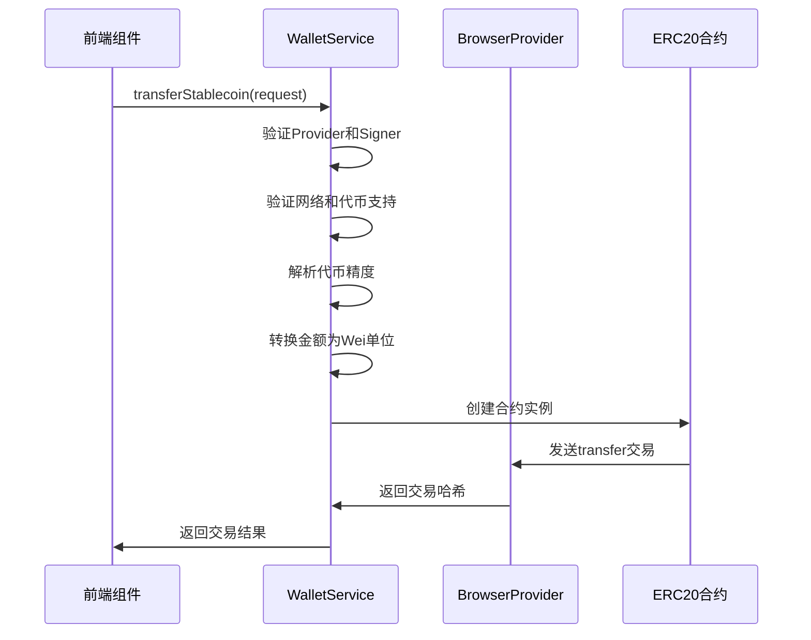

**Diagram sources**  
- [walletService.ts](file://src/services/walletService.ts#L119-L159)

**Section sources**  
- [walletService.ts](file://src/services/walletService.ts#L119-L159)

## 前端组件集成

`TransactionExecutor`组件展示了前端如何与钱包服务集成的最佳实践，包括状态管理、错误处理和用户体验优化。

### 状态管理

组件使用React的useState和useCallback钩子管理复杂的交易状态。

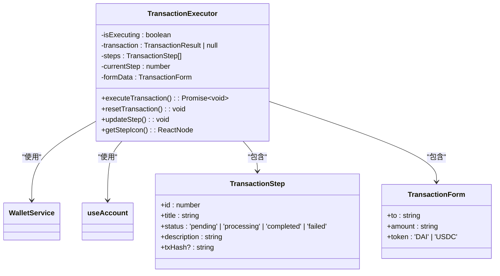

**Diagram sources**  
- [TransactionExecutor.tsx](file://src/components/Blockchain/TransactionExecutor.tsx#L22-L388)

**Section sources**  
- [TransactionExecutor.tsx](file://src/components/Blockchain/TransactionExecutor.tsx#L22-L388)

### 交易流程

组件实现了六步交易流程，为用户提供清晰的进度反馈。

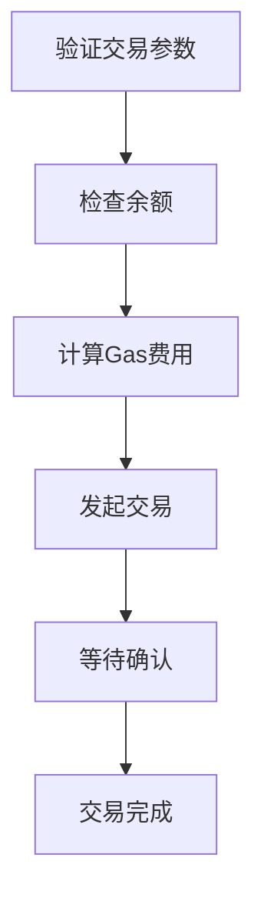

**Diagram sources**  
- [TransactionExecutor.tsx](file://src/components/Blockchain/TransactionExecutor.tsx#L50-L75)

**Section sources**  
- [TransactionExecutor.tsx](file://src/components/Blockchain/TransactionExecutor.tsx#L50-L75)

## API接口设计

钱包服务与后端API通过特定接口进行通信，确保交易数据的持久化和状态同步。

### 余额查询API

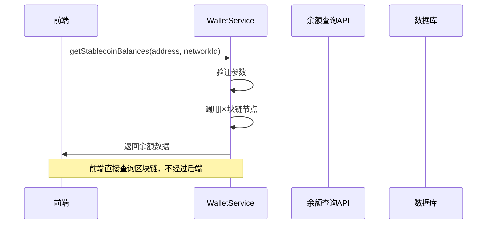

**Diagram sources**  
- [walletService.ts](file://src/services/walletService.ts#L82-L117)
- [balances/route.ts](file://src/app/api/wallet/balances/route.ts#L1-L50)

**Section sources**  
- [balances/route.ts](file://src/app/api/wallet/balances/route.ts#L1-L50)

### 交易记录API

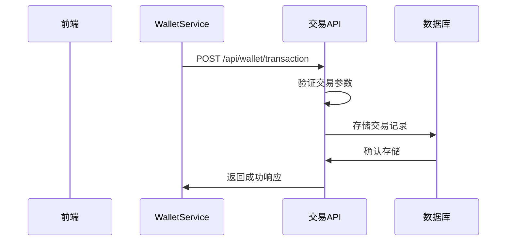

**Diagram sources**  
- [transaction/route.ts](file://src/app/api/wallet/transaction/route.ts#L1-L144)
- [TransactionExecutor.tsx](file://src/components/Blockchain/TransactionExecutor.tsx#L200-L220)

**Section sources**  
- [transaction/route.ts](file://src/app/api/wallet/transaction/route.ts#L1-L144)

## 网络切换机制

钱包服务实现了完整的网络切换逻辑，支持`wallet_switchEthereumChain`和`wallet_addEthereumChain`的调用。

### 网络切换流程

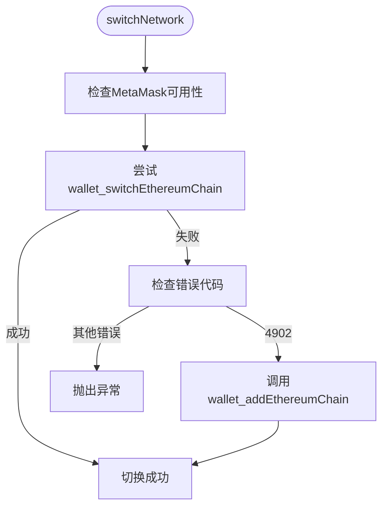

**Diagram sources**  
- [walletService.ts](file://src/services/walletService.ts#L224-L265)

**Section sources**  
- [walletService.ts](file://src/services/walletService.ts#L224-L265)

## 最佳实践

### 错误处理

钱包服务和前端组件实现了全面的错误处理机制，确保用户能够获得清晰的错误信息。

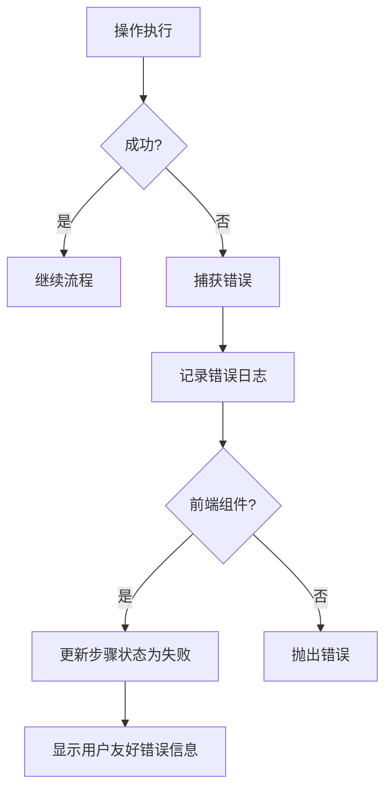

**Diagram sources**  
- [walletService.ts](file://src/services/walletService.ts#L145-L158)
- [TransactionExecutor.tsx](file://src/components/Blockchain/TransactionExecutor.tsx#L150-L180)

**Section sources**  
- [walletService.ts](file://src/services/walletService.ts#L145-L158)
- [TransactionExecutor.tsx](file://src/components/Blockchain/TransactionExecutor.tsx#L150-L180)

### 用户体验优化

`TransactionExecutor`组件通过进度条、步骤指示器和实时反馈优化用户体验。

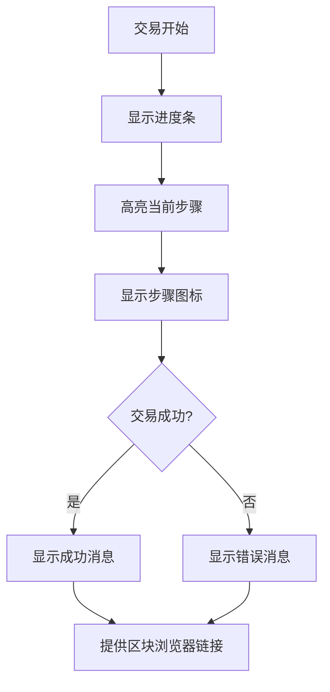

**Diagram sources**  
- [TransactionExecutor.tsx](file://src/components/Blockchain/TransactionExecutor.tsx#L250-L350)

**Section sources**  
- [TransactionExecutor.tsx](file://src/components/Blockchain/TransactionExecutor.tsx#L250-L350)