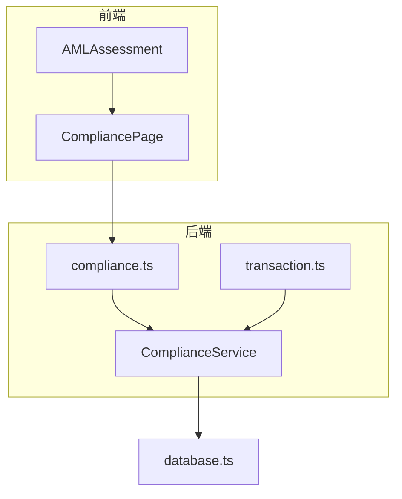
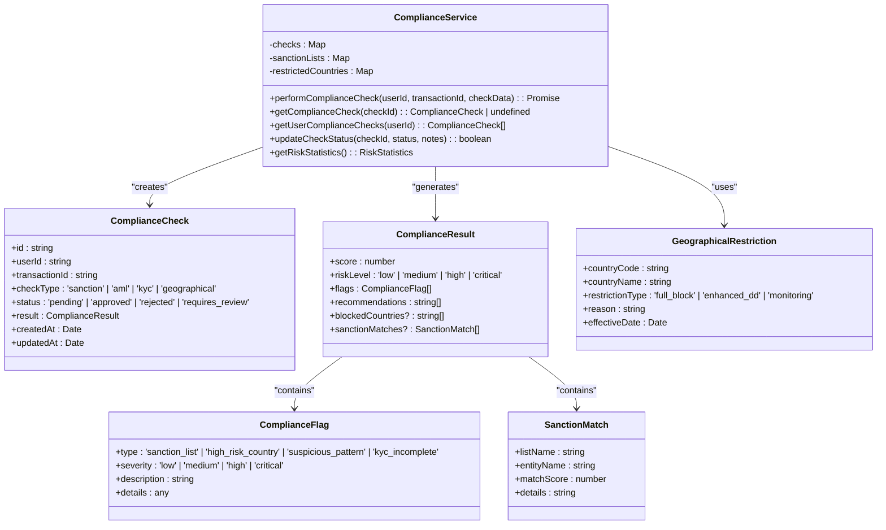
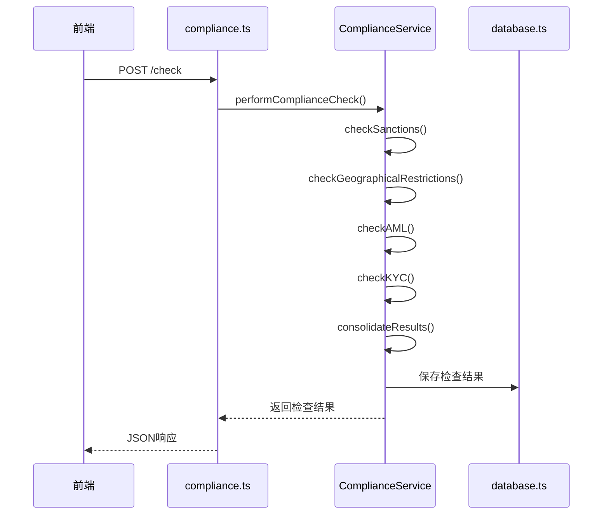
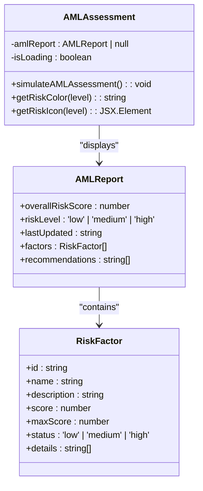
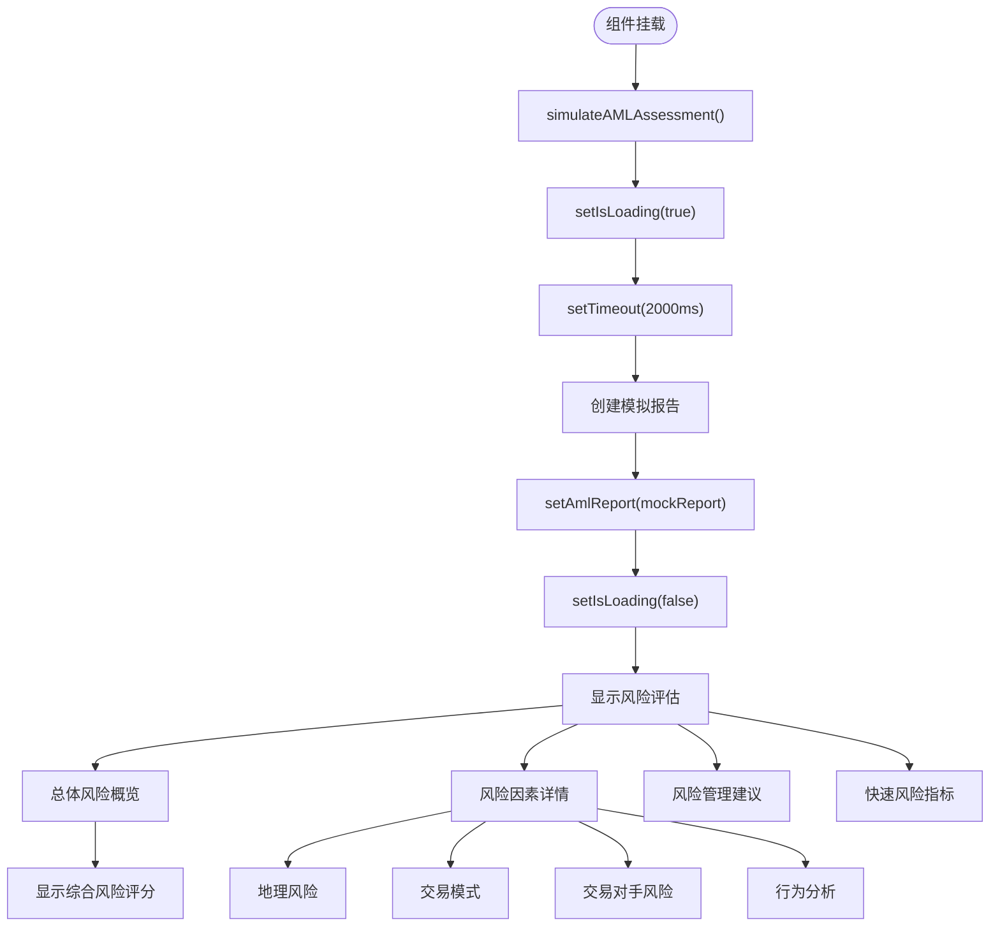
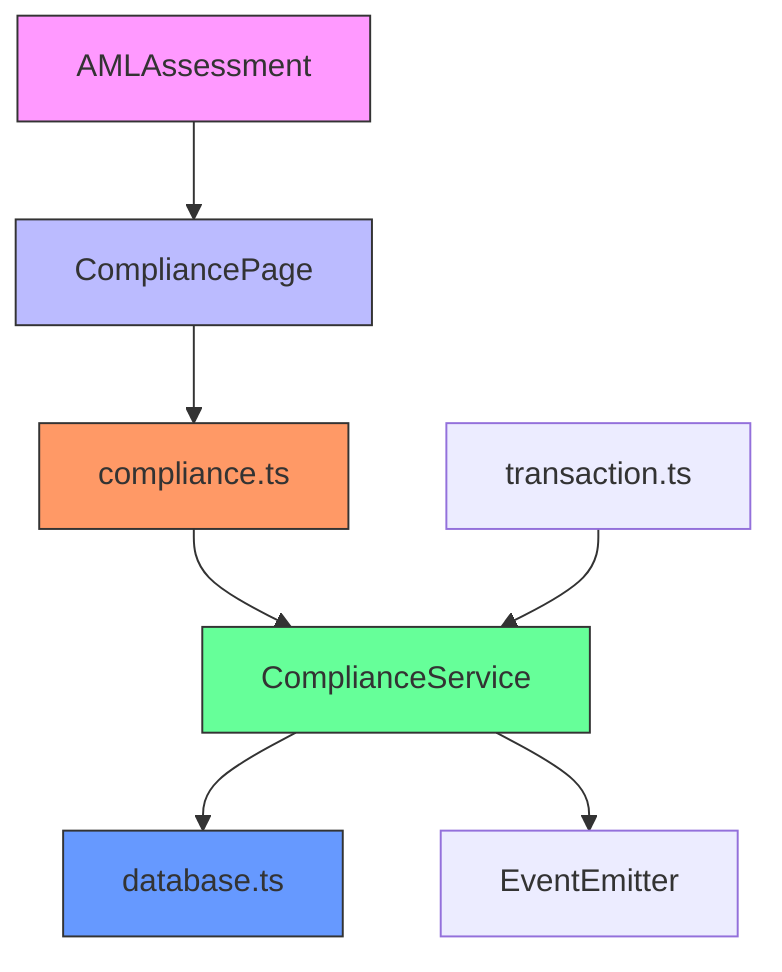

# AML检查引擎

<cite>
**Referenced Files in This Document**   
- [complianceService.ts](file://backend/src/services/complianceService.ts)
- [compliance.ts](file://backend/src/routes/compliance.ts)
- [transaction.ts](file://backend/src/routes/transaction.ts)
- [AMLAssessment.tsx](file://src/components/Compliance/AMLAssessment.tsx)
- [Compliance.tsx](file://src/pages/Compliance.tsx)
- [database.ts](file://backend/src/services/database.ts)
</cite>

## 目录
1. [引言](#引言)
2. [项目结构](#项目结构)
3. [核心组件](#核心组件)
4. [架构概述](#架构概述)
5. [详细组件分析](#详细组件分析)
6. [依赖分析](#依赖分析)
7. [性能考虑](#性能考虑)
8. [故障排除指南](#故障排除指南)
9. [结论](#结论)

## 引言
本文档详细描述了反洗钱（AML）检查引擎的架构与实现，重点分析了合规服务中的规则引擎设计、风险评估算法、制裁名单比对机制以及前端风险展示逻辑。系统通过多层次的合规检查，确保交易符合监管要求，防止洗钱和恐怖融资活动。

## 项目结构
项目采用前后端分离的架构，后端服务位于`backend/src`目录，前端组件位于`src`目录。合规相关的核心逻辑集中在`backend/src/services/complianceService.ts`，而前端展示组件位于`src/components/Compliance`目录。

**Section sources**
- [complianceService.ts](file://backend/src/services/complianceService.ts#L1-L50)
- [AMLAssessment.tsx](file://src/components/Compliance/AMLAssessment.tsx#L1-L50)

## 核心组件
AML检查引擎的核心是`ComplianceService`类，它实现了多层次的合规检查机制，包括制裁名单检查、地理限制检查、反洗钱模式识别和KYC验证。前端通过`AMLAssessment`组件展示风险评估结果。

**Section sources**
- [complianceService.ts](file://backend/src/services/complianceService.ts#L44-L458)
- [AMLAssessment.tsx](file://src/components/Compliance/AMLAssessment.tsx#L36-L344)

## 架构概述
系统采用分层架构，前端通过API路由与后端服务交互，后端服务调用合规检查引擎执行具体的检查逻辑。

**Diagram sources **
- [compliance.ts](file://backend/src/routes/compliance.ts#L1-L181)
- [complianceService.ts](file://backend/src/services/complianceService.ts#L44-L458)
- [transaction.ts](file://backend/src/routes/transaction.ts#L1-L313)

## 详细组件分析

### 合规服务分析
`ComplianceService`是AML检查引擎的核心，实现了完整的合规检查流程。

#### 类图

**Diagram sources **
- [complianceService.ts](file://backend/src/services/complianceService.ts#L1-L458)

#### 合规检查流程

**Diagram sources **
- [compliance.ts](file://backend/src/routes/compliance.ts#L4-L40)
- [complianceService.ts](file://backend/src/services/complianceService.ts#L102-L149)

### AML风险评估分析
`AMLAssessment`组件负责在前端展示用户的风险评估结果。

#### 组件结构

**Diagram sources **
- [AMLAssessment.tsx](file://src/components/Compliance/AMLAssessment.tsx#L1-L344)

#### 风险评估流程

**Diagram sources **
- [AMLAssessment.tsx](file://src/components/Compliance/AMLAssessment.tsx#L36-L344)

## 依赖分析
系统各组件之间存在明确的依赖关系，确保了合规检查的完整性和数据持久化。

**Diagram sources **
- [complianceService.ts](file://backend/src/services/complianceService.ts#L1-L10)
- [compliance.ts](file://backend/src/routes/compliance.ts#L1-L10)
- [database.ts](file://backend/src/services/database.ts#L1-L10)

**Section sources**
- [complianceService.ts](file://backend/src/services/complianceService.ts#L1-L50)
- [compliance.ts](file://backend/src/routes/compliance.ts#L1-L50)
- [database.ts](file://backend/src/services/database.ts#L1-L50)

## 性能考虑
系统在设计时考虑了性能优化，通过内存存储检查结果避免频繁的数据库查询，同时使用异步处理确保API响应速度。

**Section sources**
- [complianceService.ts](file://backend/src/services/complianceService.ts#L44-L50)
- [compliance.ts](file://backend/src/routes/compliance.ts#L4-L10)

## 故障排除指南
当合规检查功能出现问题时，应首先检查`complianceService.ts`中的检查逻辑和`compliance.ts`中的API路由配置。

**Section sources**
- [complianceService.ts](file://backend/src/services/complianceService.ts#L150-L200)
- [compliance.ts](file://backend/src/routes/compliance.ts#L10-L50)

## 结论
AML检查引擎通过多层次的合规检查机制，有效识别和防范洗钱风险。系统设计合理，前后端分离清晰，便于维护和扩展。未来可考虑引入机器学习算法优化风险评分模型，并集成外部合规API提高检查准确性。