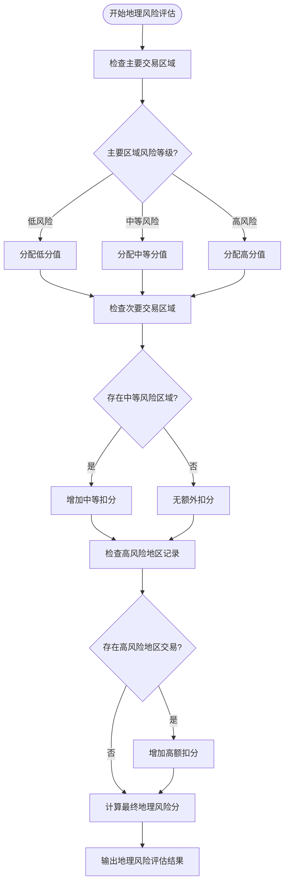

# AML风险评估

<cite>
**本文档引用的文件**
- [AMLAssessment.tsx](file://src/components/Compliance/AMLAssessment.tsx)
- [RiskMonitoring.tsx](file://src/components/Risk/RiskMonitoring.tsx)
- [analytics.ts](file://backend/src/routes/analytics.ts)
</cite>

## 目录
1. [引言](#引言)
2. [核心风险因素分析](#核心风险因素分析)
3. [风险评分算法与判定标准](#风险评分算法与判定标准)
4. [风险等级判定与管理建议](#风险等级判定与管理建议)
5. [风险评估数据更新与缓存策略](#风险评估数据更新与缓存策略)
6. [风险评估报告数据结构与可视化](#风险评估报告数据结构与可视化)
7. [动态交易限额与验证机制](#动态交易限额与验证机制)

## 引言
AML（反洗钱）风险评估系统是保障金融交易合规性的核心组件，通过多维度风险因素分析，对用户交易行为进行实时监控与风险评级。本系统主要由前端风险评估界面与后端分析服务构成，结合地理风险、交易模式、交易对手风险和行为分析等关键指标，构建综合风险评分模型。系统不仅提供可视化风险报告，还能根据风险等级动态调整交易策略，实现智能化风险管理。

**Section sources**
- [AMLAssessment.tsx](file://src/components/Compliance/AMLAssessment.tsx#L0-L346)

## 核心风险因素分析

### 地理风险
地理风险评估基于交易对手所在地区的监管合规状况和风险等级。系统维护高风险地区名单，对涉及高风险地区的交易进行重点监控。评估内容包括主要交易区域、次要交易区域以及是否存在高风险地区交易记录。



**Diagram sources**
- [AMLAssessment.tsx](file://src/components/Compliance/AMLAssessment.tsx#L45-L55)

### 交易模式分析
交易模式分析评估用户的交易频率、金额分布和时间规律性。系统通过统计分析识别正常交易模式，并对异常模式（如频繁小额交易、大额交易集中等）进行预警。评估指标包括交易频率、单笔交易金额范围和交易时间规律性。

```mermaid
flowchart TD
    Start([开始交易模式分析]) --> AnalyzeFrequency["分析交易频率"]
    AnalyzeFrequency --> FrequencyLevel{"频率是否正常?"}
    FrequencyLevel -->|正常| NormalFreq["标记为正常"]
    FrequencyLevel -->|异常| AbnormalFreq["标记为异常"]
    NormalFreq --> AnalyzeAmount["分析交易金额"]
    AbnormalFreq --> AnalyzeAmount
    AnalyzeAmount --> AmountRange{"金额是否合理?"}
    AmountRange -->|合理| ReasonableAmount["标记为合理"]
    AmountRange -->|过大| LargeAmount["标记为过大"]
    ReasonableAmount --> AnalyzeTiming["分析交易时间"]
    LargeAmount --> AnalyzeTiming
    AnalyzeTiming --> TimingPattern{"时间是否规律?"}
    TimingPattern -->|规律