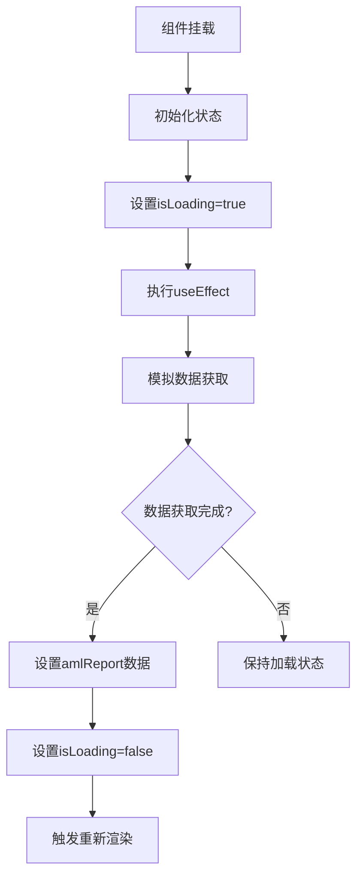
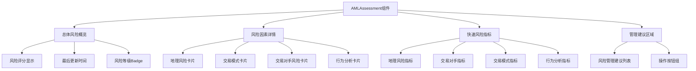
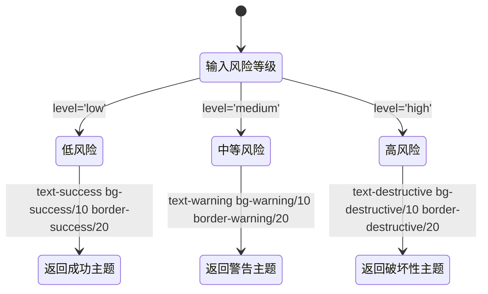
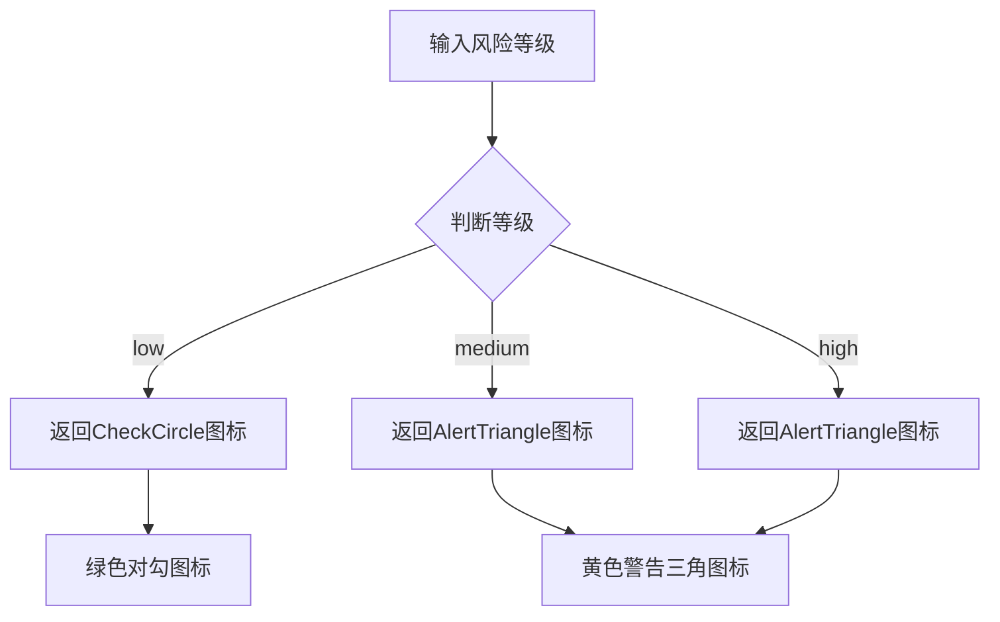
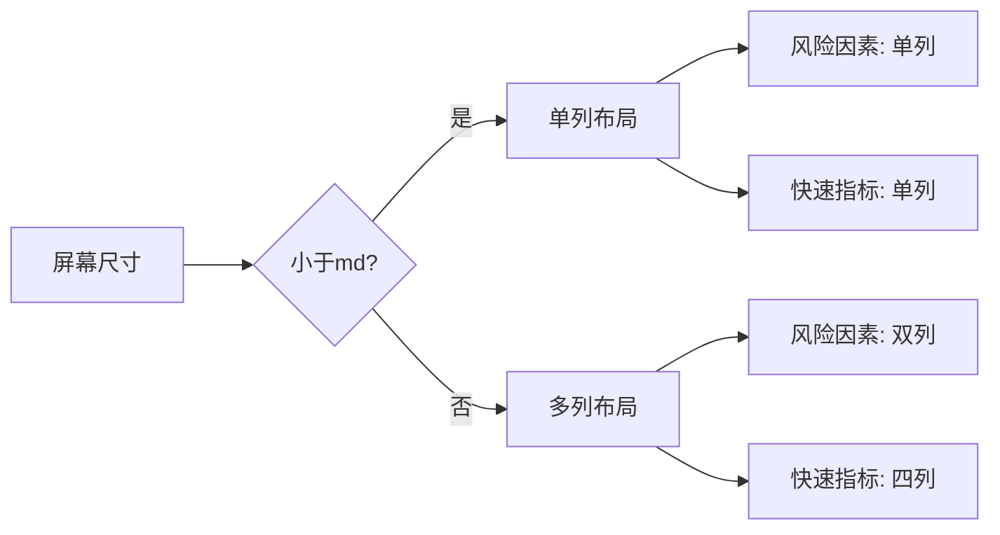
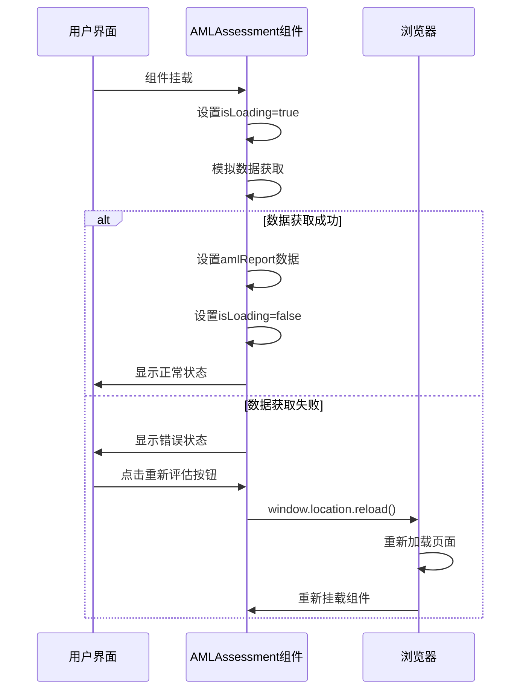

# 前端风险评估可视化

<cite>
**Referenced Files in This Document**   
- [AMLAssessment.tsx](file://src/components/Compliance/AMLAssessment.tsx)
- [card.tsx](file://src/components/ui/card.tsx)
- [badge.tsx](file://src/components/ui/badge.tsx)
- [progress.tsx](file://src/components/ui/progress.tsx)
- [button.tsx](file://src/components/ui/button.tsx)
- [utils.ts](file://src/lib/utils.ts)
</cite>

## 目录
1. [简介](#简介)
2. [核心组件分析](#核心组件分析)
3. [状态管理机制](#状态管理机制)
4. [UI结构设计](#ui结构设计)
5. [风险等级映射函数](#风险等级映射函数)
6. [ShadCN UI组件配置](#shadcn-ui组件配置)
7. [响应式布局设计](#响应式布局设计)
8. [错误处理与重试机制](#错误处理与重试机制)

## 简介
`AMLAssessment`组件是一个全面的反洗钱风险评估可视化组件，用于展示用户的综合风险评分、风险因素详情和管理建议。该组件通过React Hooks管理状态，实现了数据获取、加载状态处理和用户交互功能。组件采用模块化设计，包含总体风险概览、风险因素详情卡片、快速风险指标网格和管理建议区域等多个部分，为用户提供清晰的风险评估视图。

## 核心组件分析

`AMLAssessment`组件是一个功能完整的风险评估可视化组件，主要包含风险报告数据展示、状态管理、UI渲染和用户交互等功能。组件通过模拟数据获取过程，展示了从数据加载到最终呈现的完整生命周期。

**Section sources**
- [AMLAssessment.tsx](file://src/components/Compliance/AMLAssessment.tsx#L36-L344)

## 状态管理机制

`AMLAssessment`组件使用React Hooks进行状态管理，主要通过`useState`和`useEffect`两个Hooks实现数据获取和状态更新。

组件定义了两个核心状态变量：
- `amlReport`：存储AML风险评估报告数据，初始值为`null`
- `isLoading`：控制加载状态，初始值为`true`

在`useEffect`中，组件模拟了风险评估数据的获取过程，通过`setTimeout`延迟2秒后设置报告数据并更新加载状态。这种设计模式确保了用户界面在数据加载期间显示适当的加载状态，提升了用户体验。



**Diagram sources**
- [AMLAssessment.tsx](file://src/components/Compliance/AMLAssessment.tsx#L36-L344)

**Section sources**
- [AMLAssessment.tsx](file://src/components/Compliance/AMLAssessment.tsx#L36-L344)

## UI结构设计

`AMLAssessment`组件的UI结构设计遵循清晰的层次化布局，包含多个逻辑区域：

1. **总体风险概览**：位于顶部的主卡片，展示综合风险评分和最后更新时间
2. **风险因素详情**：以网格形式展示各个风险因素的详细信息
3. **快速风险指标**：底部的四宫格布局，提供关键风险指标的快速查看
4. **管理建议区域**：列出具体的风险管理建议和操作按钮

组件采用`div`容器结合`space-y-6`类名实现垂直间距，确保各部分之间有足够的视觉分离。主容器使用`space-y-6`类名创建6个单位的垂直间距，使整体布局更加清晰易读。



**Diagram sources**
- [AMLAssessment.tsx](file://src/components/Compliance/AMLAssessment.tsx#L36-L344)

**Section sources**
- [AMLAssessment.tsx](file://src/components/Compliance/AMLAssessment.tsx#L36-L344)

## 风险等级映射函数

### 风险颜色映射函数

`getRiskColor`函数根据风险等级返回相应的CSS类名，用于控制UI元素的颜色主题。函数接收`low`、`medium`或`high`三种风险等级作为参数，返回对应的文本颜色、背景色和边框颜色的组合。



**Diagram sources**
- [AMLAssessment.tsx](file://src/components/Compliance/AMLAssessment.tsx#L118-L124)

### 风险图标映射函数

`getRiskIcon`函数根据风险等级返回相应的图标组件，用于视觉化表示风险程度。函数使用Lucide图标库中的图标，为不同风险等级提供直观的视觉反馈。



**Diagram sources**
- [AMLAssessment.tsx](file://src/components/Compliance/AMLAssessment.tsx#L126-L132)

**Section sources**
- [AMLAssessment.tsx](file://src/components/Compliance/AMLAssessment.tsx#L118-L132)

## ShadCN UI组件配置

### Card组件配置

`Card`组件用于创建各种信息卡片，其配置参数如下：

| 组件 | 配置参数 | 说明 |
|------|----------|------|
| Card | `className="border-0 shadow-sm"` | 移除边框，保留轻微阴影 |
| CardHeader | 无特殊配置 | 使用默认样式 |
| CardTitle | `className="flex items-center"` | 水平排列标题和图标 |
| CardContent | `className="pt-0"` | 移除上内边距，紧贴标题 |

**Section sources**
- [card.tsx](file://src/components/ui/card.tsx#L1-L44)
- [AMLAssessment.tsx](file://src/components/Compliance/AMLAssessment.tsx#L36-L344)

### Badge组件配置

`Badge`组件用于显示风险等级和分数，其配置参数如下：

| 组件 | 配置参数 | 说明 |
|------|----------|------|
| Badge | `variant="outline"` | 使用轮廓变体 |
| Badge | `className={getRiskColor(level)}` | 动态应用风险颜色类名 |
| Badge | `className="text-xs"` | 设置小号文本 |

**Section sources**
- [badge.tsx](file://src/components/ui/badge.tsx#L1-L30)
- [AMLAssessment.tsx](file://src/components/Compliance/AMLAssessment.tsx#L36-L344)

### Progress组件配置

`Progress`组件用于可视化风险分数，其配置参数如下：

| 组件 | 配置参数 | 说明 |
|------|----------|------|
| Progress | `value={score}` | 动态设置进度值 |
| Progress | `className="h-2"` | 设置进度条高度为2 |
| Progress | `className="h-3"` | 在主评分中设置高度为3 |

**Section sources**
- [progress.tsx](file://src/components/ui/progress.tsx#L1-L24)
- [AMLAssessment.tsx](file://src/components/Compliance/AMLAssessment.tsx#L36-L344)

### Button组件配置

`Button`组件用于用户操作，其配置参数如下：

| 组件 | 配置参数 | 说明 |
|------|----------|------|
| Button | 无特殊配置 | 使用默认样式 |
| Button | `variant="outline"` | 使用轮廓变体 |
| Button | `onClick={() => window.location.reload()}` | 点击重新加载页面 |

**Section sources**
- [button.tsx](file://src/components/ui/button.tsx#L1-L48)
- [AMLAssessment.tsx](file://src/components/Compliance/AMLAssessment.tsx#L36-L344)

## 响应式布局设计

`AMLAssessment`组件采用Tailwind CSS的响应式设计系统，根据不同屏幕尺寸调整布局。

### 风险因素详情布局

风险因素详情区域使用`grid`布局，通过`md:grid-cols-2`实现响应式设计：
- **移动设备**：单列布局，卡片垂直堆叠
- **中等及以上屏幕**：双列布局，卡片并排显示

### 快速风险指标布局

快速风险指标区域使用`grid`布局，通过`md:grid-cols-4`实现响应式设计：
- **移动设备**：单列布局，指标垂直排列
- **中等及以上屏幕**：四列布局，指标网格排列



**Diagram sources**
- [AMLAssessment.tsx](file://src/components/Compliance/AMLAssessment.tsx#L36-L344)

**Section sources**
- [AMLAssessment.tsx](file://src/components/Compliance/AMLAssessment.tsx#L36-L344)

## 错误处理与重试机制

`AMLAssessment`组件实现了完善的错误处理和重试机制，确保在各种情况下都能提供良好的用户体验。

### 加载状态处理

组件通过`isLoading`状态管理数据加载过程：
- 初始状态显示加载动画和进度条
- 使用`Activity`图标和脉冲动画增强视觉反馈
- 显示"正在分析风险因素..."的提示文本

### 数据获取失败处理

当`amlReport`为空时，组件显示错误状态：
- 使用`AlertTriangle`图标表示警告
- 显示"无法获取风险评估"的错误信息
- 提供"重新评估"按钮供用户重试

### 重试功能实现

重试功能通过按钮的`onClick`事件处理程序实现：
```typescript
<Button onClick={() => window.location.reload()}>
  重新评估
</Button>
```
点击按钮会重新加载整个页面，触发组件重新挂载和数据获取过程，实现简单的重试机制。



**Diagram sources**
- [AMLAssessment.tsx](file://src/components/Compliance/AMLAssessment.tsx#L36-L344)

**Section sources**
- [AMLAssessment.tsx](file://src/components/Compliance/AMLAssessment.tsx#L36-L344)