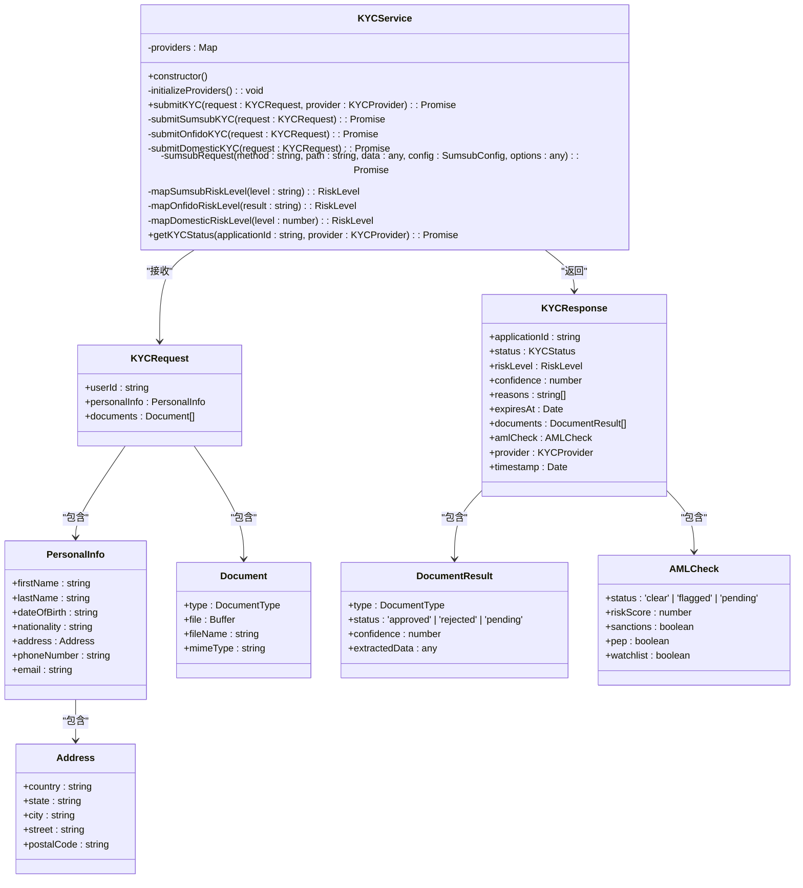
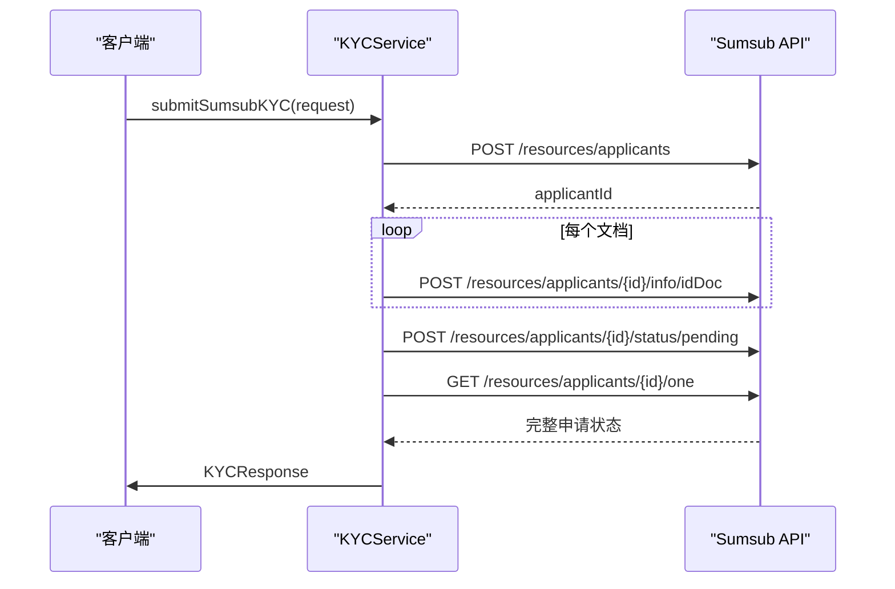
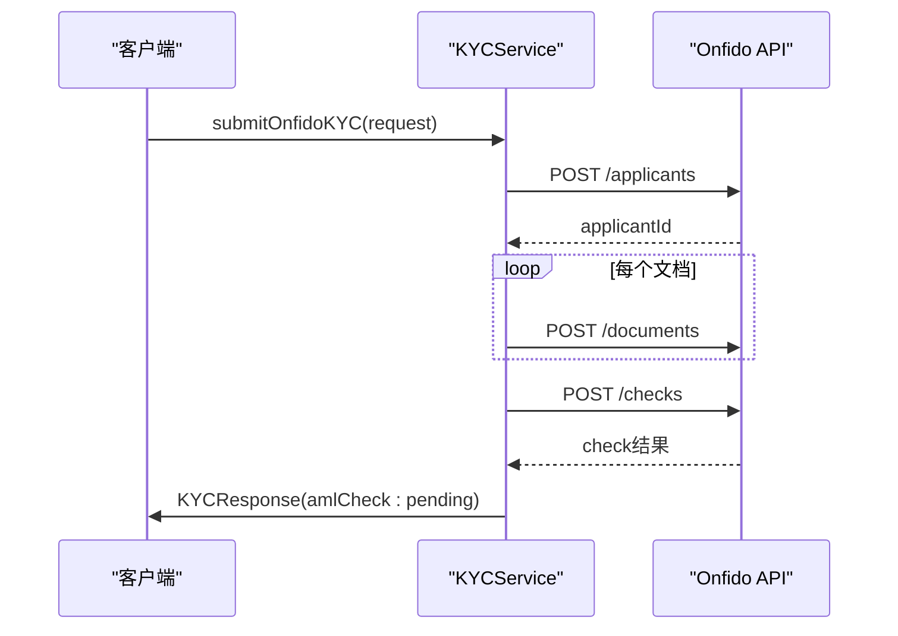
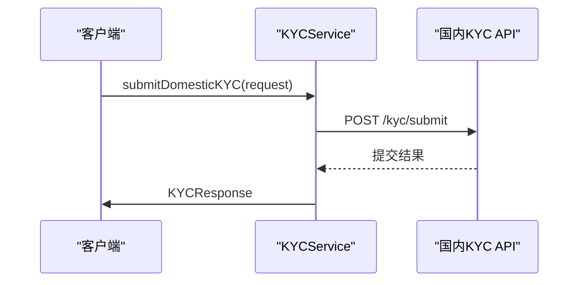

# 后端风险计算引擎

<cite>
**Referenced Files in This Document**   
- [kycService.ts](file://backend/src/services/kycService.ts)
</cite>

## 目录
1. [引言](#引言)
2. [核心组件](#核心组件)
3. [KYC服务架构](#kyc服务架构)
4. [第三方KYC提供商集成](#第三方kyc提供商集成)
5. [风险评分映射逻辑](#风险评分映射逻辑)
6. [AML检查机制](#aml检查机制)
7. [API安全实现](#api安全实现)
8. [数据结构定义](#数据结构定义)

## 引言

本文档深入文档化KYCService中AML风险评估的后端计算逻辑。该服务作为系统的核心合规组件，负责集成Sumsub、Onfido和国内KYC提供商进行风险评估。服务通过统一的接口抽象不同提供商的实现细节，为前端和业务逻辑层提供一致的KYC/AML评估结果。本文档将详细解释服务的实现流程、风险评分映射逻辑、AML检查机制以及关键的数据结构定义。

## 核心组件

KYCService是负责处理所有KYC（了解你的客户）和AML（反洗钱）相关操作的核心服务类。该服务通过`submitKYC`方法作为统一入口，根据指定的提供商调用相应的实现方法。服务在初始化时会检查环境变量，动态配置支持的KYC提供商，包括Sumsub、Onfido和国内KYC提供商。这种设计模式实现了提供商的可插拔性，允许系统在不修改核心逻辑的情况下添加新的KYC提供商。

**Section sources**
- [kycService.ts](file://backend/src/services/kycService.ts#L95-L559)

## KYC服务架构

**Diagram sources**
- [kycService.ts](file://backend/src/services/kycService.ts#L95-L559)

**Section sources**
- [kycService.ts](file://backend/src/services/kycService.ts#L95-L559)

## 第三方KYC提供商集成

### Sumsub KYC实现流程

Sumsub KYC实现通过`submitSumsubKYC`方法完成，遵循以下四个步骤的标准化流程：

1. **申请人创建**：使用`sumsubRequest`方法向Sumsub API的`/resources/applicants`端点发送POST请求，创建新的申请人。请求数据包含用户ID、姓名、出生日期、国家、电话和电子邮件等个人信息。

2. **文档上传**：对于每个需要提交的文档，创建一个FormData对象，将文档文件作为`content`字段添加，并通过`sumsubRequest`方法发送到`/resources/applicants/{applicantId}/info/idDoc`端点。此过程使用Promise.all并行处理多个文档上传。

3. **状态设置**：文档上传完成后，通过向`/resources/applicants/{applicantId}/status/pending`端点发送POST请求，将申请人状态设置为待处理。

4. **状态获取与风险评估**：最后，通过向`/resources/applicants/{applicantId}/one`端点发送GET请求获取申请人的完整状态和风险评估结果。服务将原始响应映射到统一的KYCResponse格式，包括状态、风险等级、置信度、拒绝原因、文档验证结果和AML检查结果。

**Diagram sources**
- [kycService.ts](file://backend/src/services/kycService.ts#L152-L222)

**Section sources**
- [kycService.ts](file://backend/src/services/kycService.ts#L152-L222)

### Onfido KYC实现流程

Onfido KYC实现通过`submitOnfidoKYC`方法完成，其流程与Sumsub类似但有特定差异：

1. **申请人创建**：向Onfido API的`/applicants`端点发送POST请求创建申请人。请求数据结构与Sumsub略有不同，例如使用`first_name`和`last_name`而非`firstName`和`lastName`。

2. **文档上传**：与Sumsub不同，Onfido的文档上传需要指定文档类型和申请人ID。服务使用`mapToOnfidoDocType`方法将通用文档类型映射到Onfido特定的类型。

3. **检查创建**：Onfido流程的关键步骤是创建"check"，这是一个包含多个报告的验证任务。服务创建一个包含`document`、`facial_similarity_photo`和`watchlist_aml`报告的检查，触发全面的KYC验证。

4. **结果返回**：与Sumsub不同，Onfido的AML检查结果在初始响应中可能不可用，因此服务返回的`amlCheck`状态为"pending"，需要后续通过`getKYCStatus`方法轮询获取最终结果。

**Diagram sources**
- [kycService.ts](file://backend/src/services/kycService.ts#L225-L322)

**Section sources**
- [kycService.ts](file://backend/src/services/kycService.ts#L225-L322)

### 国内KYC实现流程

国内KYC实现通过`submitDomesticKYC`方法完成，为适应中国市场的特定合规要求而设计：

1. **数据准备**：构建符合国内提供商API要求的请求数据，包括商户ID、用户ID、姓名、电话和文档列表。文档内容以Base64编码字符串形式传输。

2. **KYC提交**：向国内提供商的`/kyc/submit`端点发送POST请求，提交完整的KYC申请。认证使用Bearer Token模式。

3. **结果映射**：将国内提供商的响应映射到统一的KYCResponse格式。由于国内提供商的风险评分通常为0-100的数值，服务使用`mapDomesticRiskLevel`方法将其转换为统一的风险等级。

**Diagram sources**
- [kycService.ts](file://backend/src/services/kycService.ts#L325-L378)

**Section sources**
- [kycService.ts](file://backend/src/services/kycService.ts#L325-L378)

## 风险评分映射逻辑

### Sumsub风险等级映射

`mapSumsubRiskLevel`方法将Sumsub返回的字符串风险等级映射到统一的风险等级枚举。Sumsub使用"low"、"medium"和"high"作为风险等级，这些值直接映射到系统的`RiskLevel`类型。如果收到未知的风险等级，方法默认返回"medium"作为安全的中间值。

**Section sources**
- [kycService.ts](file://backend/src/services/kycService.ts#L447-L454)

### Onfido风险等级映射

`mapOnfidoRiskLevel`方法将Onfido的验证结果映射到统一的风险等级。Onfido使用"clear"（通过）、"consider"（需考虑）和"unidentified"（未识别）作为结果状态。这些状态被映射为"low"、"medium"和"high"风险等级。"clear"表示低风险，"consider"表示中等风险（需要人工审查），"unidentified"表示高风险。

**Section sources**
- [kycService.ts](file://backend/src/services/kycService.ts#L456-L463)

### 国内风险等级映射

`mapDomesticRiskLevel`方法将国内提供商返回的0-100数值风险评分映射到统一的风险等级。评分≤30映射为"low"风险，31-70映射为"medium"风险，>70映射为"high"风险。这种基于阈值的映射方法允许灵活调整风险分类标准，以适应不同监管要求或业务策略。

**Section sources**
- [kycService.ts](file://backend/src/services/kycService.ts#L465-L469)

## AML检查机制

AML检查结果通过`amlCheck`字段在KYCResponse中返回，包含四个关键判定机制：

1. **制裁名单检查**：`sanctions`布尔字段表示申请人是否出现在国际制裁名单上。对于Sumsub，这对应于`amlResult.sanctions`字段；对于其他提供商，有相应的等效字段。

2. **政治人物（PEP）检查**：`pep`布尔字段表示申请人是否被识别为政治敏感人物。PEP检查是AML合规的关键部分，因为政治人物及其关联人可能面临更高的腐败和洗钱风险。

3. **观察名单检查**：`watchlist`布尔字段表示申请人是否出现在各种观察名单上，这些名单可能包括可疑活动报告、内部黑名单或其他风险数据库。

4. **综合风险评分**：`riskScore`数字字段提供0-100的量化风险评分，`status`字段则提供"clear"、"flagged"或"pending"的总体状态。这种分层的检查机制允许系统进行精细化的风险决策。

**Section sources**
- [kycService.ts](file://backend/src/services/kycService.ts#L62-L68)

## API安全实现

`sumsubRequest`方法实现了与Sumsub API通信的安全机制，采用HMAC-SHA256签名方案：

1. **时间戳生成**：每次请求生成当前Unix时间戳（秒），防止重放攻击。

2. **签名构造**：使用SHA256 HMAC算法，以提供商的密钥作为密钥，对`timestamp + method + path + body`字符串进行哈希计算。这种方法确保了请求的完整性和真实性。

3. **请求头设置**：将API密钥、计算出的签名和时间戳分别放入`X-App-Token`、`X-App-Access-Sig`和`X-App-Access-Ts`请求头中，遵循Sumsub的认证协议。

4. **内容类型处理**：根据请求体类型自动设置正确的Content-Type头，对FormData请求使用multipart/form-data，对JSON请求使用application/json。

这种安全实现确保了与Sumsub API的通信既安全又符合其API规范要求。

**Section sources**
- [kycService.ts](file://backend/src/services/kycService.ts#L381-L413)

## 数据结构定义

### KYC请求结构

`KYCRequest`接口定义了提交KYC申请所需的数据结构：

| 字段 | 类型 | 说明 |
|------|------|------|
| userId | string | 系统内用户的唯一标识符 |
| personalInfo | object | 申请人个人信息对象 |
| documents | array | 需要提交的文档列表 |

其中`personalInfo`对象包含：
- 姓名（firstName, lastName）
- 出生日期（dateOfBirth）
- 国籍（nationality）
- 地址（address，包含国家、州、城市、街道和邮政编码）
- 联系方式（phoneNumber, email）

`documents`数组中的每个文档包含：
- 类型（type，如护照、身份证等）
- 文件内容（file，Buffer格式）
- 文件名（fileName）
- MIME类型（mimeType）

**Section sources**
- [kycService.ts](file://backend/src/services/kycService.ts#L23-L46)

### KYC响应结构

`KYCResponse`接口定义了KYC服务返回的标准化响应结构：

| 字段 | 类型 | 说明 |
|------|------|------|
| applicationId | string | KYC申请的唯一标识符 |
| status | KYCStatus | 申请状态（pending, in_review, approved, rejected, expired） |
| riskLevel | RiskLevel | 统一的风险等级（low, medium, high, critical） |
| confidence | number | 验证的置信度评分（0-1） |
| reasons | string[] | 拒绝原因列表（可选） |
| expiresAt | Date | 申请过期时间（可选） |
| documents | array | 提交的文档验证结果 |
| amlCheck | object | AML检查结果 |
| provider | KYCProvider | 使用的KYC提供商 |
| timestamp | Date | 响应生成时间 |

其中`amlCheck`对象包含：
- status: 总体AML状态（clear, flagged, pending）
- riskScore: AML风险评分（0-100）
- sanctions: 是否在制裁名单上
- pep: 是否为政治敏感人物
- watchlist: 是否在观察名单上

**Section sources**
- [kycService.ts](file://backend/src/services/kycService.ts#L49-L71)