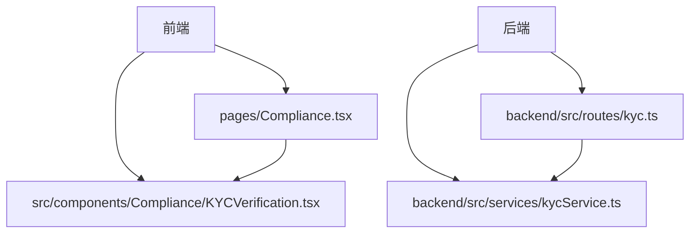
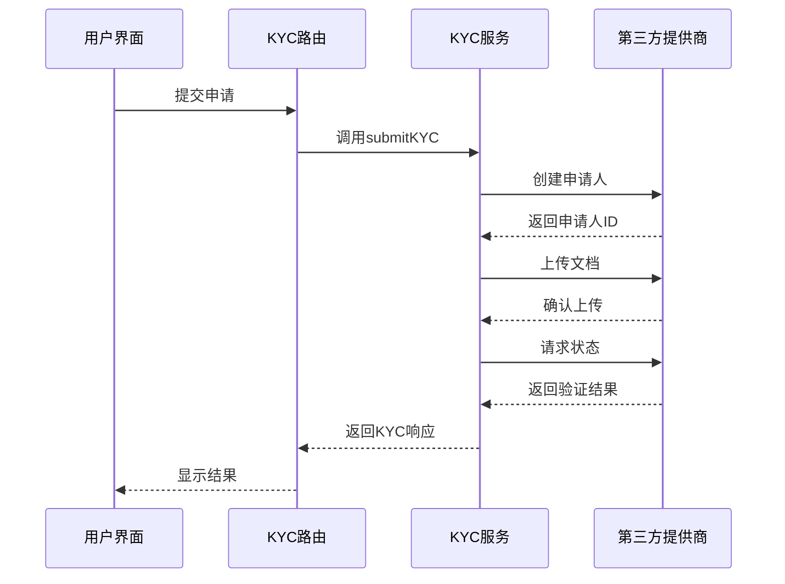
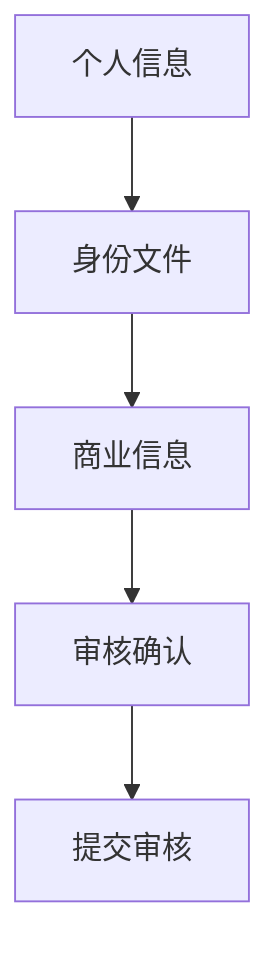
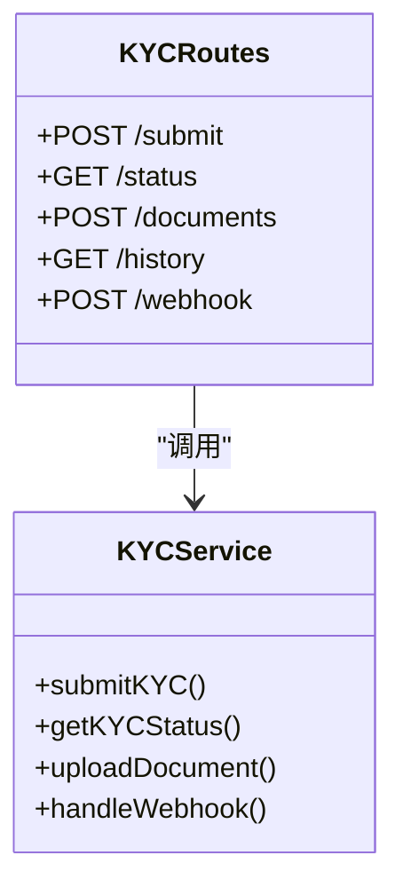
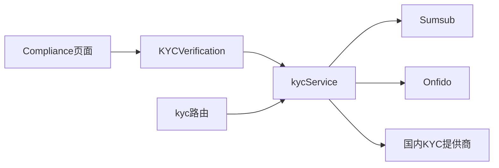

# KYC验证

<cite>
**本文档引用的文件**
- [KYCVerification.tsx](file://src/components/Compliance/KYCVerification.tsx)
- [kycService.ts](file://backend/src/services/kycService.ts)
- [kyc.ts](file://backend/src/routes/kyc.ts)
- [Compliance.tsx](file://src/pages/Compliance.tsx)
</cite>

## 目录
1. [项目结构](#项目结构)
2. [核心组件](#核心组件)
3. [架构概述](#架构概述)
4. [详细组件分析](#详细组件分析)
5. [依赖分析](#依赖分析)
6. [性能考虑](#性能考虑)
7. [故障排除指南](#故障排除指南)
8. [结论](#结论)

## 项目结构

**图示来源**
- [Compliance.tsx](file://src/pages/Compliance.tsx)
- [KYCVerification.tsx](file://src/components/Compliance/KYCVerification.tsx)
- [kyc.ts](file://backend/src/routes/kyc.ts)
- [kycService.ts](file://backend/src/services/kycService.ts)

**章节来源**
- [Compliance.tsx](file://src/pages/Compliance.tsx)
- [KYCVerification.tsx](file://src/components/Compliance/KYCVerification.tsx)

## 核心组件

KYC验证流程由四个主要步骤组成：个人信息、身份文件、商业信息和审核确认。前端组件KYCVerification.tsx实现了用户界面，包含表单字段、文件上传机制和状态管理。后端服务kycService.ts集成了Sumsub、Onfido和国内KYC提供商，处理申请人创建、文档上传、状态跟踪和风险评估。

**章节来源**
- [KYCVerification.tsx](file://src/components/Compliance/KYCVerification.tsx)
- [kycService.ts](file://backend/src/services/kycService.ts)

## 架构概述

**图示来源**
- [kyc.ts](file://backend/src/routes/kyc.ts)
- [kycService.ts](file://backend/src/services/kycService.ts)

**章节来源**
- [kyc.ts](file://backend/src/routes/kyc.ts)
- [kycService.ts](file://backend/src/services/kycService.ts)

## 详细组件分析

### KYC验证组件分析

#### 四步验证流程

**图示来源**
- [KYCVerification.tsx](file://src/components/Compliance/KYCVerification.tsx)

**章节来源**
- [KYCVerification.tsx](file://src/components/Compliance/KYCVerification.tsx)

#### API端点

**图示来源**
- [kyc.ts](file://backend/src/routes/kyc.ts)
- [kycService.ts](file://backend/src/services/kycService.ts)

**章节来源**
- [kyc.ts](file://backend/src/routes/kyc.ts)
- [kycService.ts](file://backend/src/services/kycService.ts)

## 依赖分析

**图示来源**
- [KYCVerification.tsx](file://src/components/Compliance/KYCVerification.tsx)
- [kycService.ts](file://backend/src/services/kycService.ts)
- [kyc.ts](file://backend/src/routes/kyc.ts)
- [Compliance.tsx](file://src/pages/Compliance.tsx)

**章节来源**
- [KYCVerification.tsx](file://src/components/Compliance/KYCVerification.tsx)
- [kycService.ts](file://backend/src/services/kycService.ts)
- [kyc.ts](file://backend/src/routes/kyc.ts)
- [Compliance.tsx](file://src/pages/Compliance.tsx)

## 性能考虑

系统设计考虑了KYC验证流程的性能优化，包括异步处理文档上传、缓存验证结果和并行调用多个第三方提供商。数据流从用户提交开始，经过后端服务处理，最终到达第三方验证提供商，确保了高效的身份验证过程。

## 故障排除指南

常见问题包括文件上传失败、第三方提供商连接问题和状态同步延迟。建议检查API密钥配置、网络连接和文件格式要求。审核日志记录机制帮助追踪验证流程中的每个步骤，便于调试和合规审计。

**章节来源**
- [kycService.ts](file://backend/src/services/kycService.ts)
- [kyc.ts](file://backend/src/routes/kyc.ts)

## 结论

KYC验证系统实现了从用户界面到后端服务的完整流程，支持多个第三方提供商的集成。系统设计注重GDPR合规性、数据加密存储和审核日志记录，确保了身份验证的安全性和可靠性。