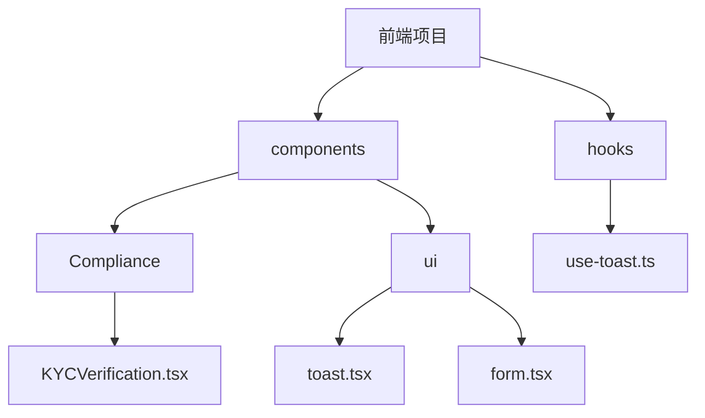
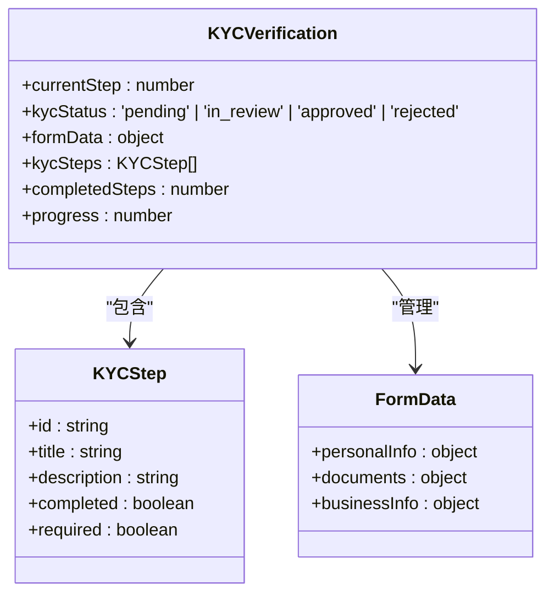
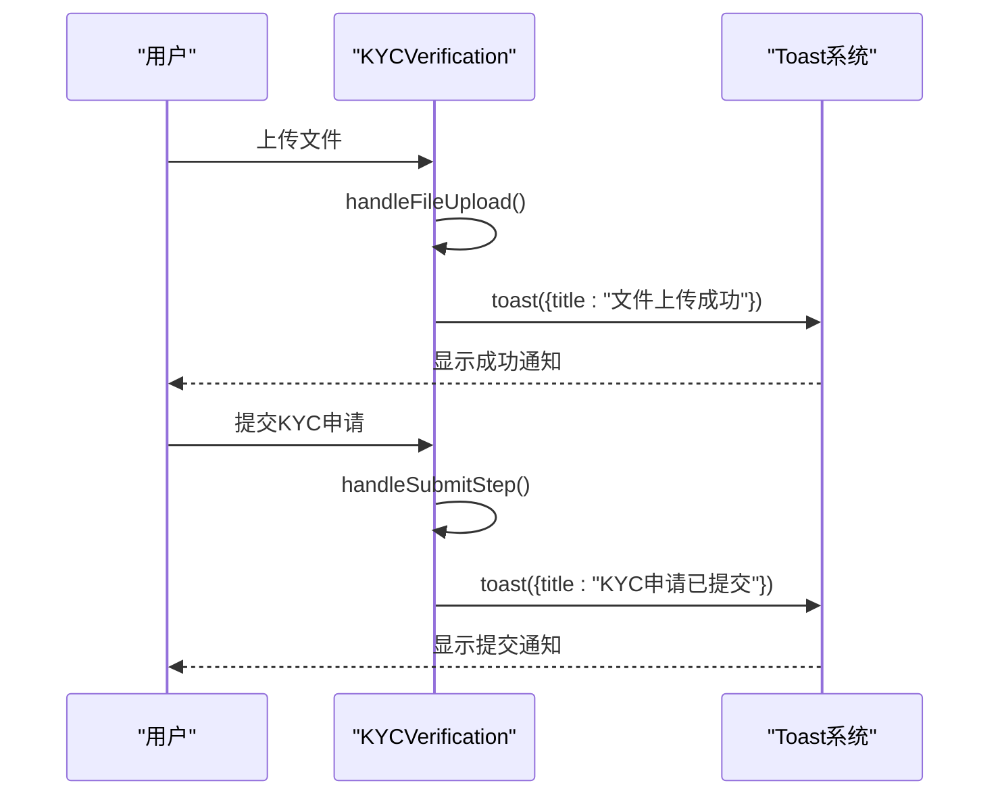
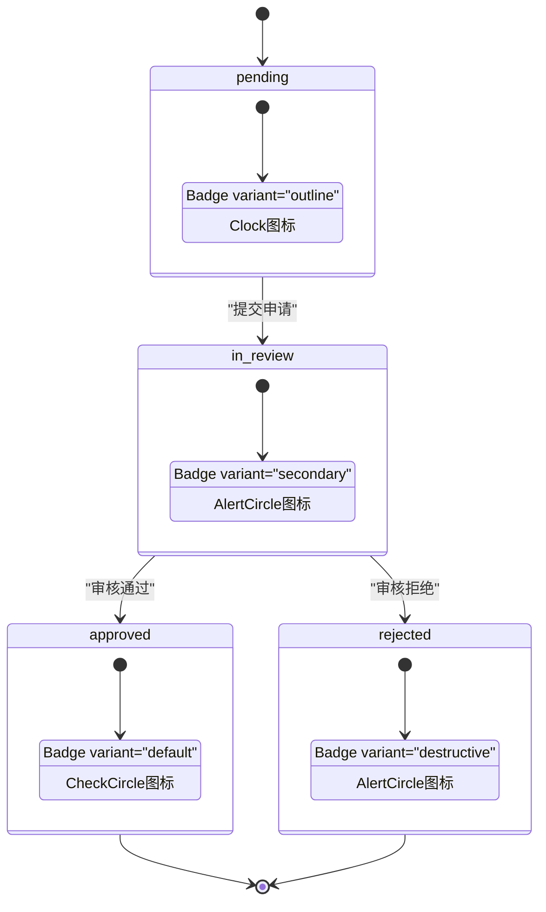

<cite>
**Referenced Files in This Document**   
- [KYCVerification.tsx](file://src/components/Compliance/KYCVerification.tsx)
- [use-toast.ts](file://src/hooks/use-toast.ts)
- [toast.tsx](file://src/components/ui/toast.tsx)
- [form.tsx](file://src/components/ui/form.tsx)
</cite>

# 前端验证流程

## Table of Contents
1. [项目结构](#项目结构)
2. [核心组件](#核心组件)
3. [四步验证流程](#四步验证流程)
4. [表单验证与状态管理](#表单验证与状态管理)
5. [用户反馈机制](#用户反馈机制)
6. [进度条与步骤导航](#进度条与步骤导航)
7. [KYC状态视觉呈现](#kyc状态视觉呈现)
8. [数据收集与处理](#数据收集与处理)

## 项目结构



**Diagram sources**
- [KYCVerification.tsx](file://src/components/Compliance/KYCVerification.tsx)
- [toast.tsx](file://src/components/ui/toast.tsx)
- [use-toast.ts](file://src/hooks/use-toast.ts)

**Section sources**
- [KYCVerification.tsx](file://src/components/Compliance/KYCVerification.tsx)
- [use-toast.ts](file://src/hooks/use-toast.ts)

## 核心组件

KYC验证组件实现了完整的四步验证流程，包括个人信息、身份文件、商业信息和审核确认。组件使用React函数式组件和Hooks进行状态管理，通过useState管理当前步骤、KYC状态和表单数据。

**Section sources**
- [KYCVerification.tsx](file://src/components/Compliance/KYCVerification.tsx#L0-L519)

## 四步验证流程

### 个人信息步骤
个人信息步骤收集用户的基本身份信息，包括姓名、出生日期、国籍、电话号码和居住地址。该步骤使用Input、Select和Textarea等UI组件构建表单，所有字段均为必填项。

**Section sources**
- [KYCVerification.tsx](file://src/components/Compliance/KYCVerification.tsx#L112-L178)

### 身份文件步骤
身份文件步骤提供文件上传功能，允许用户上传身份证明文件、地址证明文件和自拍照片。每个文件上传区域包含上传按钮、文件格式说明和上传状态指示。

**Section sources**
- [KYCVerification.tsx](file://src/components/Compliance/KYCVerification.tsx#L180-L258)

### 商业信息步骤
商业信息步骤收集企业用户的相关信息，包括公司名称、业务类型、工商注册号和公司地址。此步骤为可选步骤，仅在用户需要提供商业信息时显示。

**Section sources**
- [KYCVerification.tsx](file://src/components/Compliance/KYCVerification.tsx#L260-L310)

### 审核确认步骤
审核确认步骤展示用户提交的所有信息供最终确认，包括个人信息摘要、文件上传状态和商业信息（如提供）。用户在此步骤可以检查所有信息的准确性。

**Section sources**
- [KYCVerification.tsx](file://src/components/Compliance/KYCVerification.tsx#L312-L376)

## 表单验证与状态管理

### React Hook Form集成
组件虽然未直接使用React Hook Form的useForm钩子，但通过自定义状态管理实现了类似功能。表单数据存储在formData状态中，通过setFormData函数进行更新。



**Diagram sources**
- [KYCVerification.tsx](file://src/components/Compliance/KYCVerification.tsx#L48-L110)

### 状态管理策略
组件使用多个useState钩子管理不同方面的状态：currentStep跟踪当前验证步骤，kycStatus表示整体KYC状态，formData存储所有表单数据。这种分离的状态管理方式提高了代码的可维护性。

**Section sources**
- [KYCVerification.tsx](file://src/components/Compliance/KYCVerification.tsx#L21-L46)

## 用户反馈机制

### Toast组件集成
组件通过useToast钩子集成Toast通知系统，为用户提供即时反馈。文件上传成功和KYC申请提交时会显示相应的Toast通知。



**Diagram sources**
- [KYCVerification.tsx](file://src/components/Compliance/KYCVerification.tsx#L90-L108)
- [use-toast.ts](file://src/hooks/use-toast.ts#L0-L186)

### 反馈实现细节
Toast系统基于Radix UI的Toast组件构建，提供一致的用户体验。useToast钩子管理Toast状态，允许组件在不同位置触发通知。

**Section sources**
- [use-toast.ts](file://src/hooks/use-toast.ts#L0-L186)
- [toast.tsx](file://src/components/ui/toast.tsx#L0-L111)

## 进度条与步骤导航

### 进度条实现
进度条根据已完成步骤的数量动态计算完成百分比，使用Progress组件可视化显示验证进度。

```mermaid
flowchart TD
A[开始] --> B[计算completedSteps]
B --> C[计算progress = (completedSteps / totalSteps) * 100]
C --> D[更新Progress组件]
D --> E[显示进度]
```

**Section sources**
- [KYCVerification.tsx](file://src/components/Compliance/KYCVerification.tsx#L80-L82)

### 步骤导航逻辑
步骤导航通过映射kycSteps数组实现，每个步骤显示圆形指示器，已完成步骤显示勾选图标，当前步骤高亮显示，未完成步骤显示步骤编号。

**Section sources**
- [KYCVerification.tsx](file://src/components/Compliance/KYCVerification.tsx#L448-L481)

## KYC状态视觉呈现

### 状态徽章实现
组件根据kycStatus状态值渲染不同的Badge组件，使用不同颜色和图标表示待提交、审核中、已通过和已拒绝四种状态。



**Diagram sources**
- [KYCVerification.tsx](file://src/components/Compliance/KYCVerification.tsx#L425-L446)

## 数据收集与处理

### 表单数据结构
组件使用嵌套的对象结构组织表单数据，分为personalInfo、documents和businessInfo三个主要部分，便于数据管理和提交。

**Section sources**
- [KYCVerification.tsx](file://src/components/Compliance/KYCVerification.tsx#L25-L44)

### 用户交互处理
组件通过handleSubmitStep函数处理步骤提交，更新步骤完成状态，导航到下一步或提交KYC申请，同时触发相应的用户反馈。

**Section sources**
- [KYCVerification.tsx](file://src/components/Compliance/KYCVerification.tsx#L92-L108)