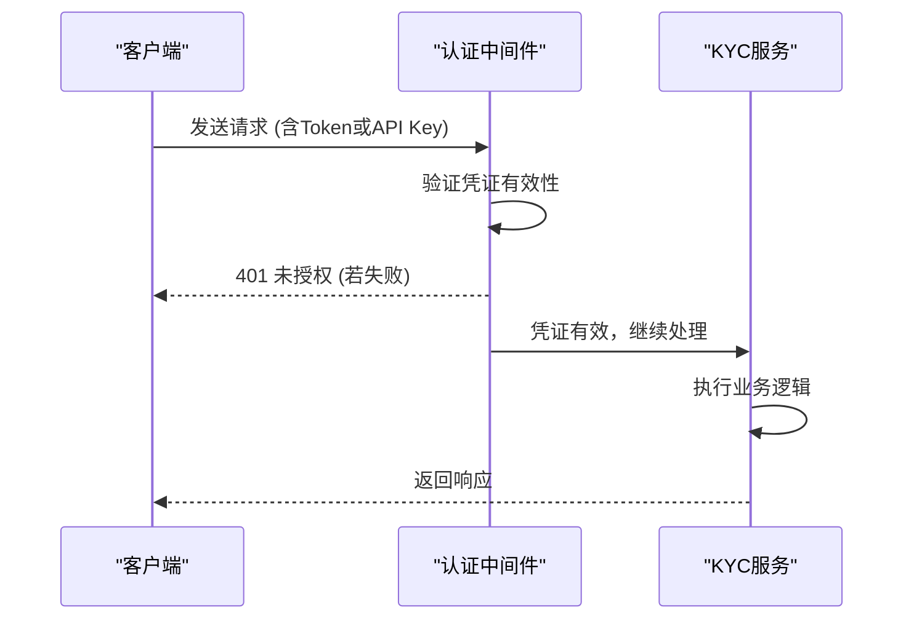
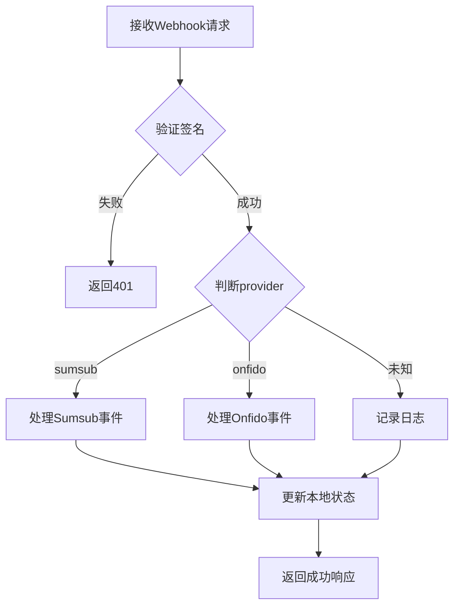

# API端点规范

<cite>
**本文档中引用的文件**  
- [kyc.ts](file://backend/src/routes/kyc.ts)
- [kycService.ts](file://backend/src/services/kycService.ts)
- [auth.ts](file://backend/src/middleware/auth.ts)
- [apiKey.ts](file://backend/src/middleware/apiKey.ts)
</cite>

## 目录
1. [简介](#简介)
2. [认证与安全](#认证与安全)
3. [POST /kyc/submit - 提交KYC申请](#post-kycsubmit---提交kyc申请)
4. [GET /kyc/status - 查询KYC状态](#get-kycstatus---查询kyc状态)
5. [POST /kyc/documents - 上传KYC文档](#post-kycdocuments---上传kyc文档)
6. [GET /kyc/history - 获取KYC历史记录](#get-kychistory---获取kyc历史记录)
7. [POST /kyc/webhook - 处理第三方KYC回调](#post-kycwebhook---处理第三方kyc回调)
8. [错误码说明](#错误码说明)

## 简介
本API文档详细描述了系统中KYC（了解你的客户）模块的所有公开端点。该模块支持与多个第三方KYC提供商（如Sumsub、Onfido和国内合规服务）的集成，用于用户身份验证、反洗钱检查和风险评估。所有端点均需身份验证，并遵循统一的请求/响应格式。

**Section sources**
- [kyc.ts](file://backend/src/routes/kyc.ts#L1-L209)

## 认证与安全
所有KYC相关端点均需要有效的身份验证。系统支持以下两种认证方式：

1. **JWT Bearer Token**：用于用户端请求，通过`Authorization: Bearer <token>`头传递
2. **API Key**：用于服务间通信或管理员操作，通过`X-API-Key`头传递

此外，系统实施速率限制以防止滥用，基于API密钥进行每分钟60次请求的限制。



**Diagram sources**
- [auth.ts](file://backend/src/middleware/auth.ts#L1-L166)
- [apiKey.ts](file://backend/src/middleware/apiKey.ts#L1-L136)

## POST /kyc/submit - 提交KYC申请
用于提交新的KYC身份验证申请。

### 请求详情
- **方法**: POST
- **路径**: `/kyc/submit`
- **认证要求**: JWT Bearer Token
- **内容类型**: `application/json`

### 请求体结构
```json
{
  "personalInfo": {
    "firstName": "张",
    "lastName": "三",
    "dateOfBirth": "1990-01-01",
    "nationality": "CN",
    "address": {
      "country": "CN",
      "state": "北京市",
      "city": "北京市",
      "street": "朝阳区某某街道123号",
      "postalCode": "100000"
    },
    "phoneNumber": "+8613800138000",
    "email": "zhangsan@example.com"
  },
  "documents": [
    {
      "type": "passport",
      "file": "<base64-encoded-file>",
      "fileName": "passport.jpg",
      "mimeType": "image/jpeg"
    }
  ],
  "provider": "sumsub"
}
```

### provider选择机制
可通过可选的`provider`字段指定KYC服务提供商：
- `sumsub`（默认）：国际合规服务
- `onfido`：生物识别身份验证
- `domestic`：国内合规服务

### curl示例
```bash
curl -X POST https://api.example.com/kyc/submit \
  -H "Authorization: Bearer <your-jwt-token>" \
  -H "Content-Type: application/json" \
  -d '{
    "personalInfo": {
      "firstName": "张",
      "lastName": "三",
      "dateOfBirth": "1990-01-01",
      "nationality": "CN",
      "address": {
        "country": "CN",
        "state": "北京市",
        "city": "北京市",
        "street": "朝阳区某某街道123号",
        "postalCode": "100000"
      },
      "phoneNumber": "+8613800138000",
      "email": "zhangsan@example.com"
    },
    "documents": [
      {
        "type": "passport",
        "file": "base64data",
        "fileName": "passport.jpg",
        "mimeType": "image/jpeg"
      }
    ],
    "provider": "sumsub"
  }'
```

### 成功响应 (201 Created)
```json
{
  "success": true,
  "data": {
    "applicationId": "123456789",
    "status": "pending",
    "riskLevel": "medium",
    "confidence": 0.85,
    "documents": [
      {
        "type": "passport",
        "status": "pending",
        "confidence": 0.9
      }
    ],
    "amlCheck": {
      "status": "pending",
      "riskScore": 0,
      "sanctions": false,
      "pep": false,
      "watchlist": false
    },
    "provider": "sumsub",
    "timestamp": "2024-01-01T00:00:00.000Z"
  },
  "message": "KYC申请提交成功"
}
```

### 错误响应
见[错误码说明](#错误码说明)

**Section sources**
- [kyc.ts](file://backend/src/routes/kyc.ts#L4-L45)
- [kycService.ts](file://backend/src/services/kycService.ts#L23-L46)

## GET /kyc/status - 查询KYC状态
用于查询指定KYC申请的状态。

### 请求详情
- **方法**: GET
- **路径**: `/kyc/status`
- **认证要求**: JWT Bearer Token
- **查询参数**:
  - `applicationId` (必需): KYC申请ID
  - `provider` (可选): KYC服务提供商，默认为`sumsub`

### curl示例
```bash
curl -X GET "https://api.example.com/kyc/status?applicationId=123456789&provider=sumsub" \
  -H "Authorization: Bearer <your-jwt-token>"
```

### 成功响应 (200 OK)
```json
{
  "success": true,
  "data": {
    "userId": "user123",
    "status": "verified",
    "level": "full",
    "submittedAt": "2024-01-01T00:00:00.000Z",
    "verifiedAt": "2024-01-02T00:00:00.000Z",
    "documents": [
      {
        "type": "passport",
        "status": "verified",
        "uploadedAt": "2024-01-01T00:00:00.000Z"
      }
    ],
    "provider": "sumsub",
    "limits": {
      "daily": 50000,
      "monthly": 1000000,
      "annual": 5000000
    }
  }
}
```

### 错误响应
见[错误码说明](#错误码说明)

**Section sources**
- [kyc.ts](file://backend/src/routes/kyc.ts#L47-L83)
- [kycService.ts](file://backend/src/services/kycService.ts#L506-L542)

## POST /kyc/documents - 上传KYC文档
处理KYC文档的上传请求。

### 请求详情
- **方法**: POST
- **路径**: `/kyc/documents`
- **认证要求**: JWT Bearer Token
- **内容类型**: `multipart/form-data`

### 请求参数
- `documentType`: 文档类型 (`passport`, `id_card`, `driving_license`, `utility_bill`, `bank_statement`)
- `file`: 文件二进制数据

### curl示例
```bash
curl -X POST https://api.example.com/kyc/documents \
  -H "Authorization: Bearer <your-jwt-token>" \
  -F "documentType=passport" \
  -F "file=@/path/to/passport.jpg"
```

### 成功响应 (201 Created)
```json
{
  "success": true,
  "data": {
    "documentId": "doc123",
    "type": "passport",
    "status": "uploaded",
    "uploadedAt": "2024-01-01T00:00:00.000Z"
  },
  "message": "文档上传成功"
}
```

### 错误响应
见[错误码说明](#错误码说明)

**Section sources**
- [kyc.ts](file://backend/src/routes/kyc.ts#L85-L117)

## GET /kyc/history - 获取KYC历史记录
返回用户的历史KYC验证记录。

### 请求详情
- **方法**: GET
- **路径**: `/kyc/history`
- **认证要求**: JWT Bearer Token

### curl示例
```bash
curl -X GET https://api.example.com/kyc/history \
  -H "Authorization: Bearer <your-jwt-token>"
```

### 成功响应 (200 OK)
```json
{
  "success": true,
  "data": [
    {
      "id": "1",
      "status": "verified",
      "provider": "sumsub",
      "submittedAt": "2024-01-01T00:00:00.000Z",
      "completedAt": "2024-01-02T00:00:00.000Z",
      "notes": "KYC验证成功"
    }
  ]
}
```

### 错误响应
见[错误码说明](#错误码说明)

**Section sources**
- [kyc.ts](file://backend/src/routes/kyc.ts#L119-L147)

## POST /kyc/webhook - 处理第三方KYC回调
处理来自第三方KYC提供商的异步状态更新通知。

### 请求详情
- **方法**: POST
- **路径**: `/kyc/webhook`
- **认证要求**: API Key 或 签名验证
- **内容类型**: `application/json`

### 请求体结构
```json
{
  "provider": "sumsub",
  "event": "applicantReviewed",
  "data": {
    "applicantId": "123456789",
    "reviewStatus": "completed",
    "reviewResult": {
      "reviewAnswer": "RED",
      "rejectLabels": ["document_expired"]
    }
  }
}
```

### 签名验证机制
对于Sumsub等提供商，系统会验证请求签名以确保来源可信。签名基于请求时间戳、HTTP方法、路径和请求体内容使用HMAC-SHA256算法生成。

### 事件处理流程


**Diagram sources**
- [kyc.ts](file://backend/src/routes/kyc.ts#L149-L185)
- [kycService.ts](file://backend/src/services/kycService.ts#L320-L360)

### curl示例
```bash
curl -X POST https://api.example.com/kyc/webhook \
  -H "X-API-Key: <admin-api-key>" \
  -H "Content-Type: application/json" \
  -d '{
    "provider": "sumsub",
    "event": "applicantReviewed",
    "data": {
      "applicantId": "123456789",
      "reviewStatus": "completed"
    }
  }'
```

### 成功响应 (200 OK)
```json
{
  "success": true,
  "message": "Webhook处理成功"
}
```

**Section sources**
- [kyc.ts](file://backend/src/routes/kyc.ts#L149-L185)

## 错误码说明
本节说明各端点可能返回的错误码及其触发条件和处理建议。

| 错误码 | 错误类型 | 触发条件 | 处理建议 |
|--------|----------|----------|----------|
| 400 | 参数错误 | 请求缺少必要字段或格式不正确 | 检查请求体结构，确保所有必需字段存在且格式正确 |
| 401 | 未授权 | 缺少或无效的身份验证凭证 | 确保在请求头中包含有效的JWT Token或API Key |
| 429 | 请求频率超限 | 超过每分钟60次请求限制 | 降低请求频率，或联系管理员申请提高配额 |
| 502 | 第三方服务错误 | 与KYC提供商通信失败 | 重试请求，若持续失败请联系技术支持 |

**Section sources**
- [kyc.ts](file://backend/src/routes/kyc.ts#L1-L209)
- [auth.ts](file://backend/src/middleware/auth.ts#L1-L166)
- [apiKey.ts](file://backend/src/middleware/apiKey.ts#L1-L136)