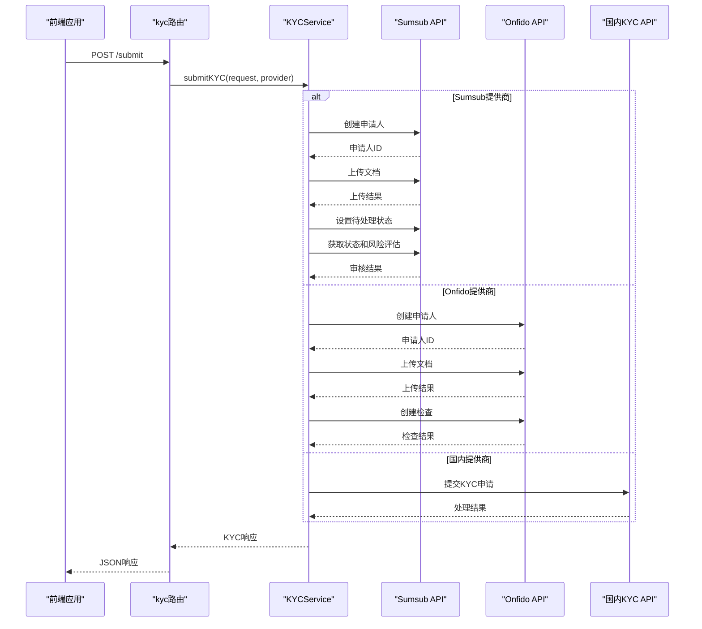
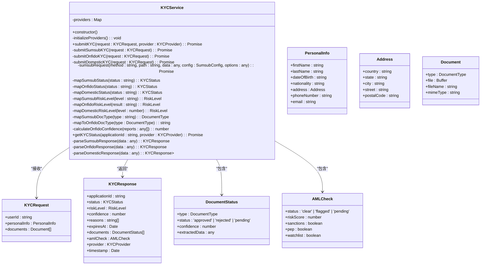
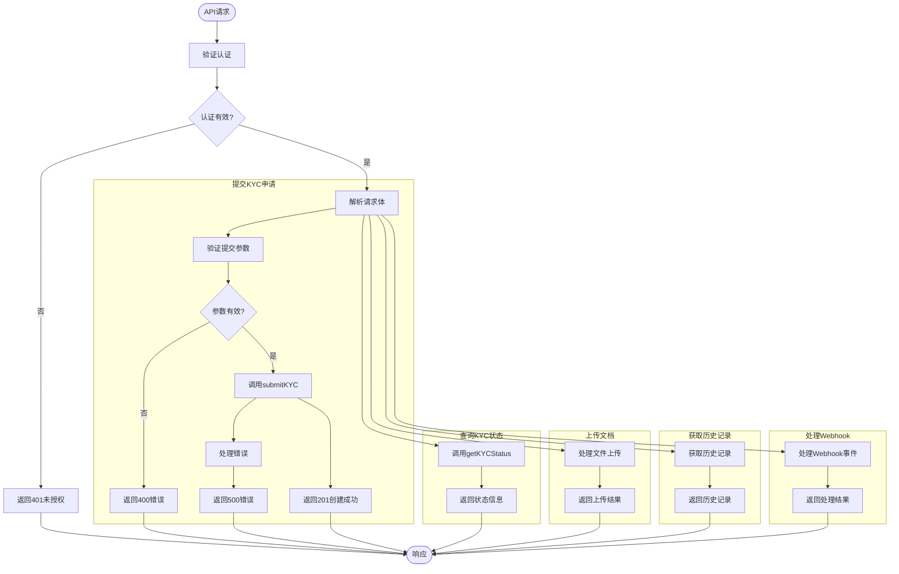
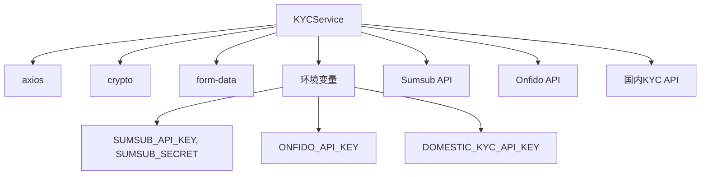

# 后端服务集成

<cite>
**Referenced Files in This Document**  
- [kycService.ts](file://backend/src/services/kycService.ts)
- [kyc.ts](file://backend/src/routes/kyc.ts)
</cite>

## 目录
1. [简介](#简介)
2. [项目结构](#项目结构)
3. [核心组件](#核心组件)
4. [架构概述](#架构概述)
5. [详细组件分析](#详细组件分析)
6. [依赖分析](#依赖分析)
7. [性能考虑](#性能考虑)
8. [故障排除指南](#故障排除指南)
9. [结论](#结论)

## 简介
本文档全面记录了KYC服务的后端实现，重点分析了`kycService`类和`kyc`路由。文档详细说明了KYC服务如何集成Sumsub、Onfido和国内KYC提供商，涵盖申请人创建、文档上传、状态跟踪和风险评估的完整流程。特别关注`submitKYC`方法如何根据不同的提供商执行相应的验证逻辑，以及`sumsubRequest`工具方法如何处理API签名认证。同时，文档化了kyc路由中的API端点（提交申请、状态查询、文档上传、历史记录、webhook处理），包括请求/响应格式、认证机制和错误处理策略，并提供数据流图展示从API请求到第三方服务调用的完整路径。

## 项目结构
KYC服务的实现主要分布在后端服务的`services`和`routes`目录中。`kycService.ts`文件包含了核心的KYC业务逻辑和第三方服务集成，而`kyc.ts`文件则定义了对外暴露的API路由。

```mermaid
graph TD
subgraph "Backend"
subgraph "Services"
KYCService[kycService.ts]
end
subgraph "Routes"
KYCRoutes[kyc.ts]
end
KYCRoutes --> KYCService : "调用"
end
```

**Diagram sources**
- [kycService.ts](file://backend/src/services/kycService.ts)
- [kyc.ts](file://backend/src/routes/kyc.ts)

**Section sources**
- [kycService.ts](file://backend/src/services/kycService.ts)
- [kyc.ts](file://backend/src/routes/kyc.ts)

## 核心组件
核心组件包括`KYCService`类和`kyc`路由。`KYCService`类负责与Sumsub、Onfido和国内KYC提供商的集成，实现了申请人创建、文档上传、状态跟踪和风险评估的完整流程。`kyc`路由则提供了REST API端点，用于处理前端的KYC相关请求。

**Section sources**
- [kycService.ts](file://backend/src/services/kycService.ts)
- [kyc.ts](file://backend/src/routes/kyc.ts)

## 架构概述
KYC服务采用分层架构，将API路由与业务逻辑分离。`kyc`路由接收HTTP请求，进行基本验证后调用`KYCService`类的方法。`KYCService`类根据配置的提供商（Sumsub、Onfido或国内提供商）执行相应的验证逻辑，并通过API调用与第三方服务交互。



**Diagram sources**
- [kycService.ts](file://backend/src/services/kycService.ts)
- [kyc.ts](file://backend/src/routes/kyc.ts)

## 详细组件分析

### KYCService类分析
`KYCService`类是KYC功能的核心实现，负责与多个第三方KYC提供商的集成。它通过策略模式根据配置的提供商选择相应的验证流程。

#### 类结构与关系


**Diagram sources**
- [kycService.ts](file://backend/src/services/kycService.ts)

**Section sources**
- [kycService.ts](file://backend/src/services/kycService.ts)

### kyc路由分析
`kyc`路由定义了KYC服务的API端点，为前端应用提供RESTful接口。

#### API端点流程


**Diagram sources**
- [kyc.ts](file://backend/src/routes/kyc.ts)

**Section sources**
- [kyc.ts](file://backend/src/routes/kyc.ts)

## 依赖分析
KYC服务依赖于多个外部库和环境变量。主要依赖包括axios用于HTTP请求，crypto用于API签名，以及form-data用于文件上传。服务通过环境变量配置不同提供商的API密钥和端点。



**Diagram sources**
- [kycService.ts](file://backend/src/services/kycService.ts)

**Section sources**
- [kycService.ts](file://backend/src/services/kycService.ts)

## 性能考虑
KYC服务在处理文件上传时使用Promise.all并行上传多个文档，提高了处理效率。对于API调用，服务实现了错误处理和重试机制，确保在第三方服务暂时不可用时能够优雅降级。建议在生产环境中添加缓存机制，对频繁查询的KYC状态进行缓存，减少对第三方API的调用频率。

## 故障排除指南
常见问题包括API认证失败、文件上传失败和第三方服务响应超时。检查环境变量配置是否正确，特别是API密钥和密钥。对于文件上传问题，确保请求体中的文件数据格式正确。当遇到第三方服务问题时，查看日志中的错误信息，并根据提供商的文档进行排查。

**Section sources**
- [kycService.ts](file://backend/src/services/kycService.ts)
- [kyc.ts](file://backend/src/routes/kyc.ts)

## 结论
KYC服务成功集成了多个第三方KYC提供商，提供了统一的API接口。通过模块化设计，服务易于扩展新的KYC提供商。未来可以考虑添加更多的错误处理和监控功能，提高系统的可靠性和可维护性。