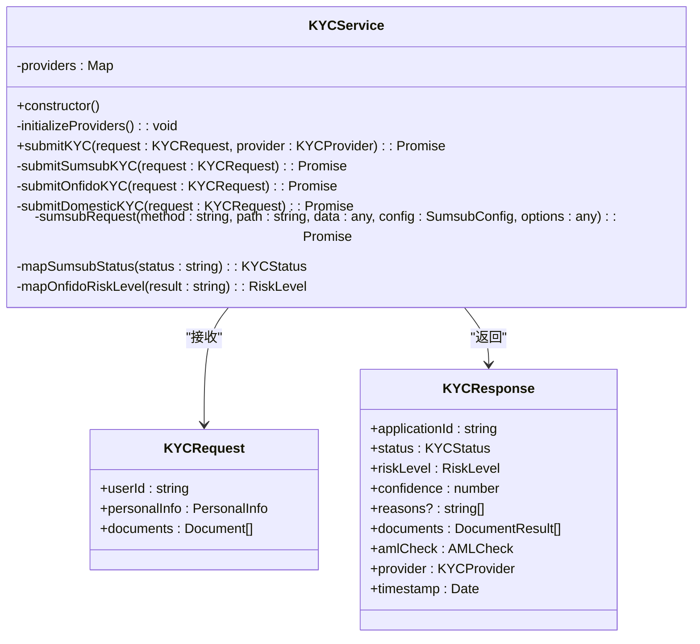
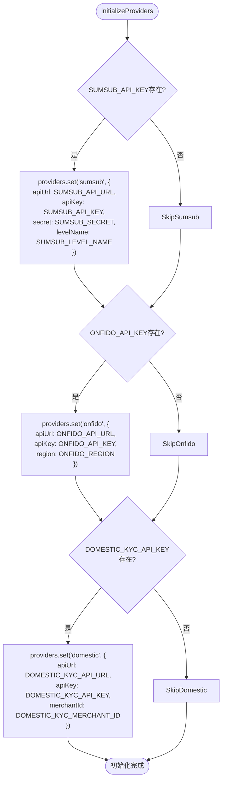
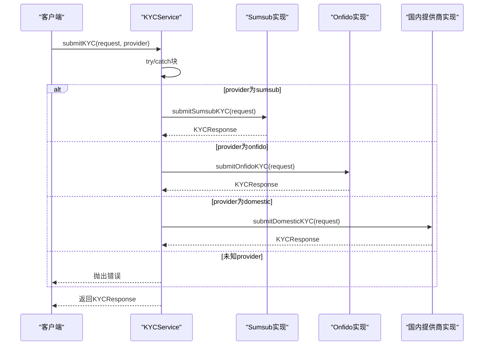
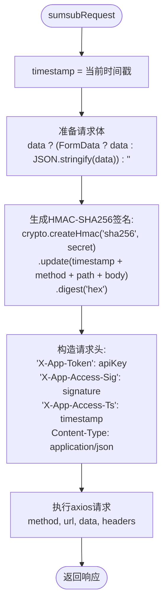
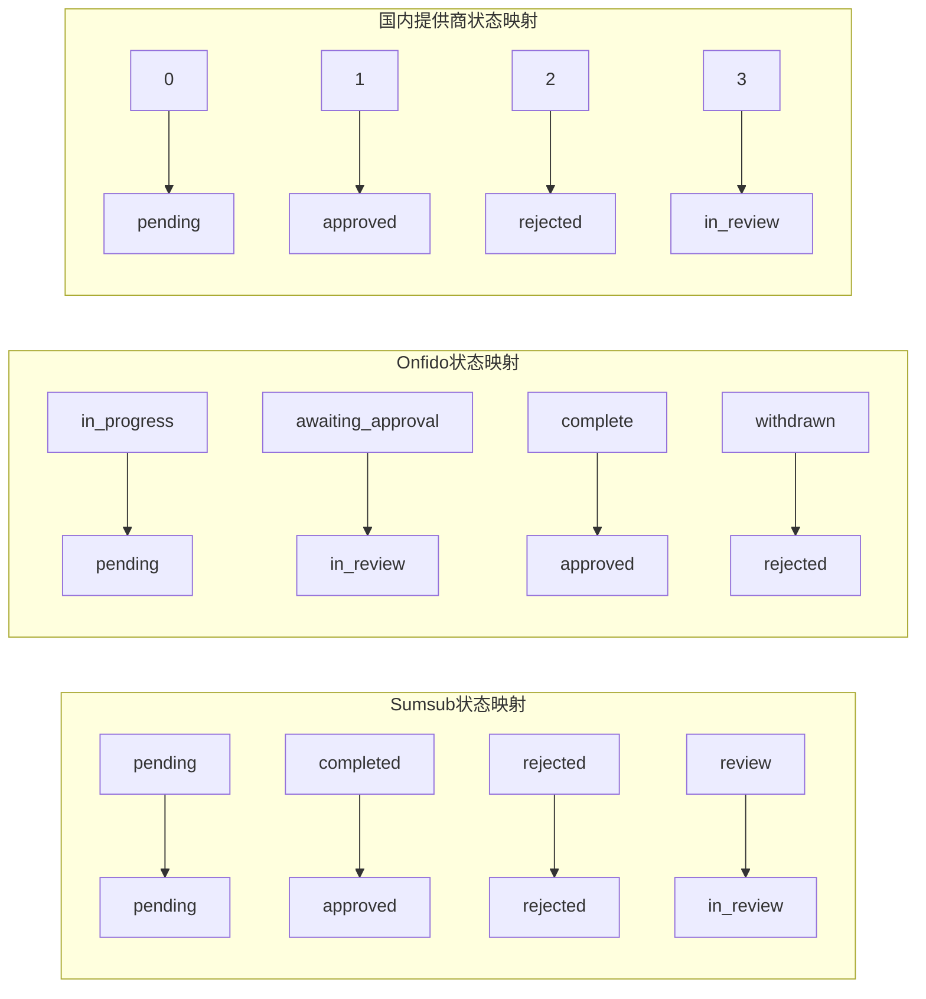
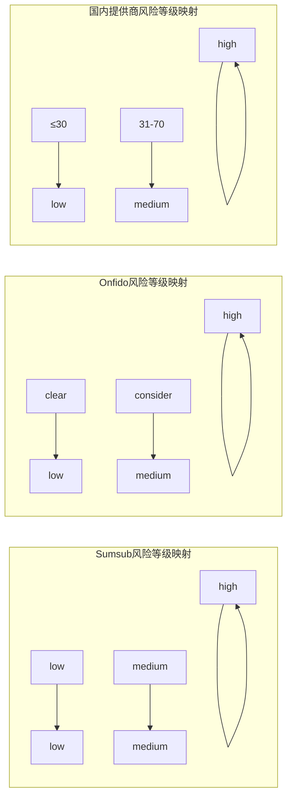

# 核心服务实现

<cite>
**Referenced Files in This Document**  
- [kycService.ts](file://backend/src/services/kycService.ts)
- [kyc.ts](file://backend/src/routes/kyc.ts)
</cite>

## 目录
1. [多提供商集成架构](#多提供商集成架构)
2. [初始化流程](#初始化流程)
3. [主方法控制流](#主方法控制流)
4. [安全实现机制](#安全实现机制)
5. [状态与风险映射](#状态与风险映射)
6. [请求与响应结构](#请求与响应结构)

## 多提供商集成架构

KYCService类实现了多提供商集成架构，支持Sumsub、Onfido和国内KYC提供商的灵活配置。该架构通过Map数据结构存储不同提供商的配置信息，实现了动态路由和可扩展性。



**Diagram sources**
- [kycService.ts](file://backend/src/services/kycService.ts#L95-L559)

**Section sources**
- [kycService.ts](file://backend/src/services/kycService.ts#L95-L559)

## 初始化流程

`initializeProviders`方法根据环境变量动态初始化各KYC提供商的配置。该方法在KYCService构造函数中被调用，确保服务启动时完成提供商配置的加载。



**Diagram sources**
- [kycService.ts](file://backend/src/services/kycService.ts#L102-L130)

**Section sources**
- [kycService.ts](file://backend/src/services/kycService.ts#L102-L130)

## 主方法控制流

`submitKYC`方法是KYC服务的主入口，根据提供的provider参数路由到相应的实现方法。该方法实现了策略模式，通过switch语句选择具体的KYC提供商实现。



**Diagram sources**
- [kycService.ts](file://backend/src/services/kycService.ts#L133-L149)

**Section sources**
- [kycService.ts](file://backend/src/services/kycService.ts#L133-L149)

## 安全实现机制

`sumsubRequest`工具方法实现了基于HMAC-SHA256的安全API调用机制，包含时间戳防重放攻击和请求头构造等安全措施。



**Diagram sources**
- [kycService.ts](file://backend/src/services/kycService.ts#L381-L413)

**Section sources**
- [kycService.ts](file://backend/src/services/kycService.ts#L381-L413)

## 状态与风险映射

KYCService提供了多个映射方法，将不同提供商的原始状态和风险等级转换为统一的内部表示。这些方法确保了多提供商集成的一致性。

### 状态映射逻辑



### 风险等级映射逻辑



**Diagram sources**
- [kycService.ts](file://backend/src/services/kycService.ts#L416-L424)
- [kycService.ts](file://backend/src/services/kycService.ts#L456-L463)

**Section sources**
- [kycService.ts](file://backend/src/services/kycService.ts#L416-L463)

## 请求与响应结构

### KYC请求对象构造

```typescript
const kycRequest: KYCRequest = {
  userId: "user_123",
  personalInfo: {
    firstName: "张",
    lastName: "三",
    dateOfBirth: "1990-01-01",
    nationality: "CN",
    address: {
      country: "CN",
      state: "北京市",
      city: "北京市",
      street: "朝阳区某某街道123号",
      postalCode: "100000"
    },
    phoneNumber: "+8613800138000",
    email: "zhangsan@example.com"
  },
  documents: [
    {
      type: "id_card",
      file: Buffer.from("..."), // 身份证文件二进制数据
      fileName: "id_card.jpg",
      mimeType: "image/jpeg"
    }
  ]
};
```

### KYC响应对象解析

```typescript
// 响应解析示例
const response: KYCResponse = {
  applicationId: "app_456",
  status: "approved",
  riskLevel: "low",
  confidence: 0.95,
  reasons: [],
  documents: [
    {
      type: "id_card",
      status: "approved",
      confidence: 0.98,
      extractedData: {
        name: "张三",
        idNumber: "110101199001011234",
        expiryDate: "2030-01-01"
      }
    }
  ],
  amlCheck: {
    status: "clear",
    riskScore: 15,
    sanctions: false,
    pep: false,
    watchlist: false
  },
  provider: "sumsub",
  timestamp: new Date()
};
```

**Section sources**
- [kycService.ts](file://backend/src/services/kycService.ts#L23-L71)