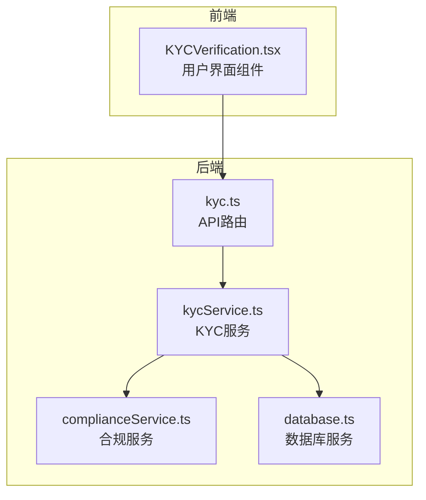
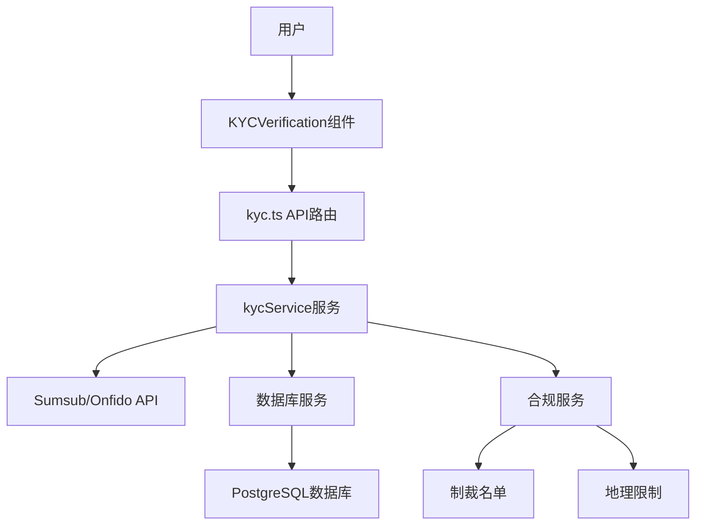
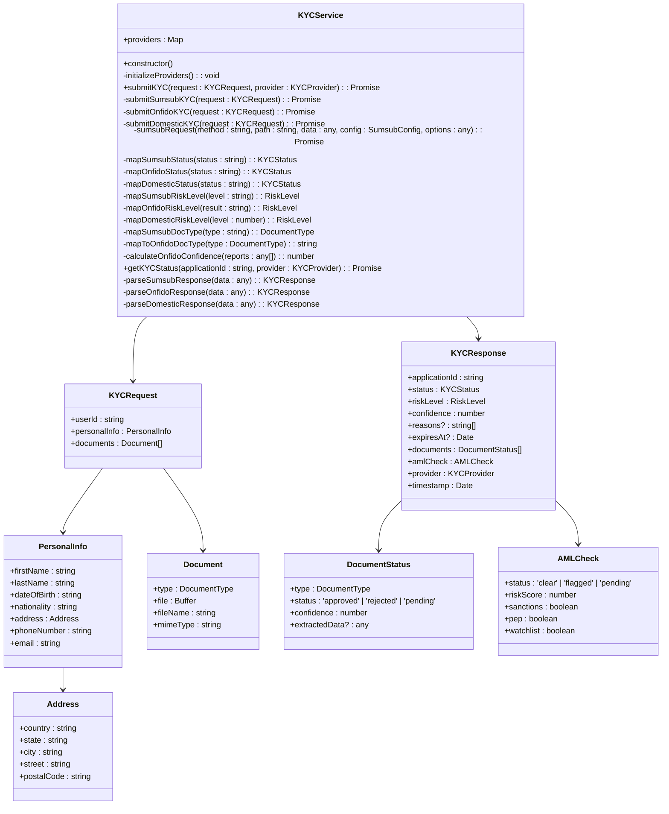
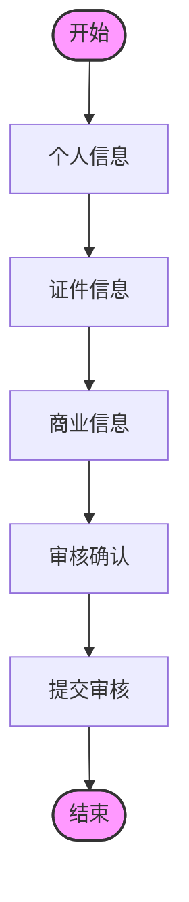
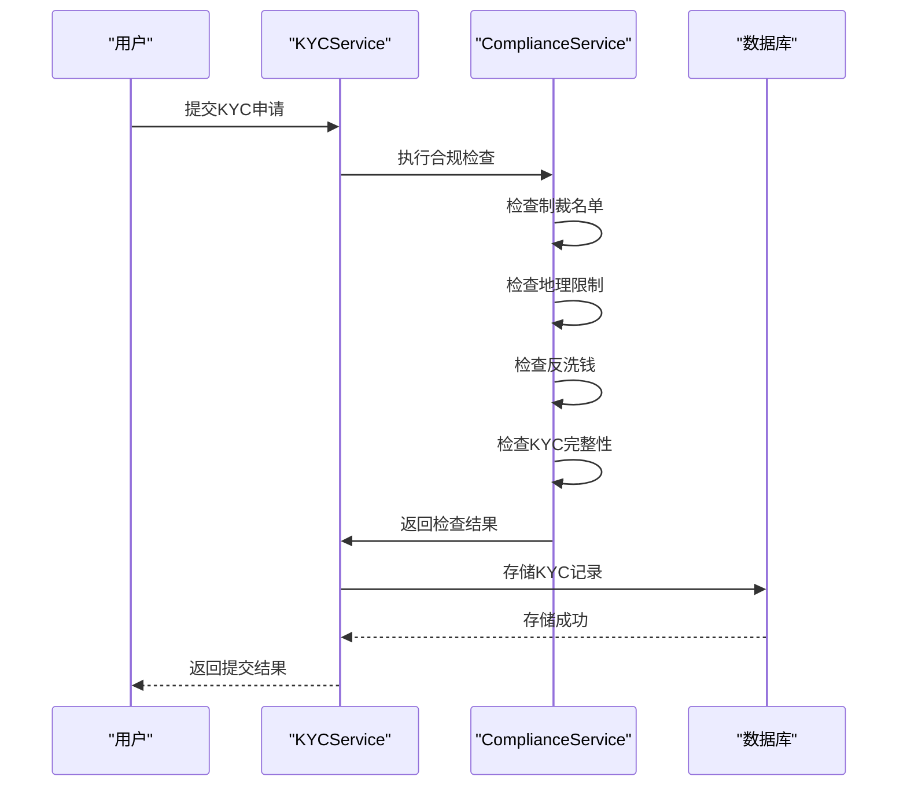
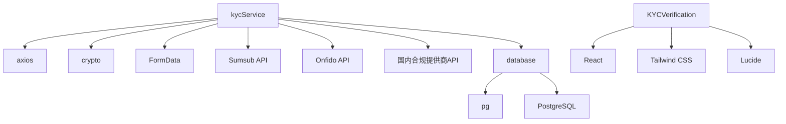

# KYC验证流程

<cite>
**本文档引用的文件**   
- [kycService.ts](file://backend/src/services/kycService.ts)
- [kyc.ts](file://backend/src/routes/kyc.ts)
- [KYCVerification.tsx](file://src/components/Compliance/KYCVerification.tsx)
- [complianceService.ts](file://backend/src/services/complianceService.ts)
- [database.ts](file://backend/src/services/database.ts)
</cite>

## 目录
1. [简介](#简介)
2. [项目结构](#项目结构)
3. [核心组件](#核心组件)
4. [架构概述](#架构概述)
5. [详细组件分析](#详细组件分析)
6. [依赖分析](#依赖分析)
7. [性能考虑](#性能考虑)
8. [故障排除指南](#故障排除指南)
9. [结论](#结论)
10. [附录](#附录)（如有必要）

## 简介
本文档深入文档化KYC验证流程的完整实现，涵盖用户身份信息提交、证件上传、生物特征识别集成方案（支持Sumsub或Onfido）、验证状态机设计。详细说明kycService中的身份验证逻辑，包括文档真实性校验、活体检测回调处理和人工复核机制。描述前端KYCVerification组件的用户引导流程、多步骤表单设计、实时进度反馈和错误处理策略。提供与后端API的交互示例，包括请求参数、响应结构和错误码。解释KYC数据加密存储、访问权限控制及GDPR合规措施。包含常见验证失败原因分析与解决方案。

## 项目结构
本项目采用前后端分离架构，前端位于`src`目录，后端位于`backend/src`目录。KYC相关功能主要分布在前端`src/components/Compliance/KYCVerification.tsx`组件和后端`backend/src/services/kycService.ts`服务中。后端通过`backend/src/routes/kyc.ts`路由文件暴露API接口，前端通过调用这些API与后端交互。数据库表结构在`backend/src/services/database.ts`中定义，包括用户表、KYC记录表等。

**图示来源**
- [kycService.ts](file://backend/src/services/kycService.ts)
- [kyc.ts](file://backend/src/routes/kyc.ts)
- [KYCVerification.tsx](file://src/components/Compliance/KYCVerification.tsx)

**本节来源**
- [kycService.ts](file://backend/src/services/kycService.ts)
- [kyc.ts](file://backend/src/routes/kyc.ts)
- [KYCVerification.tsx](file://src/components/Compliance/KYCVerification.tsx)

## 核心组件
KYC验证流程的核心组件包括前端的KYCVerification组件和后端的kycService服务。前端组件负责用户界面展示和用户交互，后端服务负责与第三方KYC提供商（如Sumsub、Onfido）集成，执行身份验证逻辑，并将结果存储在数据库中。状态管理通过多步骤表单实现，用户可以逐步提交个人信息、证件信息和商业信息。验证状态通过状态机管理，包括待提交、审核中、已通过和已拒绝等状态。

**本节来源**
- [kycService.ts](file://backend/src/services/kycService.ts)
- [KYCVerification.tsx](file://src/components/Compliance/KYCVerification.tsx)

## 架构概述
KYC验证流程采用分层架构，前端负责用户界面和用户交互，后端服务负责业务逻辑处理和第三方服务集成。前端通过API调用与后端通信，后端服务处理请求并调用相应的第三方KYC提供商API。验证结果存储在PostgreSQL数据库中，通过数据库服务进行持久化。合规服务负责执行制裁名单检查、地理限制检查和反洗钱检查，确保符合监管要求。

**图示来源**
- [kycService.ts](file://backend/src/services/kycService.ts)
- [kyc.ts](file://backend/src/routes/kyc.ts)
- [complianceService.ts](file://backend/src/services/complianceService.ts)

## 详细组件分析
### KYC服务分析
kycService服务是KYC验证流程的核心，负责与第三方KYC提供商集成。服务支持Sumsub、Onfido和国内合规提供商，通过环境变量配置提供商信息。服务提供提交KYC申请、获取KYC状态、处理webhook事件等方法。提交KYC申请时，服务会创建申请人、上传文档并启动验证流程。获取KYC状态时，服务会查询第三方提供商的API并返回结果。webhook事件处理用于接收第三方提供商的状态更新。

#### KYC服务类图

**图示来源**
- [kycService.ts](file://backend/src/services/kycService.ts)

### KYC验证组件分析
KYCVerification组件是前端用户界面的核心，负责引导用户完成KYC验证流程。组件采用多步骤表单设计，包括个人信息、证件信息、商业信息和审核确认四个步骤。每个步骤完成后，用户可以进入下一步，所有步骤完成后提交审核。组件提供实时进度反馈，显示已完成步骤和总进度。错误处理策略包括表单验证和Toast通知，确保用户能够及时了解提交状态。

#### KYC验证组件流程图

**图示来源**
- [KYCVerification.tsx](file://src/components/Compliance/KYCVerification.tsx)

### 合规服务分析
合规服务负责执行多层次合规检查，包括制裁名单检查、地理限制检查、反洗钱检查和KYC完整性检查。服务通过事件发射器模式通知其他组件检查结果。检查结果包括风险评分、风险等级、标记和建议。风险等级根据风险评分确定，包括低、中、高和关键四个等级。建议根据具体标记生成，如制裁名单匹配需要进行详细核查，高风险国家需要进行地理位置验证。

#### 合规检查序列图

**图示来源**
- [complianceService.ts](file://backend/src/services/complianceService.ts)
- [kycService.ts](file://backend/src/services/kycService.ts)

**本节来源**
- [kycService.ts](file://backend/src/services/kycService.ts)
- [KYCVerification.tsx](file://src/components/Compliance/KYCVerification.tsx)
- [complianceService.ts](file://backend/src/services/complianceService.ts)

## 依赖分析
KYC验证流程依赖多个外部服务和库。后端依赖axios进行HTTP请求，crypto进行签名计算，FormData处理文件上传。第三方KYC提供商包括Sumsub、Onfido和国内合规提供商，通过API密钥和密钥进行身份验证。数据库依赖PostgreSQL，通过pg库进行连接和查询。前端依赖React、Tailwind CSS和Lucide图标库。环境变量用于配置提供商信息和数据库连接。

**图示来源**
- [kycService.ts](file://backend/src/services/kycService.ts)
- [database.ts](file://backend/src/services/database.ts)
- [KYCVerification.tsx](file://src/components/Compliance/KYCVerification.tsx)

**本节来源**
- [kycService.ts](file://backend/src/services/kycService.ts)
- [database.ts](file://backend/src/services/database.ts)
- [KYCVerification.tsx](file://src/components/Compliance/KYCVerification.tsx)

## 性能考虑
KYC验证流程的性能主要受第三方KYC提供商API响应时间和数据库查询性能影响。为提高性能，建议使用连接池管理数据库连接，缓存频繁查询的结果，异步处理文件上传和验证。第三方API调用应设置超时和重试机制，避免因网络问题导致请求失败。前端应优化用户界面，减少不必要的渲染，提高用户体验。

## 故障排除指南
常见验证失败原因包括：缺少必要参数、文件格式不支持、文件大小超过限制、第三方API密钥无效、网络连接问题。解决方案包括：检查请求参数是否完整，确保文件格式为JPG、PNG或PDF，文件大小不超过5MB，检查环境变量中的API密钥是否正确，确保网络连接正常。错误处理策略包括返回详细的错误信息，记录日志以便排查问题。

**本节来源**
- [kycService.ts](file://backend/src/services/kycService.ts)
- [kyc.ts](file://backend/src/routes/kyc.ts)

## 结论
KYC验证流程通过前后端分离架构实现，前端负责用户界面和用户交互，后端负责业务逻辑处理和第三方服务集成。流程支持多步骤表单、实时进度反馈和错误处理，确保用户能够顺利完成KYC验证。通过与Sumsub、Onfido等第三方提供商集成，实现高效的生物特征识别和文档真实性校验。合规服务确保符合监管要求，保护平台和用户的安全。