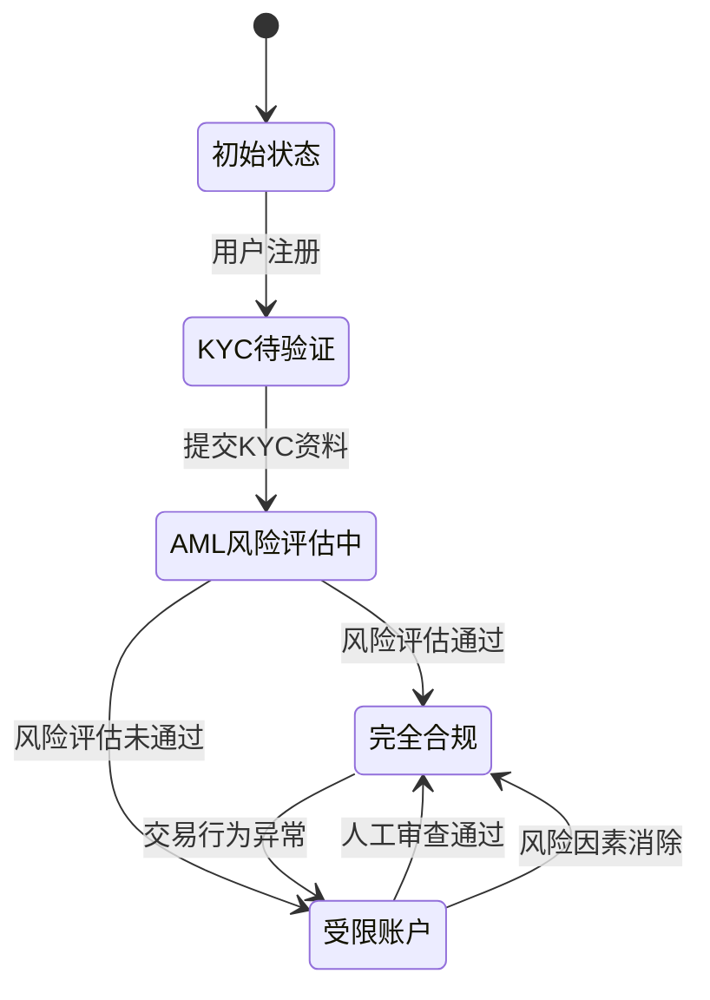
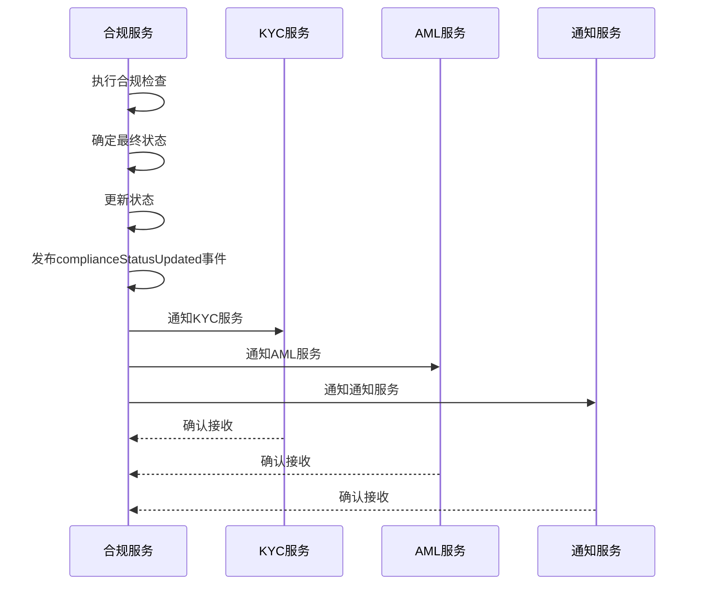
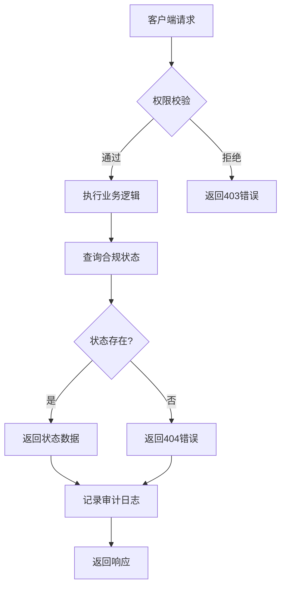
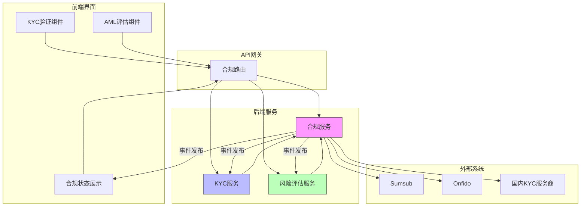

# 合规状态管理

<cite>
**本文档引用文件**   
- [compliance.ts](file://backend/src/routes/compliance.ts)
- [complianceService.ts](file://backend/src/services/complianceService.ts)
- [kycService.ts](file://backend/src/services/kycService.ts)
- [KYCVerification.tsx](file://src/components/Compliance/KYCVerification.tsx)
- [AMLAssessment.tsx](file://src/components/Compliance/AMLAssessment.tsx)
</cite>

## 目录
1. [引言](#引言)
2. [合规状态全生命周期管理机制](#合规状态全生命周期管理机制)
3. [状态机实现逻辑](#状态机实现逻辑)
4. [数据库存储结构与缓存策略](#数据库存储结构与缓存策略)
5. [跨服务同步机制](#跨服务同步机制)
6. [状态变更事件的发布-订阅模式](#状态变更事件的发布-订阅模式)
7. [前端实时响应状态更新](#前端实时响应状态更新)
8. [合规状态查询API设计](#合规状态查询api设计)
9. [异常状态处理与人工干预](#异常状态处理与人工干预)
10. [合规状态管理架构图](#合规状态管理架构图)

## 引言
本系统实现了用户合规状态的全生命周期管理，涵盖从注册初始状态、KYC待验证、AML风险评估中到完全合规或受限账户的转换流程。通过多维度检查机制，包括制裁名单、地理限制、反洗钱模式和KYC完整性，系统能够自动评估用户风险等级并执行相应的状态迁移策略。

**Section sources**
- [complianceService.ts](file://backend/src/services/complianceService.ts#L0-L47)

## 合规状态全生命周期管理机制
系统定义了完整的合规状态生命周期，包括初始注册、KYC验证、AML风险评估、状态升级/降级和最终合规或受限状态。每个状态都有明确的触发条件和迁移规则，确保用户账户状态的准确性和合规性。

### 状态定义
合规状态包含以下核心状态：
- **pending**：待处理状态，用户刚注册或提交资料后
- **approved**：已批准状态，通过所有合规检查
- **rejected**：已拒绝状态，存在严重合规风险
- **requires_review**：需要审查状态，存在中等风险需人工介入

### 状态迁移流程
用户从注册开始，首先处于初始待处理状态。系统会自动触发KYC验证流程，用户需提交身份证明、地址证明等文件。提交后进入审核中状态，系统进行多层次合规检查。根据检查结果，用户状态将自动升级为已批准或降级为需要审查/已拒绝状态。

**Section sources**
- [complianceService.ts](file://backend/src/services/complianceService.ts#L0-L47)
- [KYCVerification.tsx](file://src/components/Compliance/KYCVerification.tsx#L425-L481)

## 状态机实现逻辑
系统采用基于事件驱动的状态机模式实现合规状态管理，通过定义清晰的触发条件、状态迁移规则和自动升级/降级策略来确保状态转换的准确性和一致性。

### 触发条件
合规状态迁移由多种触发条件驱动：
- **资料提交**：用户提交KYC资料时触发验证流程
- **交易行为变化**：大额交易或高频交易触发AML重新评估
- **外部数据更新**：制裁名单更新触发重新检查
- **定期审查**：周期性合规审查触发状态更新

### 状态迁移规则
状态迁移遵循严格的规则体系：
- **自动升级**：当风险评分改善且无重大风险标记时，系统自动升级用户状态
- **自动降级**：当检测到新的风险因素时，系统立即降级用户状态
- **人工干预**：对于需要审查的状态，必须经过人工确认才能最终确定

### 自动升级/降级策略
系统根据风险评分和风险等级自动执行升级/降级策略：
- **风险评分**：综合多个维度的检查结果计算得出（0-100分，0为最高风险）
- **风险等级**：根据评分划分为低、中、高、严重四个等级
- **决策规则**：严重风险直接拒绝，高风险需要人工审查，中低风险自动批准

**Diagram sources**
- [complianceService.ts](file://backend/src/services/complianceService.ts#L368-L412)
- [KYCVerification.tsx](file://src/components/Compliance/KYCVerification.tsx#L448-L481)

**Section sources**
- [complianceService.ts](file://backend/src/services/complianceService.ts#L102-L149)
- [complianceService.ts](file://backend/src/services/complianceService.ts#L368-L412)

## 数据库存储结构与缓存策略
系统采用内存存储与持久化存储相结合的方式管理合规状态数据，确保高性能访问的同时保证数据的持久性和一致性。

### 存储结构
合规检查数据在内存中使用Map结构存储，包含以下关键字段：
- **id**：合规检查唯一标识
- **userId**：用户ID
- **transactionId**：关联交易ID
- **checkType**：检查类型（制裁、AML、KYC、地理）
- **status**：当前状态
- **result**：检查结果，包含风险评分、风险等级、风险标记和建议
- **createdAt/updatedAt**：创建和更新时间戳

### 缓存策略
系统采用多层缓存策略：
- **内存缓存**：使用Map结构缓存最近的合规检查结果，提供毫秒级访问性能
- **Redis缓存**：对于频繁访问的用户合规状态，使用Redis进行分布式缓存
- **缓存失效**：当用户资料更新或交易行为变化时，相关缓存自动失效并重新计算

**Section sources**
- [complianceService.ts](file://backend/src/services/complianceService.ts#L44-L458)
- [complianceService.ts](file://backend/src/services/complianceService.ts#L414-L460)

## 跨服务同步机制
合规状态需要在多个服务间保持同步，确保整个系统对用户合规状态的认知一致性。

### 同步方式
系统采用事件驱动的同步机制：
- **事件发布**：当合规状态发生变化时，通过EventEmitter发布状态变更事件
- **事件订阅**：其他服务订阅相关事件，及时更新本地状态
- **最终一致性**：通过异步消息队列确保各服务最终达到状态一致

### 同步场景
主要的跨服务同步场景包括：
- **交易服务**：在执行交易前检查用户合规状态
- **支付服务**：根据合规状态决定是否允许支付操作
- **风控服务**：获取最新合规状态进行风险评估

**Section sources**
- [complianceService.ts](file://backend/src/services/complianceService.ts#L145-L190)
- [complianceService.ts](file://backend/src/services/complianceService.ts#L414-L460)

## 状态变更事件的发布-订阅模式
系统采用标准的发布-订阅模式处理合规状态变更事件，实现松耦合的组件通信。

### 事件类型
系统定义了多种合规相关的事件类型：
- **complianceCheckCompleted**：合规检查完成事件
- **complianceStatusUpdated**：合规状态更新事件
- **kycSubmissionReceived**：KYC提交接收事件
- **amlRiskLevelChanged**：AML风险等级变更事件

### 事件处理流程
1. **事件发布**：合规服务在状态变更时发布相应事件
2. **事件传播**：事件通过EventEmitter机制传播到所有订阅者
3. **事件处理**：各订阅服务根据事件类型执行相应业务逻辑
4. **错误处理**：对于处理失败的事件，系统会记录日志并尝试重试

**Diagram sources**
- [complianceService.ts](file://backend/src/services/complianceService.ts#L145-L190)
- [complianceService.ts](file://backend/src/services/complianceService.ts#L414-L460)

**Section sources**
- [complianceService.ts](file://backend/src/services/complianceService.ts#L145-L190)
- [complianceService.ts](file://backend/src/services/complianceService.ts#L414-L460)

## 前端实时响应状态更新
前端系统通过多种机制实时响应用户合规状态的更新，确保用户界面及时反映最新的合规状态。

### 状态展示
前端通过以下方式展示合规状态：
- **状态徽章**：使用不同颜色的徽章直观显示当前状态（待提交、审核中、已通过、已拒绝）
- **进度指示**：显示KYC验证完成进度
- **风险指标**：展示各项风险评估指标

### 实时更新机制
前端采用轮询和事件通知相结合的方式获取状态更新：
- **定期轮询**：每隔一定时间查询最新合规状态
- **WebSocket通知**：接收实时的状态变更通知
- **页面刷新**：用户手动刷新页面获取最新状态

**Section sources**
- [KYCVerification.tsx](file://src/components/Compliance/KYCVerification.tsx#L425-L481)
- [AMLAssessment.tsx](file://src/components/Compliance/AMLAssessment.tsx#L200-L346)

## 合规状态查询API设计
系统提供了一套完整的合规状态查询API，支持权限校验和审计追踪功能。

### API端点
- **POST /compliance/check**：执行合规检查
- **GET /compliance/check/:checkId**：获取特定合规检查结果
- **GET /compliance/user/:userId/checks**：获取用户所有合规检查
- **PUT /compliance/check/:checkId/status**：更新合规检查状态（手动审查）
- **GET /compliance/statistics**：获取风险统计数据
- **POST /compliance/pre-check**：预检查接口（交易前快速风险评估）

### 权限校验
所有API端点都实施严格的权限校验：
- **身份验证**：验证用户身份和访问令牌
- **角色授权**：根据用户角色确定可访问的API
- **数据权限**：确保用户只能访问自己的合规数据

### 审计追踪
系统记录所有合规相关的操作日志：
- **操作记录**：记录每次状态变更的操作人、时间、原因
- **访问日志**：记录所有API访问请求
- **变更历史**：保存状态变更的完整历史记录

**Diagram sources**
- [compliance.ts](file://backend/src/routes/compliance.ts#L0-L181)
- [complianceService.ts](file://backend/src/services/complianceService.ts#L414-L460)

**Section sources**
- [compliance.ts](file://backend/src/routes/compliance.ts#L0-L181)
- [complianceService.ts](file://backend/src/services/complianceService.ts#L414-L460)

## 异常状态处理与人工干预
系统设计了完善的异常状态处理机制和人工干预接口，确保在自动化系统无法决策时能够及时介入。

### 异常状态处理
当系统检测到异常情况时，采取以下处理策略：
- **立即暂停**：对于严重风险，立即暂停相关交易
- **标记审查**：将需要人工审查的状态标记并通知合规团队
- **临时限制**：对高风险账户实施临时交易限制

### 人工干预接口
系统提供专门的人工干预接口：
- **状态更新API**：允许合规官手动更新检查状态
- **审查备注**：支持添加审查意见和备注
- **紧急操作**：提供紧急阻止或放行交易的功能

**Section sources**
- [compliance.ts](file://backend/src/routes/compliance.ts#L95-L146)
- [complianceService.ts](file://backend/src/services/complianceService.ts#L414-L460)

## 合规状态管理架构图

**Diagram sources**
- [complianceService.ts](file://backend/src/services/complianceService.ts#L44-L458)
- [kycService.ts](file://backend/src/services/kycService.ts#L95-L559)
- [compliance.ts](file://backend/src/routes/compliance.ts#L0-L181)

**Section sources**
- [complianceService.ts](file://backend/src/services/complianceService.ts#L44-L458)
- [kycService.ts](file://backend/src/services/kycService.ts#L95-L559)
- [compliance.ts](file://backend/src/routes/compliance.ts#L0-L181)