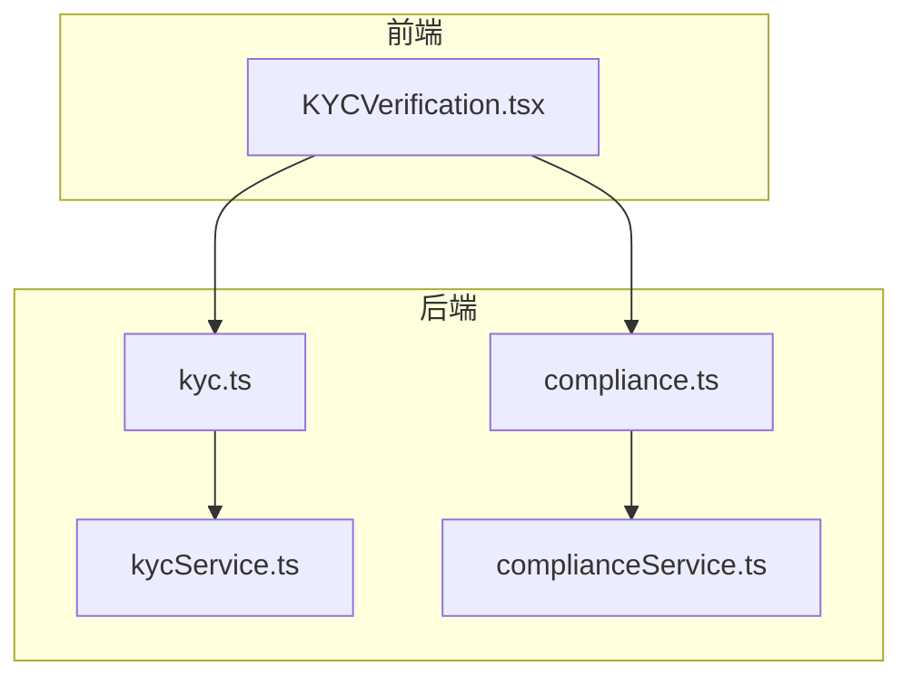
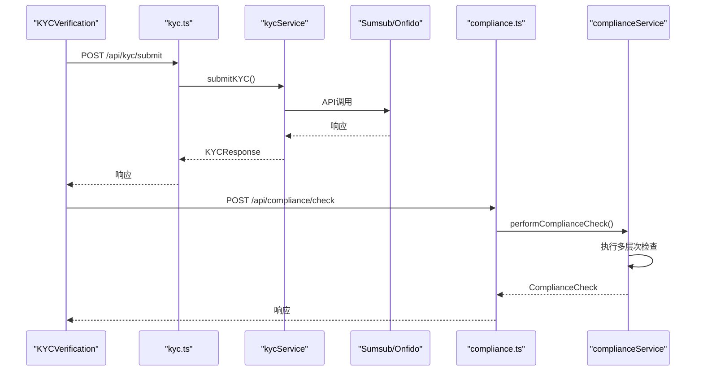
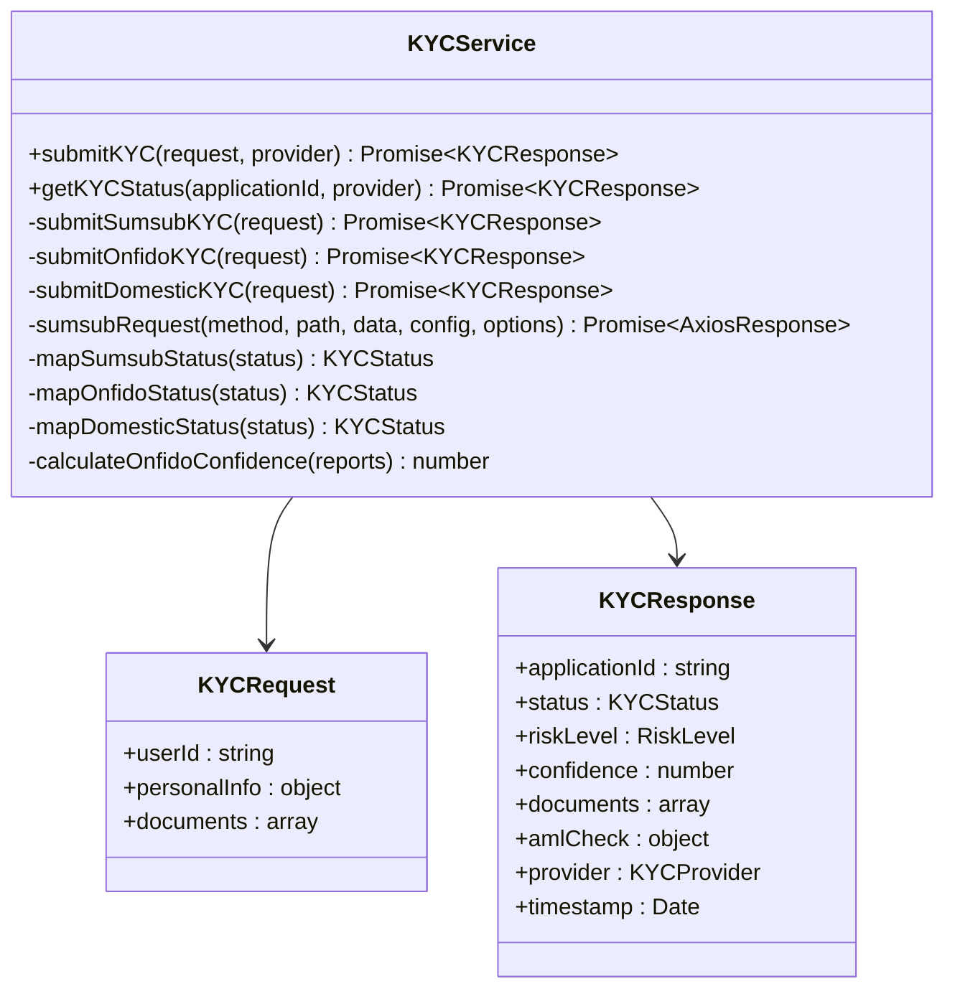
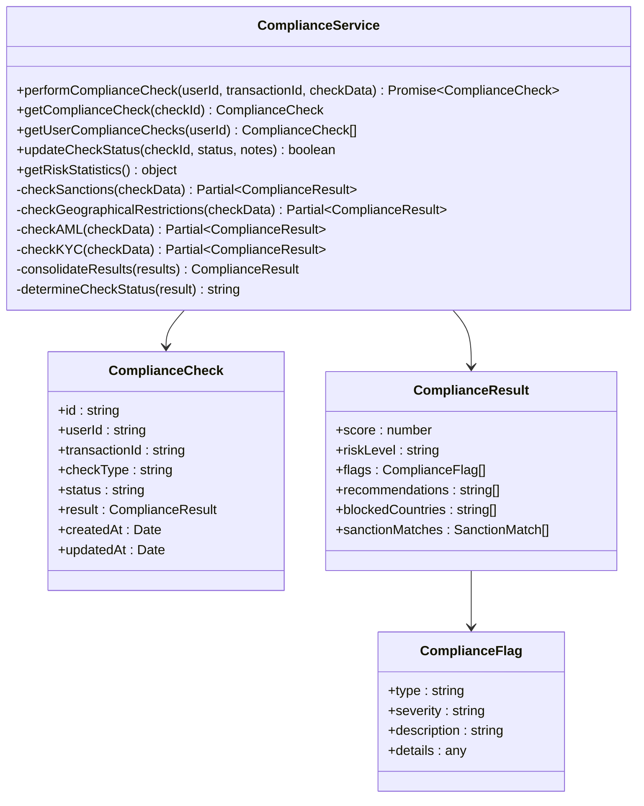
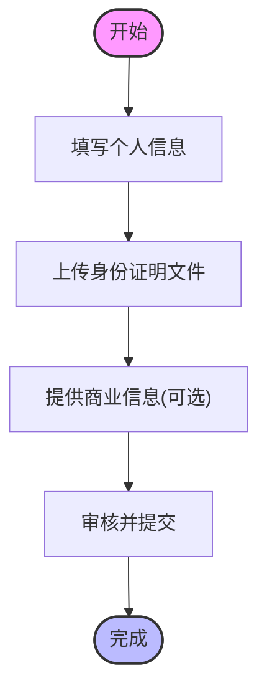
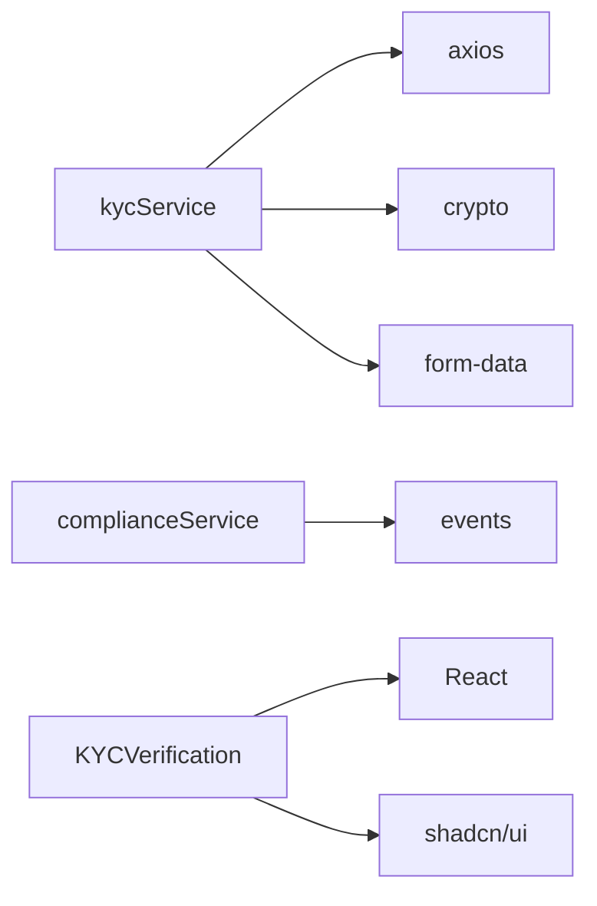

# 合规系统

<cite>
**本文档引用的文件**  
- [kyc.ts](file://backend/src/routes/kyc.ts)
- [kycService.ts](file://backend/src/services/kycService.ts)
- [compliance.ts](file://backend/src/routes/compliance.ts)
- [complianceService.ts](file://backend/src/services/complianceService.ts)
- [KYCVerification.tsx](file://src/components/Compliance/KYCVerification.tsx)
</cite>

## 目录
1. [简介](#简介)
2. [项目结构](#项目结构)
3. [核心组件](#核心组件)
4. [架构概述](#架构概述)
5. [详细组件分析](#详细组件分析)
6. [依赖分析](#依赖分析)
7. [性能考虑](#性能考虑)
8. [故障排除指南](#故障排除指南)
9. [结论](#结论)

## 简介

本技术文档深入分析了KYC/AML合规系统的设计与实现，涵盖用户身份验证流程、文档上传、人脸识别集成、风险等级评估算法等核心功能。系统通过集成Sumsub和Onfido等第三方服务，实现了完整的合规验证流程。反洗钱规则引擎包含交易监控、可疑活动报告生成和制裁名单检查等关键功能。文档详细说明了合规状态的生命周期管理，从待验证到完全合规的转换条件，以及前端KYCVerification组件如何引导用户完成验证流程并实时显示进度。同时，文档还涵盖了合规数据的存储与访问控制策略，确保符合GDPR等隐私法规，并提供了审计日志记录和监管报告生成机制。

## 项目结构

系统采用分层架构设计，后端服务位于`backend/src`目录下，前端组件位于`src/components/Compliance`目录中。后端路由层（`routes`）负责处理HTTP请求，业务服务层（`services`）实现核心逻辑，包括`kycService`和`complianceService`。前端通过`KYCVerification`组件提供用户友好的验证界面。系统通过环境变量配置第三方服务（如Sumsub、Onfido）的API密钥和端点，确保了配置的灵活性和安全性。

**图示来源**
- [kyc.ts](file://backend/src/routes/kyc.ts)
- [compliance.ts](file://backend/src/routes/compliance.ts)
- [kycService.ts](file://backend/src/services/kycService.ts)
- [complianceService.ts](file://backend/src/services/complianceService.ts)
- [KYCVerification.tsx](file://src/components/Compliance/KYCVerification.tsx)

**本节来源**
- [kyc.ts](file://backend/src/routes/kyc.ts)
- [compliance.ts](file://backend/src/routes/compliance.ts)
- [kycService.ts](file://backend/src/services/kycService.ts)
- [complianceService.ts](file://backend/src/services/complianceService.ts)
- [KYCVerification.tsx](file://src/components/Compliance/KYCVerification.tsx)

## 核心组件

系统的核心组件包括`kycService`、`complianceService`和`KYCVerification`组件。`kycService`负责与第三方KYC提供商（如Sumsub、Onfido）集成，处理用户身份验证请求。`complianceService`实现了反洗钱规则引擎，执行多层次的合规检查。`KYCVerification`组件为用户提供交互式验证界面，引导用户完成整个KYC流程。

**本节来源**
- [kycService.ts](file://backend/src/services/kycService.ts)
- [complianceService.ts](file://backend/src/services/complianceService.ts)
- [KYCVerification.tsx](file://src/components/Compliance/KYCVerification.tsx)

## 架构概述

系统采用微服务架构，前端通过REST API与后端通信。`kycService`和`complianceService`作为独立的服务模块，分别处理身份验证和合规检查。系统通过事件驱动架构，当合规检查完成时触发相应的事件处理。数据流从用户界面开始，经过API路由，由相应的服务处理，并与第三方提供商交互，最终将结果返回给前端。

**图示来源**
- [kyc.ts](file://backend/src/routes/kyc.ts)
- [kycService.ts](file://backend/src/services/kycService.ts)
- [compliance.ts](file://backend/src/routes/compliance.ts)
- [complianceService.ts](file://backend/src/services/complianceService.ts)

## 详细组件分析

### KYC服务分析

`kycService`实现了与多个第三方合规服务商的集成，支持Sumsub、Onfido和国内KYC服务。其构造函数通过`initializeProviders`方法读取环境变量中的API密钥和配置，初始化各服务商的客户端。`submitKYC`方法根据指定的provider参数，路由到相应的第三方服务实现KYC申请提交。该服务还实现了签名生成、状态映射和置信度计算等辅助功能，确保与不同服务商的API兼容性。

**图示来源**
- [kycService.ts](file://backend/src/services/kycService.ts)

**本节来源**
- [kycService.ts](file://backend/src/services/kycService.ts)

### 合规服务分析

`complianceService`是反洗钱规则引擎的核心，执行多层次的合规检查。它包含制裁名单检查、地理限制检查、反洗钱检查和KYC完整性检查。服务通过`performComplianceCheck`方法协调这些检查，并汇总结果生成最终的合规决策。系统内置了OFAC、EU和UN制裁名单，以及高风险国家/地区的限制列表。

**图示来源**
- [complianceService.ts](file://backend/src/services/complianceService.ts)

**本节来源**
- [complianceService.ts](file://backend/src/services/complianceService.ts)

### KYC验证组件分析

`KYCVerification`组件为用户提供了一个分步式的身份验证流程。组件通过状态管理跟踪用户的验证进度，并提供实时反馈。用户界面包含个人信息填写、文件上传和商业信息（如适用）等步骤。组件通过API与后端服务通信，提交验证请求并获取状态更新。

**图示来源**
- [KYCVerification.tsx](file://src/components/Compliance/KYCVerification.tsx)

**本节来源**
- [KYCVerification.tsx](file://src/components/Compliance/KYCVerification.tsx)

## 依赖分析

系统依赖于多个外部服务和库。后端服务依赖于`axios`进行HTTP请求，`crypto`用于签名生成，`form-data`用于文件上传。系统通过环境变量配置第三方服务的API密钥，确保了配置的安全性。前端组件依赖于UI库（如shadcn/ui）和状态管理库（如React useState）。

**图示来源**
- [kycService.ts](file://backend/src/services/kycService.ts)
- [complianceService.ts](file://backend/src/services/complianceService.ts)
- [KYCVerification.tsx](file://src/components/Compliance/KYCVerification.tsx)

**本节来源**
- [kycService.ts](file://backend/src/services/kycService.ts)
- [complianceService.ts](file://backend/src/services/complianceService.ts)
- [KYCVerification.tsx](file://src/components/Compliance/KYCVerification.tsx)

## 性能考虑

系统在设计时考虑了性能优化。`kycService`使用并行处理上传多个文档，提高了处理效率。`complianceService`的检查逻辑被设计为可扩展的，允许添加新的检查规则而不影响现有功能。前端组件使用状态管理优化渲染性能，避免不必要的重渲染。系统还实现了请求速率限制，防止滥用。

## 故障排除指南

常见问题包括API密钥配置错误、第三方服务连接失败和文件上传问题。确保环境变量正确设置，特别是`SUMSUB_API_KEY`、`ONFIDO_API_KEY`等。检查网络连接和防火墙设置，确保能够访问第三方服务的API端点。对于文件上传问题，验证文件大小和格式是否符合要求。

**本节来源**
- [kycService.ts](file://backend/src/services/kycService.ts)
- [complianceService.ts](file://backend/src/services/complianceService.ts)

## 结论

该KYC/AML合规系统设计完善，实现了从用户身份验证到反洗钱检查的完整流程。系统通过模块化设计，确保了各组件的独立性和可维护性。集成多个第三方服务提供了灵活性和可靠性。前端组件提供了用户友好的界面，引导用户顺利完成验证流程。整体架构符合金融合规要求，为跨境支付平台提供了坚实的安全基础。