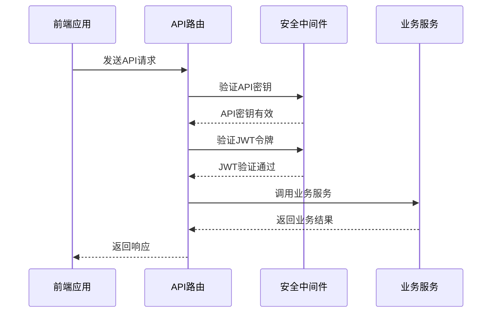
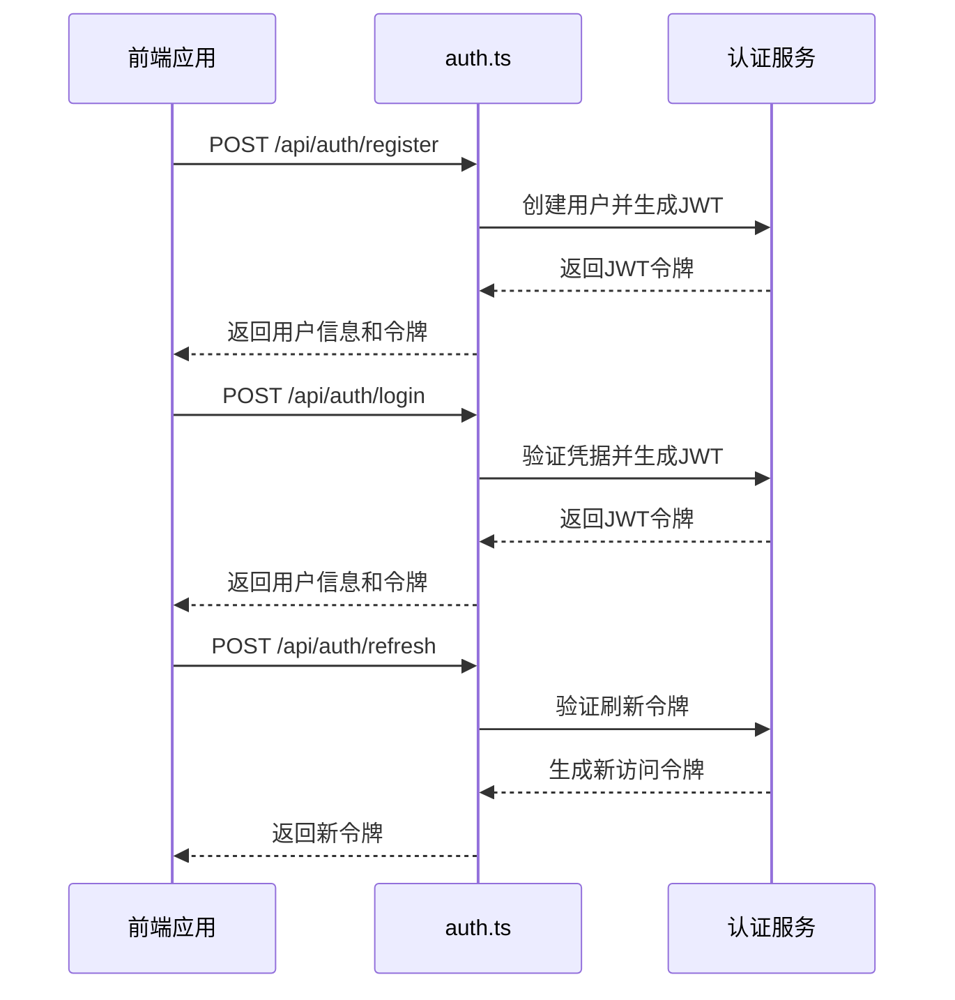
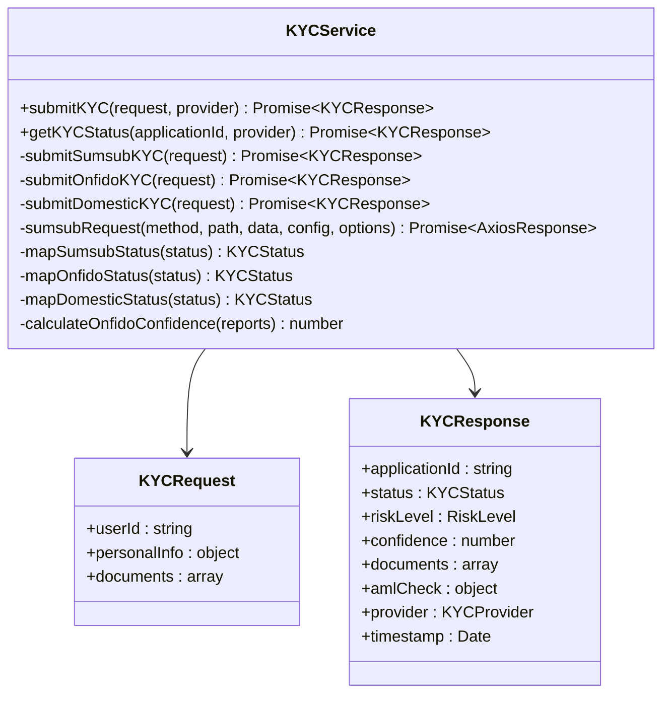
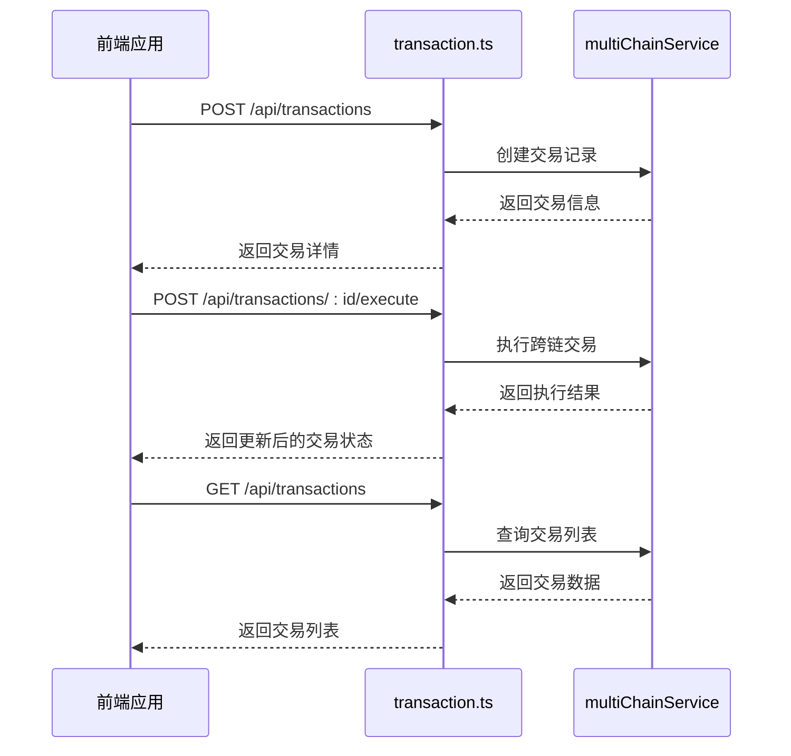
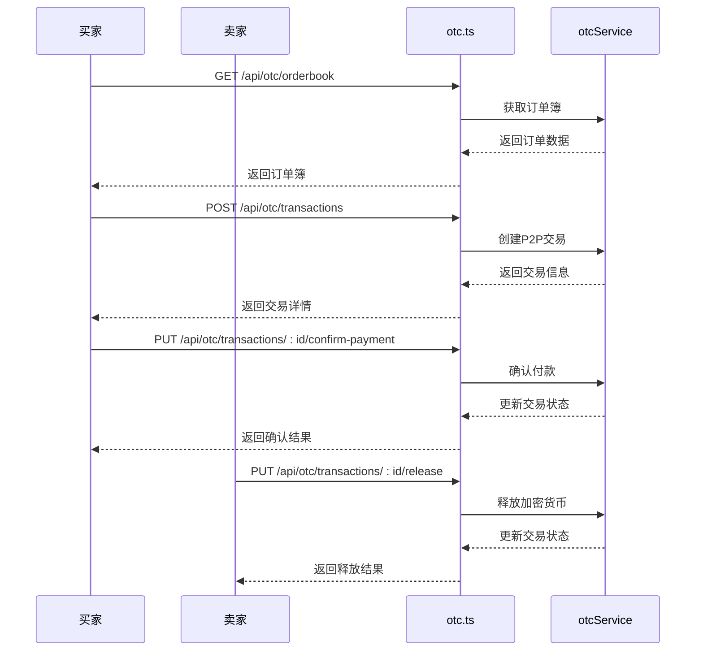
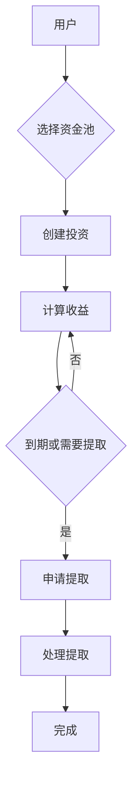
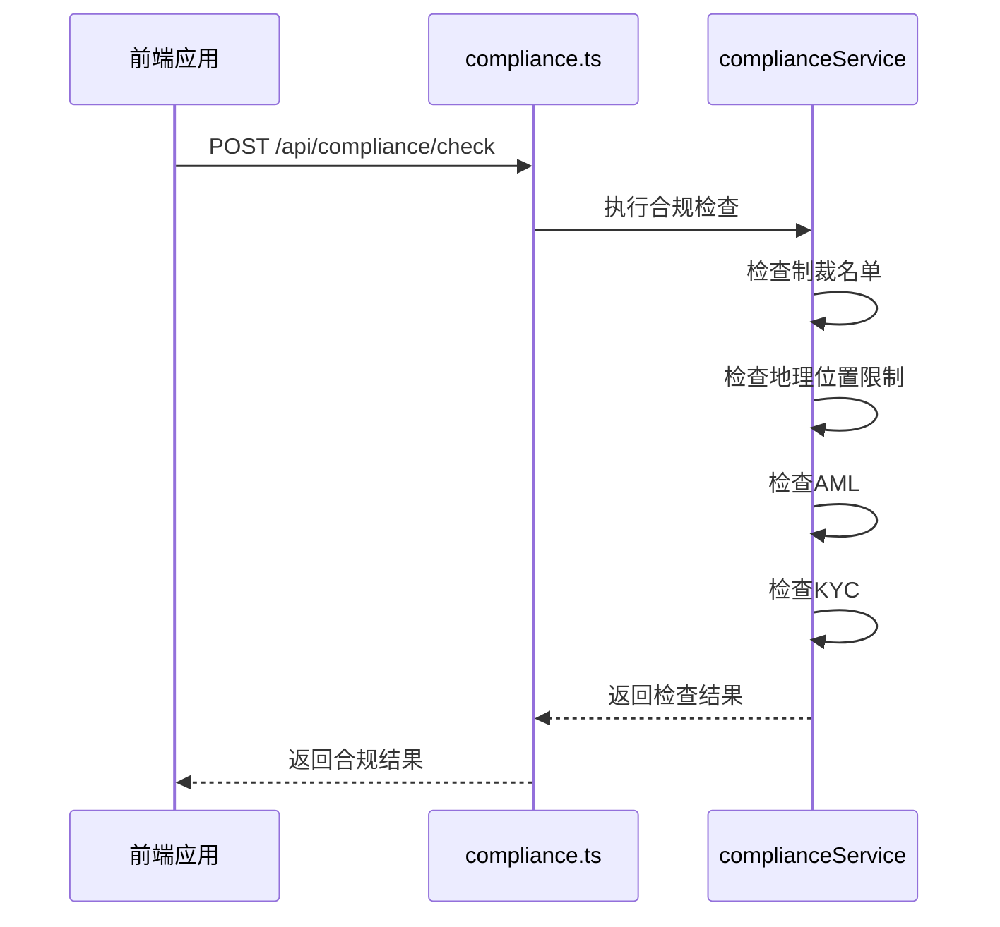
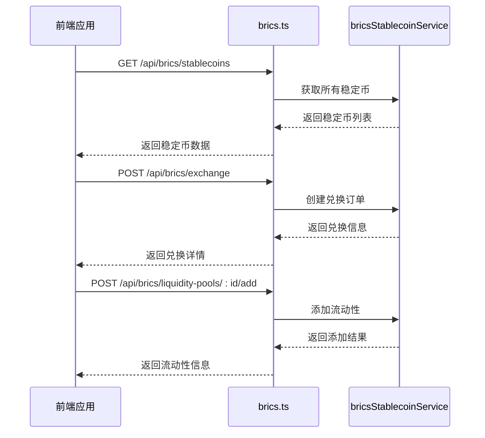
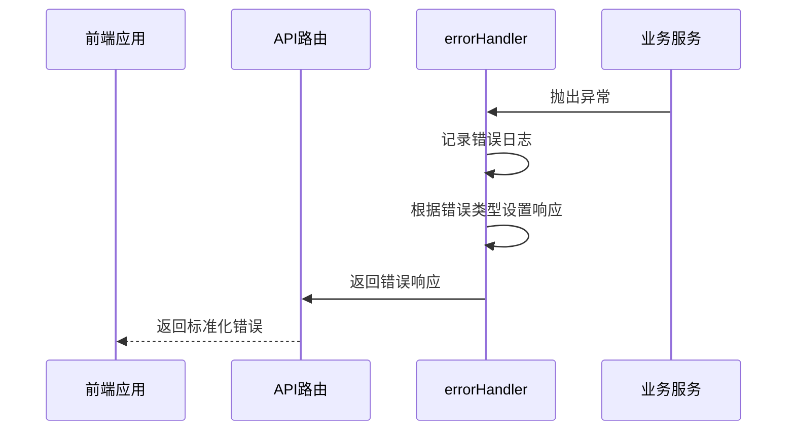

# API路由

<cite>
**本文档引用文件**  
- [auth.ts](file://backend/src/routes/auth.ts)
- [kyc.ts](file://backend/src/routes/kyc.ts)
- [otc.ts](file://backend/src/routes/otc.ts)
- [brics.ts](file://backend/src/routes/brics.ts)
- [compliance.ts](file://backend/src/routes/compliance.ts)
- [liquidityPool.ts](file://backend/src/routes/liquidityPool.ts)
- [transaction.ts](file://backend/src/routes/transaction.ts)
- [user.ts](file://backend/src/routes/user.ts)
- [blockchain.ts](file://backend/src/routes/blockchain.ts)
- [settlement.ts](file://backend/src/routes/settlement.ts)
- [valueAdded.ts](file://backend/src/routes/valueAdded.ts)
- [auth.ts](file://backend/src/middleware/auth.ts)
- [errorHandler.ts](file://backend/src/middleware/errorHandler.ts)
- [kycService.ts](file://backend/src/services/kycService.ts)
- [otcService.ts](file://backend/src/services/otcService.ts)
- [bricsStablecoinService.ts](file://backend/src/services/bricsStablecoinService.ts)
- [complianceService.ts](file://backend/src/services/complianceService.ts)
- [liquidityPoolService.ts](file://backend/src/services/liquidityPoolService.ts)
- [multiChainService.ts](file://backend/src/services/multiChainService.ts)
</cite>

## 目录
1. [简介](#简介)
2. [路由分组与版本控制](#路由分组与版本控制)
3. [安全要求](#安全要求)
4. [错误响应格式](#错误响应格式)
5. [用户认证流程](#用户认证流程)
6. [KYC提交接口](#kyc提交接口)
7. [交易创建与查询](#交易创建与查询)
8. [OTC订单管理](#otc订单管理)
9. [流动性池操作](#流动性池操作)
10. [合规检查接口](#合规检查接口)
11. [BRICS稳定币相关操作](#brics稳定币相关操作)
12. [异常处理流程](#异常处理流程)

## 简介
本项目提供全面的API路由，支持跨境稳定币支付平台的核心功能。API涵盖用户认证、KYC验证、OTC交易、流动性池管理、合规检查和BRICS稳定币操作等关键业务。所有路由均通过统一的错误处理机制和安全验证，确保系统的稳定性和安全性。

## 路由分组与版本控制
API路由按功能模块进行分组，所有端点均位于`/api`前缀下。系统采用扁平化路由结构，通过不同的子路径实现功能分离：

```mermaid
graph TB
A[/api] --> B[/api/auth]
A --> C[/api/user]
A --> D[/api/kyc]
A --> E[/api/transactions]
A --> F[/api/blockchain]
A --> G[/api/settlement]
A --> H[/api/analytics]
A --> I[/api/otc]
A --> J[/api/brics]
A --> K[/api/compliance]
A --> L[/api/liquidityPool]
A --> M[/api/valueAdded]
```

**图示来源**
- [index.ts](file://backend/src/index.ts#L100-L130)

**本节来源**
- [index.ts](file://backend/src/index.ts#L100-L130)

## 安全要求
API路由实施多层次安全验证机制，确保系统安全：



**图示来源**
- [auth.ts](file://backend/src/middleware/auth.ts#L1-L166)
- [apiKey.ts](file://backend/src/middleware/apiKey.ts#L1-L136)

**本节来源**
- [auth.ts](file://backend/src/middleware/auth.ts#L1-L166)
- [apiKey.ts](file://backend/src/middleware/apiKey.ts#L1-L136)

## 错误响应格式
系统采用统一的错误响应格式，便于前端处理和用户理解：

```json
{
  "success": false,
  "error": "错误描述信息",
  "errorCode": "错误代码",
  "timestamp": "2024-01-01T00:00:00.000Z",
  "path": "/api/endpoint",
  "method": "GET"
}
```

在开发环境下，响应还包括堆栈信息和详细错误信息，帮助开发者快速定位问题。

**本节来源**
- [errorHandler.ts](file://backend/src/middleware/errorHandler.ts#L1-L175)

## 用户认证流程
用户认证系统基于JWT（JSON Web Token）实现，包含注册、登录和令牌刷新功能。

### 认证流程


**图示来源**
- [auth.ts](file://backend/src/routes/auth.ts#L4-L156)
- [auth.ts](file://backend/src/middleware/auth.ts#L1-L166)

**本节来源**
- [auth.ts](file://backend/src/routes/auth.ts#L4-L156)

### 认证端点
| HTTP方法 | URL路径 | 描述 | 认证要求 |
|---------|--------|------|---------|
| `POST` | `/api/auth/register` | 用户注册 | 无需认证 |
| `POST` | `/api/auth/login` | 用户登录 | 无需认证 |
| `POST` | `/api/auth/refresh` | 刷新访问令牌 | 需要刷新令牌 |

## KYC提交接口
KYC（了解你的客户）接口负责处理用户身份验证和合规检查，与多个第三方服务集成。

### KYC服务集成


**图示来源**
- [kycService.ts](file://backend/src/services/kycService.ts#L95-L559)

**本节来源**
- [kycService.ts](file://backend/src/services/kycService.ts#L95-L559)

### KYC端点
| HTTP方法 | URL路径 | 描述 | 认证要求 |
|---------|--------|------|---------|
| `POST` | `/api/kyc/submit` | 提交KYC申请 | JWT认证 |
| `GET` | `/api/kyc/status` | 获取KYC状态 | JWT认证 |
| `POST` | `/api/kyc/documents` | 上传KYC文档 | JWT认证 |
| `GET` | `/api/kyc/history` | 获取KYC历史 | JWT认证 |
| `POST` | `/api/kyc/webhook` | KYC服务Webhook | API密钥 |

## 交易创建与查询
交易管理接口支持跨链交易的创建、执行和状态查询。

### 交易流程


**图示来源**
- [transaction.ts](file://backend/src/routes/transaction.ts#L4-L313)
- [multiChainService.ts](file://backend/src/services/multiChainService.ts#L280-L350)

**本节来源**
- [transaction.ts](file://backend/src/routes/transaction.ts#L4-L313)

### 交易端点
| HTTP方法 | URL路径 | 描述 | 认证要求 |
|---------|--------|------|---------|
| `POST` | `/api/transactions` | 创建新交易 | JWT认证 |
| `POST` | `/api/transactions/:id/execute` | 执行交易 | JWT认证 |
| `GET` | `/api/transactions` | 获取交易列表 | JWT认证 |
| `GET` | `/api/transactions/:id` | 获取交易详情 | JWT认证 |
| `POST` | `/api/transactions/:id/cancel` | 取消交易 | JWT认证 |

## OTC订单管理
OTC（场外交易）接口支持订单创建、交易执行和争议处理。

### OTC交易流程


**图示来源**
- [otc.ts](file://backend/src/routes/otc.ts#L4-L427)
- [otcService.ts](file://backend/src/services/otcService.ts#L84-L450)

**本节来源**
- [otc.ts](file://backend/src/routes/otc.ts#L4-L427)

### OTC端点
| HTTP方法 | URL路径 | 描述 | 认证要求 |
|---------|--------|------|---------|
| `GET` | `/api/otc/orderbook` | 获取订单簿 | JWT认证 |
| `POST` | `/api/otc/orders` | 创建OTC订单 | JWT认证 |
| `GET` | `/api/otc/orders/user` | 获取用户订单 | JWT认证 |
| `PUT` | `/api/otc/orders/:id/cancel` | 取消订单 | JWT认证 |
| `POST` | `/api/otc/transactions` | 创建P2P交易 | JWT认证 |
| `GET` | `/api/otc/transactions/:id` | 获取交易详情 | JWT认证 |
| `GET` | `/api/otc/transactions/user/all` | 获取用户交易 | JWT认证 |
| `POST` | `/api/otc/transactions/:id/messages` | 发送聊天消息 | JWT认证 |
| `PUT` | `/api/otc/transactions/:id/confirm-payment` | 确认付款 | JWT认证 |
| `PUT` | `/api/otc/transactions/:id/release` | 释放加密货币 | JWT认证 |
| `PUT` | `/api/otc/transactions/:id/dispute` | 发起争议 | JWT认证 |
| `GET` | `/api/otc/users/:id/credit` | 获取用户信用 | 无需认证 |

## 流动性池操作
流动性池接口支持投资、收益计算和提取请求。

### 投资流程


**图示来源**
- [liquidityPool.ts](file://backend/src/routes/liquidityPool.ts#L4-L434)
- [liquidityPoolService.ts](file://backend/src/services/liquidityPoolService.ts#L90-L686)

**本节来源**
- [liquidityPool.ts](file://backend/src/routes/liquidityPool.ts#L4-L434)

### 流动性池端点
| HTTP方法 | URL路径 | 描述 | 认证要求 |
|---------|--------|------|---------|
| `GET` | `/api/liquidityPool/pools` | 获取所有资金池 | 无需认证 |
| `GET` | `/api/liquidityPool/pools/:id` | 获取资金池详情 | 无需认证 |
| `POST` | `/api/liquidityPool/pools/:id/invest` | 创建投资 | JWT认证 |
| `GET` | `/api/liquidityPool/investments` | 获取用户投资 | JWT认证 |
| `GET` | `/api/liquidityPool/investments/:id/returns` | 获取收益计算 | JWT认证 |
| `POST` | `/api/liquidityPool/investments/:id/withdraw` | 申请提取 | JWT认证 |
| `PUT` | `/api/liquidityPool/withdrawals/:id/process` | 处理提取请求 | JWT认证 |
| `GET` | `/api/liquidityPool/pools/:id/statistics` | 获取资金池统计 | 无需认证 |
| `GET` | `/api/liquidityPool/pools/:id/cashflows` | 获取资金流记录 | 无需认证 |
| `GET` | `/api/liquidityPool/pools/:id/risk-assessment` | 风险评估 | 无需认证 |
| `GET` | `/api/liquidityPool/portfolio/overview` | 投资组合概览 | JWT认证 |

## 合规检查接口
合规检查接口执行多层次的合规性验证，包括制裁名单检查和地理位置限制。

### 合规检查流程


**图示来源**
- [compliance.ts](file://backend/src/routes/compliance.ts#L4-L181)
- [complianceService.ts](file://backend/src/services/complianceService.ts#L44-L458)

**本节来源**
- [compliance.ts](file://backend/src/routes/compliance.ts#L4-L181)

### 合规端点
| HTTP方法 | URL路径 | 描述 | 认证要求 |
|---------|--------|------|---------|
| `POST` | `/api/compliance/check` | 执行合规检查 | JWT认证 |
| `GET` | `/api/compliance/check/:id` | 获取合规检查结果 | JWT认证 |
| `GET` | `/api/compliance/user/:id/checks` | 获取用户合规检查 | JWT认证 |
| `PUT` | `/api/compliance/check/:id/status` | 更新合规状态 | JWT认证 |
| `GET` | `/api/compliance/statistics` | 获取风险统计数据 | JWT认证 |
| `POST` | `/api/compliance/pre-check` | 预检查 | 无需认证 |

## BRICS稳定币相关操作
BRICS稳定币接口支持稳定币兑换、流动性添加和跨境支付估算。

### 稳定币操作流程


**图示来源**
- [brics.ts](file://backend/src/routes/brics.ts#L4-L332)
- [bricsStablecoinService.ts](file://backend/src/services/bricsStablecoinService.ts#L73-L614)

**本节来源**
- [brics.ts](file://backend/src/routes/brics.ts#L4-L332)

### BRICS端点
| HTTP方法 | URL路径 | 描述 | 认证要求 |
|---------|--------|------|---------|
| `GET` | `/api/brics/stablecoins` | 获取所有BRICS稳定币 | 无需认证 |
| `GET` | `/api/brics/stablecoins/:id` | 获取特定稳定币 | 无需认证 |
| `GET` | `/api/brics/exchange-rate/:from/:to` | 计算兑换率 | 无需认证 |
| `POST` | `/api/brics/exchange` | 创建兑换订单 | JWT认证 |
| `GET` | `/api/brics/exchange/:id` | 获取兑换订单状态 | JWT认证 |
| `GET` | `/api/brics/user/:id/exchanges` | 获取用户兑换历史 | JWT认证 |
| `GET` | `/api/brics/liquidity-pools` | 获取流动性池 | 无需认证 |
| `POST` | `/api/brics/liquidity-pools/:id/add` | 添加流动性 | JWT认证 |
| `GET` | `/api/brics/payment-routes` | 获取支付路由 | 无需认证 |
| `POST` | `/api/brics/estimate-payment` | 估算跨境支付 | 无需认证 |
| `GET` | `/api/brics/statistics` | 获取统计数据 | 无需认证 |
| `PUT` | `/api/brics/exchange-rates` | 更新汇率 | 管理员API密钥 |
| `GET` | `/api/brics/network-status` | 获取网络状态 | 无需认证 |

## 异常处理流程
系统采用统一的异常处理机制，确保所有错误都能被正确捕获和处理。

### 错误处理流程


**图示来源**
- [errorHandler.ts](file://backend/src/middleware/errorHandler.ts#L1-L175)

**本节来源**
- [errorHandler.ts](file://backend/src/middleware/errorHandler.ts#L1-L175)

### 错误类型映射
| 错误名称 | HTTP状态码 | 错误代码 | 描述 |
|---------|-----------|---------|------|
| ValidationError | 400 | VALIDATION_ERROR | 请求参数验证失败 |
| UnauthorizedError | 401 | UNAUTHORIZED | 身份验证失败 |
| ForbiddenError | 403 | FORBIDDEN | 权限不足 |
| NotFoundError | 404 | NOT_FOUND | 资源未找到 |
| ConflictError | 409 | CONFLICT | 资源冲突 |
| TooManyRequestsError | 429 | TOO_MANY_REQUESTS | 请求频率超限 |
| 其他错误 | 500 | INTERNAL_SERVER_ERROR | 服务器内部错误 |