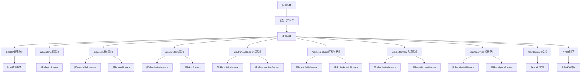
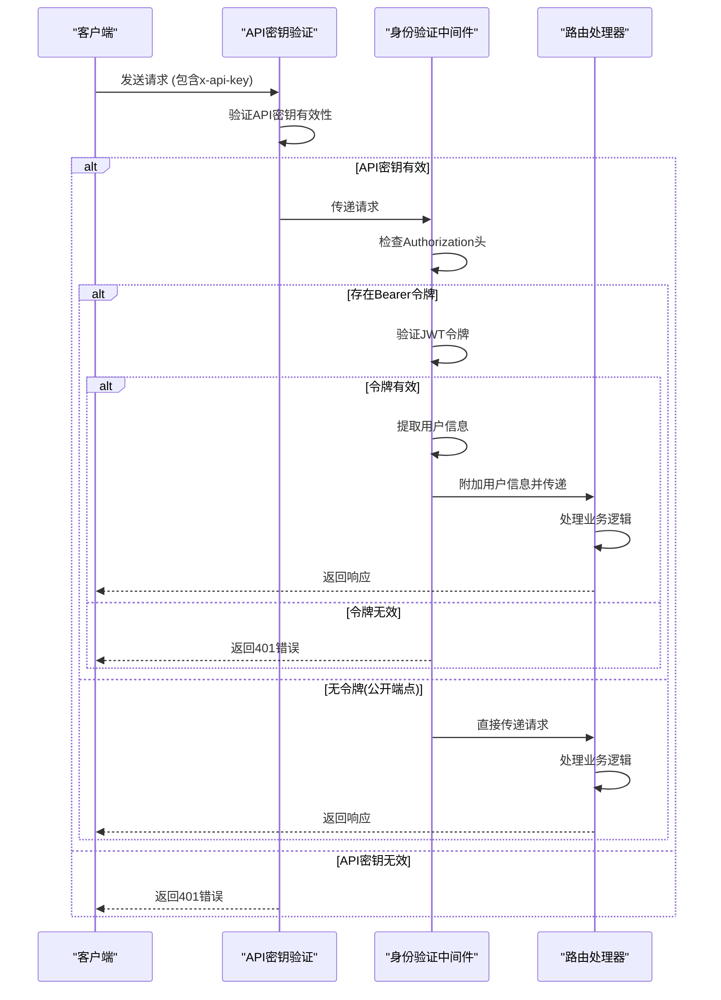

# API路由管理

<cite>
**本文档引用文件**  
- [index.ts](file://backend/src/index.ts)
- [auth.ts](file://backend/src/routes/auth.ts)
- [user.ts](file://backend/src/routes/user.ts)
- [kyc.ts](file://backend/src/routes/kyc.ts)
- [transaction.ts](file://backend/src/routes/transaction.ts)
- [blockchain.ts](file://backend/src/routes/blockchain.ts)
- [settlement.ts](file://backend/src/routes/settlement.ts)
- [analytics.ts](file://backend/src/routes/analytics.ts)
- [auth.ts](file://backend/src/middleware/auth.ts)
- [apiKey.ts](file://backend/src/middleware/apiKey.ts)
- [errorHandler.ts](file://backend/src/middleware/errorHandler.ts)
</cite>

## 目录
1. [简介](#简介)
2. [路由注册机制](#路由注册机制)
3. [认证路由模块](#认证路由模块)
4. [用户路由模块](#用户路由模块)
5. [KYC路由模块](#kyc路由模块)
6. [交易路由模块](#交易路由模块)
7. [区块链路由模块](#区块链路由模块)
8. [结算路由模块](#结算路由模块)
9. [分析路由模块](#分析路由模块)
10. [中间件组合机制](#中间件组合机制)
11. [请求路径映射表](#请求路径映射表)
12. [健康检查与API文档端点](#健康检查与api文档端点)
13. [路由扩展最佳实践](#路由扩展最佳实践)
14. [错误处理机制](#错误处理机制)

## 简介
本系统为跨链稳定币支付平台的后端API服务，提供完整的API路由管理功能。系统基于Express框架构建，通过模块化路由设计实现了七个核心功能模块：认证、用户、KYC、交易、区块链、结算与分析。所有API端点均以`/api`为前缀，通过`index.ts`文件统一注册和管理。系统实现了完整的身份验证机制，包括JWT令牌验证和API密钥验证，确保接口访问的安全性。每个路由模块都经过精心设计，提供了清晰的端点划分和一致的响应格式，支持跨链交易、钱包管理、风险分析等复杂业务场景。

## 路由注册机制
系统在`index.ts`文件中通过模块化方式注册所有路由，采用前缀挂载机制将不同功能模块的路由挂载到特定路径下。每个路由模块作为一个独立的Express Router实例，通过`app.use()`方法挂载到主应用上。这种设计实现了路由的逻辑分离和代码组织的清晰性，便于维护和扩展。路由注册遵循RESTful设计原则，使用标准的HTTP方法（GET、POST、PUT、DELETE）来表示不同的操作类型。系统还实现了统一的错误处理和404处理机制，确保所有未匹配的请求都能得到适当的响应。

**Diagram sources**
- [index.ts](file://backend/src/index.ts#L1-L259)

**Section sources**
- [index.ts](file://backend/src/index.ts#L1-L259)

## 认证路由模块
认证路由模块负责用户的身份验证和令牌管理，提供注册、登录和令牌刷新功能。该模块位于`/api/auth`路径下，包含三个主要端点：`/register`用于用户注册，`/login`用于用户登录，`/refresh`用于刷新访问令牌。所有认证操作都返回标准化的JSON响应，包含成功状态、用户信息和JWT令牌。系统使用bcrypt进行密码加密，确保用户凭证的安全存储。JWT令牌用于后续的受保护路由访问，有效期为24小时。该模块不应用身份验证中间件，因为它是获取访问令牌的入口点。

**Section sources**
- [auth.ts](file://backend/src/routes/auth.ts#L1-L157)

## 用户路由模块
用户路由模块管理用户个人资料和钱包信息，位于`/api/user`路径下。该模块受到`authMiddleware`保护，确保只有经过身份验证的用户才能访问。主要端点包括`/profile`用于获取和更新用户资料，`/wallets`用于管理用户的钱包列表。系统支持添加、查询和删除钱包地址，每个钱包与特定的区块链网络关联。用户资料包含基本信息、KYC状态、偏好设置等。该模块实现了完整的CRUD操作，支持个人信息的读取和更新，同时保护敏感信息不被未授权访问。

**Section sources**
- [user.ts](file://backend/src/routes/user.ts#L1-L198)

## KYC路由模块
KYC路由模块处理用户的合规性验证流程，位于`/api/kyc`路径下。该模块同样受到`authMiddleware`保护，确保只有注册用户才能提交KYC申请。主要功能包括`/submit`用于提交KYC申请，`/status`用于查询KYC验证状态，`/documents`用于上传身份证明文件。系统集成了第三方KYC服务提供商（如Sumsub），并通过`/webhook`端点接收状态更新通知。KYC状态包括待处理、审核中、已验证和已拒绝等，不同状态对应不同的交易限额。该模块还提供历史记录查询功能，让用户了解过去的验证情况。

**Section sources**
- [kyc.ts](file://backend/src/routes/kyc.ts#L1-L210)

## 交易路由模块
交易路由模块是系统的核心功能之一，位于`/api/transactions`路径下。该模块管理所有类型的交易操作，包括跨链转账和同链转账。主要端点包括`/`用于创建新交易，`/:transactionId/execute`用于执行交易，`/:transactionId`用于查询交易详情。系统支持分页查询交易列表，允许用户按状态和类型过滤结果。交易生命周期包括创建、执行、确认和完成等阶段，每个阶段都有相应的时间戳记录。用户还可以取消处于待处理状态的交易。该模块与区块链服务紧密集成，确保交易状态的实时更新。

**Section sources**
- [transaction.ts](file://backend/src/routes/transaction.ts#L1-L314)

## 区块链路由模块
区块链路由模块提供与区块链网络交互的功能，位于`/api/blockchain`路径下。该模块提供区块链信息查询、余额获取、地址验证和费用估算等服务。主要端点包括`/chains`用于获取支持的区块链列表，`/balance/:chainName/:address`用于查询特定地址的代币余额，`/validate-address`用于验证钱包地址格式。系统支持多链环境，包括以太坊、BNB Smart Chain和TRON等主流网络。`/estimate-fee`端点提供交易费用估算，帮助用户预知交易成本。该模块还提供网络状态监控功能，让用户了解各区块链的拥堵情况和确认时间。

**Section sources**
- [blockchain.ts](file://backend/src/routes/blockchain.ts#L1-L294)

## 结算路由模块
结算路由模块处理跨链资产结算业务，位于`/api/settlement`路径下。该模块管理清算订单的创建、查询和取消操作。主要端点包括`/orders`用于创建和获取清算订单，`/orders/:orderId`用于查询订单详情，`/stats`用于获取结算统计信息。清算流程分为多个步骤：锁定源链代币、验证锁定状态、目标链铸造代币和转账到接收方地址。系统提供详细的步骤状态跟踪，让用户了解清算进度。`/routes`端点返回支持的清算路径，包括可用的链对和代币类型。该模块还提供统计分析功能，展示清算量、成功率和平均处理时间等关键指标。

**Section sources**
- [settlement.ts](file://backend/src/routes/settlement.ts#L1-L409)

## 分析路由模块
分析路由模块提供全面的数据分析和监控功能，位于`/api/analytics`路径下。该模块为管理员和高级用户提供业务洞察，包括交易量趋势、用户活跃度、性能指标和风险分析。主要端点包括`/dashboard`用于获取仪表板统计数据，`/volume-trend`用于分析交易量趋势，`/performance`用于监控系统性能。`/risk-analysis`端点提供风险评估，识别潜在的异常行为模式。系统支持报告导出功能，用户可以生成PDF、Excel或CSV格式的分析报告。`/realtime`端点提供实时统计信息，包括当前活跃交易数、TPS和在线用户数等。

**Section sources**
- [analytics.ts](file://backend/src/routes/analytics.ts#L1-L423)

## 中间件组合机制
系统采用分层中间件架构，确保请求处理的安全性和一致性。在`index.ts`中，所有以`/api`开头的请求都应用了API密钥验证中间件`validateApiKey`，确保只有授权的客户端才能访问API。对于需要身份验证的路由模块，系统在挂载路由前应用`authMiddleware`，该中间件解析JWT令牌并提取用户信息。`authMiddleware`从请求头中获取Bearer令牌，验证其有效性，并将用户信息附加到请求对象上供后续处理使用。这种中间件组合机制实现了双重安全防护：API密钥保护整个API端点，JWT令牌保护用户特定资源。此外，系统还应用了速率限制、CORS、安全头等通用中间件，提升整体安全性。

**Diagram sources**
- [index.ts](file://backend/src/index.ts#L1-L259)
- [auth.ts](file://backend/src/middleware/auth.ts#L10-L58)
- [apiKey.ts](file://backend/src/middleware/apiKey.ts#L1-L136)

**Section sources**
- [index.ts](file://backend/src/index.ts#L1-L259)
- [auth.ts](file://backend/src/middleware/auth.ts#L1-L166)
- [apiKey.ts](file://backend/src/middleware/apiKey.ts#L1-L136)

## 请求路径映射表
下表展示了从客户端调用到后端处理的完整请求路径映射，包括HTTP方法、端点路径、中间件应用和对应的服务层调用关系。

| 模块 | HTTP方法 | 端点路径 | 中间件 | 功能描述 | 服务层 |
|------|---------|---------|--------|---------|--------|
| 健康检查 | GET | /health | 无 | 返回系统健康状态 | 无 |
| API文档 | GET | /api/docs | 无 | 返回API文档信息 | 无 |
| 认证 | POST | /api/auth/register | validateApiKey | 用户注册 | authRoutes |
| 认证 | POST | /api/auth/login | validateApiKey | 用户登录 | authRoutes |
| 认证 | POST | /api/auth/refresh | validateApiKey | 刷新访问令牌 | authRoutes |
| 用户 | GET | /api/user/profile | authMiddleware | 获取用户资料 | userRoutes |
| 用户 | PUT | /api/user/profile | authMiddleware | 更新用户资料 | userRoutes |
| 用户 | GET | /api/user/wallets | authMiddleware | 获取钱包列表 | userRoutes |
| 用户 | POST | /api/user/wallets | authMiddleware | 添加钱包地址 | userRoutes |
| 用户 | DELETE | /api/user/wallets/:walletId | authMiddleware | 删除钱包 | userRoutes |
| KYC | POST | /api/kyc/submit | authMiddleware | 提交KYC申请 | kycRoutes |
| KYC | GET | /api/kyc/status | authMiddleware | 获取KYC状态 | kycRoutes |
| KYC | POST | /api/kyc/documents | authMiddleware | 上传KYC文档 | kycRoutes |
| KYC | GET | /api/kyc/history | authMiddleware | 获取KYC历史 | kycRoutes |
| KYC | POST | /api/kyc/webhook | validateApiKey | 处理KYC webhook | kycRoutes |
| 交易 | POST | /api/transactions | authMiddleware | 创建新交易 | transactionRoutes |
| 交易 | POST | /api/transactions/:transactionId/execute | authMiddleware | 执行交易 | transactionRoutes |
| 交易 | GET | /api/transactions | authMiddleware | 获取交易列表 | transactionRoutes |
| 交易 | GET | /api/transactions/:transactionId | authMiddleware | 获取交易详情 | transactionRoutes |
| 交易 | POST | /api/transactions/:transactionId/cancel | authMiddleware | 取消交易 | transactionRoutes |
| 区块链 | GET | /api/blockchain/chains | authMiddleware | 获取支持的区块链 | blockchainRoutes |
| 区块链 | GET | /api/blockchain/chains/:chainName | authMiddleware | 获取链配置 | blockchainRoutes |
| 区块链 | GET | /api/blockchain/balance/:chainName/:address | authMiddleware | 获取余额 | blockchainRoutes |
| 区块链 | POST | /api/blockchain/balance/multi | authMiddleware | 批量获取余额 | blockchainRoutes |
| 区块链 | POST | /api/blockchain/validate-address | authMiddleware | 验证地址格式 | blockchainRoutes |
| 区块链 | POST | /api/blockchain/estimate-fee | authMiddleware | 估算交易费用 | blockchainRoutes |
| 区块链 | GET | /api/blockchain/network/:chainName/status | authMiddleware | 获取网络状态 | blockchainRoutes |
| 区块链 | GET | /api/blockchain/transactions/:address | authMiddleware | 获取交易历史 | blockchainRoutes |
| 结算 | POST | /api/settlement/orders | authMiddleware | 创建清算订单 | settlementRoutes |
| 结算 | GET | /api/settlement/orders | authMiddleware | 获取清算订单列表 | settlementRoutes |
| 结算 | GET | /api/settlement/orders/:orderId | authMiddleware | 获取清算订单详情 | settlementRoutes |
| 结算 | POST | /api/settlement/orders/:orderId/cancel | authMiddleware | 取消清算订单 | settlementRoutes |
| 结算 | GET | /api/settlement/stats | authMiddleware | 获取清算统计 | settlementRoutes |
| 结算 | GET | /api/settlement/routes | authMiddleware | 获取清算路径 | settlementRoutes |
| 分析 | GET | /api/analytics/dashboard | authMiddleware | 获取仪表板数据 | analyticsRoutes |
| 分析 | GET | /api/analytics/volume-trend | authMiddleware | 获取交易量趋势 | analyticsRoutes |
| 分析 | GET | /api/analytics/user-activity | authMiddleware | 获取用户活跃度 | analyticsRoutes |
| 分析 | GET | /api/analytics/performance | authMiddleware | 获取性能指标 | analyticsRoutes |
| 分析 | GET | /api/analytics/risk-analysis | authMiddleware | 获取风险分析 | analyticsRoutes |
| 分析 | POST | /api/analytics/export | authMiddleware | 导出分析报告 | analyticsRoutes |
| 分析 | GET | /api/analytics/realtime | authMiddleware | 获取实时统计 | analyticsRoutes |

**Section sources**
- [index.ts](file://backend/src/index.ts#L1-L259)

## 健康检查与API文档端点
系统提供了两个特殊的公共端点：`/health`和`/api/docs`，用于系统监控和开发者支持。`/health`端点返回系统的健康状态，包括服务状态、时间戳、版本号和运行环境等信息。该端点通常被监控系统定期调用，以确保服务的可用性。响应包含`status: 'healthy'`字段，表示服务正常运行。`/api/docs`端点返回API文档信息，包括所有模块的端点路径、WebSocket连接信息和事件类型。该端点帮助开发者快速了解API结构，无需查阅外部文档。两个端点都不需要身份验证，但受到API密钥保护，确保只有授权客户端可以访问。

**Section sources**
- [index.ts](file://backend/src/index.ts#L1-L259)

## 路由扩展最佳实践
系统设计遵循可扩展性原则，支持轻松添加新功能模块。新增路由模块时，应创建独立的路由文件（如`newModule.ts`），定义相关端点并导出Router实例。在`index.ts`中导入新路由，并使用`app.use()`方法将其挂载到`/api/new-module`路径下。建议为新模块创建专门的中间件组合，根据安全需求选择是否应用`authMiddleware`。对于版本控制，推荐采用URL路径版本化策略，如`/api/v1/resource`，通过创建`v1`和`v2`等不同版本的路由文件来管理API演进。当添加新端点时，应遵循现有的响应格式规范，确保API的一致性。同时，应在`/api/docs`端点中更新文档信息，方便开发者发现新功能。

**Section sources**
- [index.ts](file://backend/src/index.ts#L1-L259)

## 错误处理机制
系统实现了全面的错误处理机制，确保所有异常情况都能得到适当处理。全局错误处理中间件`errorHandler`捕获所有未处理的异常，根据错误类型返回相应的HTTP状态码和错误信息。系统定义了多种自定义错误类，如`ValidationError`、`UnauthorizedError`、`ForbiddenError`等，用于表示不同类型的业务错误。所有错误响应都遵循统一的格式，包含成功状态、错误消息、错误代码和时间戳等字段。在生产环境中，错误响应不包含堆栈跟踪等敏感信息，防止信息泄露。系统还实现了404处理中间件，捕获所有未匹配的路由请求并返回友好的错误消息。通过`process.on('uncaughtException')`和`process.on('unhandledRejection')`监听器，系统能够优雅地处理未捕获的异常和Promise拒绝。

**Section sources**
- [errorHandler.ts](file://backend/src/middleware/errorHandler.ts#L1-L175)