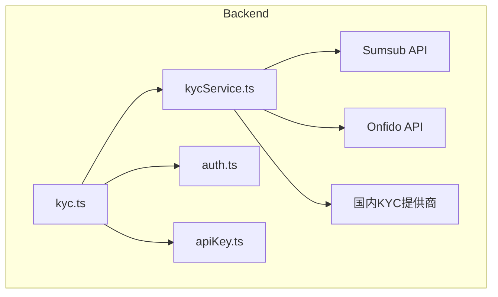
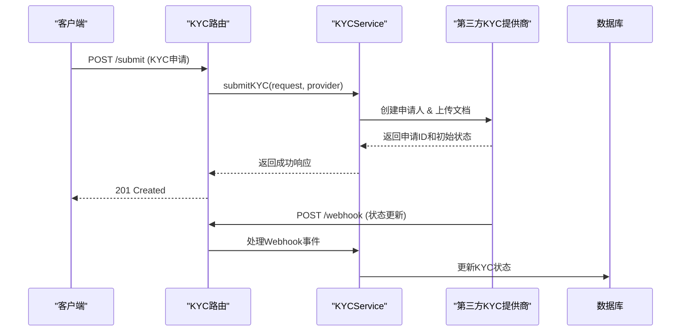
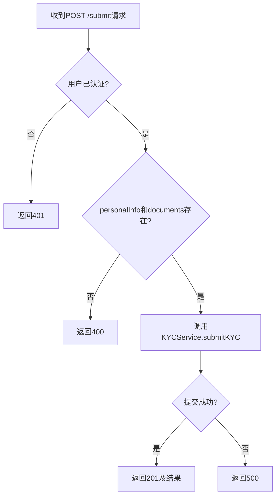
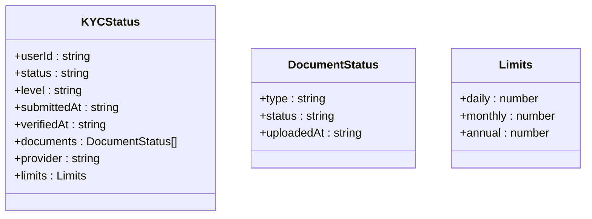
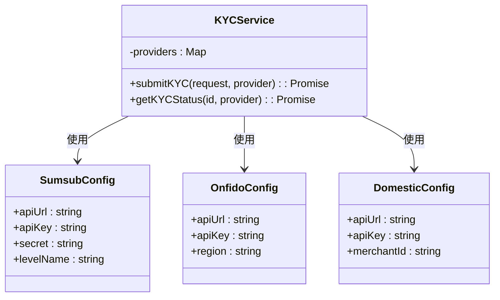
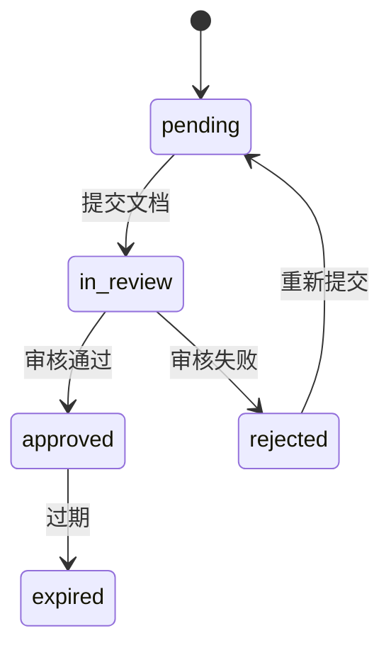
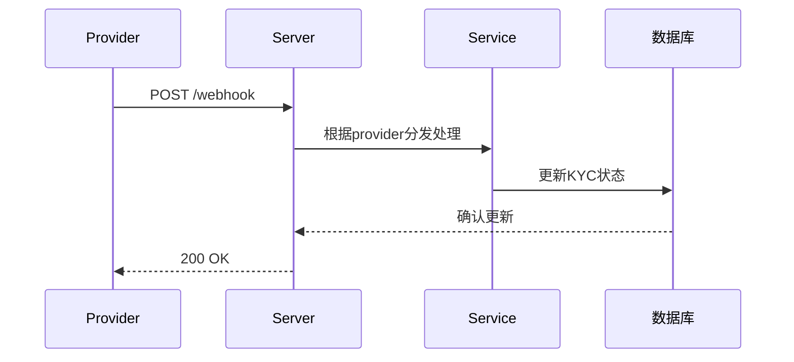
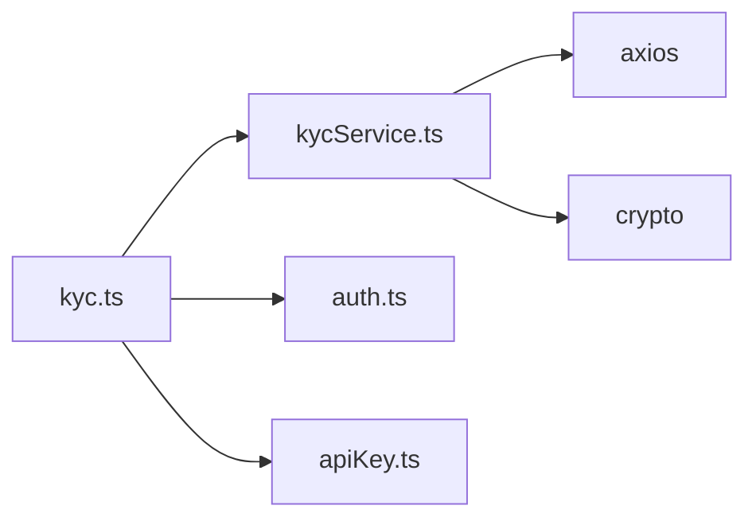

# KYC路由

<cite>
**本文档中引用的文件**  
- [kyc.ts](file://backend/src/routes/kyc.ts)
- [kycService.ts](file://backend/src/services/kycService.ts)
- [auth.ts](file://backend/src/middleware/auth.ts)
- [apiKey.ts](file://backend/src/middleware/apiKey.ts)
</cite>

## 目录
1. [简介](#简介)
2. [项目结构](#项目结构)
3. [核心组件](#核心组件)
4. [架构概述](#架构概述)
5. [详细组件分析](#详细组件分析)
6. [依赖分析](#依赖分析)
7. [性能考虑](#性能考虑)
8. [故障排除指南](#故障排除指南)
9. [结论](#结论)

## 简介
本文档详细描述了KYC服务的API路由设计与实现，涵盖KYC申请提交、状态查询、文档管理及Webhook处理等核心功能。基于`kyc.ts`中的路由定义和`kycService.ts`中的服务逻辑，说明如何通过API与KYC系统交互，并深入解析多提供商集成机制、状态机流程、合规性要求以及安全传输策略。

## 项目结构
本项目采用分层架构，后端路由与服务分离，确保高内聚低耦合。KYC相关功能集中于`backend/src/routes/kyc.ts`和`backend/src/services/kycService.ts`，并通过中间件进行身份验证和API密钥控制。



**图示来源**  
- [kyc.ts](file://backend/src/routes/kyc.ts)
- [kycService.ts](file://backend/src/services/kycService.ts)
- [auth.ts](file://backend/src/middleware/auth.ts)
- [apiKey.ts](file://backend/src/middleware/apiKey.ts)

**本节来源**  
- [kyc.ts](file://backend/src/routes/kyc.ts)
- [kycService.ts](file://backend/src/services/kycService.ts)

## 核心组件
核心组件包括KYC路由处理器、KYC服务类、身份验证中间件和API密钥验证机制。`KYCService`类封装了与第三方KYC提供商（如Sumsub、Onfido）的通信逻辑，支持动态配置和多提供商切换。

**本节来源**  
- [kyc.ts](file://backend/src/routes/kyc.ts#L1-L209)
- [kycService.ts](file://backend/src/services/kycService.ts#L1-L562)

## 架构概述
系统采用微服务风格的模块化设计，前端通过API调用后端KYC路由，后端服务根据配置选择合适的KYC提供商完成验证流程。异步Webhook机制用于接收外部状态更新，确保最终一致性。



**图示来源**  
- [kyc.ts](file://backend/src/routes/kyc.ts#L1-L209)
- [kycService.ts](file://backend/src/services/kycService.ts#L95-L559)

## 详细组件分析

### KYC申请提交分析
该功能允许用户提交KYC申请，包含个人信息和身份证明文件。系统支持指定KYC提供商，默认为Sumsub。

#### 请求格式
```json
{
  "personalInfo": {
    "firstName": "张",
    "lastName": "三",
    "dateOfBirth": "1990-01-01",
    "nationality": "CN",
    "address": {
      "country": "CN",
      "state": "北京",
      "city": "北京",
      "street": "朝阳区xxx路",
      "postalCode": "100000"
    },
    "phoneNumber": "+8613800138000",
    "email": "zhangsan@example.com"
  },
  "documents": [
    {
      "type": "id_card",
      "file": "base64编码的文件内容",
      "fileName": "id_card.jpg",
      "mimeType": "image/jpeg"
    }
  ],
  "provider": "sumsub"
}
```

#### 验证规则
- 必须提供`personalInfo`和`documents`
- 用户必须已认证（通过JWT）
- 文档类型必须是支持的类型之一：`passport`, `id_card`, `driving_license`, `utility_bill`, `bank_statement`, `selfie`

#### 响应处理
成功时返回201状态码及申请结果；失败时返回相应错误码（400/401/500）。



**图示来源**  
- [kyc.ts](file://backend/src/routes/kyc.ts#L10-L50)
- [kycService.ts](file://backend/src/services/kycService.ts#L120-L150)

**本节来源**  
- [kyc.ts](file://backend/src/routes/kyc.ts#L10-L50)
- [kycService.ts](file://backend/src/services/kycService.ts#L120-L150)

### KYC状态查询分析
提供`GET /status`接口用于获取当前用户的KYC状态，包括验证级别、限制额度和文档状态。



**图示来源**  
- [kyc.ts](file://backend/src/routes/kyc.ts#L52-L90)

**本节来源**  
- [kyc.ts](file://backend/src/routes/kyc.ts#L52-L90)

### 第三方提供商集成机制
系统支持Sumsub、Onfido和国内KYC提供商，通过环境变量配置各提供商的API密钥和端点。

#### 多提供商支持架构


**图示来源**  
- [kycService.ts](file://backend/src/services/kycService.ts#L85-L115)

**本节来源**  
- [kycService.ts](file://backend/src/services/kycService.ts#L85-L115)

### KYC状态机与合规性流程
KYC状态包括：`pending`, `in_review`, `approved`, `rejected`, `expired`。系统结合AML检查结果和风险评估决定最终状态。



**图示来源**  
- [kycService.ts](file://backend/src/services/kycService.ts#L10-L15)

**本节来源**  
- [kycService.ts](file://backend/src/services/kycService.ts#L10-L15)

### Webhook处理与异步更新
`POST /webhook`接收来自第三方KYC提供商的状态变更通知，触发本地状态同步。



**图示来源**  
- [kyc.ts](file://backend/src/routes/kyc.ts#L185-L205)

**本节来源**  
- [kyc.ts](file://backend/src/routes/kyc.ts#L185-L205)

## 依赖分析
系统依赖于多个外部服务和内部模块，形成清晰的调用链。



**图示来源**  
- [kyc.ts](file://backend/src/routes/kyc.ts)
- [kycService.ts](file://backend/src/services/kycService.ts)

**本节来源**  
- [kyc.ts](file://backend/src/routes/kyc.ts)
- [kycService.ts](file://backend/src/services/kycService.ts)

## 性能考虑
- 使用Map缓存已配置的提供商实例，避免重复初始化
- 批量上传文档时使用Promise.all并行处理
- Webhook处理无阻塞响应，确保第三方服务能快速确认

## 故障排除指南
常见问题及解决方案：

| 问题 | 原因 | 解决方案 |
|------|------|----------|
| 提交返回401 | JWT令牌缺失或无效 | 检查Authorization头是否正确设置 |
| 提交返回400 | 缺少personalInfo或documents | 确保请求体包含必要字段 |
| Webhook未生效 | 签名验证失败 | 检查SUMSUB_SECRET等环境变量配置 |
| 状态不更新 | 异步处理延迟 | 检查日志确认Webhook是否被正确接收 |

**本节来源**  
- [kyc.ts](file://backend/src/routes/kyc.ts)
- [kycService.ts](file://backend/src/services/kycService.ts)
- [auth.ts](file://backend/src/middleware/auth.ts)

## 结论
本文档全面解析了KYC服务的路由设计与实现机制，展示了如何通过模块化架构支持多KYC提供商集成。系统具备良好的扩展性和安全性，符合金融级合规要求。建议在生产环境中启用完整的日志审计和监控告警机制。