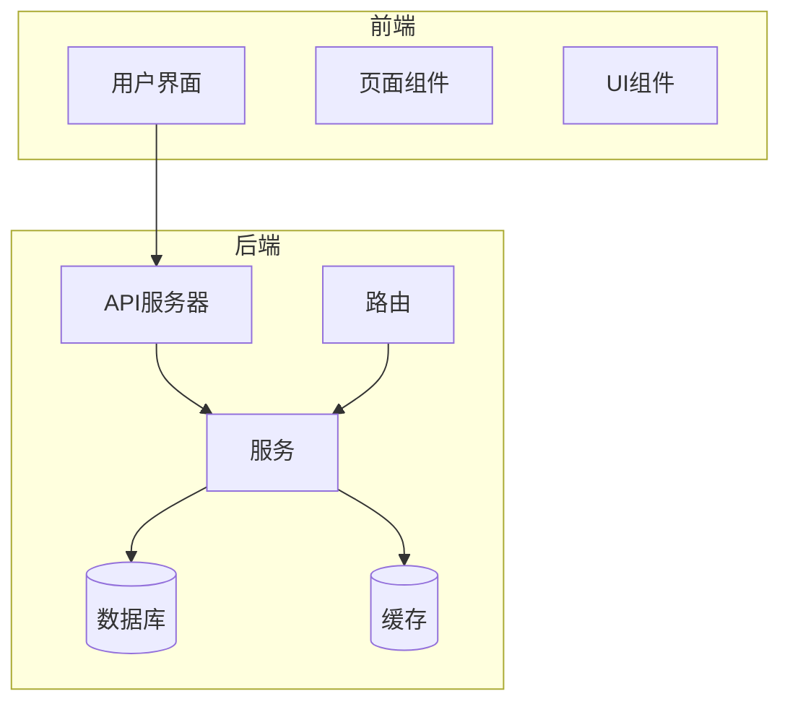
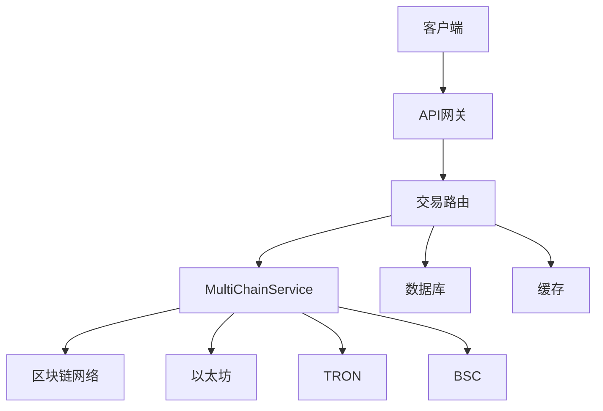
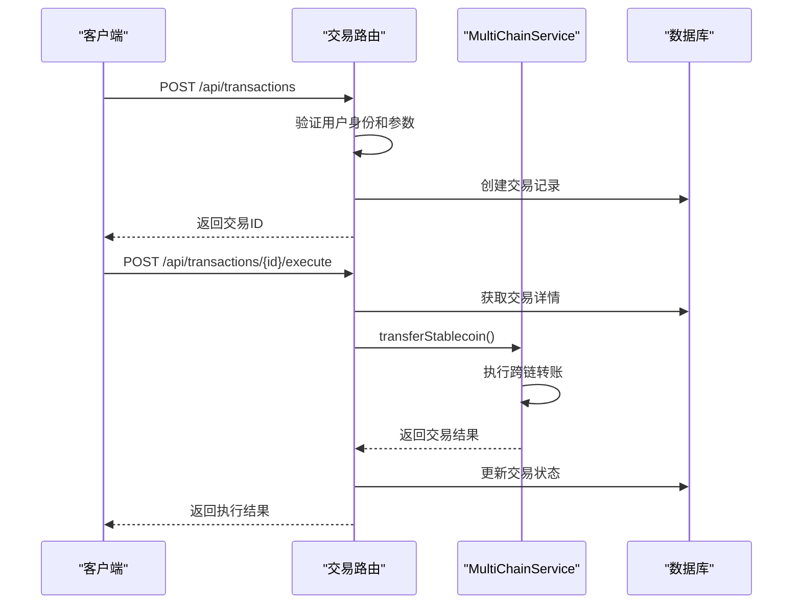
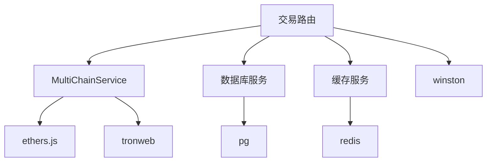

# 交易路由

<cite>
**本文档引用的文件**   
- [transaction.ts](file://backend/src/routes/transaction.ts)
- [multiChainService.ts](file://backend/src/services/multiChainService.ts)
- [BlockchainService.ts](file://backend/src/services/BlockchainService.ts)
- [logger.ts](file://backend/src/utils/logger.ts)
- [database.ts](file://backend/src/services/database.ts)
- [redis.ts](file://backend/src/services/redis.ts)
</cite>

## 目录
1. [简介](#简介)
2. [项目结构](#项目结构)
3. [核心组件](#核心组件)
4. [架构概述](#架构概述)
5. [详细组件分析](#详细组件分析)
6. [依赖分析](#依赖分析)
7. [性能考虑](#性能考虑)
8. [故障排除指南](#故障排除指南)
9. [结论](#结论)

## 简介
本文档详细说明了基于 `transaction.ts` 文件中路由定义的交易路由系统，涵盖稳定币转账、交易查询和状态监控功能。系统通过 `MultiChainService` 与不同区块链网络（包括以太坊、TRON 和 BSC）进行交互，支持跨链交易处理。文档详细描述了交易请求的参数结构、验证规则、安全检查、交易哈希生成、状态轮询机制和错误处理策略。此外，还提供了交易费用估算、Gas 价格优化、失败交易恢复的实现细节，以及性能监控和日志记录的最佳实践。

## 项目结构
该项目采用分层架构，主要分为前端和后端两大部分。后端服务位于 `backend` 目录下，使用 TypeScript 编写，基于 Express 框架构建 RESTful API。核心业务逻辑和服务位于 `backend/src/services` 目录，包括 `multiChainService.ts` 用于处理多链交互，`BlockchainService.ts` 用于监控区块链状态，`database.ts` 用于数据库操作，`redis.ts` 用于缓存管理。路由定义位于 `backend/src/routes` 目录，其中 `transaction.ts` 文件定义了交易相关的 API 路由。前端部分位于 `src` 和 `pages` 目录，使用 React 和 Next.js 构建用户界面。



**图表来源**
- [transaction.ts](file://backend/src/routes/transaction.ts)
- [multiChainService.ts](file://backend/src/services/multiChainService.ts)
- [database.ts](file://backend/src/services/database.ts)
- [redis.ts](file://backend/src/services/redis.ts)

**章节来源**
- [transaction.ts](file://backend/src/routes/transaction.ts)
- [multiChainService.ts](file://backend/src/services/multiChainService.ts)

## 核心组件
核心组件包括 `MultiChainService` 和 `BlockchainService`。`MultiChainService` 负责与不同区块链网络进行交互，支持以太坊、TRON 和 BSC 网络，提供稳定币转账、余额查询、交易状态获取等功能。`BlockchainService` 继承自 `MultiChainService`，增加了区块链状态监控、性能指标获取和健康检查功能。交易路由 `transaction.ts` 定义了创建、执行、查询和取消交易的 API 接口，通过调用 `MultiChainService` 实现跨链交易功能。

**章节来源**
- [multiChainService.ts](file://backend/src/services/multiChainService.ts)
- [BlockchainService.ts](file://backend/src/services/BlockchainService.ts)
- [transaction.ts](file://backend/src/routes/transaction.ts)

## 架构概述
系统架构采用微服务设计模式，前后端分离。后端服务通过 Express 框架暴露 RESTful API，前端通过 HTTP 请求与后端交互。`MultiChainService` 作为核心服务，封装了与不同区块链网络的交互逻辑，提供统一的接口供上层应用调用。`BlockchainService` 在 `MultiChainService` 的基础上增加了状态监控和性能优化功能。数据库使用 PostgreSQL 存储交易记录和用户信息，Redis 用于缓存频繁访问的数据，提高系统性能。



**图表来源**
- [transaction.ts](file://backend/src/routes/transaction.ts)
- [multiChainService.ts](file://backend/src/services/multiChainService.ts)
- [database.ts](file://backend/src/services/database.ts)
- [redis.ts](file://backend/src/services/redis.ts)

## 详细组件分析

### 交易路由分析
交易路由 `transaction.ts` 定义了五个主要的 API 接口：创建交易、执行交易、获取交易列表、获取交易详情和取消交易。创建交易接口接收交易参数，验证用户身份和参数完整性，创建交易记录并返回。执行交易接口调用 `MultiChainService` 的 `transferStablecoin` 方法执行跨链转账。获取交易列表和详情接口从数据库查询交易记录，支持分页和过滤。取消交易接口允许用户取消待处理的交易。



**图表来源**
- [transaction.ts](file://backend/src/routes/transaction.ts)
- [multiChainService.ts](file://backend/src/services/multiChainService.ts)
- [database.ts](file://backend/src/services/database.ts)

**章节来源**
- [transaction.ts](file://backend/src/routes/transaction.ts)

### MultiChainService分析
`MultiChainService` 是系统的核心服务，负责与不同区块链网络进行交互。它初始化了以太坊、TRON 和 BSC 网络的配置和提供者，支持稳定币转账、余额查询、交易状态获取等功能。服务通过 `transferStablecoin` 方法执行跨链转账，根据目标链的不同调用相应的 `executeEVMTransfer` 或 `executeTronTransfer` 方法。`getTransactionStatus` 方法用于获取交易状态，支持 EVM 和 TRON 网络。

```mermaid
classDiagram
class MultiChainService {
+chains : Map<string, ChainConfig>
+providers : Map<string, any>
+transferStablecoin(chainName, tokenSymbol, fromAddress, toAddress, amount, privateKey) TransactionResult
+getStablecoinBalance(chainName, tokenSymbol, address) Promise<string>
+getTransactionStatus(chainName, txHash) Promise<TransactionResult>
+getGasPrices(chainName) Promise<{slow, standard, fast}>
+validateAddress(chainName, address) boolean
}
class ChainConfig {
+chainId : number
+name : string
+symbol : string
+rpcUrl : string
+explorerUrl : string
+nativeCurrency : {name, symbol, decimals}
+stablecoins : {[symbol] : {address, decimals, symbol, name}}
}
class TransactionResult {
+txHash : string
+chainId : number
+status : 'pending' | 'confirmed' | 'failed'
+confirmations : number
+gasUsed? : string
+blockNumber? : number
+timestamp : Date
}
MultiChainService --> ChainConfig : "包含"
MultiChainService --> TransactionResult : "返回"
```

**图表来源**
- [multiChainService.ts](file://backend/src/services/multiChainService.ts)

**章节来源**
- [multiChainService.ts](file://backend/src/services/multiChainService.ts)

### 区块链服务分析
`BlockchainService` 继承自 `MultiChainService`，增加了区块链状态监控和性能优化功能。它维护了一个链状态映射，定期更新各链的区块高度、Gas 价格、平均出块时间等信息。服务提供了获取网络拥堵建议、估算最佳 Gas 价格、监控交易状态等功能。`startHealthCheck` 方法启动定期健康检查，确保各链的正常运行。

```mermaid
classDiagram
class BlockchainService {
+stats : BlockchainStats
+chainStatus : Map<string, ChainStatus>
+getBlockchainStats() BlockchainStats
+getChainStatus(chainName?) ChainStatus | ChainStatus[] | undefined
+updateChainStatus(chainName) Promise<void>
+checkAllChainsHealth() Promise<void>
+getNetworkCongestionAdvice() {level, message, recommendedGasMultiplier}
+estimateOptimalGasPrice(chainName) Promise<{slow, standard, fast, instant}>
+monitorTransaction(chainName, txHash) Promise<{status, confirmations, blockNumber?, gasUsed?}>
+getPerformanceMetrics() {throughput, latency, successRate}
+startHealthCheck(intervalMs) void
}
class BlockchainStats {
+totalTransactions : number
+totalVolume : string
+activeChains : number
+avgConfirmationTime : number
+networkCongestion : 'low' | 'medium' | 'high'
}
class ChainStatus {
+name : string
+isOnline : boolean
+blockHeight : number
+gasPrice : string
+avgBlockTime : number
+pendingTransactions : number
}
BlockchainService --|> MultiChainService : "继承"
BlockchainService --> BlockchainStats : "包含"
BlockchainService --> ChainStatus : "包含"
```

**图表来源**
- [BlockchainService.ts](file://backend/src/services/BlockchainService.ts)

**章节来源**
- [BlockchainService.ts](file://backend/src/services/BlockchainService.ts)

## 依赖分析
系统依赖于多个外部库和服务。后端使用 Express 框架处理 HTTP 请求，使用 ethers.js 与以太坊网络交互，使用 tronweb 与 TRON 网络交互，使用 pg 库操作 PostgreSQL 数据库，使用 redis 库操作 Redis 缓存。日志记录使用 winston 库。环境变量通过 .env 文件配置，包括各区块链网络的 RPC URL 和 API 密钥。系统通过 `MultiChainService` 封装了与不同区块链网络的交互，降低了上层应用的复杂性。



**图表来源**
- [transaction.ts](file://backend/src/routes/transaction.ts)
- [multiChainService.ts](file://backend/src/services/multiChainService.ts)
- [database.ts](file://backend/src/services/database.ts)
- [redis.ts](file://backend/src/services/redis.ts)

**章节来源**
- [transaction.ts](file://backend/src/routes/transaction.ts)
- [multiChainService.ts](file://backend/src/services/multiChainService.ts)
- [database.ts](file://backend/src/services/database.ts)
- [redis.ts](file://backend/src/services/redis.ts)

## 性能考虑
系统在性能方面进行了多项优化。使用 Redis 缓存频繁访问的数据，如链状态和 Gas 价格，减少对区块链网络的直接调用。数据库查询使用索引优化，提高查询效率。`BlockchainService` 提供了定期健康检查和性能监控功能，及时发现和解决性能瓶颈。日志记录使用 winston 库，支持结构化日志输出，便于问题排查和性能分析。系统还提供了网络拥堵建议和最佳 Gas 价格估算，帮助用户优化交易成本和确认时间。

**章节来源**
- [BlockchainService.ts](file://backend/src/services/BlockchainService.ts)
- [redis.ts](file://backend/src/services/redis.ts)
- [logger.ts](file://backend/src/utils/logger.ts)

## 故障排除指南
常见问题包括交易创建失败、执行失败、状态查询失败等。交易创建失败通常是由于参数缺失或验证失败，检查请求参数是否完整且格式正确。执行失败可能是由于私钥错误、余额不足或网络问题，检查私钥是否正确，账户余额是否充足，网络连接是否正常。状态查询失败可能是由于交易哈希错误或网络延迟，检查交易哈希是否正确，稍后重试。系统日志记录了详细的错误信息，可通过日志分析具体原因。

**章节来源**
- [transaction.ts](file://backend/src/routes/transaction.ts)
- [multiChainService.ts](file://backend/src/services/multiChainService.ts)
- [logger.ts](file://backend/src/utils/logger.ts)

## 结论
本文档详细介绍了交易路由系统的架构、核心组件、实现细节和最佳实践。系统通过 `MultiChainService` 和 `BlockchainService` 实现了与多个区块链网络的交互，支持稳定币转账、交易查询和状态监控功能。通过合理的架构设计和性能优化，系统能够高效、稳定地处理跨链交易。未来可进一步优化交易费用估算和 Gas 价格优化算法，提高用户体验。