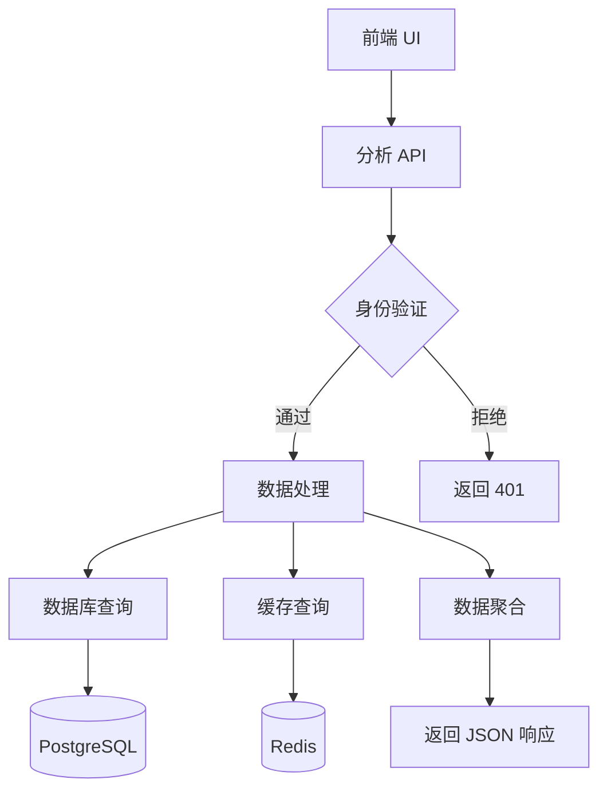
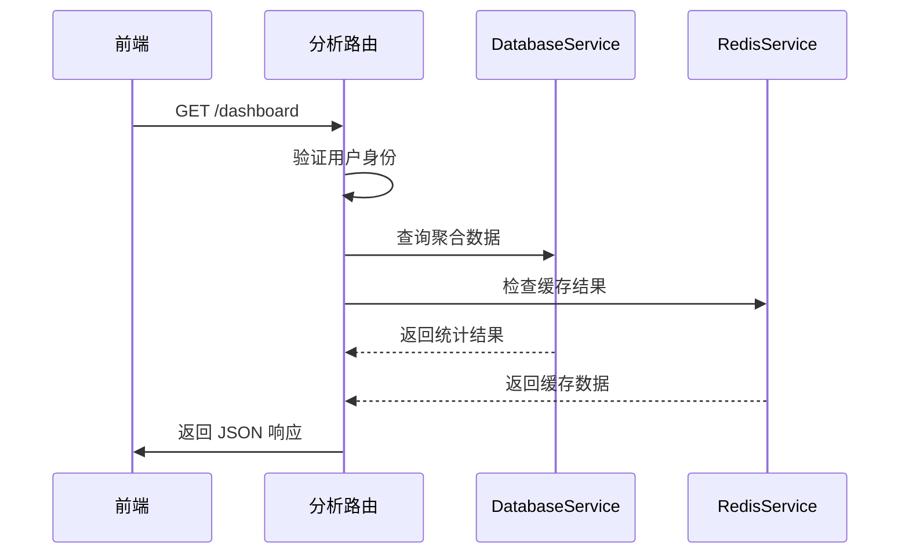
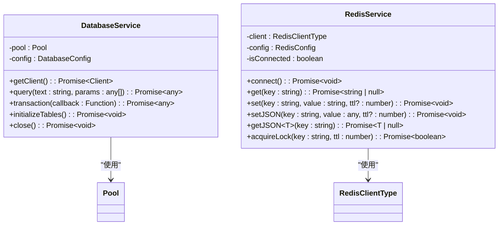
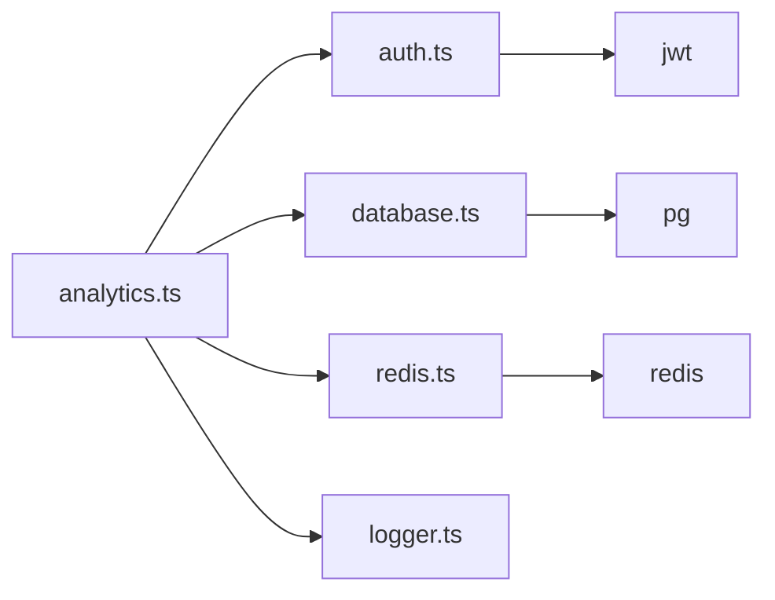

# 分析路由

<cite>
**本文档中引用的文件**  
- [analytics.ts](file://backend/src/routes/analytics.ts)
- [database.ts](file://backend/src/services/database.ts)
- [redis.ts](file://backend/src/services/redis.ts)
- [auth.ts](file://backend/src/middleware/auth.ts)
- [Analytics.tsx](file://src/components/Analytics/Analytics.tsx)
</cite>

## 目录
1. [简介](#简介)
2. [项目结构](#项目结构)
3. [核心组件](#核心组件)
4. [架构概述](#架构概述)
5. [详细组件分析](#详细组件分析)
6. [依赖分析](#依赖分析)
7. [性能考虑](#性能考虑)
8. [故障排除指南](#故障排除指南)
9. [结论](#结论)

## 简介
本文件全面分析了基于 `analytics.ts` 文件实现的分析服务路由，涵盖交易分析、用户行为统计和业务指标监控功能。文档详细说明了各类分析数据的获取方式，包括实时指标、历史趋势和聚合报表。同时描述了数据采样策略、查询性能优化和大规模数据处理技术，并解释了与 Redis 缓存、数据库聚合查询的集成机制以及数据隐私保护措施。此外，还提供了自定义报表生成、数据导出功能和可视化集成的 API 细节，以及高并发分析请求的处理策略。

## 项目结构
该项目采用前后端分离架构，后端分析路由位于 `backend/src/routes/analytics.ts`，前端可视化界面位于 `src/components/Analytics/Analytics.tsx`。后端通过 Express 框架定义 RESTful API 路由，前端使用 React 和 TypeScript 构建交互式分析仪表板。系统集成了 PostgreSQL 作为主数据库，Redis 用于缓存和实时数据处理，确保高性能和可扩展性。

```mermaid
graph TB
subgraph "前端"
A[Analytics.tsx] --> B[UI 组件]
end
subgraph "后端"
C[analytics.ts] --> D[分析路由]
D --> E[DatabaseService]
D --> F[RedisService]
end
A --> C: HTTP 请求
E --> G[(PostgreSQL)]
F --> H[(Redis)]
```

**图表来源**  
- [analytics.ts](file://backend/src/routes/analytics.ts#L1-L422)
- [Analytics.tsx](file://src/components/Analytics/Analytics.tsx#L3-L402)

**本节来源**  
- [analytics.ts](file://backend/src/routes/analytics.ts#L1-L422)
- [Analytics.tsx](file://src/components/Analytics/Analytics.tsx#L3-L402)

## 核心组件
核心分析功能由后端 `analytics.ts` 文件中的路由处理器实现，包括仪表板统计、交易量趋势、用户活跃度、性能指标和风险分析等接口。这些接口通过中间件进行身份验证，并计划从数据库和缓存服务中获取真实数据。前端组件 `Analytics.tsx` 负责调用这些 API 并将数据可视化为图表和报表。

**本节来源**  
- [analytics.ts](file://backend/src/routes/analytics.ts#L1-L422)
- [Analytics.tsx](file://src/components/Analytics/Analytics.tsx#L3-L402)

## 架构概述
系统采用分层架构，前端通过 API 与后端通信，后端服务通过 `DatabaseService` 和 `RedisService` 与数据存储层交互。分析路由作为业务逻辑层，协调数据获取、处理和返回。身份验证中间件确保只有授权用户才能访问敏感分析数据。



**图表来源**  
- [analytics.ts](file://backend/src/routes/analytics.ts#L1-L422)
- [auth.ts](file://backend/src/middleware/auth.ts#L1-L166)

**本节来源**  
- [analytics.ts](file://backend/src/routes/analytics.ts#L1-L422)
- [auth.ts](file://backend/src/middleware/auth.ts#L1-L166)

## 详细组件分析

### 分析路由组件
`analytics.ts` 文件定义了多个分析相关的 RESTful 接口，每个接口处理特定类型的分析请求。这些接口使用异步函数处理请求，并通过 try-catch 块进行错误处理。所有敏感接口都检查用户身份，确保数据安全。

#### 对于 API/服务组件：


**图表来源**  
- [analytics.ts](file://backend/src/routes/analytics.ts#L1-L422)
- [database.ts](file://backend/src/services/database.ts#L15-L243)
- [redis.ts](file://backend/src/services/redis.ts#L12-L333)

**本节来源**  
- [analytics.ts](file://backend/src/routes/analytics.ts#L1-L422)

### 数据服务组件
`DatabaseService` 和 `RedisService` 类封装了与数据存储的交互逻辑。`DatabaseService` 使用连接池管理 PostgreSQL 连接，提供查询、事务和表初始化功能。`RedisService` 提供字符串、哈希、列表等多种数据结构的操作，并包含 JSON 序列化辅助方法和分布式锁机制。

#### 对于对象导向组件：


**图表来源**  
- [database.ts](file://backend/src/services/database.ts#L15-L243)
- [redis.ts](file://backend/src/services/redis.ts#L12-L333)

**本节来源**  
- [database.ts](file://backend/src/services/database.ts#L15-L243)
- [redis.ts](file://backend/src/services/redis.ts#L12-L333)

## 依赖分析
分析服务依赖于多个核心模块：身份验证中间件确保安全性，数据库服务提供持久化存储，Redis 服务支持缓存和实时数据处理。这些依赖通过模块导入机制集成，形成了一个松耦合但高度协作的系统架构。



**图表来源**  
- [analytics.ts](file://backend/src/routes/analytics.ts#L1-L422)
- [auth.ts](file://backend/src/middleware/auth.ts#L1-L166)

**本节来源**  
- [analytics.ts](file://backend/src/routes/analytics.ts#L1-L422)
- [auth.ts](file://backend/src/middleware/auth.ts#L1-L166)

## 性能考虑
系统通过多种机制优化分析查询性能：使用 Redis 缓存频繁访问的聚合结果，避免重复计算；数据库连接池提高并发处理能力；分页和数据采样策略减少大规模数据查询的开销。计划中的实现将从数据库计算真实数据，并利用索引优化查询效率。

## 故障排除指南
常见问题包括身份验证失败（401 错误）、数据库连接问题和缓存失效。日志记录在 `logger.ts` 中实现，帮助追踪请求处理流程和错误信息。监控系统应跟踪 API 响应时间、错误率和系统资源使用情况，及时发现性能瓶颈。

**本节来源**  
- [analytics.ts](file://backend/src/routes/analytics.ts#L1-L422)
- [database.ts](file://backend/src/services/database.ts#L15-L243)
- [redis.ts](file://backend/src/services/redis.ts#L12-L333)

## 结论
该分析路由系统设计合理，功能完整，具备良好的扩展性和安全性。通过集成数据库和缓存服务，能够支持复杂的分析查询和高并发访问。未来实现应重点关注真实数据查询逻辑、缓存策略优化和性能监控，确保系统在生产环境中的稳定性和可靠性。