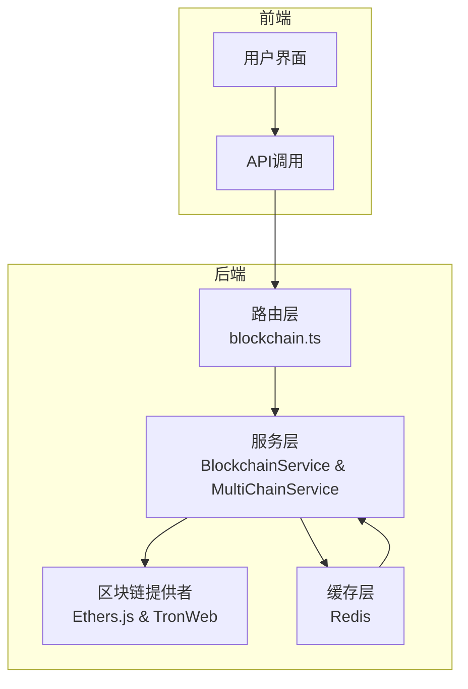

# 区块链路由

<cite>
**本文档中引用的文件**  
- [blockchain.ts](file://backend/src/routes/blockchain.ts)
- [BlockchainService.ts](file://backend/src/services/BlockchainService.ts)
- [multiChainService.ts](file://backend/src/services/multiChainService.ts)
- [redis.ts](file://backend/src/services/redis.ts)
</cite>

## 目录
1. [简介](#简介)
2. [项目结构](#项目结构)
3. [核心组件](#核心组件)
4. [架构概述](#架构概述)
5. [详细组件分析](#详细组件分析)
6. [依赖分析](#依赖分析)
7. [性能考虑](#性能考虑)
8. [故障排除指南](#故障排除指南)
9. [结论](#结论)

## 简介
本文档全面介绍基于 `blockchain.ts` 文件实现的区块链服务路由系统。该系统为区块链状态监控、网络健康检查和性能指标获取提供API接口，支持多链架构下的稳定币交易与查询功能。文档详细说明了路由设计、服务协作机制、算法逻辑及高并发优化策略，旨在为开发者和运维人员提供清晰的技术参考。

## 项目结构
系统采用分层架构设计，主要分为路由层、服务层和工具层。路由定义位于 `backend/src/routes/blockchain.ts`，核心业务逻辑由 `BlockchainService` 和 `MultiChainService` 实现，底层依赖以太坊、波场和BSC网络的SDK进行交互。



**图示来源**  
- [blockchain.ts](file://backend/src/routes/blockchain.ts#L1-L293)
- [BlockchainService.ts](file://backend/src/services/BlockchainService.ts#L1-L307)
- [multiChainService.ts](file://backend/src/services/multiChainService.ts#L1-L508)

**本节来源**  
- [blockchain.ts](file://backend/src/routes/blockchain.ts#L1-L293)
- [project_structure](file://)

## 核心组件
系统核心由三大组件构成：`BlockchainService` 负责状态监控与性能指标，`MultiChainService` 提供跨链交易支持，`RedisService` 实现缓存与分布式锁机制。这些组件协同工作，确保高可用性和低延迟响应。

**本节来源**  
- [BlockchainService.ts](file://backend/src/services/BlockchainService.ts#L1-L307)
- [multiChainService.ts](file://backend/src/services/multiChainService.ts#L1-L508)
- [redis.ts](file://backend/src/services/redis.ts#L1-L337)

## 架构概述
系统采用微服务风格的模块化架构，通过清晰的职责划分实现可扩展性与可维护性。`BlockchainService` 继承自 `MultiChainService`，复用其多链支持能力，同时扩展了健康检查、性能监控和交易跟踪功能。

```mermaid
classDiagram
    class MultiChainService {
        +getSupportedChains() ChainConfig[]
        +getChainConfig(chainName) ChainConfig
        +getStablecoinBalance(chain, token, addr) Promise~string~
        +transferStablecoin(...) Promise~TransactionResult~
        +getTransactionStatus(chain, txHash) Promise~TransactionResult~
        +getGasPrices(chain) Promise~{slow, standard, fast}~
        +validateAddress(chain, addr) boolean
    }

    class BlockchainService {
        -stats: BlockchainStats
        -chainStatus: Map~string, ChainStatus~
        +getBlockchainStats() BlockchainStats
        +getChainStatus(chain?) ChainStatus | ChainStatus[]
        +updateChainStatus(chain) Promise~void~
        +checkAllChainsHealth() Promise~void~
        +getNetworkCongestionAdvice() {level, message, multiplier}
        +estimateOptimalGasPrice(chain) Promise~{slow, standard, fast, instant}~
        +monitorTransaction(chain, txHash) Promise~{status, confirmations, ...}~
        +getPerformanceMetrics() {throughput, latency, successRate}
        +startHealthCheck(intervalMs) void
    }

    class RedisService {
        -client: RedisClientType
        -isConnected: boolean
        +connect() Promise~void~
        +set(key, value, ttl?) Promise~void~
        +get(key) Promise~string | null~
        +setJSON(key, value, ttl?) Promise~void