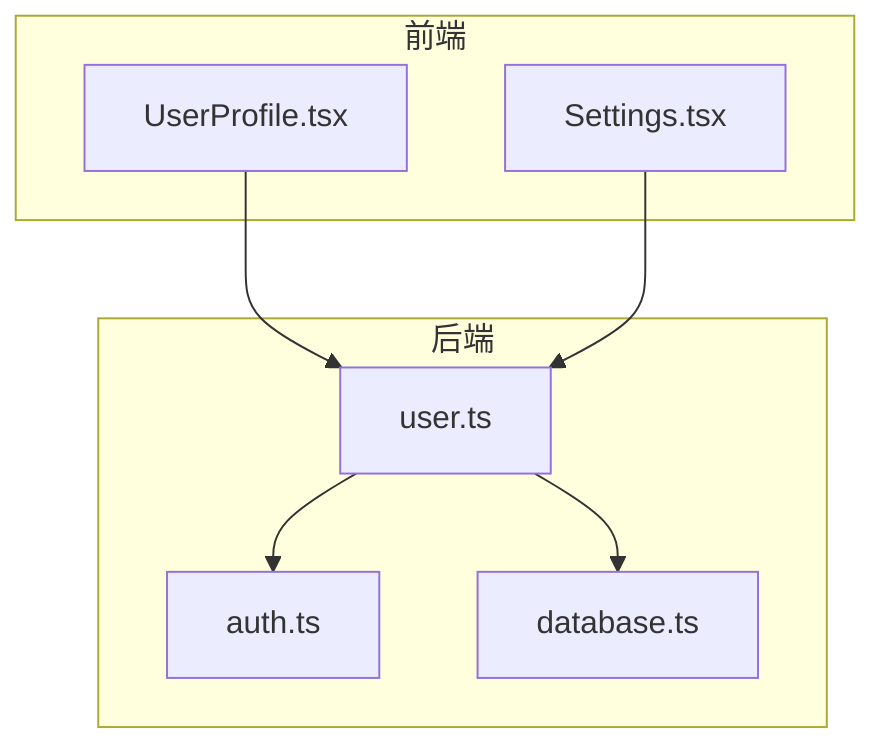
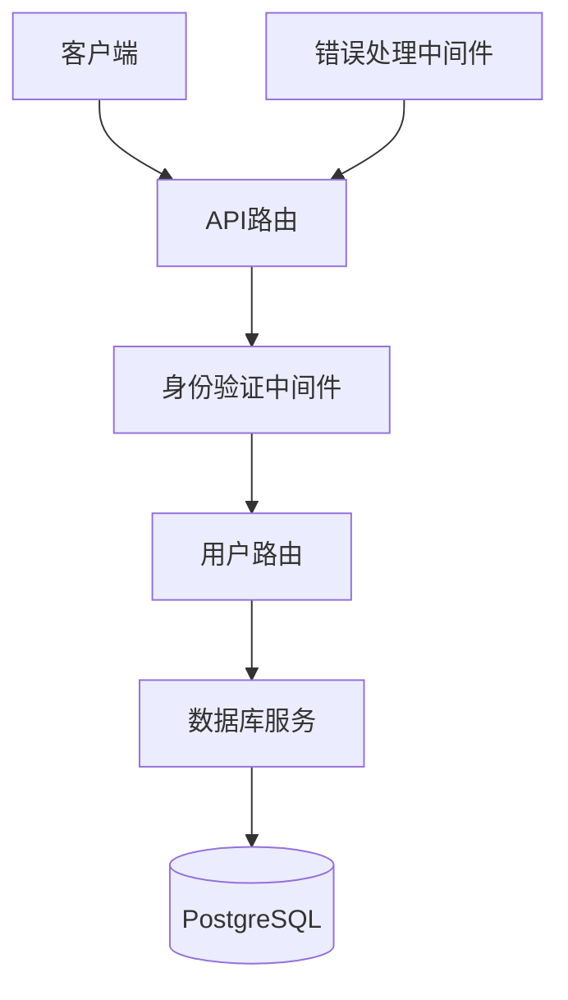
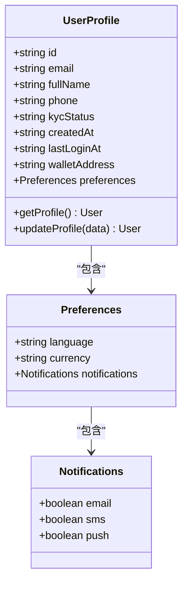
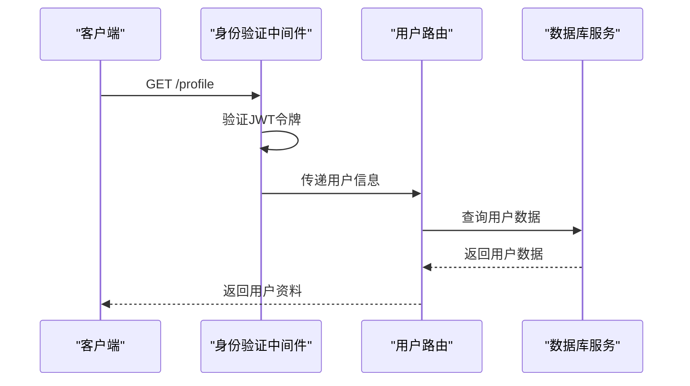
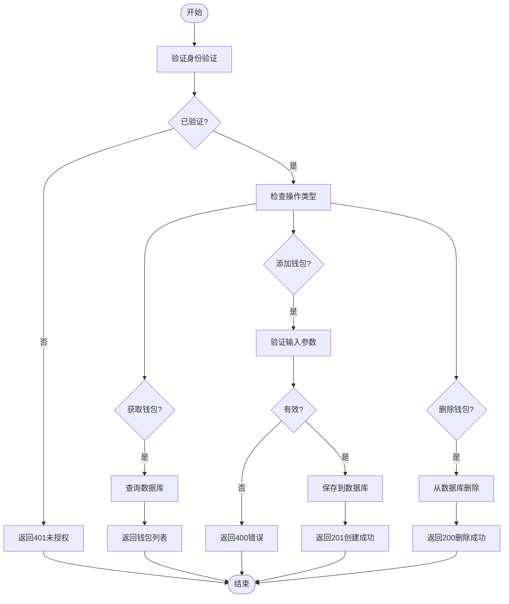
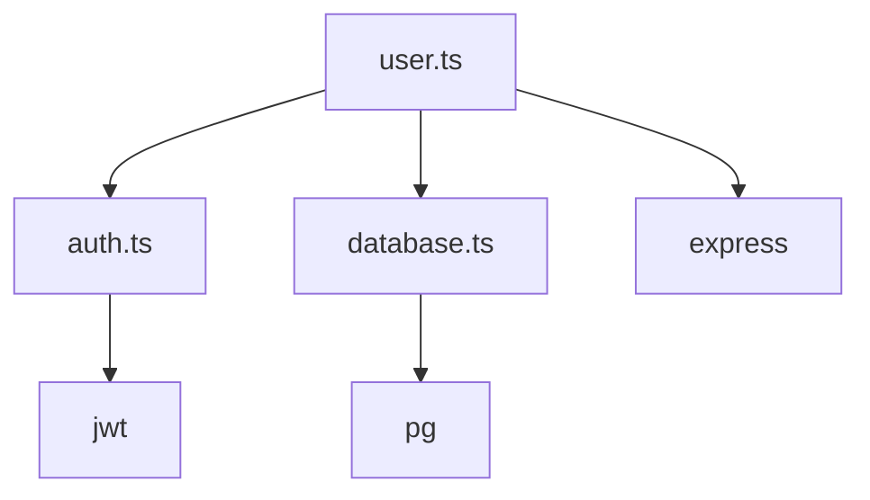

# 用户路由

<cite>
**本文档中引用的文件**   
- [user.ts](file://backend/src/routes/user.ts)
- [auth.ts](file://backend/src/middleware/auth.ts)
- [database.ts](file://backend/src/services/database.ts)
- [UserProfile.tsx](file://src/components/Profile/UserProfile.tsx)
- [Settings.tsx](file://src/pages/Settings.tsx)
</cite>

## 目录
1. [简介](#简介)
2. [项目结构](#项目结构)
3. [核心组件](#核心组件)
4. [架构概述](#架构概述)
5. [详细组件分析](#详细组件分析)
6. [依赖分析](#依赖分析)
7. [性能考虑](#性能考虑)
8. [故障排除指南](#故障排除指南)
9. [结论](#结论)

## 简介
本文档全面介绍了用户管理路由的实现，涵盖用户信息获取、更新和账户管理功能。基于user.ts文件中的路由定义，详细描述了受保护端点的实现，包括身份验证中间件的使用。文档说明了用户数据模型、隐私保护措施和访问控制策略，提供了获取用户资料、更新用户设置和管理账户偏好的API细节。同时解释了用户数据验证、错误处理和与数据库服务的交互模式，并包含性能优化建议和常见问题解决方案。

## 项目结构
本项目采用全栈Next.js架构，将前端和后端统一在一个代码库中。后端路由定义位于backend/src/routes目录下，其中user.ts文件专门处理用户相关的API请求。中间件位于backend/src/middleware目录，负责身份验证和错误处理。数据库服务在backend/src/services目录中实现，提供与PostgreSQL的连接和操作功能。前端组件分布在src/components和src/pages目录中，其中UserProfile.tsx和Settings.tsx分别负责用户资料展示和设置管理。

**图源**
- [user.ts](file://backend/src/routes/user.ts)
- [UserProfile.tsx](file://src/components/Profile/UserProfile.tsx)
- [Settings.tsx](file://src/pages/Settings.tsx)

**节源**
- [user.ts](file://backend/src/routes/user.ts)
- [UserProfile.tsx](file://src/components/Profile/UserProfile.tsx)

## 核心组件
用户路由的核心功能包括获取和更新用户资料、管理用户钱包。所有端点都受到身份验证保护，确保只有授权用户可以访问其数据。用户数据模型包含基本信息、KYC状态和偏好设置。钱包管理功能允许用户查看、添加和删除不同区块链的钱包地址。系统通过JWT进行身份验证，并使用角色基础的访问控制来保护敏感操作。

**节源**
- [user.ts](file://backend/src/routes/user.ts#L1-L197)
- [auth.ts](file://backend/src/middleware/auth.ts#L10-L58)

## 架构概述
系统采用分层架构，前端组件通过API路由与后端服务通信。身份验证中间件在请求到达路由处理程序之前验证JWT令牌，确保请求的安全性。数据库服务使用连接池管理与PostgreSQL的连接，提供高效的数据库操作。错误处理中间件全局捕获和格式化错误响应，提供一致的API错误格式。

**图源**
- [user.ts](file://backend/src/routes/user.ts)
- [auth.ts](file://backend/src/middleware/auth.ts)
- [database.ts](file://backend/src/services/database.ts)

## 详细组件分析

### 用户资料管理分析
用户资料管理功能提供获取和更新用户信息的API端点。GET /profile端点返回用户的基本信息、KYC状态和偏好设置。PUT /profile端点允许用户更新其姓名、电话和偏好。系统使用authMiddleware确保只有经过身份验证的用户可以访问这些端点。

#### 类图

**图源**
- [user.ts](file://backend/src/routes/user.ts#L4-L45)
- [Settings.tsx](file://src/pages/Settings.tsx#L26-L47)

#### 序列图

**图源**
- [user.ts](file://backend/src/routes/user.ts#L4-L45)
- [auth.ts](file://backend/src/middleware/auth.ts#L10-L58)

**节源**
- [user.ts](file://backend/src/routes/user.ts#L1-L88)
- [UserProfile.tsx](file://src/components/Profile/UserProfile.tsx#L38-L247)

### 钱包管理分析
钱包管理功能允许用户管理其在不同区块链上的钱包地址。GET /wallets端点返回用户的所有钱包列表，包括名称、地址、链类型和余额信息。POST /wallets端点允许用户添加新钱包，系统会验证钱包地址格式并保存到数据库。DELETE /wallets/:walletId端点允许用户删除指定的钱包。

#### 流程图

**图源**
- [user.ts](file://backend/src/routes/user.ts#L89-L197)
- [database.ts](file://backend/src/services/database.ts#L101-L143)

**节源**
- [user.ts](file://backend/src/routes/user.ts#L89-L197)
- [UserProfile.tsx](file://src/components/Profile/UserProfile.tsx#L38-L247)

## 依赖分析
用户路由依赖于身份验证中间件和数据库服务。身份验证中间件提供JWT验证功能，确保只有授权用户可以访问受保护的端点。数据库服务提供与PostgreSQL的连接和操作功能，用于持久化存储用户和钱包数据。系统还依赖于Express框架处理HTTP请求和响应。

**图源**
- [user.ts](file://backend/src/routes/user.ts)
- [auth.ts](file://backend/src/middleware/auth.ts)
- [database.ts](file://backend/src/services/database.ts)

**节源**
- [user.ts](file://backend/src/routes/user.ts)
- [auth.ts](file://backend/src/middleware/auth.ts)
- [database.ts](file://backend/src/services/database.ts)

## 性能考虑
为优化性能，建议实施响应数据裁剪，只返回客户端实际需要的字段。可以使用Redis缓存用户资料信息，减少数据库查询次数。对于钱包余额等频繁访问的数据，可以实现短期缓存策略。数据库查询应使用索引优化，特别是在用户ID和钱包地址等常用查询字段上。

## 故障排除指南
常见问题包括身份验证失败、参数验证错误和数据库连接问题。身份验证失败通常由于缺少或无效的JWT令牌，检查Authorization头是否正确设置。参数验证错误可能由于请求体缺少必要字段，确保POST和PUT请求包含所有必需参数。数据库连接问题可能由于配置错误或网络问题，检查数据库服务是否正常运行。

**节源**
- [errorHandler.ts](file://backend/src/middleware/errorHandler.ts)
- [user.ts](file://backend/src/routes/user.ts)

## 结论
用户路由提供了完整的用户管理和钱包管理功能，通过严格的身份验证和访问控制确保数据安全。系统架构清晰，组件职责分明，便于维护和扩展。通过实施性能优化措施，可以进一步提升系统响应速度和用户体验。未来可以考虑增加更多用户偏好选项和钱包管理功能，以满足不断增长的用户需求。