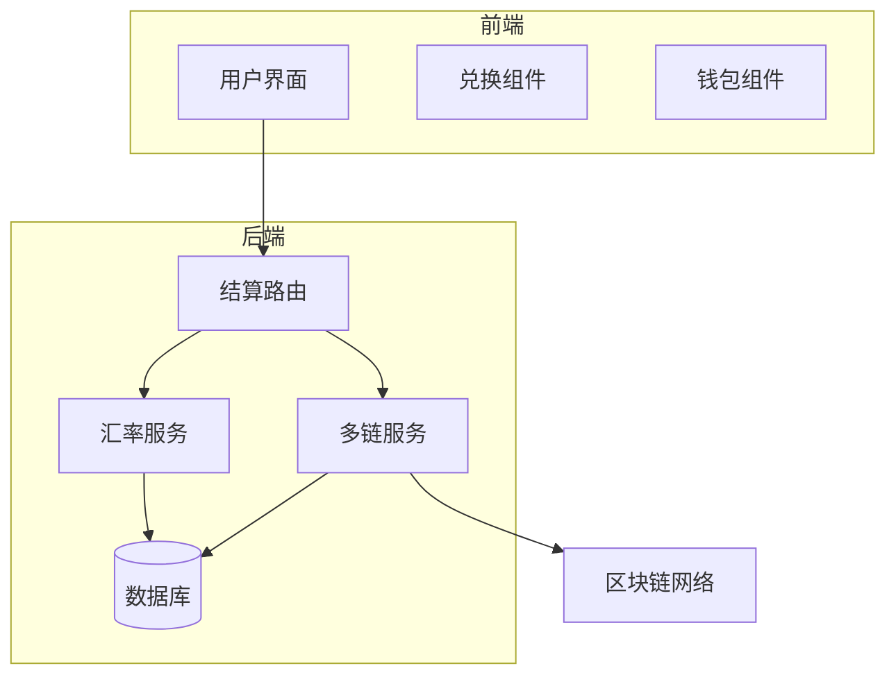
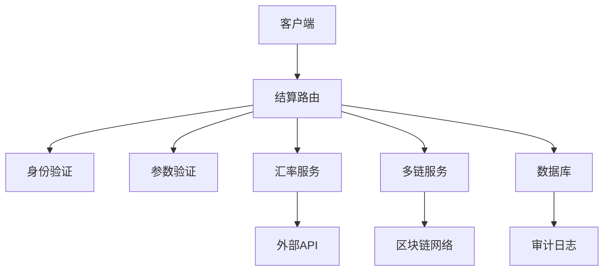
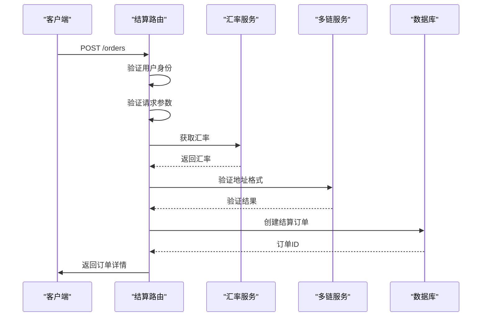
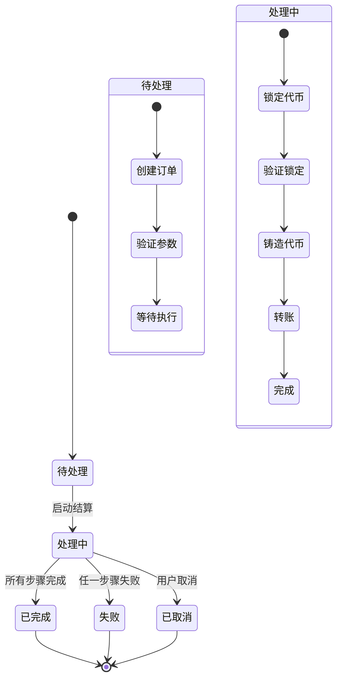
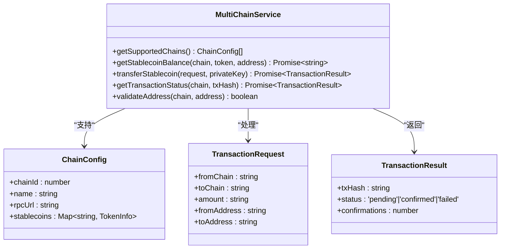
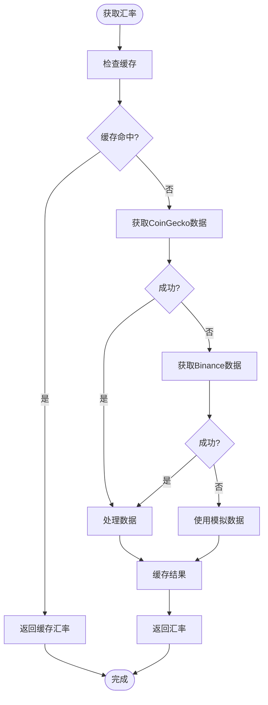
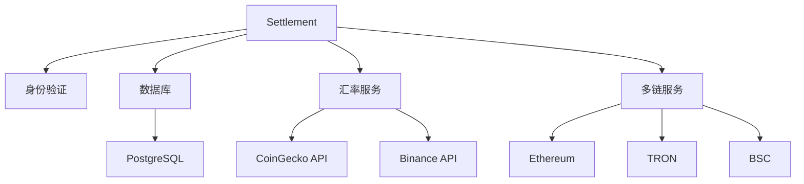

# 结算路由

<cite>
**本文档引用文件**   
- [settlement.ts](file://backend/src/routes/settlement.ts)
- [exchangeRateService.ts](file://src/services/exchangeRateService.ts)
- [multiChainService.ts](file://backend/src/services/multiChainService.ts)
- [database.ts](file://backend/src/services/database.ts)
</cite>

## 目录
1. [简介](#简介)
2. [项目结构](#项目结构)
3. [核心组件](#核心组件)
4. [架构概述](#架构概述)
5. [详细组件分析](#详细组件分析)
6. [依赖分析](#依赖分析)
7. [性能考虑](#性能考虑)
8. [故障排除指南](#故障排除指南)
9. [结论](#结论)

## 简介
本文档详细说明了基于`settlement.ts`文件的结算系统路由实现，涵盖跨境支付结算、汇率转换和结算状态管理功能。文档描述了结算请求的处理流程，包括金额计算、汇率锁定和多链结算协调机制。同时解释了与交易系统、汇率服务的集成方式，以及确保结算原子性和一致性的技术实现。

## 项目结构
结算系统位于后端路由模块中，与其他业务模块协同工作。系统采用分层架构，前端通过API调用后端服务，后端服务协调数据库、区块链和外部API完成结算任务。

**图示来源**
- [settlement.ts](file://backend/src/routes/settlement.ts#L1-L408)
- [multiChainService.ts](file://backend/src/services/multiChainService.ts#L1-L507)
- [exchangeRateService.ts](file://src/services/exchangeRateService.ts#L1-L285)

**本节来源**
- [settlement.ts](file://backend/src/routes/settlement.ts#L1-L408)
- [project_structure](file://#L1-L200)

## 核心组件
结算系统的核心组件包括结算路由处理器、多链服务和汇率服务。这些组件协同工作，确保跨境支付结算的安全性和可靠性。

**本节来源**
- [settlement.ts](file://backend/src/routes/settlement.ts#L34-L78)
- [multiChainService.ts](file://backend/src/services/multiChainService.ts#L48-L505)
- [exchangeRateService.ts](file://src/services/exchangeRateService.ts#L17-L281)

## 架构概述
结算系统采用微服务架构，各组件职责明确，通过清晰的接口进行通信。系统设计考虑了可扩展性、安全性和可靠性。

**图示来源**
- [settlement.ts](file://backend/src/routes/settlement.ts#L1-L408)
- [exchangeRateService.ts](file://src/services/exchangeRateService.ts#L1-L285)
- [multiChainService.ts](file://backend/src/services/multiChainService.ts#L1-L507)

## 详细组件分析

### 结算订单创建分析
结算订单创建是整个结算流程的起点，负责接收用户请求并初始化结算任务。

**图示来源**
- [settlement.ts](file://backend/src/routes/settlement.ts#L33-L80)
- [exchangeRateService.ts](file://src/services/exchangeRateService.ts#L100-L150)
- [multiChainService.ts](file://backend/src/services/multiChainService.ts#L300-L320)

**本节来源**
- [settlement.ts](file://backend/src/routes/settlement.ts#L1-L107)
- [database.ts](file://backend/src/services/database.ts#L200-L240)

### 结算流程状态机
结算流程采用状态机模式管理订单生命周期，确保状态转换的正确性和可追踪性。

**图示来源**
- [settlement.ts](file://backend/src/routes/settlement.ts#L34-L78)
- [database.ts](file://backend/src/services/database.ts#L150-L180)

**本节来源**
- [settlement.ts](file://backend/src/routes/settlement.ts#L33-L80)
- [database.ts](file://backend/src/services/database.ts#L100-L200)

### 多链服务分析
多链服务是结算系统的核心组件，负责与不同区块链网络的交互和操作。

**图示来源**
- [multiChainService.ts](file://backend/src/services/multiChainService.ts#L48-L505)
- [settlement.ts](file://backend/src/routes/settlement.ts#L33-L80)

**本节来源**
- [multiChainService.ts](file://backend/src/services/multiChainService.ts#L1-L507)
- [settlement.ts](file://backend/src/routes/settlement.ts#L1-L408)

### 汇率服务分析
汇率服务负责提供实时、准确的货币兑换汇率，支持多种数据源和缓存机制。

**图示来源**
- [exchangeRateService.ts](file://src/services/exchangeRateService.ts#L17-L281)
- [settlement.ts](file://backend/src/routes/settlement.ts#L33-L80)

**本节来源**
- [exchangeRateService.ts](file://src/services/exchangeRateService.ts#L1-L285)
- [settlement.ts](file://backend/src/routes/settlement.ts#L1-L408)

## 依赖分析
结算系统依赖多个内部和外部组件，这些依赖关系确保了系统的完整功能和可靠性。

**图示来源**
- [settlement.ts](file://backend/src/routes/settlement.ts#L1-L408)
- [exchangeRateService.ts](file://src/services/exchangeRateService.ts#L1-L285)
- [multiChainService.ts](file://backend/src/services/multiChainService.ts#L1-L507)
- [database.ts](file://backend/src/services/database.ts#L1-L246)

**本节来源**
- [settlement.ts](file://backend/src/routes/settlement.ts#L1-L408)
- [exchangeRateService.ts](file://src/services/exchangeRateService.ts#L1-L285)
- [multiChainService.ts](file://backend/src/services/multiChainService.ts#L1-L507)
- [database.ts](file://backend/src/services/database.ts#L1-L246)

## 性能考虑
结算系统在设计时充分考虑了性能因素，包括响应时间、吞吐量和资源利用率。

- **缓存策略**：汇率数据缓存30秒，减少外部API调用
- **并发处理**：支持多链并发操作，提高处理效率
- **连接池**：数据库连接池配置最大20个连接，优化资源利用
- **异步操作**：区块链交易采用异步处理，避免阻塞

## 故障排除指南
本节提供常见问题的解决方案和调试建议。

**本节来源**
- [settlement.ts](file://backend/src/routes/settlement.ts#L1-L408)
- [multiChainService.ts](file://backend/src/services/multiChainService.ts#L1-L507)
- [exchangeRateService.ts](file://src/services/exchangeRateService.ts#L1-L285)

### 常见错误及解决方案
| 错误代码 | 错误信息 | 可能原因 | 解决方案 |
|---------|--------|--------|--------|
| 400 | 缺少必要的清算参数 | 请求参数不完整 | 检查请求体是否包含所有必需字段 |
| 401 | 未授权访问 | 身份验证失败 | 确保请求包含有效的身份验证令牌 |
| 500 | 服务器内部错误 | 系统异常 | 检查服务日志，联系技术支持 |
| 404 | 订单不存在 | 订单ID无效 | 确认订单ID是否正确 |

### 交易失败处理
当交易失败时，系统会自动记录失败原因并触发重试机制：

1. 记录失败交易的详细信息
2. 根据失败原因分类处理
3. 对于临时性错误，启动重试流程
4. 对于永久性错误，通知用户并建议替代方案

## 结论
结算系统通过精心设计的路由、服务和数据模型，实现了安全、可靠的跨境支付结算功能。系统采用模块化设计，各组件职责明确，便于维护和扩展。通过集成多链服务和汇率服务，系统能够支持多种区块链网络和货币类型的结算需求。未来可以进一步优化性能，增加更多区块链网络支持，并完善监控和报警机制。