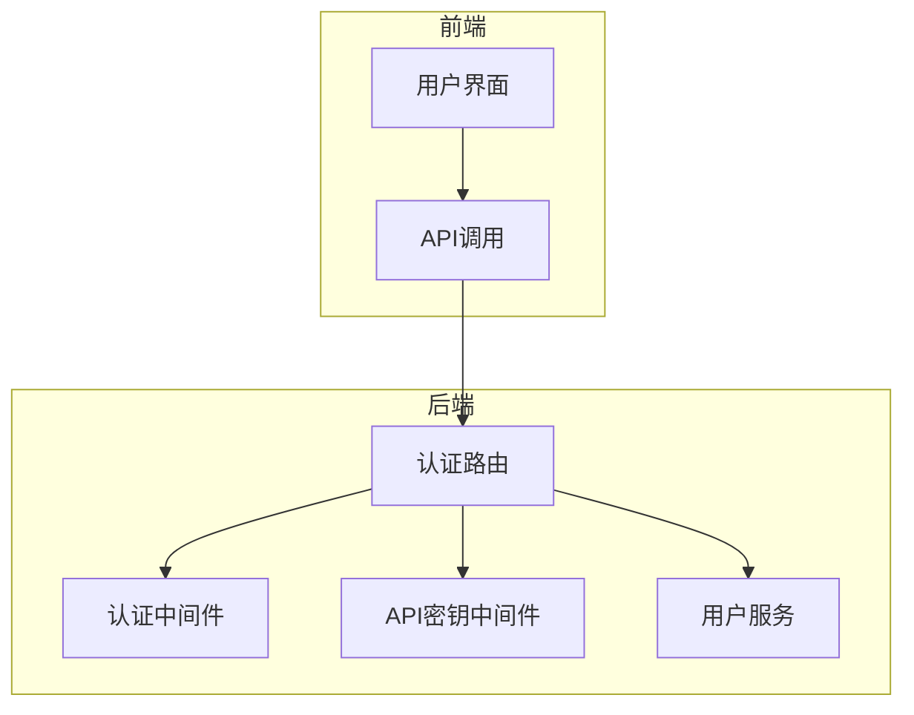
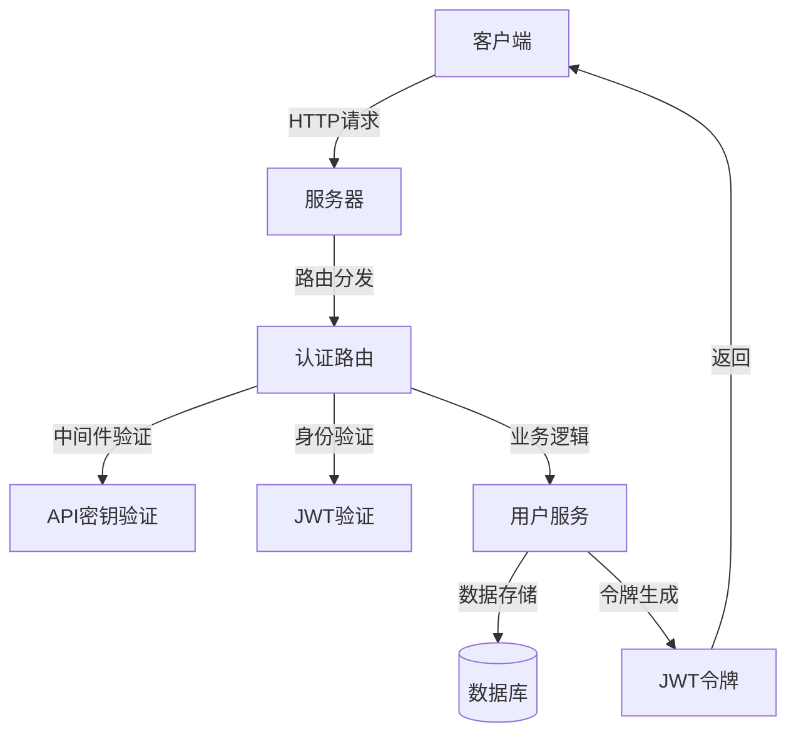
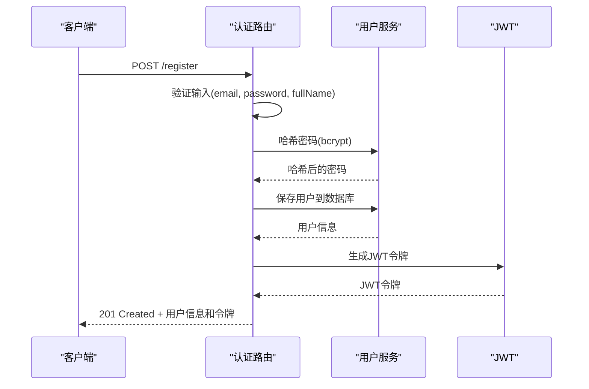
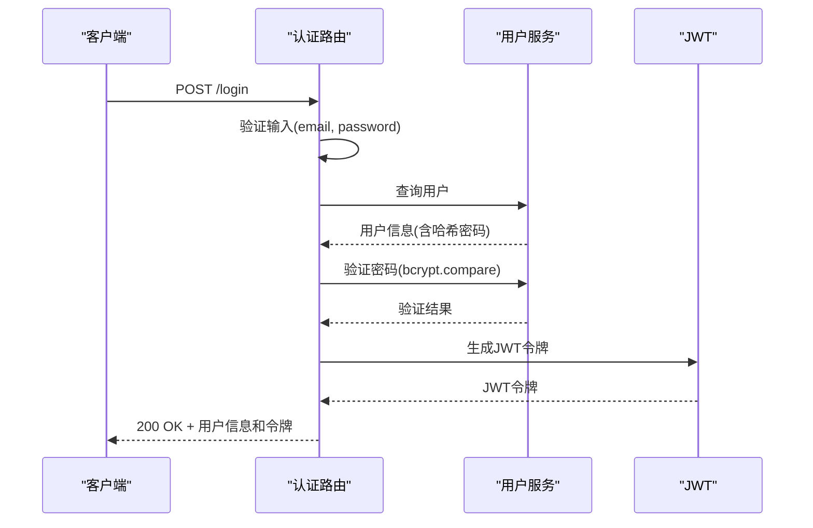
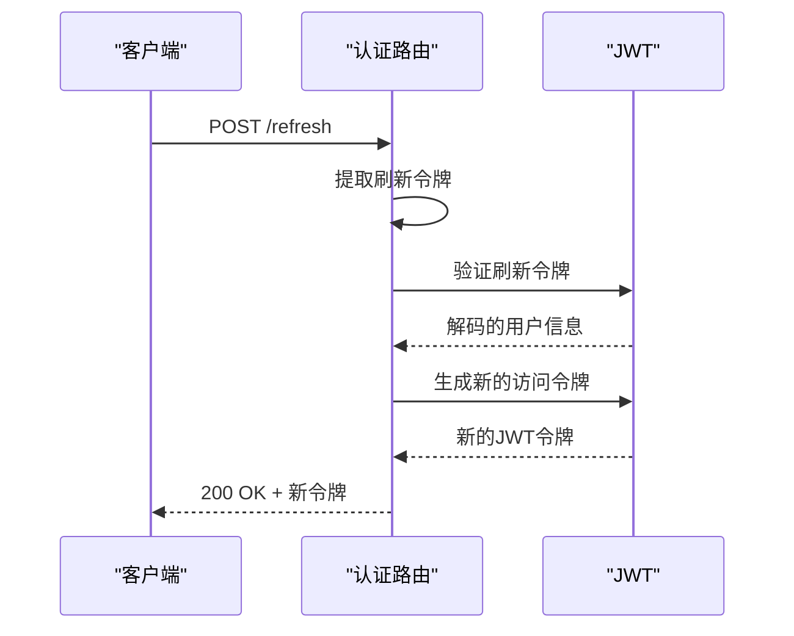
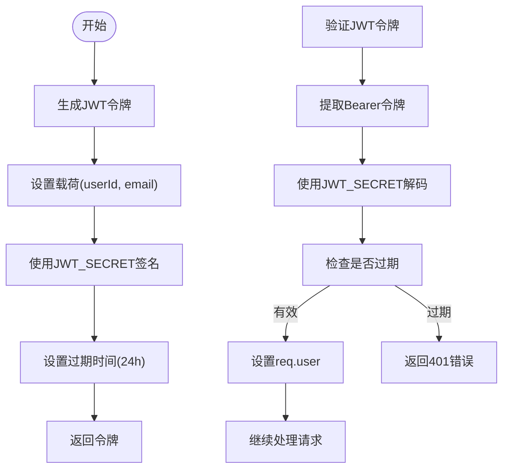
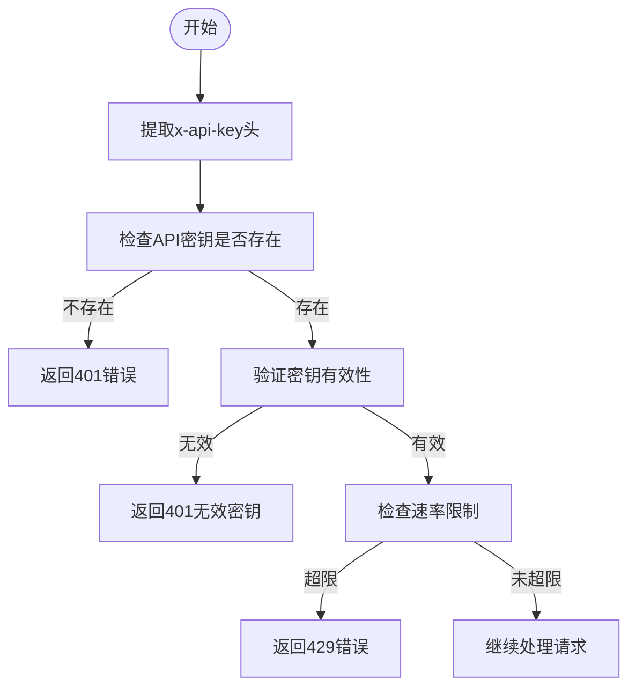
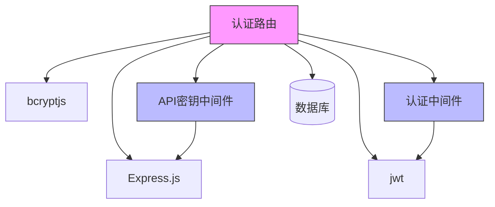

# 认证路由

<cite>
**本文档中引用的文件**   
- [auth.ts](file://backend/src/routes/auth.ts)
- [auth.ts](file://backend/src/middleware/auth.ts)
- [apiKey.ts](file://backend/src/middleware/apiKey.ts)
</cite>

## 目录
1. [简介](#简介)
2. [项目结构](#项目结构)
3. [核心组件](#核心组件)
4. [架构概述](#架构概述)
5. [详细组件分析](#详细组件分析)
6. [依赖分析](#依赖分析)
7. [性能考虑](#性能考虑)
8. [故障排除指南](#故障排除指南)
9. [结论](#结论)
10. [附录](#附录)（如有必要）

## 简介
本文档详细描述了Tribridge Crossroads平台的认证路由系统，涵盖用户注册、登录、令牌刷新和注销等端点。基于`auth.ts`文件中的路由定义，文档详细说明了每个端点的HTTP方法、请求参数、请求头要求和响应格式。同时解释了JWT令牌的生成、验证和刷新机制，以及apiKey中间件在认证流程中的作用。提供了实际的请求/响应示例，包括成功和错误场景，并描述了密码哈希处理、会话管理策略和安全最佳实践。

## 项目结构
认证系统主要由后端路由和中间件组成，前端通过API调用与之交互。系统采用分层架构，将路由、中间件和业务逻辑分离。



**Diagram sources**
- [auth.ts](file://backend/src/routes/auth.ts)
- [auth.ts](file://backend/src/middleware/auth.ts)
- [apiKey.ts](file://backend/src/middleware/apiKey.ts)

**Section sources**
- [auth.ts](file://backend/src/routes/auth.ts)
- [middleware](file://backend/src/middleware)

## 核心组件

认证系统的核心组件包括认证路由、JWT令牌管理、密码哈希处理和API密钥验证。这些组件共同确保了系统的安全性和可靠性。

**Section sources**
- [auth.ts](file://backend/src/routes/auth.ts#L1-L156)
- [auth.ts](file://backend/src/middleware/auth.ts#L1-L166)

## 架构概述

认证系统的架构采用Express.js框架，通过中间件链处理认证请求。系统使用JWT进行状态管理，bcrypt进行密码哈希，并通过API密钥进行额外的安全保护。



**Diagram sources**
- [auth.ts](file://backend/src/routes/auth.ts#L1-L156)
- [auth.ts](file://backend/src/middleware/auth.ts#L1-L166)
- [apiKey.ts](file://backend/src/middleware/apiKey.ts#L1-L136)

## 详细组件分析

### 认证端点分析

#### 用户注册
用户注册端点处理新用户的创建，包括输入验证、密码哈希和JWT令牌生成。



**Diagram sources**
- [auth.ts](file://backend/src/routes/auth.ts#L11-L45)

#### 用户登录
用户登录端点验证用户凭据并生成访问令牌。



**Diagram sources**
- [auth.ts](file://backend/src/routes/auth.ts#L59-L119)

#### 令牌刷新
令牌刷新端点允许用户使用刷新令牌获取新的访问令牌。



**Diagram sources**
- [auth.ts](file://backend/src/routes/auth.ts#L116-L156)

### 认证机制分析

#### JWT令牌生成与验证
系统使用JWT进行无状态会话管理，确保认证的安全性和可扩展性。



**Diagram sources**
- [auth.ts](file://backend/src/middleware/auth.ts#L10-L58)

#### API密钥验证
API密钥中间件为系统提供额外的安全层，限制对敏感端点的访问。



**Diagram sources**
- [apiKey.ts](file://backend/src/middleware/apiKey.ts#L3-L39)

**Section sources**
- [auth.ts](file://backend/src/routes/auth.ts#L1-L156)
- [auth.ts](file://backend/src/middleware/auth.ts#L1-L166)
- [apiKey.ts](file://backend/src/middleware/apiKey.ts#L1-L136)

## 依赖分析

认证系统依赖于多个外部库和内部组件，这些依赖关系确保了系统的完整功能。



**Diagram sources**
- [package.json](file://package.json)
- [auth.ts](file://backend/src/routes/auth.ts)
- [middleware](file://backend/src/middleware)

**Section sources**
- [package.json](file://package.json#L1-L100)
- [auth.ts](file://backend/src/routes/auth.ts#L1-L156)

## 性能考虑

认证系统的性能主要受密码哈希算法和JWT验证的影响。bcrypt的saltRounds设置为10，提供了良好的安全性和性能平衡。JWT验证是轻量级操作，不会对系统性能造成显著影响。API密钥的速率限制机制有助于防止滥用和DDoS攻击。

## 故障排除指南

### 常见错误场景

| 错误代码 | 错误信息 | 可能原因 | 解决方案 |
|---------|--------|--------|--------|
| 400 | 缺少必要的注册信息 | 请求体缺少email、password或fullName | 确保所有必需字段都包含在请求中 |
| 401 | 邮箱或密码错误 | 用户凭据不正确 | 检查邮箱和密码是否正确 |
| 401 | 缺少访问令牌 | 未提供Authorization头 | 在请求头中添加Bearer令牌 |
| 401 | 令牌已过期或无效 | JWT令牌过期或被篡改 | 使用刷新令牌获取新令牌或重新登录 |
| 401 | 缺少API密钥 | 未提供x-api-key头 | 在请求头中添加有效的API密钥 |
| 429 | 请求频率超限 | 超过每分钟60次请求限制 | 降低请求频率或联系管理员提高限制 |

**Section sources**
- [auth.ts](file://backend/src/routes/auth.ts#L1-L156)
- [auth.ts](file://backend/src/middleware/auth.ts#L1-L166)
- [apiKey.ts](file://backend/src/middleware/apiKey.ts#L1-L136)

## 结论

Tribridge Crossroads的认证系统提供了一套完整的用户身份验证解决方案，包括注册、登录、令牌管理和API密钥验证。系统采用行业标准的安全实践，如JWT令牌和bcrypt密码哈希，确保了用户数据的安全性。通过中间件架构，系统实现了关注点分离，提高了代码的可维护性和可扩展性。建议在生产环境中实现完整的数据库集成，并考虑添加多因素认证以进一步增强安全性。

## 附录

### 请求/响应示例

#### 用户注册成功
```json
// 请求
POST /register
Content-Type: application/json

{
  "email": "user@example.com",
  "password": "securepassword123",
  "fullName": "John Doe"
}

// 响应
HTTP/1.1 201 Created
Content-Type: application/json

{
  "success": true,
  "data": {
    "user": {
      "id": "12345",
      "email": "user@example.com",
      "fullName": "John Doe"
    },
    "token": "eyJhbGciOiJIUzI1NiIsInR5cCI6IkpXVCJ9..."
  }
}
```

#### 登录失败（无效凭据）
```json
// 请求
POST /login
Content-Type: application/json

{
  "email": "user@example.com",
  "password": "wrongpassword"
}

// 响应
HTTP/1.1 401 Unauthorized
Content-Type: application/json

{
  "success": false,
  "error": "邮箱或密码错误"
}
```

#### 令牌刷新成功
```json
// 请求
POST /refresh
Content-Type: application/json

{
  "refreshToken": "eyJhbGciOiJIUzI1NiIsInR5cCI6IkpXVCJ9..."
}

// 响应
HTTP/1.1 200 OK
Content-Type: application/json

{
  "success": true,
  "data": {
    "token": "eyJhbGciOiJIUzI1NiIsInR5cCI6IkpXVCJ9..."
  }
}
```