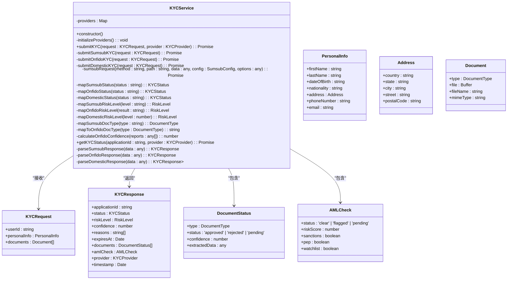
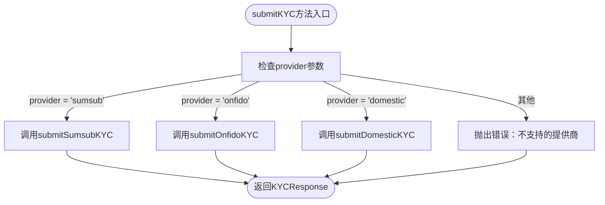
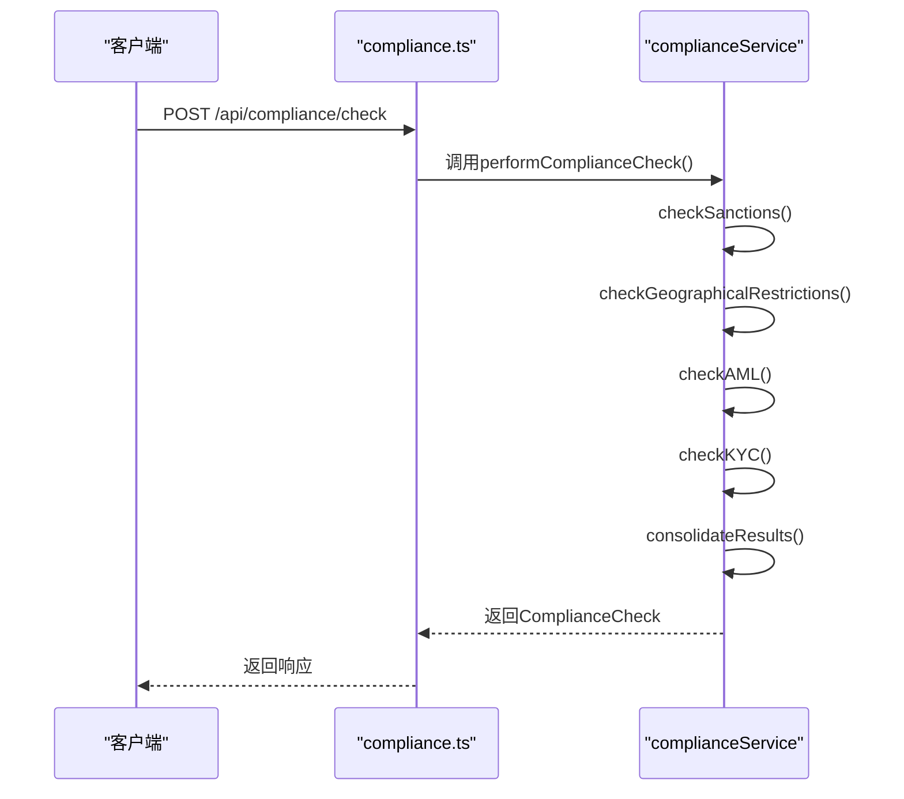
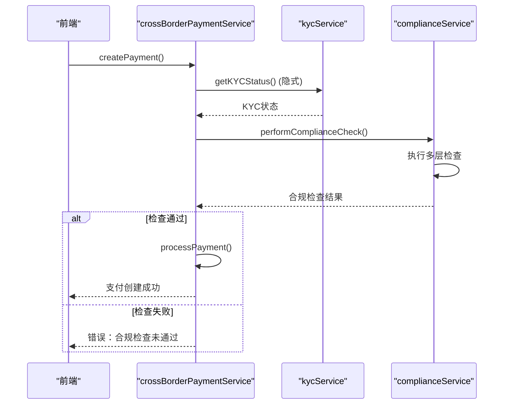

# KYC与合规服务

<cite>
**Referenced Files in This Document**   
- [kycService.ts](file://backend/src/services/kycService.ts)
- [complianceService.ts](file://backend/src/services/complianceService.ts)
- [kyc.ts](file://backend/src/routes/kyc.ts)
- [compliance.ts](file://backend/src/routes/compliance.ts)
- [crossBorderPaymentService.ts](file://backend/src/services/crossBorderPaymentService.ts)
</cite>

## 目录
1. [引言](#引言)
2. [KYC服务架构](#kyc服务架构)
3. [合规服务架构](#合规服务架构)
4. [服务协同工作模式](#服务协同工作模式)
5. [服务调用示例](#服务调用示例)
6. [错误处理策略](#错误处理策略)
7. [性能优化建议](#性能优化建议)
8. [结论](#结论)

## 引言

本文件全面阐述了KYC（了解你的客户）与合规服务的架构与实现。系统通过kycService集成Sumsub、Onfido和国内KYC提供商，实现了多提供商策略模式。同时，complianceService执行多层次合规检查，包括制裁名单、地理限制、反洗钱（AML）和KYC完整性检查。两个服务在跨境支付等关键业务流程中协同工作，确保交易的安全性和合规性。本文档详细解释了这些服务的内部机制、交互模式和最佳实践。

## KYC服务架构

kycService是KYC功能的核心实现，负责与多个第三方KYC提供商的集成。它通过策略模式根据配置的提供商选择相应的验证流程。

### 多提供商集成策略

kycService通过`initializeProviders`方法在构造函数中读取环境变量，初始化Sumsub、Onfido和国内KYC服务的客户端配置。这种设计实现了配置与代码的分离，便于在不同环境（开发、测试、生产）中灵活切换和管理提供商。



**Diagram sources**
- [kycService.ts](file://backend/src/services/kycService.ts)

**Section sources**
- [kycService.ts](file://backend/src/services/kycService.ts)

### submitKYC方法的路由逻辑

`submitKYC`方法是kycService的核心入口，它根据调用者指定的`provider`参数，使用`switch`语句将请求路由到相应的第三方服务实现。



**Diagram sources**
- [kycService.ts](file://backend/src/services/kycService.ts#L133-L149)

**Section sources**
- [kycService.ts](file://backend/src/services/kycService.ts#L133-L149)

### 签名生成机制

当与Sumsub等需要签名验证的API交互时，kycService通过`sumsubRequest`工具方法生成签名。该机制使用HMAC-SHA256算法，以时间戳、HTTP方法、请求路径和请求体（或空字符串）作为输入，结合提供商的`secret`密钥生成签名。此签名与时间戳、API密钥一起作为请求头发送，确保了通信的安全性和完整性。

### 状态映射策略

由于不同KYC提供商使用不同的状态码，kycService通过`mapSumsubStatus`、`mapOnfidoStatus`和`mapDomesticStatus`等私有方法，将各提供商的原始状态映射到统一的`KYCStatus`枚举类型（`pending`, `in_review`, `approved`, `rejected`）。这种适配器模式确保了上层应用无需关心底层提供商的具体实现细节，简化了业务逻辑。

## 合规服务架构

complianceService负责执行多层次的合规审查，确保所有交易符合反洗钱和制裁法规。

### 多层次合规检查

complianceService通过`performComplianceCheck`方法执行一系列并行的检查，包括制裁名单、地理限制、AML和KYC完整性检查。这些检查的结果被汇总并加权，最终确定交易的整体风险等级和处理状态。



**Diagram sources**
- [complianceService.ts](file://backend/src/services/complianceService.ts#L102-L149)
- [compliance.ts](file://backend/src/routes/compliance.ts#L4-L20)

**Section sources**
- [complianceService.ts](file://backend/src/services/complianceService.ts#L102-L149)

### 检查类型详解

1.  **制裁名单检查 (`checkSanctions`)**：将用户信息与内部维护的OFAC、EU、UN等制裁名单进行匹配。一旦发现匹配，风险分数直接降为0，状态为“critical”。
2.  **地理限制检查 (`checkGeographicalRestrictions`)**：检查用户所在国家和交易目标国家是否在受限国家列表中。对于“full_block”类型的国家，交易被直接阻止；对于“enhanced_dd”类型的国家，则需要增强尽职调查。
3.  **反洗钱检查 (`checkAML`)**：分析交易金额和频率模式。大额交易（>10,000）或高频交易会被标记为可疑模式。
4.  **KYC完整性检查 (`checkKYC`)**：验证用户的关键KYC信息（如全名、出生日期、地址、身份证件）是否完整。缺失任何一项都会导致风险等级上升。

## 服务协同工作模式

在跨境支付等复杂业务场景中，kycService和complianceService紧密协作，形成一个完整的风控流程。

### 跨境支付中的串联执行

在`crossBorderPaymentService`中，创建支付请求时会触发一个完整的合规审查流程。该流程首先进行初步的KYC状态验证，然后调用`complianceService.performComplianceCheck`执行全面的合规检查。



**Diagram sources**
- [crossBorderPaymentService.ts](file://backend/src/services/crossBorderPaymentService.ts#L95-L607)
- [kycService.ts](file://backend/src/services/kycService.ts)
- [complianceService.ts](file://backend/src/services/complianceService.ts)

**Section sources**
- [crossBorderPaymentService.ts](file://backend/src/services/crossBorderPaymentService.ts#L95-L607)

## 服务调用示例

以下是如何通过API路由调用这些服务的示例。

### 提交KYC申请

```http
POST /api/kyc/submit
Content-Type: application/json

{
  "personalInfo": {
    "firstName": "张",
    "lastName": "三",
    "dateOfBirth": "1990-01-01",
    "nationality": "CN",
    "address": {
      "country": "CN",
      "state": "Beijing",
      "city": "Beijing",
      "street": "Zhongguancun Street",
      "postalCode": "100080"
    },
    "phoneNumber": "+8613800138000",
    "email": "zhangsan@example.com"
  },
  "documents": [
    {
      "type": "id_card",
      "fileName": "id_card.jpg",
      "mimeType": "image/jpeg"
      // 文件内容以base64编码
    }
  ],
  "provider": "sumsub"
}
```

### 执行合规检查

```http
POST /api/compliance/check
Content-Type: application/json

{
  "userId": "user_123",
  "transactionId": "txn_456",
  "checkData": {
    "userCountry": "CN",
    "destinationCountry": "RU",
    "amount": 50000,
    "currency": "CNY",
    "userInfo": {
      "fullName": "张三",
      "dateOfBirth": "1990-01-01",
      "address": "Beijing, China",
      "idDocument": "verified"
    }
  }
}
```

## 错误处理策略

两个服务都采用了稳健的错误处理策略。

-   **kycService**：在`submitKYC`方法中使用`try-catch`块捕获所有错误，并记录详细的错误日志，然后将错误重新抛出，由上层路由处理并返回500错误。
-   **complianceService**：在`performComplianceCheck`中，每个子检查都可能抛出错误，但服务会捕获并处理这些错误，确保即使某个检查失败，其他检查仍能继续执行，最终返回一个包含所有可用信息的综合结果。

## 性能优化建议

1.  **缓存**：对于频繁查询的KYC状态和合规检查结果，应引入Redis等缓存机制，减少对第三方API和数据库的直接调用。
2.  **异步处理**：对于耗时的KYC验证流程，可以采用消息队列（如RabbitMQ），将`submitKYC`请求异步化，立即返回一个“处理中”的状态，通过Webhook接收最终结果。
3.  **并行检查**：complianceService中的多个检查（制裁、地理、AML、KYC）可以并行执行，以减少总处理时间。
4.  **连接池**：与第三方API的HTTP连接应使用连接池，避免频繁建立和断开连接的开销。

## 结论

kycService和complianceService共同构成了系统强大的风控体系。kycService通过灵活的多提供商策略，确保了KYC验证的全球覆盖和高可用性。complianceService则通过多层次、可扩展的检查框架，有效防范了金融风险。两个服务通过清晰的接口和事件驱动的模式协同工作，在保障用户体验的同时，严格遵守了各项合规要求。通过实施建议的性能优化措施，可以进一步提升系统的响应速度和吞吐量。