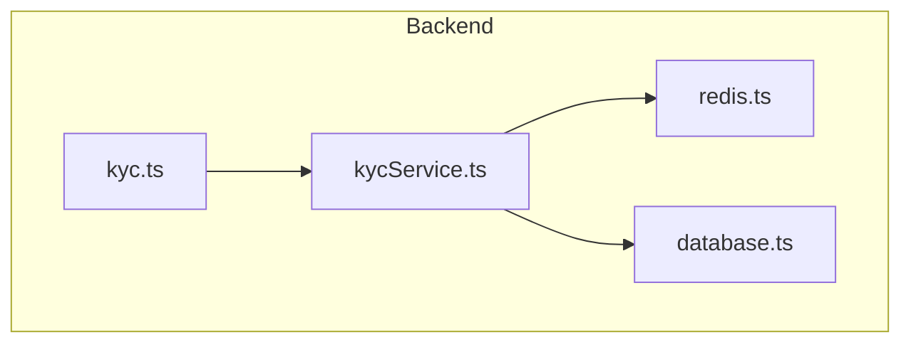
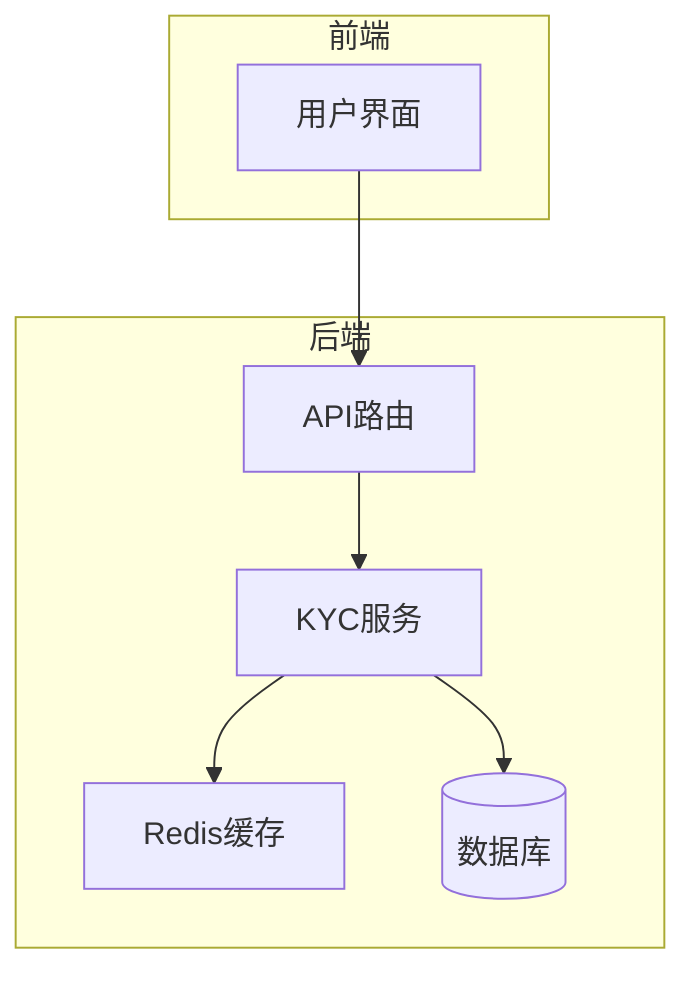
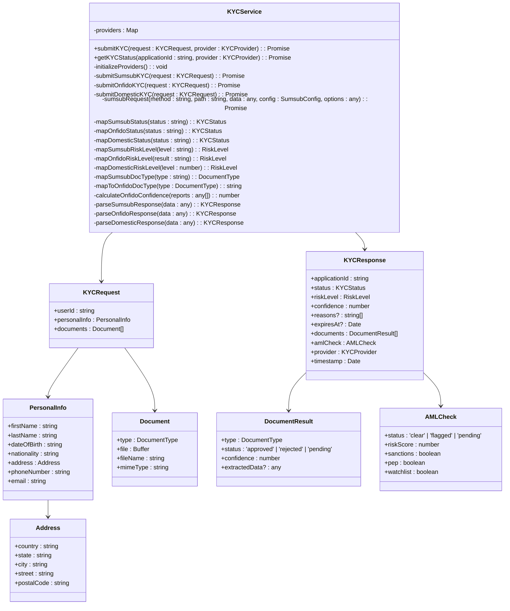
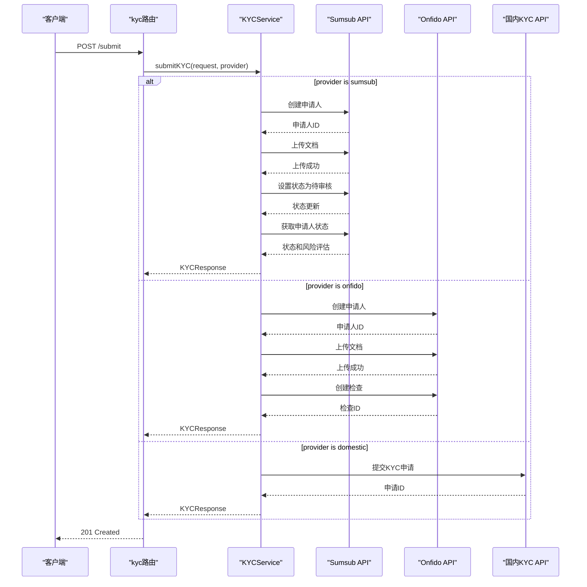
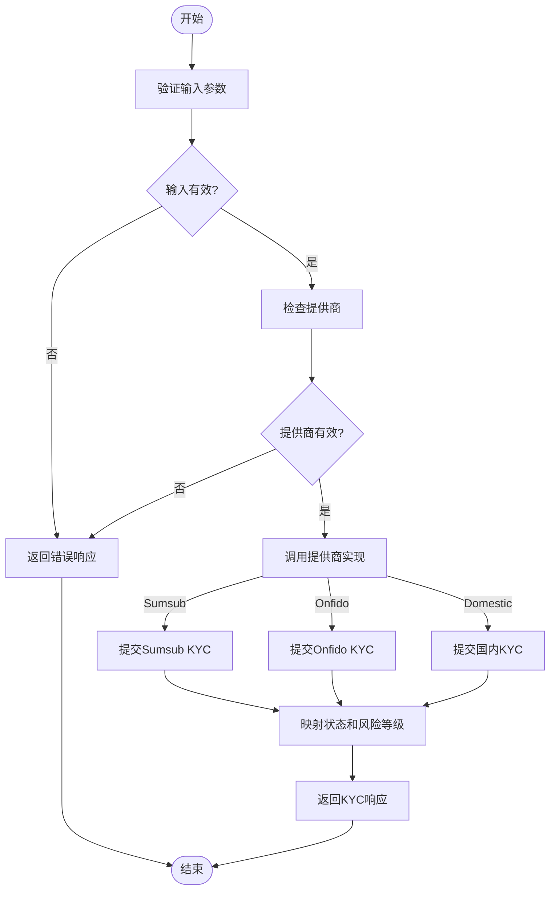
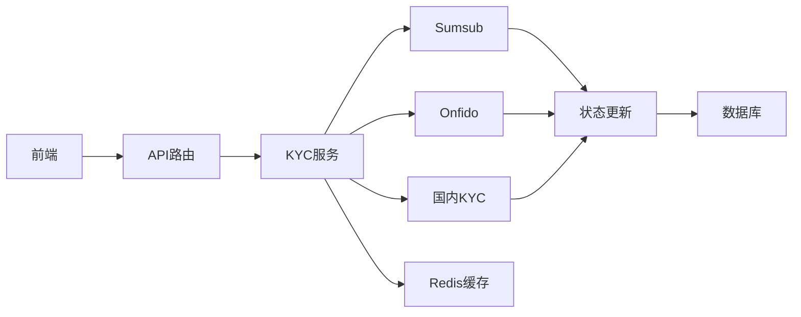
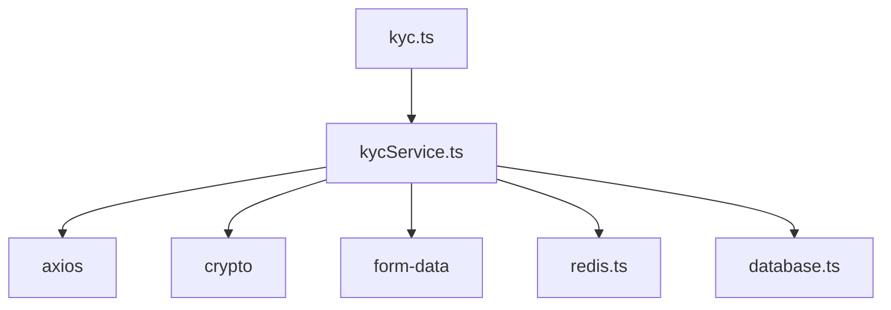

# KYC服务

<cite>
**本文档中引用的文件**   
- [kycService.ts](file://backend/src/services/kycService.ts)
- [kyc.ts](file://backend/src/routes/kyc.ts)
- [redis.ts](file://backend/src/services/redis.ts)
- [database.ts](file://backend/src/services/database.ts)
</cite>

## 目录
1. [引言](#引言)
2. [项目结构](#项目结构)
3. [核心组件](#核心组件)
4. [架构概述](#架构概述)
5. [详细组件分析](#详细组件分析)
6. [依赖分析](#依赖分析)
7. [性能考虑](#性能考虑)
8. [故障排除指南](#故障排除指南)
9. [结论](#结论)
10. [附录](#附录) (如有必要)

## 引言
KYC服务是本系统中负责身份验证和反洗钱（AML）合规性的核心模块。该服务集成了Sumsub、Onfido和国内KYC提供商，实现了多提供商策略模式，以满足不同地区和监管要求的合规需求。服务通过统一的接口处理KYC申请，支持护照、身份证、驾驶执照等多种文档类型的验证，并根据提供商的响应进行状态映射和风险评估。此外，服务还支持异步处理和缓存机制，以提高性能和用户体验。

## 项目结构
KYC服务的代码主要分布在`backend/src/services`和`backend/src/routes`目录下。`kycService.ts`文件包含了KYC服务的核心逻辑，包括与不同提供商的集成、状态映射和签名生成。`kyc.ts`文件定义了KYC相关的API路由，如提交KYC申请、获取KYC状态等。`redis.ts`和`database.ts`文件提供了缓存和数据库支持，用于存储KYC状态和历史记录。

**图源**
- [kycService.ts](file://backend/src/services/kycService.ts)
- [kyc.ts](file://backend/src/routes/kyc.ts)
- [redis.ts](file://backend/src/services/redis.ts)
- [database.ts](file://backend/src/services/database.ts)

**节源**
- [kycService.ts](file://backend/src/services/kycService.ts)
- [kyc.ts](file://backend/src/routes/kyc.ts)

## 核心组件
KYC服务的核心组件包括`KYCService`类和`kyc`路由。`KYCService`类负责与Sumsub、Onfido和国内KYC提供商的集成，处理KYC申请的提交、状态获取和结果解析。`kyc`路由定义了KYC相关的API端点，如`/submit`、`/status`、`/documents`和`/webhook`，用于处理前端的请求和第三方提供商的回调。

**节源**
- [kycService.ts](file://backend/src/services/kycService.ts#L95-L559)
- [kyc.ts](file://backend/src/routes/kyc.ts#L0-L209)

## 架构概述
KYC服务采用分层架构，分为路由层、服务层和数据层。路由层负责接收和响应HTTP请求，服务层处理业务逻辑并与第三方提供商交互，数据层负责存储和检索KYC相关数据。服务通过环境变量动态加载配置，支持多提供商策略模式，并使用Redis缓存提高性能。

**图源**
- [kyc.ts](file://backend/src/routes/kyc.ts#L0-L209)
- [kycService.ts](file://backend/src/services/kycService.ts#L95-L559)
- [redis.ts](file://backend/src/services/redis.ts#L12-L333)
- [database.ts](file://backend/src/services/database.ts#L20-L246)

## 详细组件分析

### KYC服务分析
`KYCService`类是KYC服务的核心，负责与不同提供商的集成和业务逻辑处理。服务通过`initializeProviders`方法根据环境变量动态加载配置，支持Sumsub、Onfido和国内KYC提供商。`submitKYC`方法根据指定的提供商调用相应的实现，如`submitSumsubKYC`、`submitOnfidoKYC`和`submitDomesticKYC`。

#### 对象导向组件：

**图源**
- [kycService.ts](file://backend/src/services/kycService.ts#L95-L559)

#### API/服务组件：

**图源**
- [kyc.ts](file://backend/src/routes/kyc.ts#L0-L63)
- [kycService.ts](file://backend/src/services/kycService.ts#L113-L156)

#### 复杂逻辑组件：

**图源**
- [kycService.ts](file://backend/src/services/kycService.ts#L113-L156)

**节源**
- [kycService.ts](file://backend/src/services/kycService.ts#L95-L559)
- [kyc.ts](file://backend/src/routes/kyc.ts#L0-L209)

### 概念概述
KYC服务的设计旨在提供一个灵活、可扩展的身份验证解决方案，支持多种第三方提供商。通过统一的接口和多提供商策略模式，服务能够适应不同地区的监管要求，并提供一致的用户体验。服务还支持异步处理和缓存机制，以提高性能和可靠性。

## 依赖分析
KYC服务依赖于`axios`库进行HTTP请求，`crypto`库生成HMAC-SHA256签名，`form-data`库处理文件上传。服务还依赖于`redis`和`database`服务进行数据存储和缓存。`kyc`路由依赖于`KYCService`类处理业务逻辑。

**图源**
- [kycService.ts](file://backend/src/services/kycService.ts#L0-L46)
- [kyc.ts](file://backend/src/routes/kyc.ts#L0-L209)

**节源**
- [kycService.ts](file://backend/src/services/kycService.ts#L0-L46)
- [kyc.ts](file://backend/src/routes/kyc.ts#L0-L209)

## 性能考虑
KYC服务通过使用Redis缓存来提高性能，减少对第三方提供商的重复请求。服务还支持异步处理，允许在后台处理KYC申请，提高响应速度。此外，服务通过环境变量动态加载配置，支持多提供商策略模式，提高灵活性和可扩展性。

## 故障排除指南
在使用KYC服务时，可能会遇到以下问题：
- **提供商配置错误**：确保环境变量中正确配置了提供商的API密钥和密钥。
- **网络连接问题**：检查与第三方提供商的网络连接，确保能够正常访问API。
- **文档上传失败**：验证上传的文档格式和大小是否符合提供商的要求。
- **状态映射错误**：检查状态映射逻辑，确保正确映射不同提供商的状态。

**节源**
- [kycService.ts](file://backend/src/services/kycService.ts#L380-L434)
- [kyc.ts](file://backend/src/routes/kyc.ts#L118-L180)

## 结论
KYC服务通过集成Sumsub、Onfido和国内KYC提供商，实现了多提供商策略模式，满足了不同地区的合规需求。服务通过统一的接口处理KYC申请，支持多种文档类型的验证，并根据提供商的响应进行状态映射和风险评估。通过使用Redis缓存和异步处理，服务提高了性能和用户体验。未来可以进一步优化状态映射逻辑，支持更多提供商，并增强错误处理和日志记录。