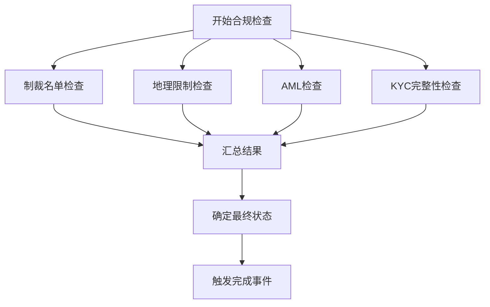
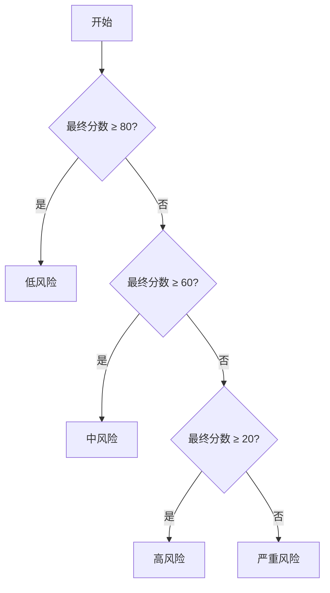
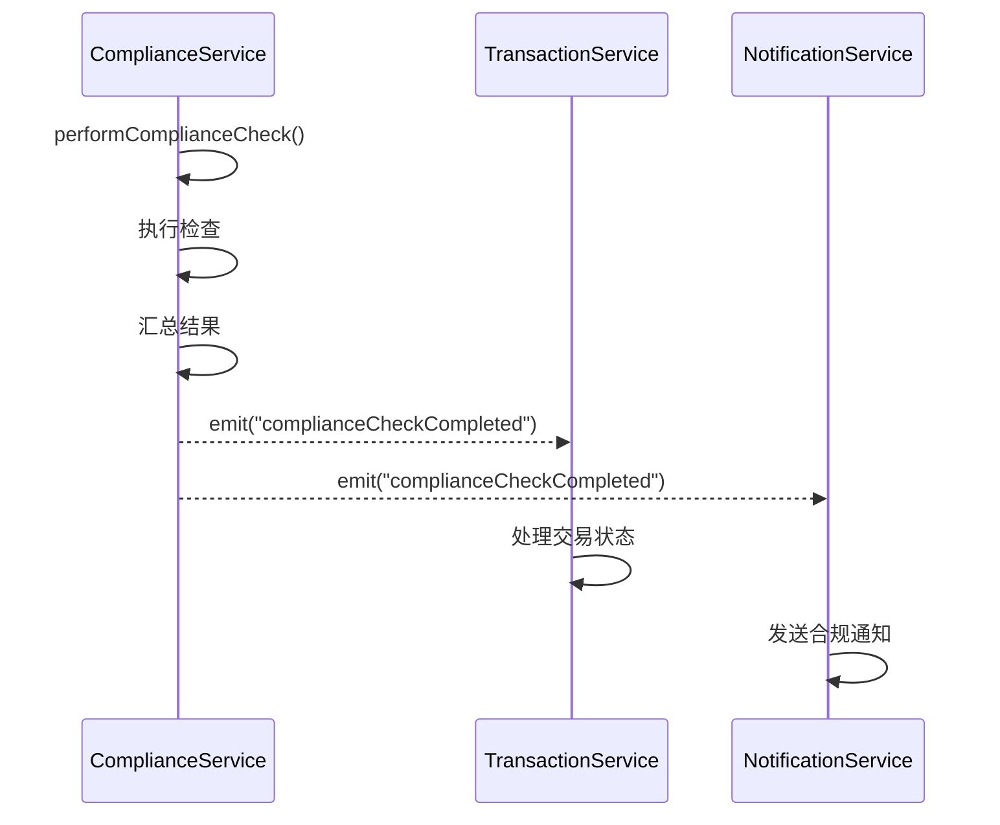
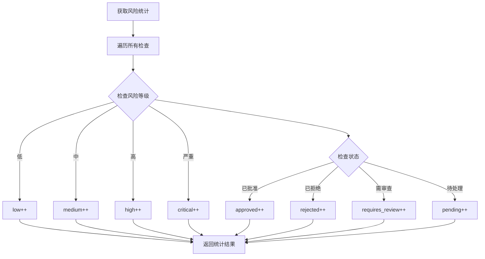

# 合规服务

<cite>
**本文档中引用的文件**  
- [complianceService.ts](file://backend/src/services/complianceService.ts)
- [compliance.ts](file://backend/src/routes/compliance.ts)
- [ComplianceModule.tsx](file://src/components/ComplianceModule.tsx)
</cite>

## 目录
1. [引言](#引言)
2. [多层次合规检查机制](#多层次合规检查机制)
3. [执行流程与结果汇总](#执行流程与结果汇总)
4. [风险评分与等级划分](#风险评分与等级划分)
5. [事件驱动通知机制](#事件驱动通知机制)
6. [状态管理与手动审查](#状态管理与手动审查)
7. [风险统计功能](#风险统计功能)
8. [实际使用示例](#实际使用示例)
9. [性能优化建议](#性能优化建议)

## 引言
合规服务是跨境支付平台的核心安全组件，负责在交易过程中执行全面的合规性检查。该服务通过集成制裁名单筛查、地理限制验证、反洗钱（AML）分析和KYC完整性检查，确保所有交易符合国际监管要求。本服务采用模块化设计，支持灵活扩展，并通过事件驱动架构实现与其他系统的高效集成。

**Section sources**
- [complianceService.ts](file://backend/src/services/complianceService.ts#L44-L458)

## 多层次合规检查机制
合规服务实现了四层检查机制，分别针对不同类型的合规风险：

1. **制裁名单检查**：比对用户信息与OFAC、欧盟和联合国制裁名单，包括国家、个人和实体。
2. **地理限制检查**：根据预定义的高风险国家列表，检查用户所在国家和交易目标国家。
3. **反洗钱（AML）检查**：分析交易金额和频率模式，识别可疑交易行为。
4. **KYC完整性检查**：验证用户身份信息的完整性，确保关键字段已填写。

每项检查独立执行，返回部分结果，最终由主服务汇总决策。



**Diagram sources**
- [complianceService.ts](file://backend/src/services/complianceService.ts#L102-L149)

**Section sources**
- [complianceService.ts](file://backend/src/services/complianceService.ts#L145-L190)

## 执行流程与结果汇总
`performComplianceCheck` 方法是合规检查的核心入口，其执行流程如下：

1. 创建新的合规检查记录，状态初始化为"pending"。
2. 并行执行四项独立检查：制裁名单、地理限制、AML和KYC。
3. 调用 `consolidateResults` 方法汇总所有检查结果。
4. 根据汇总结果确定最终状态。
5. 将检查结果存储在内存映射中。
6. 发出 `complianceCheckCompleted` 事件通知监听者。

结果汇总策略基于最坏情况原则：取所有检查中最低的分数作为最终分数，合并所有标志和建议，并保留所有匹配的制裁名单条目。

**Section sources**
- [complianceService.ts](file://backend/src/services/complianceService.ts#L102-L149)

## 风险评分与等级划分
风险评分系统采用0-100分制，分数越低表示风险越高。评分计算基于各项检查的严重程度：

- 制裁名单匹配：直接设为0分（最高风险）
- 地理限制（完全阻止）：0分
- 地理限制（增强尽职调查）：≤30分
- 大额交易（>5万美元）：≤40分
- 高频交易：≤50分
- KYC信息不完整：≤70分

风险等级根据最终分数划分：
- **低风险**：80-100分
- **中风险**：60-79分
- **高风险**：20-59分
- **严重风险**：0-19分



**Diagram sources**
- [complianceService.ts](file://backend/src/services/complianceService.ts#L339-L366)

**Section sources**
- [complianceService.ts](file://backend/src/services/complianceService.ts#L339-L366)

## 事件驱动通知机制
合规服务继承自 `EventEmitter`，利用事件驱动架构实现松耦合的通知机制。当合规检查完成或状态更新时，服务会发出相应事件：

- `complianceCheckCompleted`：当检查完成时发出，携带完整的检查结果。
- `complianceStatusUpdated`：当手动审查更新状态时发出。

其他服务（如通知服务、交易服务）可以监听这些事件，执行后续操作，如发送通知、更新交易状态等，而无需直接调用合规服务。



**Diagram sources**
- [complianceService.ts](file://backend/src/services/complianceService.ts#L145-L149)

**Section sources**
- [complianceService.ts](file://backend/src/services/complianceService.ts#L44-L458)

## 状态管理与手动审查
合规服务提供完整的状态管理功能，支持手动审查流程：

- **状态类型**：pending（待处理）、approved（已批准）、rejected（已拒绝）、requires_review（需审查）。
- **状态确定逻辑**：严重风险→拒绝，高风险→需审查，其他→批准。
- **手动审查**：通过 `updateCheckStatus` 方法更新检查状态，支持添加审查备注。

前端组件（如 `ComplianceModule`）提供用户界面，允许合规人员查看检查详情、制裁名单匹配和建议措施，并执行批准或拒绝操作。

**Section sources**
- [complianceService.ts](file://backend/src/services/complianceService.ts#L368-L412)
- [ComplianceModule.tsx](file://src/components/ComplianceModule.tsx#L696-L730)

## 风险统计功能
合规服务提供 `getRiskStatistics` 方法，返回全局风险统计数据，包括：

- **总检查数**：已完成的合规检查总数。
- **风险分布**：按风险等级（低、中、高、严重）统计的检查数量。
- **状态分布**：按状态（待处理、已批准、已拒绝、需审查）统计的检查数量。

这些统计数据可用于监控系统整体合规状况，识别风险趋势，并为管理层提供决策支持。



**Diagram sources**
- [complianceService.ts](file://backend/src/services/complianceService.ts#L414-L460)

**Section sources**
- [complianceService.ts](file://backend/src/services/complianceService.ts#L414-L460)

## 实际使用示例
以下是一个典型的合规检查API调用示例：

```json
POST /api/compliance/check
{
  "userId": "user_123",
  "transactionId": "tx_456",
  "checkData": {
    "userCountry": "RU",
    "destinationCountry": "US",
    "amount": 15000,
    "currency": "USDT",
    "userInfo": {
      "fullName": "Vladimir Putin",
      "dateOfBirth": "1952-10-07",
      "address": "Moscow, Russia",
      "idDocument": "PASS123456"
    },
    "transactionPattern": {
      "dailyCount": 15
    }
  }
}
```

此请求将触发完整的合规检查流程，由于用户姓名与制裁名单匹配，检查结果将被标记为严重风险，状态为"rejected"。

**Section sources**
- [compliance.ts](file://backend/src/routes/compliance.ts#L0-L48)
- [ComplianceModule.tsx](file://src/components/ComplianceModule.tsx#L176-L217)

## 性能优化建议
1. **缓存机制**：对于频繁访问的制裁名单和地理限制数据，考虑使用Redis缓存，减少内存查找开销。
2. **异步处理**：对于非关键路径的检查（如某些AML模式分析），可改为异步执行，提高响应速度。
3. **批量检查**：提供批量合规检查接口，减少单个请求的开销。
4. **索引优化**：为制裁名单和地理限制数据建立适当的索引，加快查找速度。
5. **定期清理**：实现过期检查结果的自动清理机制，防止内存无限增长。
6. **并行检查**：确保四项检查真正并行执行，充分利用多核CPU性能。

**Section sources**
- [complianceService.ts](file://backend/src/services/complianceService.ts#L102-L149)