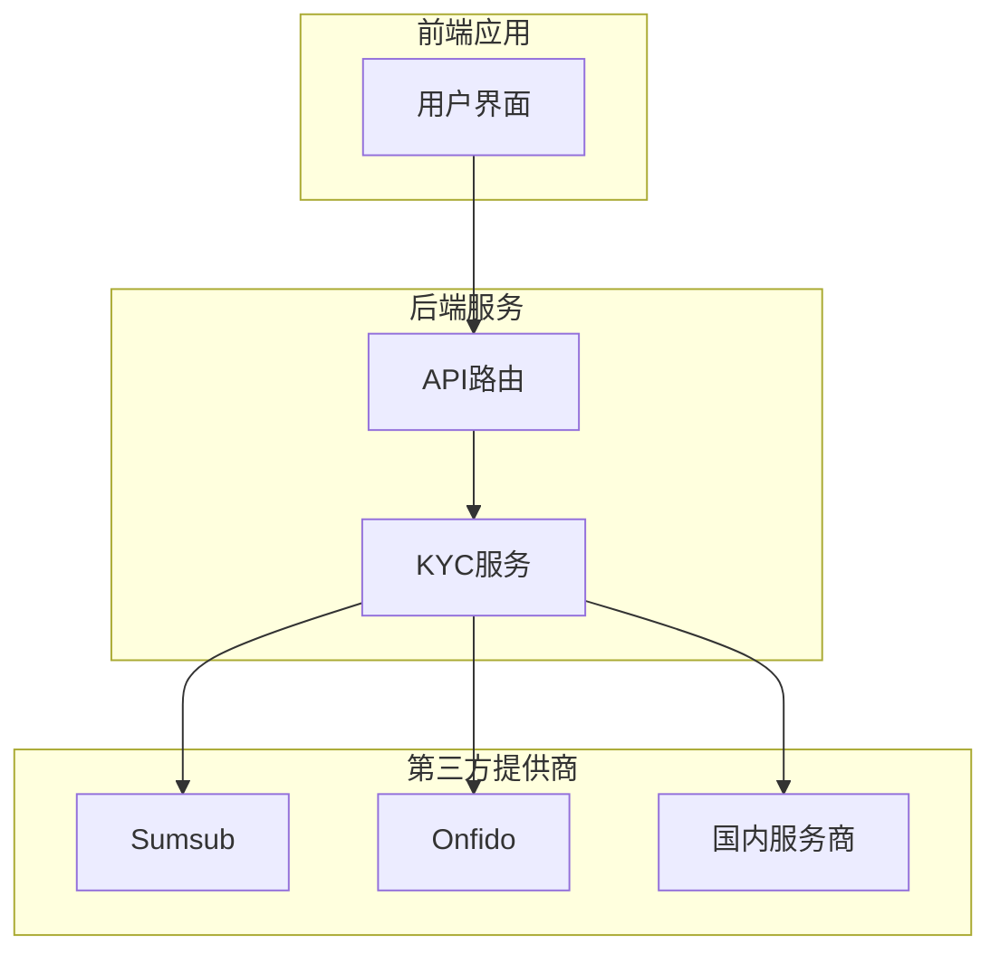
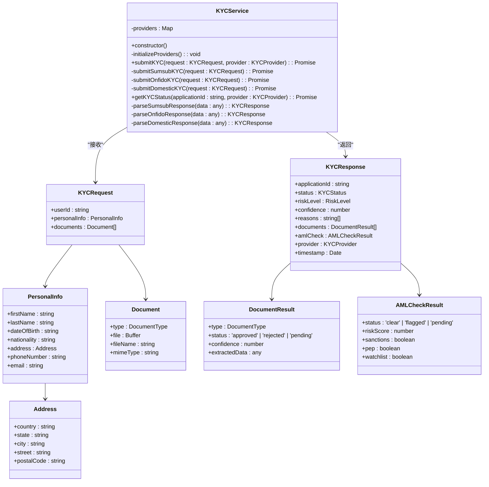
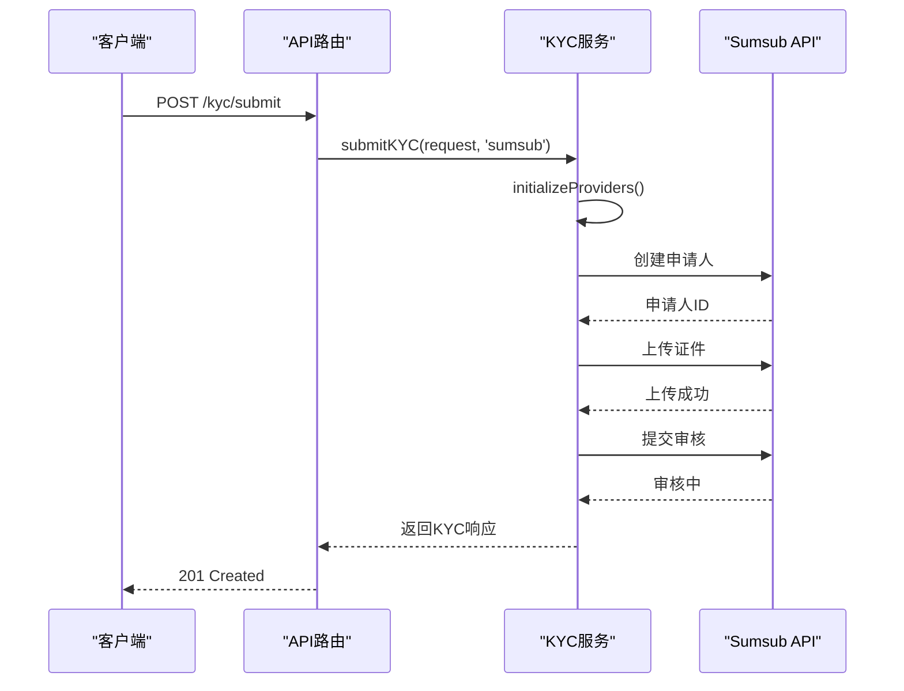
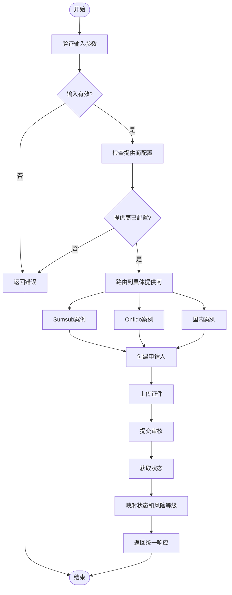
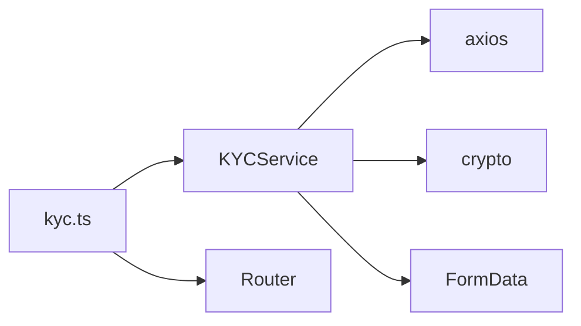

# KYC服务

<cite>
**Referenced Files in This Document**  
- [kycService.ts](file://backend/src/services/kycService.ts)
- [kyc.ts](file://backend/src/routes/kyc.ts)
</cite>

## 目录
1. [简介](#简介)
2. [核心组件](#核心组件)
3. [架构概览](#架构概览)
4. [详细组件分析](#详细组件分析)
5. [依赖分析](#依赖分析)
6. [性能考量](#性能考量)
7. [故障排除指南](#故障排除指南)
8. [结论](#结论)

## 简介
KYC服务是系统合规验证的核心组件，负责集成并协调多个第三方身份验证提供商（如Sumsub、Onfido和国内服务商），为用户提供全面的“了解你的客户”（KYC）和反洗钱（AML）验证功能。该服务通过统一的接口抽象不同提供商的实现细节，使应用程序能够灵活选择和切换验证渠道，同时确保数据格式和状态管理的一致性。其主要职责包括提交KYC申请、查询验证状态、处理Webhook回调以及管理多提供商的配置和认证。

## 核心组件
KYC服务的核心功能由`KYCService`类实现，该类封装了与所有第三方KYC提供商的交互逻辑。服务通过`submitKYC`方法接收标准化的KYC请求，并根据配置的提供商（`sumsub`、`onfido`或`domestic`）路由到相应的实现方法。`initializeProviders`方法在服务实例化时被调用，负责从环境变量中加载各提供商的API密钥和配置。`getKYCStatus`方法用于查询特定申请的当前状态，而`parseSumsubResponse`等解析方法则负责将不同提供商的异构响应数据映射到统一的`KYCResponse`模型中。

**Section sources**
- [kycService.ts](file://backend/src/services/kycService.ts#L95-L559)

## 架构概览

**Diagram sources**
- [kycService.ts](file://backend/src/services/kycService.ts#L95-L559)
- [kyc.ts](file://backend/src/routes/kyc.ts#L1-L209)

## 详细组件分析
### KYC服务分析
`KYCService`类是整个合规验证流程的中枢。它采用策略模式，根据请求中指定的提供商动态选择具体的验证实现。服务通过一个`Map`结构存储各提供商的配置，这些配置在构造函数中通过`initializeProviders`方法初始化，该方法会检查环境变量以确定哪些提供商已启用并加载其对应的API凭证。

#### 对象导向组件

**Diagram sources**
- [kycService.ts](file://backend/src/services/kycService.ts#L23-L71)
- [kycService.ts](file://backend/src/services/kycService.ts#L95-L559)

#### API/服务组件

**Diagram sources**
- [kycService.ts](file://backend/src/services/kycService.ts#L152-L222)
- [kyc.ts](file://backend/src/routes/kyc.ts#L1-L209)

#### 复杂逻辑组件

**Diagram sources**
- [kycService.ts](file://backend/src/services/kycService.ts#L133-L149)
- [kycService.ts](file://backend/src/services/kycService.ts#L152-L222)

**Section sources**
- [kycService.ts](file://backend/src/services/kycService.ts#L95-L559)

## 依赖分析

**Diagram sources**
- [kycService.ts](file://backend/src/services/kycService.ts#L1-L20)
- [kyc.ts](file://backend/src/routes/kyc.ts#L1-L209)

**Section sources**
- [kycService.ts](file://backend/src/services/kycService.ts#L1-L20)
- [kyc.ts](file://backend/src/routes/kyc.ts#L1-L209)

## 性能考量
该服务的性能主要受网络延迟和第三方提供商API响应时间的影响。`submitSumsubKYC`方法中的多个串行API调用（创建申请人、上传证件、提交审核）是潜在的性能瓶颈。为提高效率，可以考虑对文档上传进行并行处理。此外，频繁调用`getKYCStatus`查询状态可能会导致不必要的API调用，建议实现缓存机制以减少对第三方服务的依赖。服务的初始化过程是轻量级的，仅涉及从环境变量读取配置，因此对启动性能影响很小。

## 故障排除指南
常见问题包括提供商配置缺失、API密钥无效以及网络连接问题。当`submitKYC`失败时，应首先检查对应提供商的环境变量（如`SUMSUB_API_KEY`）是否已正确设置。`sumsubRequest`方法中的签名生成逻辑对请求体和时间戳非常敏感，任何偏差都可能导致401未授权错误。对于Webhook处理，确保`/kyc/webhook`端点能够被外部提供商访问，并正确处理不同提供商的事件格式。日志记录是诊断问题的关键，所有错误都会被`console.error`捕获。

**Section sources**
- [kycService.ts](file://backend/src/services/kycService.ts#L224-L240)
- [kyc.ts](file://backend/src/routes/kyc.ts#L1-L209)

## 结论
KYC服务成功地为系统提供了一个灵活且可扩展的合规验证框架。通过抽象多个第三方提供商的实现细节，它简化了集成复杂性，并允许业务根据地域和监管要求选择最合适的验证渠道。服务的设计清晰，职责分离良好，核心的`submitKYC`和`getKYCStatus`方法提供了简洁的外部接口。未来可改进的方向包括完善响应解析方法、增加对更多提供商的支持以及实现更健壮的错误重试和缓存机制。