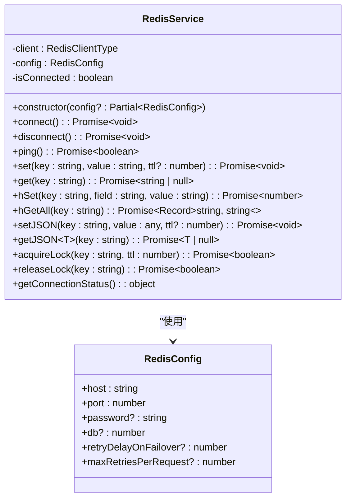
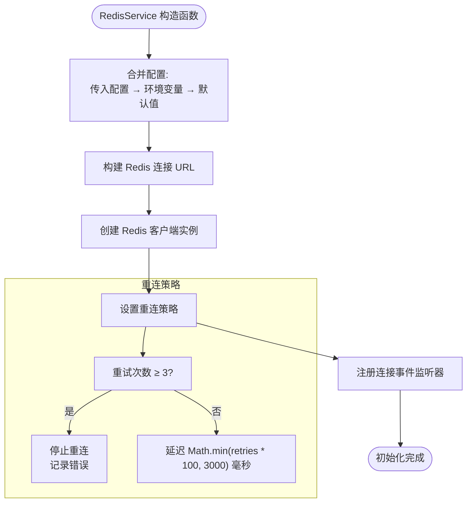
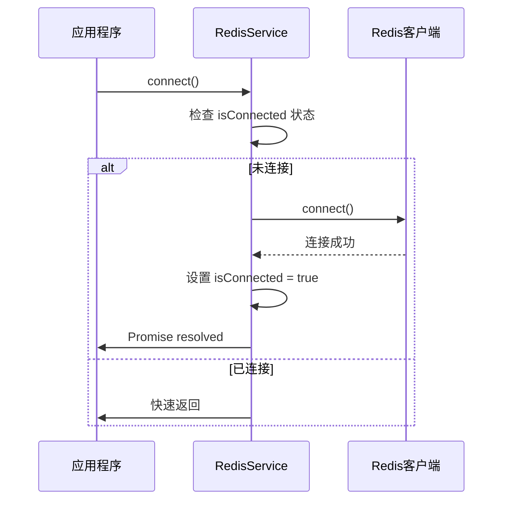
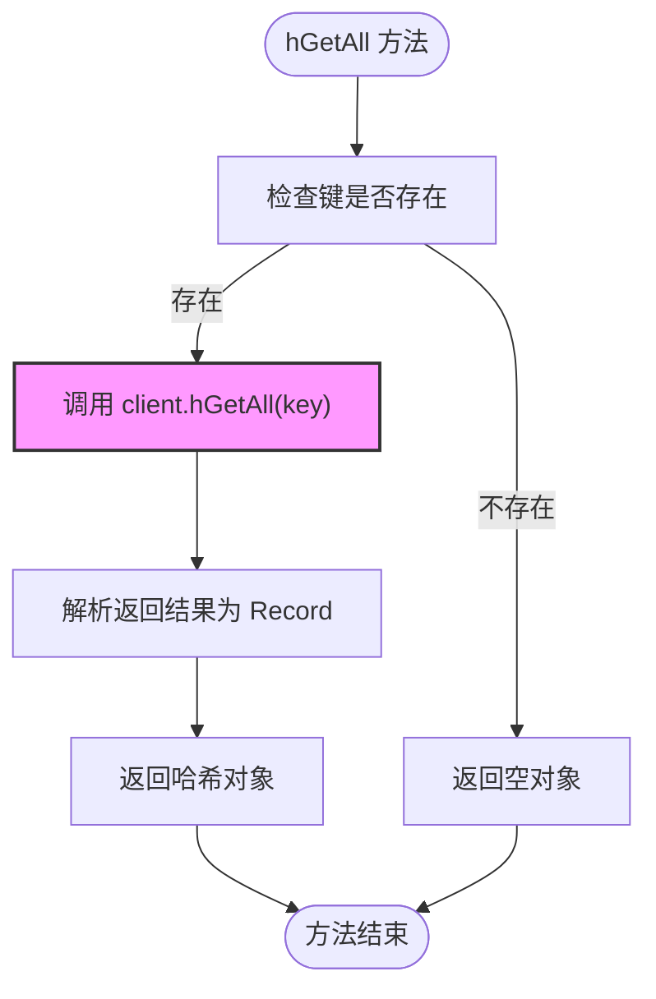
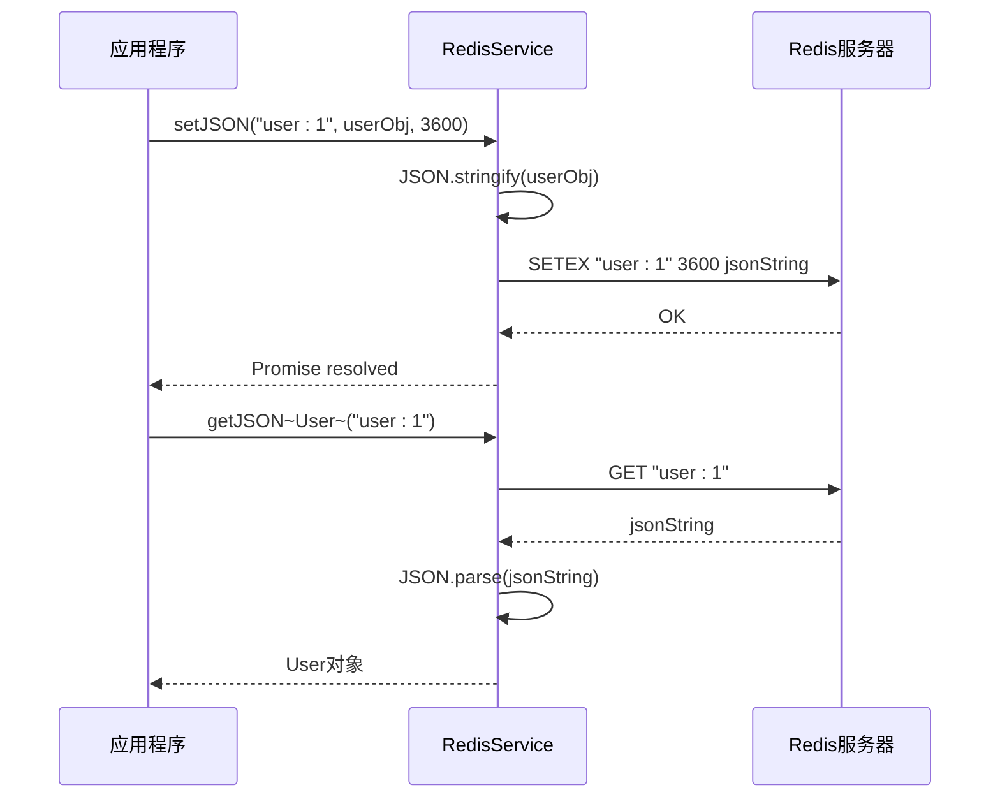
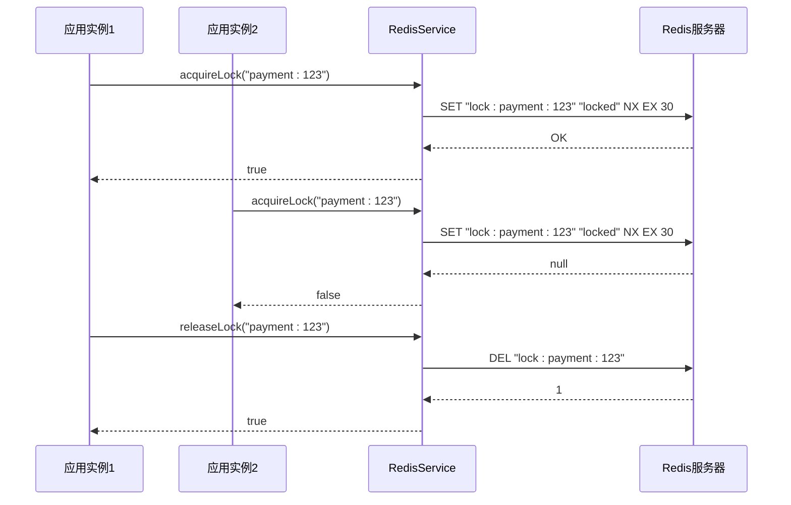
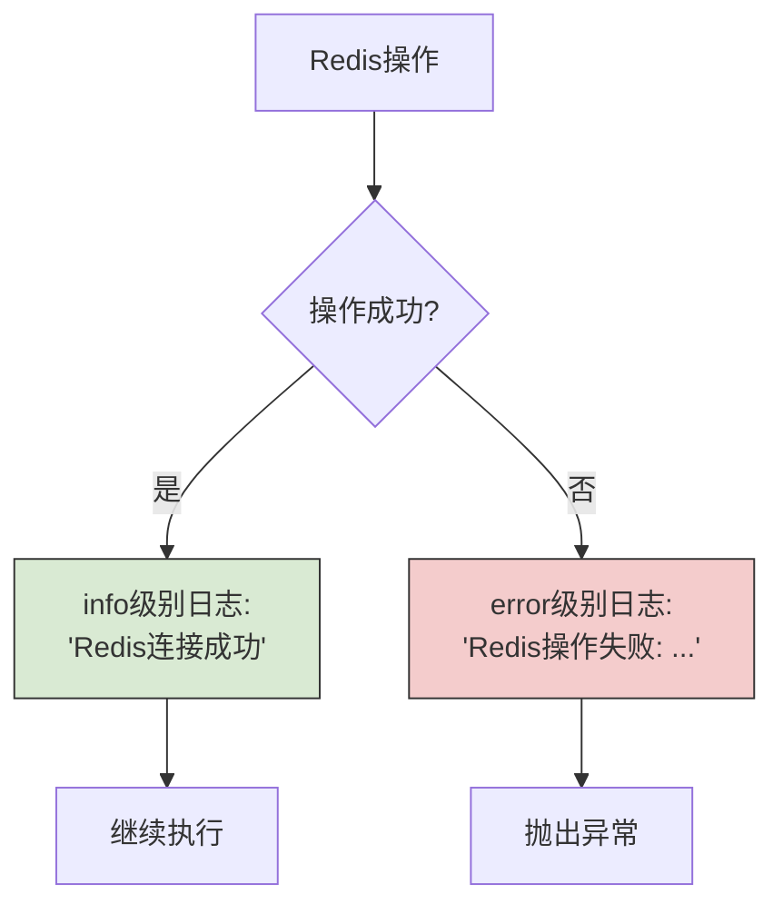

# Redis服务

<cite>
**Referenced Files in This Document**   
- [redis.ts](file://backend/src/services/redis.ts)
- [logger.ts](file://backend/src/utils/logger.ts)
</cite>

## 目录
1. [简介](#简介)
2. [核心组件](#核心组件)
3. [配置管理](#配置管理)
4. [连接管理](#连接管理)
5. [数据操作](#数据操作)
6. [高级功能](#高级功能)
7. [使用示例](#使用示例)
8. [性能监控与故障排查](#性能监控与故障排查)

## 简介

RedisService 是系统中的核心缓存与分布式协调组件，提供高性能的内存数据存储和分布式锁机制。该服务封装了 Redis 客户端的所有操作，为应用程序提供统一的缓存接口。RedisService 支持多种数据结构操作，包括字符串、哈希、列表、集合和有序集合，并提供了 JSON 序列化支持和分布式锁功能，确保在分布式环境下的数据一致性和并发安全。

**Section sources**
- [redis.ts](file://backend/src/services/redis.ts#L1-L336)

## 核心组件

RedisService 的核心由 `RedisConfig` 接口和 `RedisService` 类组成。`RedisConfig` 定义了 Redis 连接所需的所有参数，而 `RedisService` 类实现了连接管理、数据操作和分布式协调功能。服务通过环境变量提供默认配置，同时支持运行时传入自定义配置，确保了部署的灵活性和安全性。



**Diagram sources**
- [redis.ts](file://backend/src/services/redis.ts#L3-L10)
- [redis.ts](file://backend/src/services/redis.ts#L12-L333)

**Section sources**
- [redis.ts](file://backend/src/services/redis.ts#L3-L333)

## 配置管理

### RedisConfig 接口定义

`RedisConfig` 接口定义了 Redis 连接的所有配置参数，包括主机地址、端口、密码、数据库编号以及重连策略。这些配置参数既可以通过构造函数传入，也可以通过环境变量进行设置，提供了灵活的配置方式。

```typescript
export interface RedisConfig {
  host: string
  port: number
  password?: string
  db?: number
  retryDelayOnFailover?: number
  maxRetriesPerRequest?: number
}
```

### 环境变量映射关系

RedisService 通过环境变量提供默认配置，确保在不同部署环境中的一致性。以下是配置参数与环境变量的映射关系：

| 配置参数 | 环境变量 | 默认值 | 说明 |
|---------|---------|-------|------|
| host | REDIS_HOST | localhost | Redis 服务器主机地址 |
| port | REDIS_PORT | 6379 | Redis 服务器端口 |
| password | REDIS_PASSWORD | 无 | Redis 认证密码 |
| db | REDIS_DB | 0 | Redis 数据库编号 |
| retryDelayOnFailover | 无 | 100 | 故障转移时的重试延迟（毫秒） |
| maxRetriesPerRequest | 无 | 3 | 每个请求的最大重试次数 |

**Section sources**
- [redis.ts](file://backend/src/services/redis.ts#L19-L22)
- [redis.ts](file://backend/src/services/redis.ts#L3-L10)

## 连接管理

### 构造函数与客户端初始化

`RedisService` 的构造函数接收可选的配置对象，优先使用传入的配置，然后回退到环境变量，最后使用默认值。构造函数根据配置创建 Redis 客户端，并设置重连策略。当重试次数达到3次时，将停止重连并记录错误日志。



**Diagram sources**
- [redis.ts](file://backend/src/services/redis.ts#L67-L78)

### 连接方法

`connect` 方法负责建立与 Redis 服务器的连接。在连接前会检查当前连接状态，避免重复连接。连接成功后会更新 `isConnected` 状态并记录日志。



**Diagram sources**
- [redis.ts](file://backend/src/services/redis.ts#L67-L78)

### 断开连接与测试

`disconnect` 方法用于安全地断开与 Redis 服务器的连接，清理资源并更新连接状态。`ping` 方法用于测试连接的可用性，通过发送 PING 命令并验证返回结果来确认连接状态。

**Section sources**
- [redis.ts](file://backend/src/services/redis.ts#L81-L103)

## 数据操作

### 核心数据操作方法

RedisService 提供了对 Redis 各种数据结构的封装操作，包括字符串、哈希、列表、集合和有序集合。

#### 字符串操作
- `set(key, value, ttl?)`: 设置字符串值，可选 TTL（生存时间）
- `get(key)`: 获取字符串值
- `del(key)`: 删除键
- `exists(key)`: 检查键是否存在
- `expire(key, seconds)`: 设置键的过期时间

#### 哈希操作
- `hSet(key, field, value)`: 在哈希中设置字段值
- `hGet(key, field)`: 获取哈希中字段的值
- `hGetAll(key)`: 获取哈希中所有字段和值
- `hDel(key, field)`: 删除哈希中的字段



**Diagram sources**
- [redis.ts](file://backend/src/services/redis.ts#L156-L163)
- [redis.ts](file://backend/src/services/redis.ts#L174-L181)

## 高级功能

### JSON 序列化支持

`setJSON` 和 `getJSON` 方法提供了对复杂对象的序列化存储支持。`setJSON` 将任意 JavaScript 对象转换为 JSON 字符串后存储，而 `getJSON` 则从 Redis 中读取 JSON 字符串并解析为原始对象类型。



**Diagram sources**
- [redis.ts](file://backend/src/services/redis.ts#L277-L293)

### 分布式锁实现

`acquireLock` 和 `releaseLock` 方法实现了基于 Redis 的分布式锁，用于防止多个实例同时执行关键操作。锁的实现使用了 Redis 的 `SET` 命令的 NX（不存在时设置）和 EX（过期时间）选项，确保了锁的原子性和自动释放。



**Diagram sources**
- [redis.ts](file://backend/src/services/redis.ts#L296-L319)

## 使用示例

### 会话缓存

```typescript
// 存储用户会话
await redis.setJSON(`session:${sessionId}`, sessionData, 3600)

// 获取用户会话
const session = await redis.getJSON<Session>(`session:${sessionId}`)
```

### 实时数据存储

```typescript
// 存储实时交易数据
await redis.hSet('trading:stats', 'volume', totalVolume.toString())
await redis.hSet('trading:stats', 'count', transactionCount.toString())

// 获取所有交易统计
const stats = await redis.hGetAll('trading:stats')
```

### 分布式锁控制

```typescript
// 防止并发支付处理
const lockAcquired = await redis.acquireLock(`payment:${orderId}`, 60)
if (lockAcquired) {
  try {
    // 执行支付处理逻辑
    await processPayment(orderId)
  } finally {
    // 确保释放锁
    await redis.releaseLock(`payment:${orderId}`)
  }
} else {
  // 锁已被其他实例持有，稍后重试
  throw new Error('Payment processing is already in progress')
}
```

**Section sources**
- [redis.ts](file://backend/src/services/redis.ts#L277-L319)

## 性能监控与故障排查

### 连接状态监控

`getConnectionStatus` 方法提供了当前连接状态的完整信息，包括连接状态、准备状态和配置详情，便于监控和诊断。

```typescript
const status = redis.getConnectionStatus()
console.log('Redis连接状态:', status)
// 输出: { isConnected: true, isReady: true, config: { host: 'localhost', port: 6379, db: 0 } }
```

### 日志记录

RedisService 集成了 winston 日志系统，记录所有关键操作和错误信息。日志级别根据环境变量配置，生产环境使用更严格的日志格式。



**Diagram sources**
- [logger.ts](file://backend/src/utils/logger.ts#L86-L92)
- [redis.ts](file://backend/src/services/redis.ts#L67-L78)