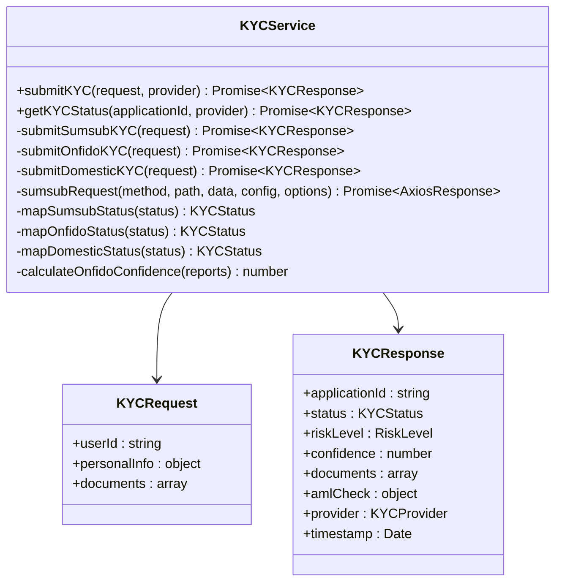
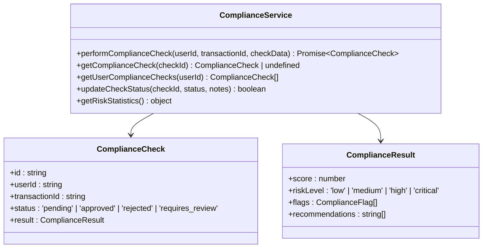
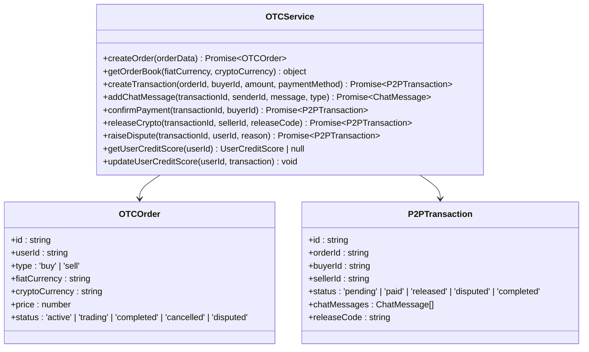
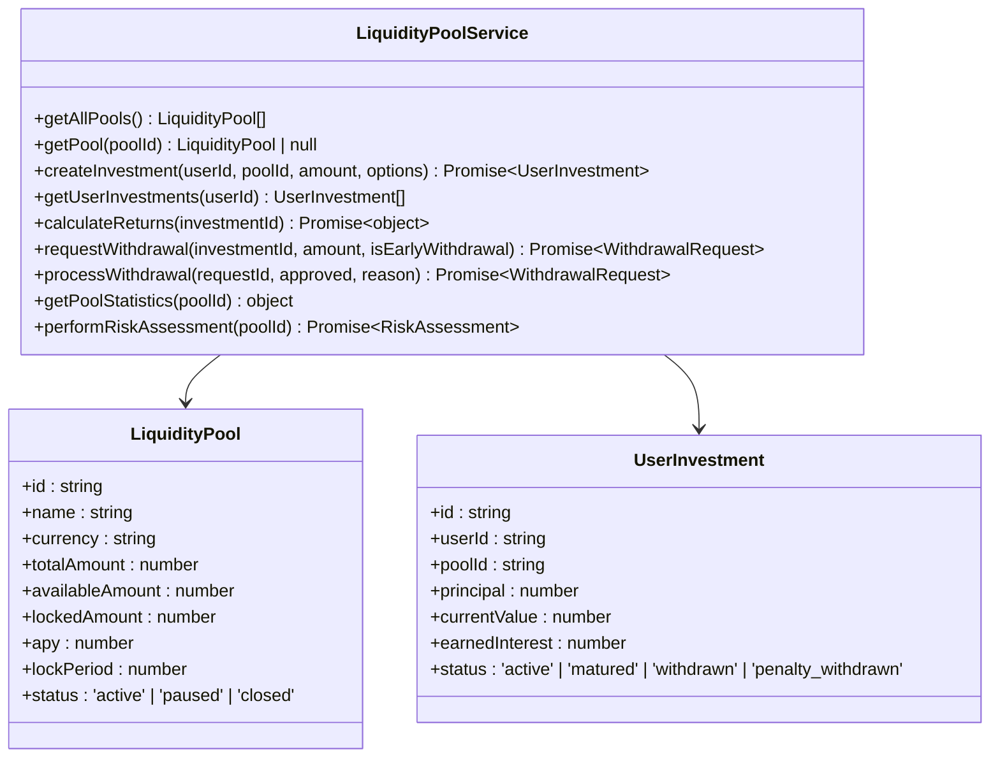
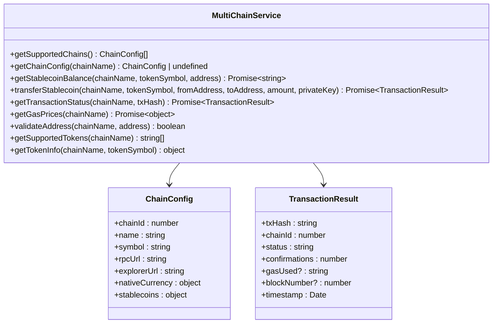
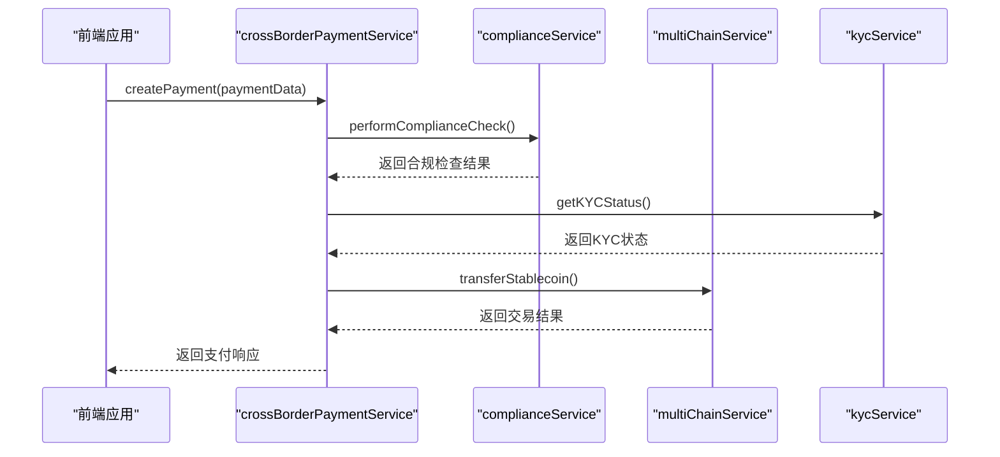
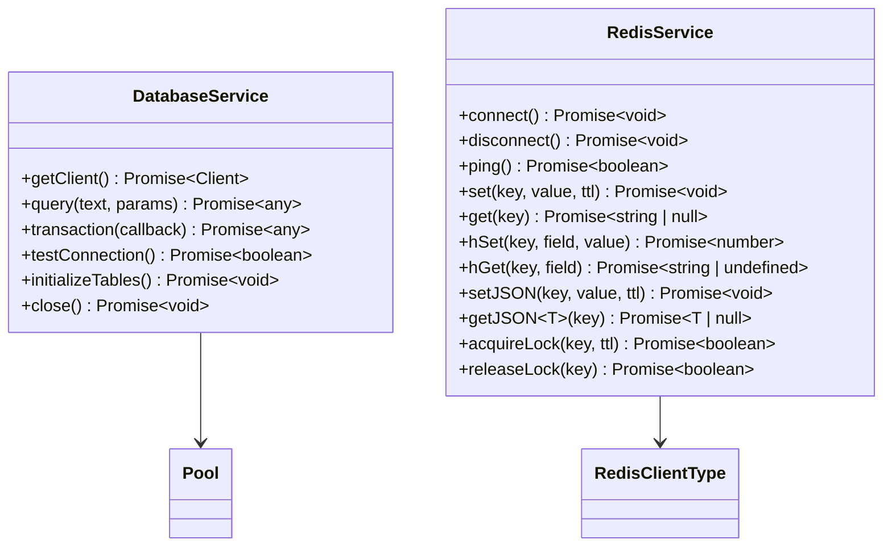

# 业务服务层

<cite>
**本文档引用的文件**   
- [kycService.ts](file://backend/src/services/kycService.ts)
- [complianceService.ts](file://backend/src/services/complianceService.ts)
- [otcService.ts](file://backend/src/services/otcService.ts)
- [liquidityPoolService.ts](file://backend/src/services/liquidityPoolService.ts)
- [multiChainService.ts](file://backend/src/services/multiChainService.ts)
- [crossBorderPaymentService.ts](file://backend/src/services/crossBorderPaymentService.ts)
- [database.ts](file://backend/src/services/database.ts)
- [redis.ts](file://backend/src/services/redis.ts)
</cite>

## 目录
1. [简介](#简介)
2. [核心服务模块](#核心服务模块)
3. [服务间依赖关系](#服务间依赖关系)
4. [数据访问抽象层](#数据访问抽象层)
5. [服务调用模式与机制](#服务调用模式与机制)
6. [关键服务方法调用示例](#关键服务方法调用示例)

## 简介

业务服务层是系统的核心，负责封装所有核心业务逻辑。它由多个专门的服务模块组成，每个模块负责特定领域的业务功能，包括KYC/AML合规、场外交易(OTC)、流动性池管理、多链交互和跨境支付等。这些服务通过清晰的接口与上层API路由和下层数据访问层进行交互，实现了业务逻辑的高内聚和低耦合。服务层还集成了PostgreSQL数据库和Redis缓存，为应用提供可靠的数据持久化和高性能的缓存支持。

## 核心服务模块

### kycService分析
kycService实现了与多个第三方合规服务商的集成，支持Sumsub、Onfido和国内KYC服务。其构造函数通过initializeProviders方法读取环境变量中的API密钥和配置，初始化各服务商的客户端。submitKYC方法根据指定的provider参数，路由到相应的第三方服务实现KYC申请提交。该服务还实现了签名生成、状态映射和置信度计算等辅助功能，确保与不同服务商的API兼容性。



**图示来源**
- [kycService.ts](file://backend/src/services/kycService.ts#L95-L559)

**本节来源**
- [kycService.ts](file://backend/src/services/kycService.ts#L95-L559)

### complianceService分析
complianceService负责执行全面的合规检查，包括制裁名单筛查、地理限制检查、反洗钱(AML)监控和KYC完整性验证。该服务通过EventEmitter模式发布合规检查完成和状态更新事件。performComplianceCheck方法协调多个检查流程，最终生成包含风险评分、风险等级和处理建议的综合结果。服务还提供了获取风险统计和手动更新检查状态的功能。



**图示来源**
- [complianceService.ts](file://backend/src/services/complianceService.ts#L44-L458)

**本节来源**
- [complianceService.ts](file://backend/src/services/complianceService.ts#L44-L458)

### otcService分析
otcService管理场外交易(OTC)的完整生命周期，包括订单创建、交易撮合、聊天沟通和争议处理。服务维护一个订单簿(orderBook)，根据价格和类型对订单进行排序。createTransaction方法创建P2P交易，并通过事件机制通知相关方。服务还实现了用户信用评分系统，根据交易完成率和争议率动态更新用户信誉。



**图示来源**
- [otcService.ts](file://backend/src/services/otcService.ts#L84-L450)

**本节来源**
- [otcService.ts](file://backend/src/services/otcService.ts#L84-L450)

### liquidityPoolService分析
liquidityPoolService负责管理多个流动性池，处理用户投资、收益计算和资金提取。服务通过startPerformanceTracking定时任务每日更新资金池的绩效数据。createInvestment方法创建新的投资记录，并更新资金池的可用和锁定金额。calculateReturns方法根据年化收益率(APY)和管理费计算投资收益。



**图示来源**
- [liquidityPoolService.ts](file://backend/src/services/liquidityPoolService.ts#L90-L686)

**本节来源**
- [liquidityPoolService.ts](file://backend/src/services/liquidityPoolService.ts#L90-L686)

### multiChainService分析
multiChainService作为跨链操作的核心协调者，统一管理Ethereum、TRON和BSC三条区块链的交互。其构造函数通过initializeChains和initializeProviders方法配置各链的RPC端点和Web3提供者。该服务提供getStablecoinBalance和transferStablecoin等方法，封装了不同区块链（EVM兼容链与TRON）在余额查询和转账实现上的差异。通过getTransactionStatus方法，可以跨链查询交易确认状态，为上层应用提供统一的交易监控接口。



**图示来源**
- [multiChainService.ts](file://backend/src/services/multiChainService.ts#L48-L505)

**本节来源**
- [multiChainService.ts](file://backend/src/services/multiChainService.ts#L48-L505)

## 服务间依赖关系

### crossBorderPaymentService分析
crossBorderPaymentService是协调多个服务完成复杂业务流程的典范。它在创建跨境支付时，会协调调用kycService、complianceService和multiChainService。该服务支持CIPS、NPS、SWIFT和SPFS等多种支付系统，根据支付请求的系统类型选择相应的处理逻辑。服务通过startStatusPolling定时任务轮询支付状态，并通过事件机制通知状态更新。



**图示来源**
- [crossBorderPaymentService.ts](file://backend/src/services/crossBorderPaymentService.ts#L95-L607)

**本节来源**
- [crossBorderPaymentService.ts](file://backend/src/services/crossBorderPaymentService.ts#L95-L607)

## 数据访问抽象层

### database和redis服务分析
database服务基于PostgreSQL提供数据持久化支持，封装了连接池管理、查询执行和事务处理等数据库操作。其构造函数接受配置参数，建立到PostgreSQL的连接，并通过query和transaction方法提供安全的数据访问接口。redis服务则基于Redis提供高速缓存和分布式锁功能，支持字符串、哈希、列表等多种数据结构的操作。两个服务均实现了连接状态监控和错误处理机制，确保数据访问的可靠性。



**图示来源**
- [database.ts](file://backend/src/services/database.ts#L6-L246)
- [redis.ts](file://backend/src/services/redis.ts#L12-L333)

**本节来源**
- [database.ts](file://backend/src/services/database.ts#L6-L246)
- [redis.ts](file://backend/src/services/redis.ts#L12-L333)

## 服务调用模式与机制

### 服务调用模式
业务服务层采用异步调用模式，所有核心方法均返回Promise，以支持非阻塞的I/O操作。服务间通过直接实例引用进行协调，如crossBorderPaymentService直接调用complianceService和multiChainService的实例方法。对于耗时较长的操作，服务使用定时任务（如liquidityPoolService的startPerformanceTracking）进行后台处理。

### 异步处理机制
服务层广泛使用异步处理机制来提高性能和响应性。例如，kycService在提交KYC申请时，会并行上传多个文档。complianceService在执行合规检查时，会同时进行制裁名单、地理限制和AML检查。这些异步操作通过Promise.all()进行协调，确保所有任务完成后才返回最终结果。

### 事务管理策略
database服务提供了显式的事务管理接口。transaction方法接受一个回调函数，在BEGIN和COMMIT语句之间执行所有数据库操作。如果回调函数抛出异常，事务将自动回滚（ROLLBACK）。这种策略确保了数据的一致性，特别是在涉及多个表更新的复杂业务流程中。

## 关键服务方法调用示例

### kycService.submitKYC调用示例
```typescript
// 提交KYC申请
const request: KYCRequest = {
  userId: 'user123',
  personalInfo: {
    firstName: '张',
    lastName: '三',
    dateOfBirth: '1990-01-01',
    address: {
      country: 'CN',
      state: 'Beijing',
      city: 'Beijing',
      street: 'Zhongguancun Street',
      postalCode: '100080'
    },
    phoneNumber: '+8613800138000',
    email: 'zhangsan@example.com'
  },
  documents: [
    {
      type: 'id_card',
      file: fs.readFileSync('id_card.jpg'),
      fileName: 'id_card.jpg',
      mimeType: 'image/jpeg'
    }
  ]
};

// 调用kycService
const response = await kycService.submitKYC(request, 'sumsub');
console.log('KYC申请提交成功:', response);
```

**本节来源**
- [kycService.ts](file://backend/src/services/kycService.ts#L113-L156)

### multiChainService.transferStablecoin调用示例
```typescript
// 执行跨链转账
const result = await multiChainService.transferStablecoin(
  'ethereum',     // 目标链
  'USDT',         // 代币符号
  '0x123...',     // 发送方地址
  '0x456...',     // 接收方地址
  '1000',         // 转账金额
  'private_key'   // 私钥
);

console.log('转账结果:', result);
// 检查交易状态
const status = await multiChainService.getTransactionStatus('ethereum', result.txHash);
console.log('交易状态:', status);
```

**本节来源**
- [multiChainService.ts](file://backend/src/services/multiChainService.ts#L280-L350)

### crossBorderPaymentService.createPayment调用示例
```typescript
// 创建跨境支付
const paymentData = {
  system: 'CIPS',
  fromAccount: 'CN1234567890',
  toAccount: 'RU9876543210',
  amount: 100000,
  currency: 'CNY',
  purpose: '贸易结算',
  urgency: 'normal',
  beneficiaryInfo: {
    name: '俄罗斯贸易公司',
    address: '莫斯科, 俄罗斯',
    bankName: 'Sberbank',
    bankCode: 'SABRRUMM',
    accountNumber: 'RU9876543210',
    swiftCode: 'SABRRUMM',
    country: 'RU'
  },
  complianceData: {
    sourceOfFunds: 'business_revenue',
    purposeCode: 'GSCO',
    regulatoryReporting: true,
    sanctions_check: true,
    aml_status: 'approved',
    documentation: ['invoice_001.pdf']
  }
};

// 调用支付服务
const response = await crossBorderPaymentService.createPayment(paymentData);
console.log('支付创建成功:', response);
```

**本节来源**
- [crossBorderPaymentService.ts](file://backend/src/services/crossBorderPaymentService.ts#L158-L198)