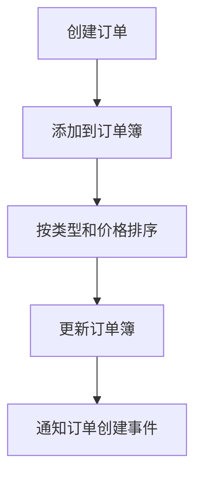
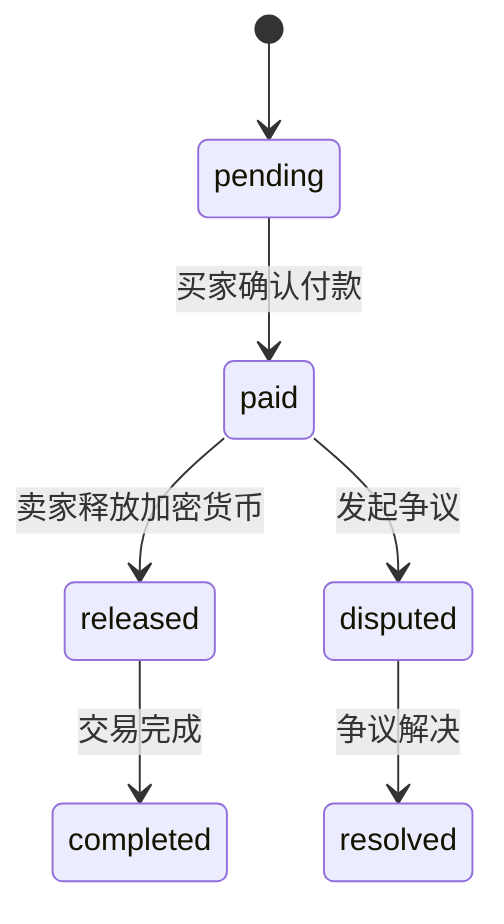
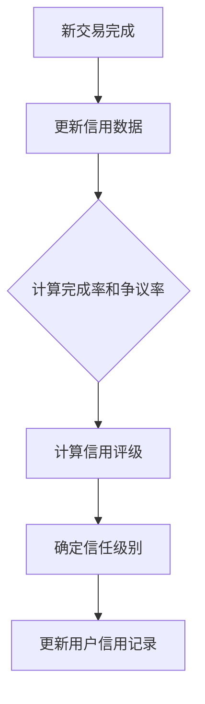

<cite>
**Referenced Files in This Document**   
- [otcService.ts](file://backend/src/services/otcService.ts)
- [otc.ts](file://backend/src/routes/otc.ts)
</cite>

# OTC交易服务

## Table of Contents
1. [OTC服务概述](#otc服务概述)
2. [核心组件分析](#核心组件分析)
3. [订单簿管理机制](#订单簿管理机制)
4. [P2P交易流程](#p2p交易流程)
5. [用户信用体系](#用户信用体系)
6. [事件通信机制](#事件通信机制)
7. [API调用示例](#api调用示例)
8. [异常处理策略](#异常处理策略)

## OTC服务概述

OTC交易服务是场外交易系统的核心组件，负责管理场外交易订单簿、P2P交易流程和用户信用体系。该服务通过`OTCService`类实现，继承自`EventEmitter`，支持事件驱动的架构模式。服务初始化时会加载模拟数据，包括订单和用户信用评级信息，为系统提供基础数据支持。

**Section sources**
- [otcService.ts](file://backend/src/services/otcService.ts#L84-L93)

## 核心组件分析

OTC服务的核心由多个关键接口和数据结构组成，定义了订单、交易和用户信用的完整模型。`OTCOrder`接口定义了场外交易订单的完整属性，包括交易类型、法币和加密货币类型、价格、交易限额等。`P2PTransaction`接口描述了P2P交易的生命周期，从创建到完成的各个状态。`UserCreditScore`接口则构建了用户信用评级体系，通过多个维度评估用户信誉。

**Section sources**
- [otcService.ts](file://backend/src/services/otcService.ts#L3-L47)

## 订单簿管理机制

### 订单簿数据结构

OTC服务使用`orderBook`对象来管理订单簿，该对象是一个以交易对为键的映射，存储对应的所有活跃订单。订单簿的排序机制确保了交易效率和公平性：买单按价格从高到低排序，卖单按价格从低到高排序。这种排序策略使得最优价格的订单优先匹配，提高了市场流动性。



**Diagram sources**
- [otcService.ts](file://backend/src/services/otcService.ts#L88-L88)
- [otcService.ts](file://backend/src/services/otcService.ts#L399-L409)

### 订单创建与排序

当用户创建新订单时，系统会将其添加到相应的订单簿中，并立即执行排序操作。`createOrder`方法负责订单的创建和初始化，包括生成唯一订单ID、设置创建时间等。`sortOrderBook`私有方法则根据订单类型执行不同的排序逻辑，确保订单簿始终保持最优匹配顺序。

**Section sources**
- [otcService.ts](file://backend/src/services/otcService.ts#L173-L195)
- [otcService.ts](file://backend/src/services/otcService.ts#L399-L409)

## P2P交易流程

### 交易生命周期

P2P交易流程涵盖了从订单创建到加密货币释放的完整生命周期。交易状态包括"pending"（待付款）、"paid"（已付款）、"released"（已放币）、"disputed"（争议中）等，确保了交易过程的透明性和安全性。



**Diagram sources**
- [otcService.ts](file://backend/src/services/otcService.ts#L28-L47)

### 核心交易方法

#### 创建交易

`createTransaction`方法是P2P交易的入口点，接收订单ID、买家ID、交易金额和支付方式等参数。该方法首先验证订单的可用性和交易金额的合规性，然后创建交易记录并更新订单状态为"trading"。

#### 确认付款

`confirmPayment`方法允许买家确认付款，将交易状态从"pending"更新为"paid"。此操作会触发系统消息，通知卖家买家已付款，等待放币。

#### 释放加密货币

`releaseCrypto`方法是交易的关键环节，允许卖家在收到付款确认后释放加密货币。系统通过释放码验证机制确保操作的安全性，只有输入正确释放码的卖家才能完成放币操作。

**Section sources**
- [otcService.ts](file://backend/src/services/otcService.ts#L209-L249)
- [otcService.ts](file://backend/src/services/otcService.ts#L279-L294)
- [otcService.ts](file://backend/src/services/otcService.ts#L297-L320)

## 用户信用体系

### 信用评分模型

用户信用体系基于交易完成率和争议率动态计算评级。系统通过`updateUserCreditScore`方法更新用户信用，综合考虑总订单数、完成订单数、争议次数等多个因素。信用评级计算公式为：`rating = max(1, 5 * completionRate - disputeRate * 2)`，确保高完成率和低争议率的用户获得更高评级。

### 信任级别管理

系统根据信用评级和交易历史自动分配信任级别，包括"new"（新用户）、"standard"（标准）、"premium"（高级）和"verified"（认证）四个等级。信任级别不仅反映用户信誉，还影响其在平台上的交易权限和优惠待遇。



**Diagram sources**
- [otcService.ts](file://backend/src/services/otcService.ts#L345-L391)

**Section sources**
- [otcService.ts](file://backend/src/services/otcService.ts#L345-L391)

## 事件通信机制

### EventEmitter集成

OTC服务通过继承`EventEmitter`类实现事件驱动的通信机制。当交易状态发生变更时，服务会发出相应的事件通知，如"orderCreated"、"transactionCreated"、"paymentConfirmed"等。这种松耦合的设计使得其他系统组件可以订阅这些事件，实现跨模块的协同工作。

### 事件类型与用途

- **orderCreated**: 订单创建时触发，用于更新订单簿视图和通知相关用户
- **transactionCreated**: 交易创建时触发，用于初始化交易聊天室和通知交易双方
- **paymentConfirmed**: 付款确认时触发，用于通知卖家及时放币
- **cryptoReleased**: 加密货币释放时触发，用于更新用户资产和完成交易记录
- **disputeRaised**: 争议发起时触发，用于通知客服团队介入处理

**Section sources**
- [otcService.ts](file://backend/src/services/otcService.ts#L84-L84)
- [otcService.ts](file://backend/src/services/otcService.ts#L173-L195)

## API调用示例

### 订单创建调用

```typescript
// 创建买单示例
const orderData = {
  type: 'buy',
  fiatCurrency: 'CNY',
  cryptoCurrency: 'USDT',
  fiatAmount: 5000,
  cryptoAmount: 683.06,
  price: 7.32,
  minAmount: 100,
  maxAmount: 5000,
  paymentMethods: ['alipay', 'wechat'],
  timeLimit: 15,
  escrowEnabled: true
};

const order = await otcService.createOrder(orderData);
```

### 交易执行调用

```typescript
// 创建交易并完成流程
const transaction = await otcService.createTransaction(
  'OTC001', 
  'user3', 
  1000, 
  'alipay'
);

// 买家确认付款
const updatedTransaction = await otcService.confirmPayment(
  transaction.id, 
  'user3'
);

// 卖家释放加密货币（需正确释放码）
const finalTransaction = await otcService.releaseCrypto(
  transaction.id, 
  'user1', 
  'ABC123'
);
```

**Section sources**
- [otc.ts](file://backend/src/routes/otc.ts#L50-L80)
- [otc.ts](file://backend/src/routes/otc.ts#L150-L180)

## 异常处理策略

### 输入验证

系统在API层面实施严格的输入验证，使用`express-validator`中间件检查请求参数的类型、长度和范围。例如，订单金额必须为正数，支付方式必须在允许列表中，交易时限必须在5-60分钟之间。

### 业务逻辑验证

在核心业务方法中，系统执行多层次的业务逻辑验证：
- 订单可用性检查：确保订单存在且状态为"active"
- 金额范围验证：确保交易金额在订单设定的最小和最大限额之间
- 权限验证：确保操作用户是订单或交易的相关方
- 状态验证：确保订单未处于"trading"状态时才能取消

### 错误响应

系统采用统一的错误响应格式，包含成功标志、错误消息和详细信息。对于不同类型的错误，返回相应的HTTP状态码，如400（验证失败）、401（未认证）、403（权限不足）、404（资源不存在）和500（服务器错误）。

**Section sources**
- [otc.ts](file://backend/src/routes/otc.ts#L10-L20)
- [otc.ts](file://backend/src/routes/otc.ts#L123-L148)